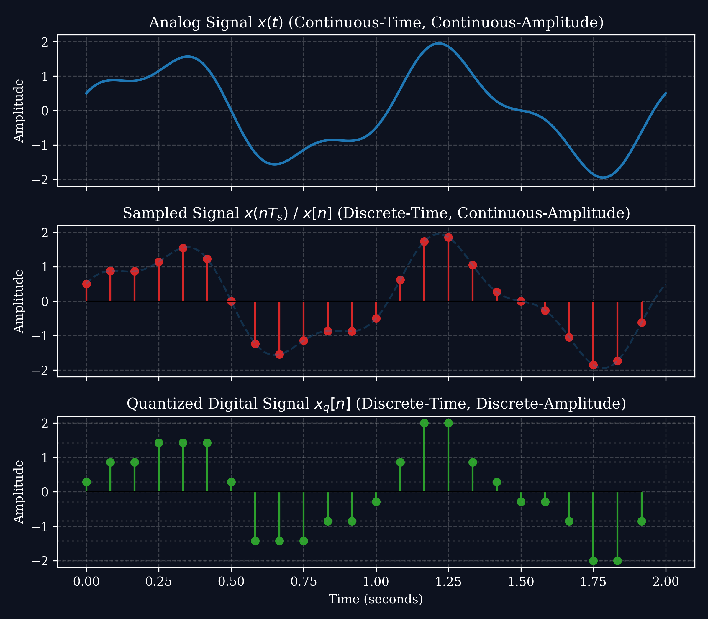
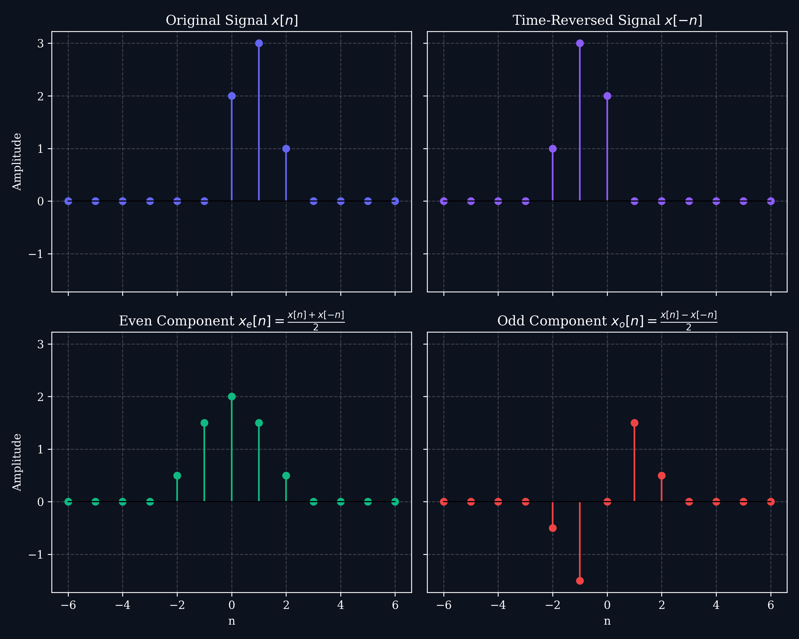
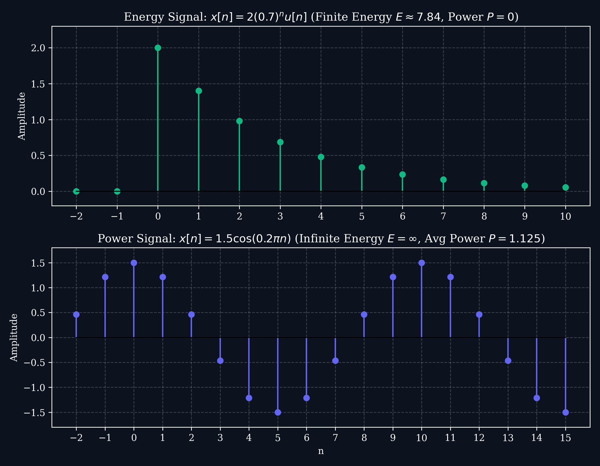
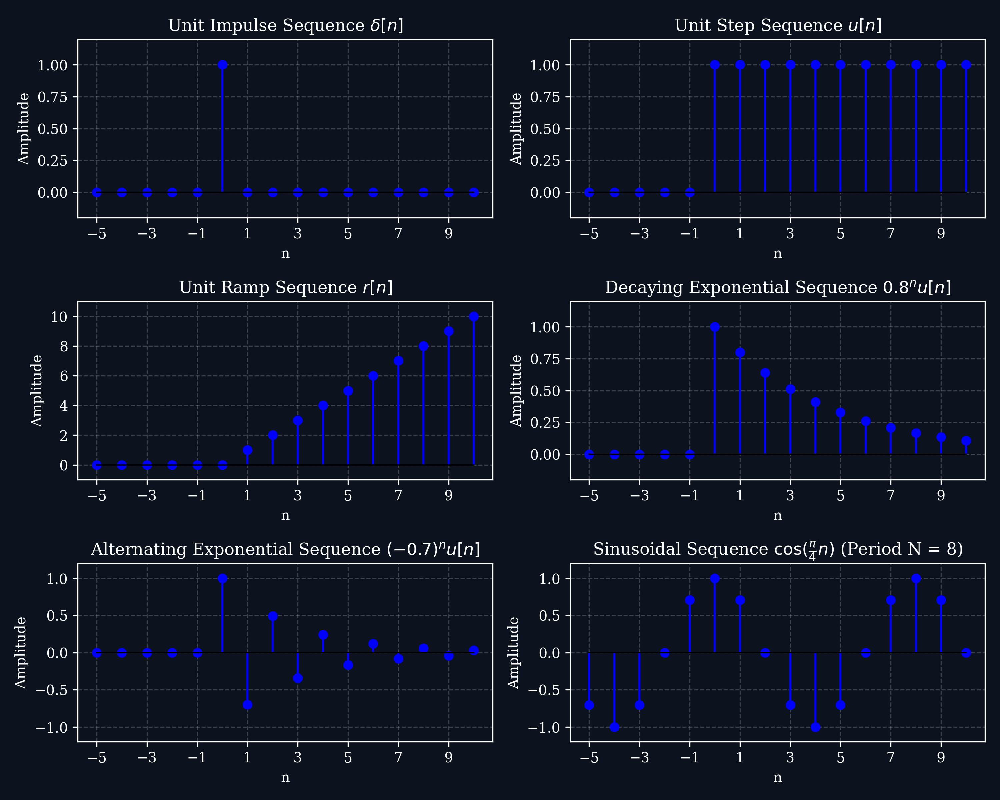

# Lecture 1: Course Introduction & Discrete-Time Signals

**Course:** EE3621 — Digital Signal Processing  
**Target Audience:** III B.Tech EEE Students  
**Duration:** 40 Minutes  

* **Available Formats:** [LaTeX Source File](file:///C:/Users/sriph/Downloads/DSP/lecture_01.tex) | [Compiled PDF Notes](file:///C:/Users/sriph/Downloads/DSP/lecture_01.pdf)


---

## 1. Lecture Plan (40 Minutes Breakdown)
* **00:00 – 05:00 (5 mins):** Welcome, Course Objectives, & Syllabus Walkthrough
* **05:00 – 18:00 (13 mins):** Introduction to DSP, Analog vs. Digital Processing (Block Diagram, Pros & Cons)
* **18:00 – 30:00 (12 mins):** Classification of Discrete-Time (DT) Signals (Periodicity, Energy/Power, Symmetry)
* **30:00 – 38:00 (8 mins):** Elementary Sequences (Impulse, Step, Ramp, Sinusoid, Exponential)
* **38:00 – 40:00 (2 mins):** Q&A and Summary of the day

---

## 2. Introduction to DSP & Analog vs. Digital Processing

### What is Digital Signal Processing (DSP)?
A **signal** is any physical quantity that varies with time, space, or any other independent variable, carrying information. Examples in electrical engineering include voltage $v(t)$, current $i(t)$, and power waveforms.
* **Analog Signal Processing (ASP):** Signals are processed in their continuous-time, continuous-amplitude form using analog hardware (resistors, capacitors, inductors, operational amplifiers).
* **Digital Signal Processing (DSP):** Signals are represented as sequences of numbers (discrete-time, quantized amplitude) and processed using digital hardware (microprocessors, DSP chips, FPGAs, or software).

### Typical DSP System Block Diagram
An analog signal is converted to digital, processed, and then converted back to analog (if required):

```
+---------------+     +-------+     +------------+     +-------+     +---------------+
| Analog Signal | --> |  ADC  | --> | DSP Device | --> |  DAC  | --> | Analog Signal |
|     x(t)      |     |       |     |   x[n]     |     |       |     |     y(t)      |
+---------------+     +-------+     +------------+     +-------+     +---------------+
```

1. **Anti-Aliasing Filter (LPF) [Optional/Implicit]:** Pre-filters the analog input $x(t)$ to remove high-frequency noise and prevent aliasing.
2. **Analog-to-Digital Converter (ADC):** Consists of:
   * **Sampler:** Discretizes the continuous time variable $t \to n T_s$.
   * **Quantizer:** Discretizes the continuous amplitude value. The number of quantization levels $L$ is determined by the **bit depth** $B$:
     $$L = 2^B$$
     The **step size** $\Delta$ for a full-scale range $R$ is:
     $$\Delta = \frac{R}{2^B}$$
     The rounding of values introduces **quantization noise** $e[n] = x_q[n] - x[n]$, bounded by $-\frac{\Delta}{2} \le e[n] \le \frac{\Delta}{2}$.
   * **Coder:** Maps each quantized level to an equivalent $B$-bit binary word.
   * **Theoretical SQNR:** For a full-scale sinusoid, the Signal-to-Quantization-Noise Ratio is:
     $$\text{SQNR (dB)} \approx 6.02 B + 1.76\text{ dB}$$
     Adding 1 bit increases the SQNR by $6.02\text{ dB}$ (improving signal fidelity and lowering noise).
3. **Digital Signal Processor:** Executes mathematical algorithms (addition, multiplication, delay) on the discrete sequence $x[n]$ to produce $y[n]$.
4. **Digital-to-Analog Converter (DAC) & Reconstruction Filter:** Reconstructs the continuous-time signal $y(t)$ from $y[n]$.

### Analog Pre-Processing Circuits: Anti-Aliasing & Sample-and-Hold

Before sampling, the analog signal must pass through physical circuitry to prepare it for conversion:

#### 1. Anti-Aliasing Filter (AAF) Circuit
An AAF is an analog low-pass filter (typically a 1st-order RC filter for simplicity) that cuts off high-frequency noise above the folding frequency $f_N = f_s/2$.
* **Transfer Function:** $H(f) = \frac{1}{1 + j 2\pi f R C}$
* **Cutoff Frequency:** $f_c = \frac{1}{2\pi R C}$
* **Relationship with Sampling Rate ($f_s$):** To prevent aliasing, we require $f_c \le \frac{f_s}{2}$:
  $$\frac{1}{2\pi R C} \le \frac{f_s}{2} \implies R C \ge \frac{1}{\pi f_s}$$
  *Example:* For $f_s = 20\text{ Hz}$, the RC time constant must satisfy $RC \ge 15.9\text{ ms}$.

#### 2. Sample-and-Hold (S&H) Circuit
The S&H circuit captures the continuous-time voltage and holds it steady while the ADC performs quantization. It consists of an electronic switch (MOSFET) and a holding capacitor $C_{hold}$.
* **Track Mode (Switch Closed):** The capacitor charges to the input voltage.
  * The switch has a small on-resistance $R_{on}$.
  * Charging time constant is $\tau_{acq} = R_{on} C_{hold}$.
  * To charge the capacitor to within $0.1\%$ accuracy (for a 10-bit ADC), the switch must stay closed for at least $T_{track} \ge 7 \tau_{acq} = 7 R_{on} C_{hold}$.
* **Hold Mode (Switch Open):** The switch is open, and the capacitor holds the voltage.
  * The capacitor slowly discharges through the input resistance of the buffer amplifier ($R_{in}$).
  * Discharge time constant is $\tau_{hold} = R_{in} C_{hold}$.
  * To prevent the voltage from dropping (droop rate) during the sample period $T_s = 1/f_s$, we require the hold constant to be extremely large: $R_{in} C_{hold} \gg \frac{1}{f_s}$.

### DSP vs. Analog Processing: Comparison

| Feature | Analog Signal Processing (ASP) | Digital Signal Processing (DSP) |
| :--- | :--- | :--- |
| **Components** | Active/passive hardware components ($R$, $L$, $C$, Op-Amps). | Digital hardware (multipliers, adders, registers, memory) or software. |
| **Accuracy** | Limited by component tolerances (e.g., $5\%$ resistor tolerance), drift due to temperature, and aging. | Highly accurate; limited only by word-length (quantization errors). |
| **Flexibility** | Difficult to modify; requires physical re-wiring or hardware redesign. | Extremely flexible; algorithms can be updated simply by modifying code. |
| **Storage** | Hard to store analog signals without degradation (e.g., magnetic tapes). | Easy to store in digital media (flash, hard drives) without loss. |
| **Complexity** | Implementing complex filters (e.g., linear phase, sharp transitions) is highly impractical. | Complex algorithms (adaptive filtering, FFT, compression) are easily implemented. |
| **Speed/Bandwidth**| Very high bandwidth; works in real-time for high frequencies. | Limited by the sampling rate of the ADC/DAC and processor clock speed. |

### Visualizing Signal Types (Analog vs. Sampled vs. Digital)
Below is the visual progression of a signal from analog, to sampled, to quantized digital form:



---


## 3. Discrete-Time (DT) Signals & Classification

A discrete-time signal $x[n]$ is defined only at integer values of the independent variable $n$. It is mathematically represented as a sequence of numbers:
$$x[n] = \{x[-1], \underline{x[0]}, x[1], x[2], \dots\}$$
*(Note: The underline indicates the origin sample where $n = 0$.)*

### Classification of DT Signals

#### A. Periodic vs. Aperiodic Signals
A DT signal $x[n]$ is **periodic** if there exists a positive integer $N$ such that:
$$x[n + N] = x[n] \quad \forall n$$
The smallest integer $N > 0$ satisfying this is the **fundamental period**.
* **Key Concept for EEE:** For a sinusoidal sequence $x[n] = A \cos(\omega_0 n + \theta)$ to be periodic, the frequency $\omega_0$ must be a rational multiple of $2\pi$:
  $$\frac{\omega_0}{2\pi} = \frac{m}{N} \quad \text{where } m, N \in \mathbb{Z}$$
  If this ratio is irrational, the DT sinusoid is **aperiodic** (unlike its continuous-time counterpart, which is always periodic).

#### B. Symmetric (Even) vs. Anti-Symmetric (Odd) Signals
* **Even Signal:** $x[-n] = x[n]$ (Symmetrical about the y-axis)
* **Odd Signal:** $x[-n] = -x[n]$ (Asymmetrical about the origin; implies $x[0] = 0$)
Any arbitrary signal $x[n]$ can be decomposed into even ($x_e[n]$) and odd ($x_o[n]$) parts:
$$x_e[n] = \frac{x[n] + x[-n]}{2}, \quad x_o[n] = \frac{x[n] - x[-n]}{2}$$

Below is an illustration of an arbitrary signal $x[n]$ decomposed into its even and odd parts:




#### C. Energy vs. Power Signals
* **Total Energy ($E$):**
  $$E = \sum_{n=-\infty}^{\infty} |x[n]|^2$$
* **Average Power ($P$):**
  $$P = \lim_{N \to \infty} \frac{1}{2N + 1} \sum_{n=-N}^{N} |x[n]|^2$$
* **Classification:**
  * **Energy Signal:** $0 < E < \infty \implies P = 0$. (Typically finite-duration signals).
  * **Power Signal:** $0 < P < \infty \implies E = \infty$. (Typically periodic or infinite-duration signals).

Below is an illustration comparing a finite-energy exponential decay signal and an infinite-energy periodic sinusoidal power signal:




#### D. Causality
* **Causal:** $x[n] = 0$ for $n < 0$ (Depends only on present and past).
* **Non-causal:** $x[n] \neq 0$ for some $n < 0$ (Depends on future values).
* **Anti-causal:** $x[n] = 0$ for $n \ge 0$ (Depends only on future/past negative values).

---

## 4. Elementary Sequences

These basic signals serve as the building blocks for representing and analyzing more complex signals.

### Graphical Representations
Below are the graphical plots of the five elementary sequences:



### 1. Unit Impulse Sequence $\delta[n]$
Defines a single spike at the origin:
$$\delta[n] = \begin{cases} 1, & n = 0 \\ 0, & n \neq 0 \end{cases}$$
* **Sifting Property:** Any sequence can be represented as a weighted sum of delayed impulses:
  $$x[n] = \sum_{k=-\infty}^{\infty} x[k] \delta[n-k]$$

### 2. Unit Step Sequence $u[n]$
Represents a DC signal switched on at $n=0$:
$$u[n] = \begin{cases} 1, & n \ge 0 \\ 0, & n < 0 \end{cases}$$
* **Relationship to Impulse:** $\delta[n] = u[n] - u[n-1]$ and $u[n] = \sum_{k=0}^{\infty} \delta[n-k]$.

### 3. Unit Ramp Sequence $r[n]$
Increases linearly for non-negative time:
$$r[n] = n \cdot u[n] = \begin{cases} n, & n \ge 0 \\ 0, & n < 0 \end{cases}$$

### 4. Exponential Sequence $x[n] = a^n u[n]$
The behavior depends heavily on the value of $a$ (real or complex):
* If $0 < a < 1$: Decaying exponential.
* If $a > 1$: Growing exponential.
* If $-1 < a < 0$: Decaying, alternating-sign sequence.

### 5. Sinusoidal Sequence $x[n] = A \cos(\omega_0 n + \theta)$
* $\omega_0$ is the digital angular frequency in radians per sample.
* Range of unique frequencies is $-\pi \le \omega_0 \le \pi$ or $0 \le \omega_0 \le 2\pi$ due to frequency aliasing in discrete-time domain (higher frequencies wrap around).

---

## 4.5 Properties & Operations on Signals

Signals can be manipulated using several basic mathematical operations:

### 1. Time Shifting
A signal $x[n]$ is delayed or advanced by shifting the index:
$$y[n] = x[n - n_0]$$
* If $n_0 > 0$, the signal is **delayed** (shifted right).
* If $n_0 < 0$, the signal is **advanced** (shifted left).

### 2. Time Reversal (Folding)
Reflecting the signal about the origin $n=0$:
$$y[n] = x[-n]$$

### 3. Time Scaling (Decimation & Interpolation)
Alters the effective sampling rate of the sequence:
* **Decimation (Downsampling):** $y[n] = x[D \cdot n]$, keeping every $D$-th sample.
* **Interpolation (Upsampling):** $y[n] = x[n/I]$ if $n$ is a multiple of $I$, and $0$ otherwise.

### 4. Arithmetic Operations
* **Addition:** $y[n] = x_1[n] + x_2[n]$ (mixer)
* **Multiplication:** $y[n] = x_1[n] \cdot x_2[n]$ (modulation/windowing)
* **Scaling:** $y[n] = A \cdot x[n]$ (amplification/attenuation)

---

## 4.6 Definition & Classification of a DSP System

A **system** is a device or algorithm that operates on an input sequence $x[n]$ to produce an output sequence $y[n]$:
$$y[n] = \mathcal{T}\{x[n]\}$$
In DSP, the processor executes this transformation mathematically. A system is characterized by its properties:

### 1. Linearity
A system is linear if it satisfies superposition and homogeneity:
$$\mathcal{T}\{a x_1[n] + b x_2[n]\} = a \mathcal{T}\{x_1[n]\} + b \mathcal{T}\{x_2[n]\}$$

### 2. Time-Invariance
If $y[n] = \mathcal{T}\{x[n]\}$, then the system is time-invariant if:
$$\mathcal{T}\{x[n-n_0]\} = y[n-n_0]$$

### 3. Causality
A system is causal if the output at $n_0$ depends only on present and past inputs: $x[n]$ for $n \le n_0$.

### 4. Stability (BIBO)
A system is BIBO stable if a bounded input $|x[n]| \le M_x < \infty$ produces a bounded output $|y[n]| \le M_y < \infty$.

---

## 5. Checkpoint & Quick Review Questions (For Class Engagement)
1. **Q1:** If $x[n] = \sin(\frac{3}{5} n)$, is the signal periodic?
   * *Answer:* Check $\frac{\omega_0}{2\pi} = \frac{3/5}{2\pi} = \frac{3}{10\pi}$, which is irrational. Therefore, $x[n]$ is **aperiodic**.
2. **Q2:** Why do we need an Anti-Aliasing Filter before the sampler in a typical DSP system?
   * *Answer:* To limit the bandwidth of the analog signal to less than half the sampling rate ($f_s / 2$), preventing frequency overlap (aliasing) in the sampled spectrum.
