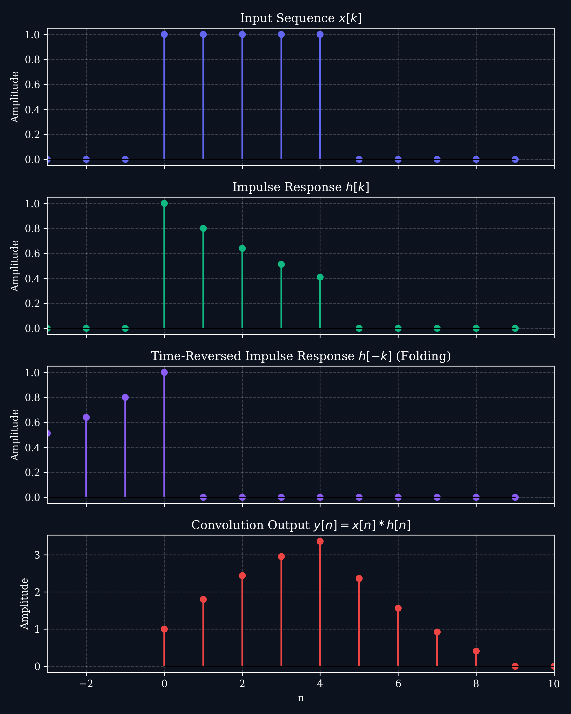
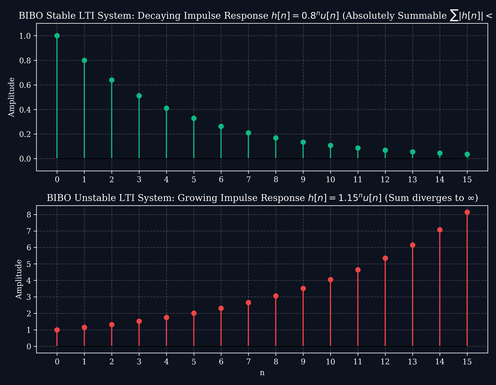

# Lecture 2: LTI Systems, Convolution, Stability & Difference Equations

**Course:** EE3621 — Digital Signal Processing  
**Target Audience:** III B.Tech EEE Students  
**Duration:** 40 Minutes  

* **Available Formats:** [LaTeX Source File](file:///C:/Users/sriph/Downloads/DSP/lecture_02.tex) | [Compiled PDF Notes](file:///C:/Users/sriph/Downloads/DSP/lecture_02.pdf)

---

## 1. Lecture Plan (40 Minutes Breakdown)
* **00:00 – 05:00 (5 mins):** Review of System Properties & Introduction to LTI Systems.
* **05:00 – 15:00 (10 mins):** Derivation of the Convolution Sum & Graphical Steps.
* **15:00 – 22:00 (7 mins):** Properties of Discrete-Time Convolution (with proofs).
* **22:00 – 30:00 (8 mins):** LTI Causality, BIBO Stability (with proof), and Step Response.
* **30:00 – 38:00 (8 mins):** Constant-Coefficient Difference Equations: Homogeneous \& Particular Solutions.
* **38:00 – 40:00 (2 mins):** Checkpoints \& Quick Q\&A.

---

## 2. Derivation of the Convolution Sum

A **Linear Time-Invariant (LTI)** system is uniquely and completely characterized by its **impulse response** $h[n]$, which is the system response to a unit impulse input $\delta[n]$.

### The Derivation
1. Recall the **sifting property** of the unit impulse sequence from Lecture 1:
   $$x[n] = \sum_{k=-\infty}^{\infty} x[k] \delta[n-k]$$
2. Apply the input $x[n]$ to a system $\mathcal{T}$:
   $$y[n] = \mathcal{T}\{x[n]\} = \mathcal{T}\left\{ \sum_{k=-\infty}^{\infty} x[k] \delta[n-k] \right\}$$
3. By the property of **Linearity** (additivity and scaling), we can move the operator inside the summation:
   $$y[n] = \sum_{k=-\infty}^{\infty} x[k] \mathcal{T}\{\delta[n-k]\}$$
4. By the property of **Time-Invariance**, if the response to $\delta[n]$ is $h[n]$, then the response to a delayed impulse $\delta[n-k]$ is a delayed impulse response $h[n-k]$:
   $$\mathcal{T}\{\delta[n-k]\} = h[n-k]$$
5. Substituting this back, we obtain the **Convolution Sum**:
   $$y[n] = \sum_{k=-\infty}^{\infty} x[k] h[n-k] = x[n] * h[n]$$

### The Convolution Steps
To calculate convolution graphically or analytically for each index $n$:
1. **Folding (Time Reversal):** Flip the impulse response about the vertical axis to get $h[-k]$.
2. **Shifting:** Delay the folded sequence by $n$ to get $h[n-k]$.
3. **Multiplication:** Multiply the input sequence $x[k]$ with the shifted sequence $h[n-k]$ point-by-point to get the product sequence $v_n[k] = x[k] h[n-k]$.
4. **Summation:** Add all elements of the product sequence $v_n[k]$ to yield the single output sample $y[n]$.

Below is the visual progression of convolution:

---

## 3. Properties of Discrete-Time Convolution

Linear time-invariant systems enjoy several properties due to the properties of convolution:

### A. Commutativity
The order of the signals in convolution does not affect the output:
$$x[n] * h[n] = h[n] * x[n]$$
* **Proof:** Let $m = n - k \Rightarrow k = n - m$. As $k \to \infty$, $m \to -\infty$, and as $k \to -\infty$, $m \to \infty$:
  $$x[n] * h[n] = \sum_{k=-\infty}^{\infty} x[k] h[n-k] = \sum_{m=-\infty}^{\infty} x[n-m] h[m] = \sum_{m=-\infty}^{\infty} h[m] x[n-m] = h[n] * x[n]$$

### B. Associativity
Convolution is associative, meaning series cascaded LTI systems can be combined:
$$(x[n] * h_1[n]) * h_2[n] = x[n] * (h_1[n] * h_2[n])$$
* **System Interpretation:** If an input goes through $h_1[n]$ and then $h_2[n]$, the equivalent single-block system has impulse response $h_{eq}[n] = h_1[n] * h_2[n]$.

### C. Distributivity
Convolution distributes over addition, meaning parallel LTI systems can be combined:
$$x[n] * \left( h_1[n] + h_2[n] \right) = x[n] * h_1[n] + x[n] * h_2[n]$$

### D. Shifting Property
If $y[n] = x[n] * h[n]$, then shifting either input shifts the output by the same amount:
$$x[n-n_1] * h[n-n_2] = y[n - n_1 - n_2]$$

---

## 4. Causality, BIBO Stability \& Step Response

### A. Causality
A system is causal if its output at any time depends only on present and past inputs.
* **LTI Causality Condition:** An LTI system is causal if and only if its impulse response is zero for negative time:
  $$h[n] = 0 \quad \forall n < 0$$
* **Implication:** The convolution sum limits for a causal system with a causal input ($x[n] = 0$ for $n < 0$) simplify to:
  $$y[n] = \sum_{k=0}^{n} x[k] h[n-k]$$

### B. BIBO Stability
A system is Bounded-Input Bounded-Output (BIBO) stable if every bounded input $|x[n]| \le M_x < \infty$ produces a bounded output $|y[n]| \le M_y < \infty$.
* **LTI Stability Condition:** An LTI system is stable if and only if its impulse response is **absolutely summable**:
  $$S = \sum_{n=-\infty}^{\infty} |h[n]| < \infty$$

#### Mathematical Proof:
$$|y[n]| = \left| \sum_{k=-\infty}^{\infty} x[k] h[n-k] \right|$$
Using the triangle inequality:
$$|y[n]| \le \sum_{k=-\infty}^{\infty} |x[k]| |h[n-k]|$$
Since the input is bounded ($|x[k]| \le M_x$):
$$|y[n]| \le M_x \sum_{k=-\infty}^{\infty} |h[n-k]|$$
Substitute variables $m = n - k$:
$$|y[n]| \le M_x \sum_{m=-\infty}^{\infty} |h[m]|$$
If $\sum |h[m]| = S < \infty$, then $|y[n]| \le M_x S < \infty$, guaranteeing a bounded output.

Below is an illustration comparing a stable decaying impulse response and an unstable growing impulse response:

### C. Step Response
The **step response** $s[n]$ of an LTI system is its response to the unit step input $u[n]$:
$$s[n] = h[n] * u[n] = \sum_{k=-\infty}^{\infty} h[k] u[n-k] = \sum_{k=-\infty}^{n} h[k]$$
* **Finding $h[n]$ from $s[n]$:** By taking the first difference of the step response:
  $$h[n] = s[n] - s[n-1]$$

---

## 5. Analytical Convolution Example (Infinite Sequences)

### Problem Statement:
Find the output $y[n]$ of an LTI system with impulse response $h[n] = u[n]$ subjected to input $x[n] = a^n u[n]$ where $0 < a < 1$.

### Solution:
Using the convolution sum:
$$y[n] = \sum_{k=-\infty}^{\infty} x[k] h[n-k] = \sum_{k=-\infty}^{\infty} a^k u[k] u[n-k]$$
1. **Overlap Conditions:**
   - The term $u[k]$ is non-zero only for $k \ge 0$.
   - The term $u[n-k]$ is non-zero only for $n-k \ge 0 \Rightarrow k \le n$.
   - Thus, the product $u[k]u[n-k] = 1$ if and only if:
     $$0 \le k \le n$$
2. **Interval 1 ($n < 0$):**
   There is no value of $k$ that satisfies $0 \le k \le n$. Therefore, the product is zero:
   $$y[n] = 0$$
3. **Interval 2 ($n \ge 0$):**
   The limits of the summation become $0$ to $n$:
   $$y[n] = \sum_{k=0}^{n} a^k$$
   Applying the finite geometric series formula $\sum_{k=0}^{n} q^k = \frac{1 - q^{n+1}}{1 - q}$:
   $$y[n] = \frac{1 - a^{n+1}}{1 - a}$$
4. **Final Combined Result:**
   $$y[n] = \left( \frac{1 - a^{n+1}}{1 - a} \right) u[n]$$

---

## 6. Solving Constant-Coefficient Difference Equations

Discrete-time systems are described by **linear constant-coefficient difference equations**:
$$y[n] + \sum_{k=1}^{N} a_k y[n-k] = \sum_{k=0}^{M} b_k x[n-k]$$
The total solution $y[n]$ consists of two parts: $y[n] = y_h[n] + y_p[n]$.

### A. Homogeneous Solution ($y_h[n]$)
The homogeneous solution is found by setting the input $x[n] = 0$:
$$y[n] + \sum_{k=1}^{N} a_k y[n-k] = 0$$
We assume a solution of the form $y_h[n] = C \lambda^n$. Substituting this into the homogeneous equation yields the **characteristic equation**:
$$\lambda^N + a_1 \lambda^{N-1} + a_2 \lambda^{N-2} + \dots + a_N = 0$$
Let $\lambda_1, \lambda_2, \dots, \lambda_N$ be the roots of the characteristic equation.
1. **Distinct Roots:** If all roots are distinct:
   $$y_h[n] = C_1 \lambda_1^n + C_2 \lambda_2^n + \dots + C_N \lambda_N^n$$
2. **Repeated Roots:** If a root $\lambda_1$ is repeated $m$ times:
   $$y_h[n] = \left( C_1 + C_2 n + C_3 n^2 + \dots + C_m n^{m-1} \right) \lambda_1^n$$

### B. Particular Solution ($y_p[n]$)
The particular solution represents the system output for a specific input $x[n]$ for $n \ge 0$. We select a trial particular solution matching the form of the input:

| Input Signal $x[n]$ | Assumed Particular Solution $y_p[n]$ |
| :--- | :--- |
| Constant: $A$ | $K_p$ |
| Exponential: $A \beta^n$ | $K_p \beta^n$ (if $\beta$ is not a characteristic root) |
| Exponential (root conflict): $A \lambda_1^n$ | $K_p n \lambda_1^n$ (where $\lambda_1$ is a single root) |
| Sinusoidal: $A \cos(\omega_0 n)$ | $C_1 \cos(\omega_0 n) + C_2 \sin(\omega_0 n)$ |

The constant coefficients ($K_p$, $C_1$, $C_2$) are determined by substituting $y_p[n]$ back into the difference equation.

---

## 7. Checkpoint & Quick Review Questions

1. **Q1:** An LTI system has impulse response $h[n] = (1.2)^n u[n]$. Is the system BIBO stable?
   * *Answer:* Check absolute sum:
     $$\sum_{n=-\infty}^{\infty} |h[n]| = \sum_{n=0}^{\infty} (1.2)^n$$
     Since the base $|1.2| \ge 1$, this geometric series diverges to $\infty$. The system is **unstable** (its impulse response grows exponentially).

2. **Q2:** Find the homogeneous solution of the difference equation $y[n] - 0.5 y[n-1] = x[n]$.
   * *Answer:* 
     * Set $x[n] = 0 \Rightarrow y[n] - 0.5 y[n-1] = 0$.
     * Assume $y_h[n] = C \lambda^n \Rightarrow C \lambda^n - 0.5 C \lambda^{n-1} = 0 \Rightarrow \lambda - 0.5 = 0 \Rightarrow \lambda = 0.5$.
     * Thus, the homogeneous solution is:
       $$y_h[n] = C (0.5)^n$$
