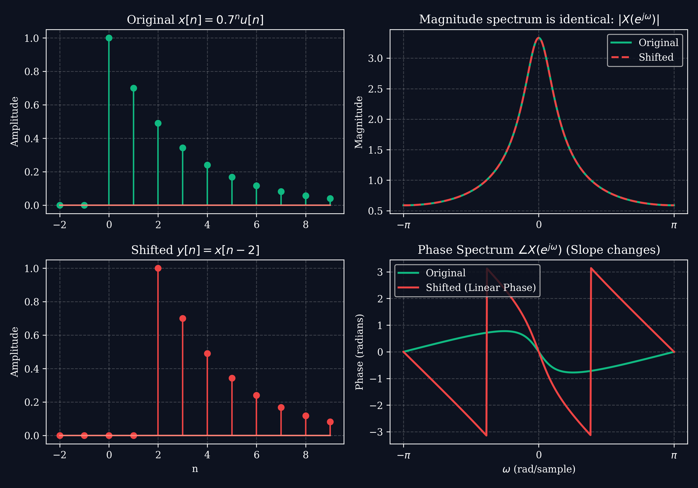
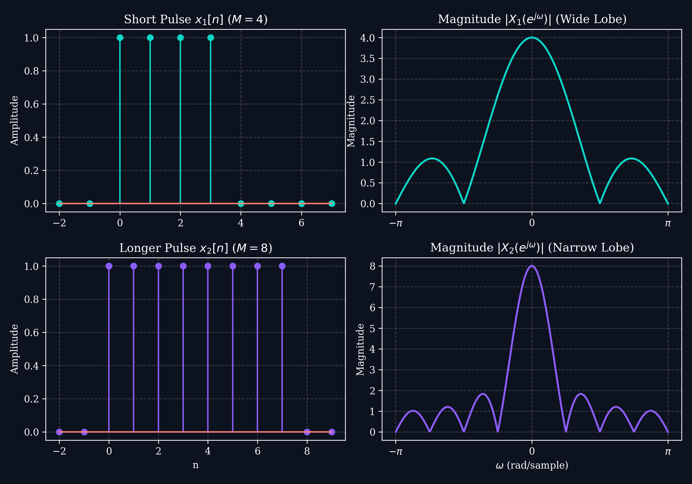

# Lecture 3: The Discrete-Time Fourier Transform (DTFT)

**Course:** EE3621 — Digital Signal Processing  
**Target Audience:** III B.Tech EEE Students  
**Duration:** 40 Minutes  

* **Available Formats:** [LaTeX Source File](file:///C:/Users/sriph/Downloads/DSP/lecture_03.tex) | [Compiled PDF Notes](file:///C:/Users/sriph/Downloads/DSP/lecture_03.pdf)

---

## 1. Lecture Plan (40 Minutes Breakdown)
* **00:00 – 05:00 (5 mins):** Motivation: Continuous spectrum for discrete signals and periodic spectrum.
* **05:00 – 12:00 (7 mins):** DTFT \& IDTFT Definitions and Convergence Criteria.
* **12:00 – 22:00 (10 mins):** DTFT of Common Signals: Rectangular Pulse, Decaying Exponential, and Double-Sided Exponential.
* **22:00 – 35:00 (13 mins):** Key Properties of the DTFT with full algebraic proofs.
* **35:00 – 40:00 (5 mins):** Duality, the Uncertainty Principle, and Checkpoint.

---

## 2. Mathematical Definition of DTFT

The **Discrete-Time Fourier Transform (DTFT)** maps a discrete-time sequence $x[n]$ to a continuous, periodic complex frequency function $X(e^{j\omega})$, where $\omega$ is the digital frequency (in radians per sample).

### Analysis Equation (Forward DTFT)
$$X(e^{j\omega}) = \sum_{n=-\infty}^{\infty} x[n] e^{-j\omega n}$$

* **Periodicity:** The DTFT is always periodic in $\omega$ with a period of $2\pi$ due to the periodicity of the complex exponential:
  $$X(e^{j(\omega + 2\pi)}) = \sum_{n=-\infty}^{\infty} x[n] e^{-j(\omega + 2\pi)n} = \sum_{n=-\infty}^{\infty} x[n] e^{-j\omega n} e^{-j 2\pi n} = X(e^{j\omega})$$
  *(Since $e^{-j 2\pi n} = 1$ for any integer $n$).*
* Because of this periodicity, we only evaluate $X(e^{j\omega})$ over a single interval of length $2\pi$, typically $[-\pi, \pi]$ or $[0, 2\pi]$.

### Synthesis Equation (Inverse DTFT / IDTFT)
$$x[n] = \frac{1}{2\pi} \int_{-\pi}^{\pi} X(e^{j\omega}) e^{j\omega n} d\omega$$

### Convergence Conditions
The infinite sum defining the DTFT does not always converge.
* **Condition for Convergence (Sufficient):** The DTFT of a sequence $x[n]$ exists if the sequence is **absolutely summable**:
  $$\sum_{n=-\infty}^{\infty} |x[n]| < \infty$$
* **Proof:**
  $$|X(e^{j\omega})| = \left| \sum_{n=-\infty}^{\infty} x[n] e^{-j\omega n} \right| \le \sum_{n=-\infty}^{\infty} |x[n] e^{-j\omega n}| = \sum_{n=-\infty}^{\infty} |x[n]| < \infty$$
  If $x[n]$ is absolutely summable, the sum converges uniformly for all $\omega$.

---

## 3. DTFT of Common Signals

### A. Finite Rectangular Pulse (Length $M$)
Let:
$$x[n] = \begin{cases} 1, & 0 \le n \le M-1 \\ 0, & \text{otherwise} \end{cases}$$
Its DTFT is derived using the finite geometric series sum:
$$X(e^{j\omega}) = \sum_{n=0}^{M-1} e^{-j\omega n} = \frac{1 - e^{-j\omega M}}{1 - e^{-j\omega}}$$
Factor out half-angles to simplify:
$$X(e^{j\omega}) = \frac{e^{-j\omega M/2} \left( e^{j\omega M/2} - e^{-j\omega M/2} \right)}{e^{-j\omega/2} \left( e^{j\omega/2} - e^{-j\omega/2} \right)} = e^{-j\omega(M-1)/2} \frac{\sin\left(\frac{\omega M}{2}\right)}{\sin\left(\frac{\omega}{2}\right)}$$
* **Interpretation:** This is a discrete sinc function (Dirichlet kernel). The magnitude is:
  $$\left| X(e^{j\omega}) \right| = \left| \frac{\sin\left(\frac{\omega M}{2}\right)}{\sin\left(\frac{\omega}{2}\right)} \right|$$
  and the phase factor $e^{-j\omega(M-1)/2}$ represents the delay due to the signal being causal instead of centered at $n=0$.

### B. Single-Sided Decaying Exponential
Let $x[n] = a^n u[n]$ for $|a| < 1$.
$$X(e^{j\omega}) = \sum_{n=-\infty}^{\infty} a^n u[n] e^{-j\omega n} = \sum_{n=0}^{\infty} \left( a e^{-j\omega} \right)^n$$
Since $|a e^{-j\omega}| = |a| < 1$, we use the infinite geometric series formula $\sum_{n=0}^{\infty} q^n = \frac{1}{1-q}$:
$$X(e^{j\omega}) = \frac{1}{1 - a e^{-j\omega}}$$
* **Magnitude:**
  $$\left| X(e^{j\omega}) \right| = \frac{1}{\left| 1 - a\cos\omega + j a\sin\omega \right|} = \frac{1}{\sqrt{1 + a^2 - 2a\cos\omega}}$$

### C. Double-Sided Decaying Exponential
Let $x[n] = a^{|n|}$ for $|a| < 1$.
$$X(e^{j\omega}) = \sum_{n=-\infty}^{\infty} a^{|n|} e^{-j\omega n} = \sum_{n=-\infty}^{-1} a^{-n} e^{-j\omega n} + \sum_{n=0}^{\infty} a^n e^{-j\omega n}$$
Substitute $m = -n$ in the first summation:
$$X(e^{j\omega}) = \sum_{m=1}^{\infty} \left( a e^{j\omega} \right)^m + \sum_{n=0}^{\infty} \left( a e^{-j\omega} \right)^n = \frac{a e^{j\omega}}{1 - a e^{j\omega}} + \frac{1}{1 - a e^{-j\omega}}$$
Combine fractions over a common denominator:
$$X(e^{j\omega}) = \frac{a e^{j\omega}(1 - a e^{-j\omega}) + (1 - a e^{j\omega})}{(1 - a e^{j\omega})(1 - a e^{-j\omega})} = \frac{a e^{j\omega} - a^2 + 1 - a e^{j\omega}}{1 + a^2 - a(e^{j\omega} + e^{-j\omega})} = \frac{1 - a^2}{1 + a^2 - 2a\cos\omega}$$

---

## 4. Key Properties of the DTFT (with Proofs)

For two sequences $x[n] \leftrightarrow X(e^{j\omega})$ and $y[n] \leftrightarrow Y(e^{j\omega})$:

### A. Linearity
$$a \cdot x[n] + b \cdot y[n] \longleftrightarrow a \cdot X(e^{j\omega}) + b \cdot Y(e^{j\omega})$$

### B. Time Shifting
$$x[n - n_0] \longleftrightarrow X(e^{j\omega}) e^{-j\omega n_0}$$
* **Proof:**
  $$\text{DTFT}\{x[n-n_0]\} = \sum_{n=-\infty}^{\infty} x[n-n_0] e^{-j\omega n}$$
  Let $m = n - n_0 \Rightarrow n = m + n_0$:
  $$\sum_{m=-\infty}^{\infty} x[m] e^{-j\omega (m + n_0)} = e^{-j\omega n_0} \sum_{m=-\infty}^{\infty} x[m] e^{-j\omega m} = X(e^{j\omega}) e^{-j\omega n_0}$$

Below is an illustration of the time-shifting property showing that the magnitude is invariant while the phase changes linearly:

### C. Frequency Shifting (Modulation)
$$x[n] e^{j\omega_0 n} \longleftrightarrow X\left( e^{j(\omega - \omega_0)} \right)$$
* **Proof:**
  $$\text{DTFT}\left\{ x[n] e^{j\omega_0 n} \right\} = \sum_{n=-\infty}^{\infty} x[n] e^{j\omega_0 n} e^{-j\omega n} = \sum_{n=-\infty}^{\infty} x[n] e^{-j(\omega - \omega_0)n} = X\left( e^{j(\omega - \omega_0)} \right)$$

### D. Time Reversal
$$x[-n] \longleftrightarrow X(e^{-j\omega})$$
* **Proof:**
  $$\text{DTFT}\{x[-n]\} = \sum_{n=-\infty}^{\infty} x[-n] e^{-j\omega n}$$
  Let $m = -n \Rightarrow n = -m$:
  $$\sum_{m=-\infty}^{\infty} x[m] e^{-j\omega (-m)} = \sum_{m=-\infty}^{\infty} x[m] e^{-j(-\omega)m} = X(e^{-j\omega})$$

### E. Differentiation in Frequency
$$n x[n] \longleftrightarrow j \frac{d X(e^{j\omega})}{d\omega}$$
* **Proof:**
  $$\frac{d X(e^{j\omega})}{d\omega} = \frac{d}{d\omega} \left( \sum_{n=-\infty}^{\infty} x[n] e^{-j\omega n} \right) = \sum_{n=-\infty}^{\infty} x[n] \frac{d}{d\omega} \left( e^{-j\omega n} \right) = \sum_{n=-\infty}^{\infty} x[n] (-jn) e^{-j\omega n}$$
  $$\frac{d X(e^{j\omega})}{d\omega} = -j \sum_{n=-\infty}^{\infty} (n x[n]) e^{-j\omega n} = -j \cdot \text{DTFT}\{n x[n]\}$$
  Multiply both sides by $j$ (since $j \cdot (-j) = 1$):
  $$j \frac{d X(e^{j\omega})}{d\omega} = \text{DTFT}\{n x[n]\}$$

### F. Conjugation \& Symmetry Properties
$$x^*[n] \longleftrightarrow X^*(e^{-j\omega})$$
If $x[n]$ is real ($x^*[n] = x[n]$), then $X(e^{j\omega})$ is conjugate symmetric:
$$X(e^{-j\omega}) = X^*(e^{j\omega})$$
This implies:
* The magnitude spectrum is an even function: $|X(e^{-j\omega})| = |X(e^{j\omega})|$
* The phase spectrum is an odd function: $\angle X(e^{-j\omega}) = -\angle X(e^{j\omega})$

### G. Convolution Property
$$y[n] = x[n] * h[n] \longleftrightarrow Y(e^{j\omega}) = X(e^{j\omega}) \cdot H(e^{j\omega})$$
* **Proof:**
  $$Y(e^{j\omega}) = \sum_{n=-\infty}^{\infty} \left( \sum_{k=-\infty}^{\infty} x[k] h[n-k] \right) e^{-j\omega n}$$
  Interchange the order of summation:
  $$Y(e^{j\omega}) = \sum_{k=-\infty}^{\infty} x[k] \left( \sum_{n=-\infty}^{\infty} h[n-k] e^{-j\omega n} \right)$$
  Using the shifting property, the inner sum is $H(e^{j\omega}) e^{-j\omega k}$:
  $$Y(e^{j\omega}) = \sum_{k=-\infty}^{\infty} x[k] H(e^{j\omega}) e^{-j\omega k} = H(e^{j\omega}) \sum_{k=-\infty}^{\infty} x[k] e^{-j\omega k} = H(e^{j\omega}) X(e^{j\omega})$$

### H. Parseval's Relation (Energy Conservation)
$$\sum_{n=-\infty}^{\infty} |x[n]|^2 = \frac{1}{2\pi} \int_{-\pi}^{\pi} |X(e^{j\omega})|^2 d\omega$$

---

## 5. Duality \& The Uncertainty Principle

A fundamental rule in signal analysis is that **a signal cannot be simultaneously narrow in both time and frequency domains**.
* **Short Pulse (Time) $\longleftrightarrow$ Broad Spectrum (Frequency)**
* **Long Pulse (Time) $\longleftrightarrow$ Narrow Spectrum (Frequency)**

Below is the visual illustration of a rectangular pulse of length $M=4$ compared to a pulse of length $M=8$:

---

## 6. Checkpoint \& Quick Review Questions

1. **Q1:** Find the DTFT of the unit impulse sequence $x[n] = \delta[n-n_0]$.
   * *Answer:* 
     $$X(e^{j\omega}) = \sum_{n=-\infty}^{\infty} \delta[n-n_0] e^{-j\omega n} = e^{-j\omega n_0}$$
     For $n_0 = 0$ (impulse at origin), $X(e^{j\omega}) = 1$, which is a flat spectrum containing all frequencies equally.

2. **Q2:** Using properties, find the DTFT of $g[n] = n a^n u[n]$ for $|a| < 1$.
   * *Answer:* 
     * Let $x[n] = a^n u[n] \longleftrightarrow X(e^{j\omega}) = \frac{1}{1 - a e^{-j\omega}}$.
     * By the frequency differentiation property, $n x[n] \longleftrightarrow j \frac{d X(e^{j\omega})}{d\omega}$.
     * Compute the derivative:
       $$\frac{d}{d\omega} \left( 1 - a e^{-j\omega} \right)^{-1} = - (1 - a e^{-j\omega})^{-2} \cdot \left( -a (-j) e^{-j\omega} \right) = \frac{-j a e^{-j\omega}}{(1 - a e^{-j\omega})^2}$$
     * Multiply by $j$:
       $$G(e^{j\omega}) = j \left( \frac{-j a e^{-j\omega}}{(1 - a e^{-j\omega})^2} \right) = \frac{a e^{-j\omega}}{(1 - a e^{-j\omega})^2}$$
