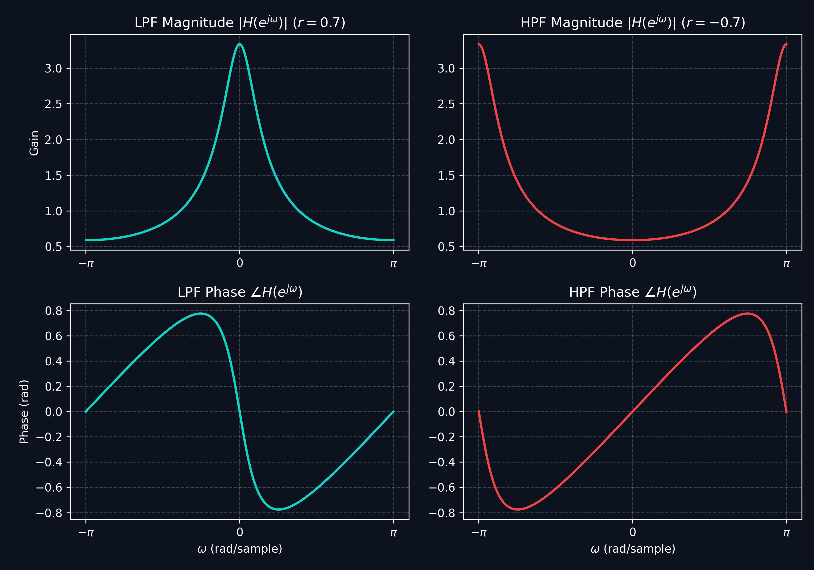
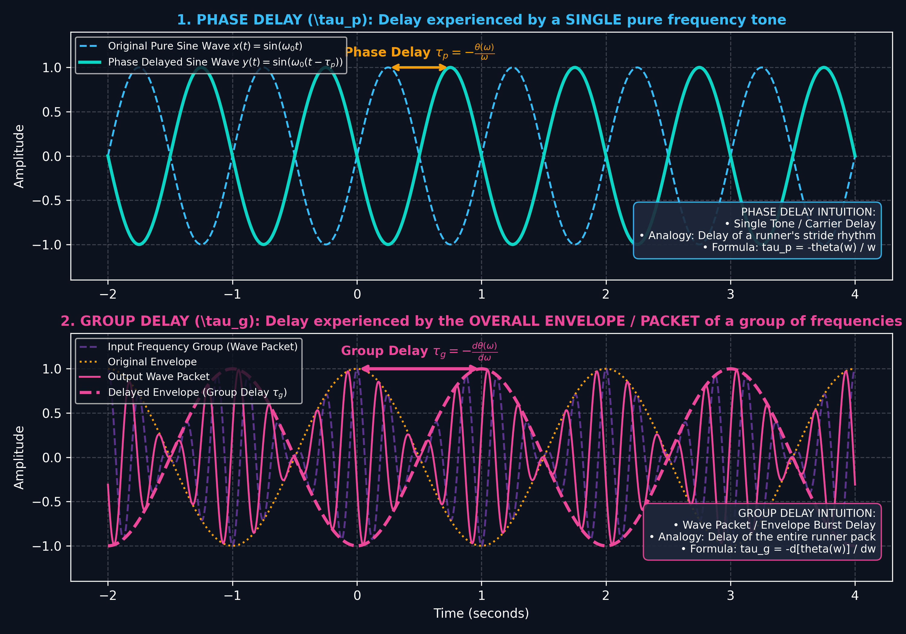
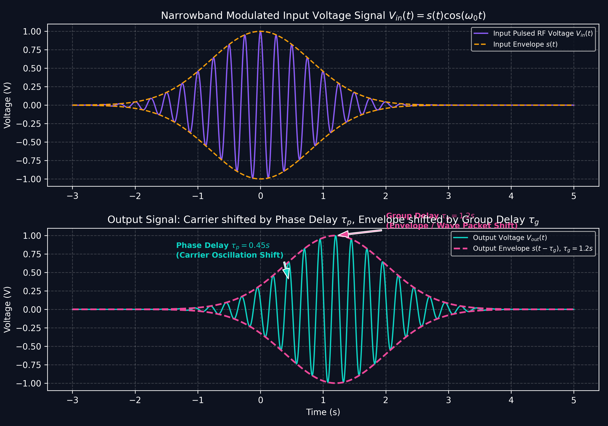
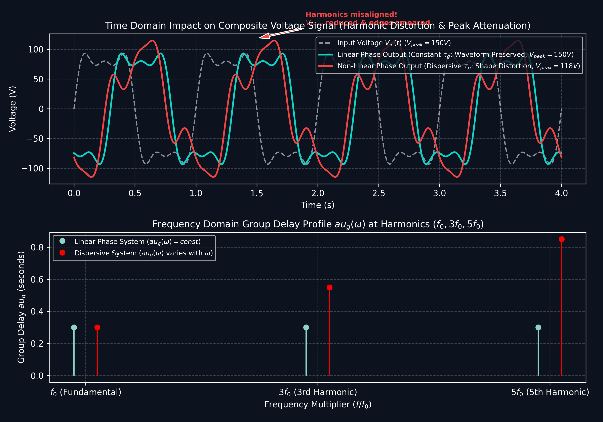
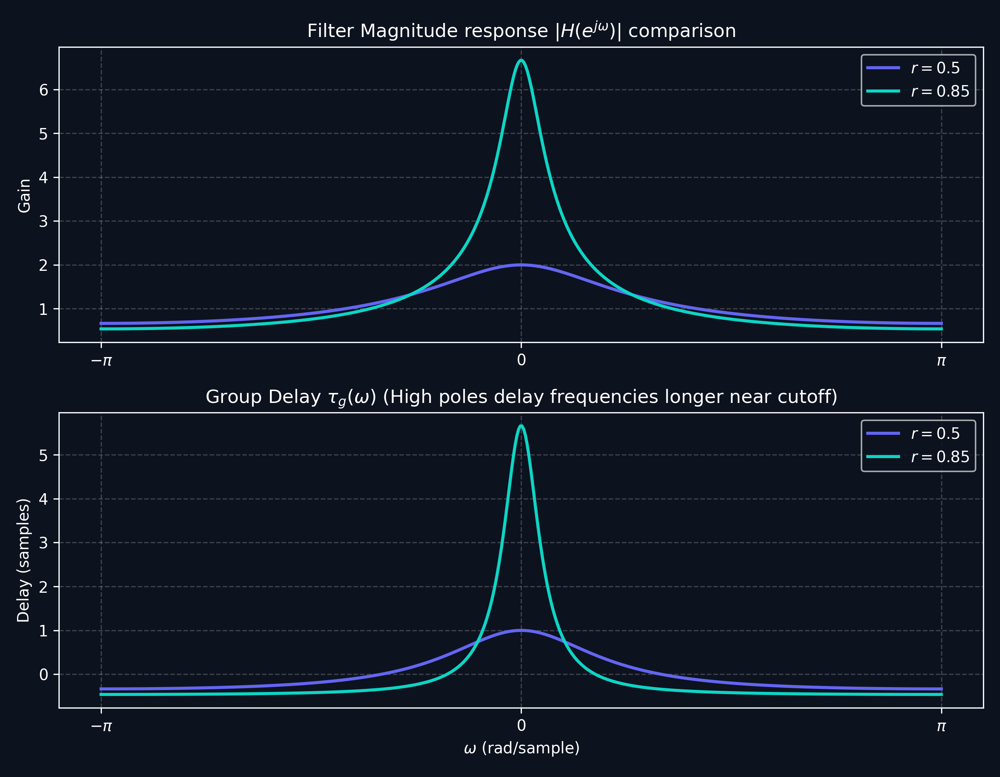

# Lecture 4: Frequency Response, Magnitude/Phase & Group Delay of LTI Systems

**Course:** EE3621 — Digital Signal Processing  
**Target Audience:** III B.Tech EEE Students  
**Duration:** 40 Minutes  

* **Available Formats:** [LaTeX Source File](file:///C:/Users/sriph/Downloads/DSP/lecture_04.tex) | [Compiled PDF Notes](file:///C:/Users/sriph/Downloads/DSP/lecture_04.pdf)

---

## 1. Lecture Plan (40 Minutes Breakdown)
* **00:00 – 08:00 (8 mins):** LTI Eigenfunctions: Why complex exponentials are unique. Derivation of $H(e^{j\omega})$.
* **08:00 – 15:00 (7 mins):** Magnitude & Phase responses, Rectangular vs. Polar forms.
* **15:00 – 25:00 (10 mins):** Phase Delay vs. Group Delay. Narrowband input derivation (Carrier vs. Envelope delay).
* **25:00 – 33:00 (8 mins):** Signal Impacts in Time/Frequency Domains & Voltage Signal Characteristics.
* **33:00 – 38:00 (5 mins):** First-order IIR Filter Example: Detailed algebraic derivation of Group Delay.
* **38:00 – 40:00 (2 mins):** Checkpoints & Concept Recap.

---

## 2. Eigenfunctions & The Frequency Response

In linear system analysis, **complex exponentials are eigenfunctions of LTI systems**. An eigenfunction of an operator is a function that, when applied to the operator, yields the same function scaled by a constant (the eigenvalue).

### Derivation
Let the input to a discrete-time LTI system be a complex exponential:
$$x[n] = e^{j\omega n} \quad \forall n$$
The system output $y[n]$ is computed via the convolution sum:
$$y[n] = \sum_{k=-\infty}^{\infty} h[k] x[n-k] = \sum_{k=-\infty}^{\infty} h[k] e^{j\omega(n-k)}$$
We factor out $e^{j\omega n}$ since the summation index is $k$:
$$y[n] = e^{j\omega n} \sum_{k=-\infty}^{\infty} h[k] e^{-j\omega k}$$
Notice that the output $y[n]$ is the original input $e^{j\omega n}$ multiplied by a complex scalar factor. We define this complex scalar factor (eigenvalue) as the **Frequency Response** $H(e^{j\omega})$:
$$y[n] = H(e^{j\omega}) e^{j\omega n}$$
where:
$$H(e^{j\omega}) = \sum_{k=-\infty}^{\infty} h[k] e^{-j\omega k}$$

* **Significance:** LTI systems do not generate new frequency components. They only alter the magnitude and shift the phase of existing sinusoidal inputs.

---

## 3. Magnitude & Phase Responses

Since $H(e^{j\omega})$ is a complex-valued function of $\omega$, it can be represented in either rectangular or polar coordinates:

### A. Rectangular Form
$$H(e^{j\omega}) = H_R(e^{j\omega}) + j H_I(e^{j\omega})$$

### B. Polar Form
$$H(e^{j\omega}) = \left| H(e^{j\omega}) \right| e^{j \theta(\omega)}$$
* **Magnitude Response $|H(e^{j\omega})|$**: Frequency-dependent gain:
  $$\left| H(e^{j\omega}) \right| = \sqrt{H_R^2(e^{j\omega}) + H_I^2(e^{j\omega})}$$
* **Phase Response $\theta(\omega) = \angle H(e^{j\omega})$**: Frequency-dependent phase shift:
  $$\theta(\omega) = \arctan\left( \frac{H_I(e^{j\omega})}{H_R(e^{j\omega})} \right)$$

For a real sinusoidal input $x[n] = A \cos(\omega_0 n + \phi)$, the output is:
$$y[n] = A \left| H(e^{j\omega_0}) \right| \cos\left( \omega_0 n + \phi + \theta(\omega_0) \right)$$

---

## 4. Phase Delay ($\tau_p$) vs. Group Delay ($\tau_g$)

When a signal containing multiple frequency components passes through an LTI system, different frequency components experience different time delays.

### A. Mathematical Definitions & Intuitive Meaning

| Concept | Simplest Intuitive Meaning | Mathematical Formula | Everyday Analogy |
| :--- | :--- | :--- | :--- |
| **Phase Delay ($\tau_p$)** | Time delay experienced by a **SINGLE pure sine wave** (fine carrier oscillations). | $\tau_p(\omega) = -\dfrac{\theta(\omega)}{\omega}$ | Delay of an individual runner's stride rhythm |
| **Group Delay ($\tau_g$)** | Time delay experienced by the **OVERALL ENVELOPE / WAVE PACKET** (information cluster). | $\tau_g(\omega) = -\dfrac{d\theta(\omega)}{d\omega}$ | Delay of the entire group / cluster of runners |

#### 1. Intuition Behind Phase Delay ($\tau_p$)
* **Core Question:** *"How long does one specific pure frequency take to pass through the system?"*
* **Where the formula comes from:**
  * A sinusoidal phase shift equals frequency $\times$ time delay: $\theta(\omega) = -\omega \cdot \tau_p$.
  * Rearranging for time delay yields: 
    $$\tau_p(\omega) = -\frac{\theta(\omega)}{\omega} \quad \text{(in samples or seconds)}$$
* **Simple Example:** A single $100\text{ Hz}$ sine wave shifted by $\frac{\pi}{2}$ radians ($90^\circ$) experiences a phase delay of $\tau_p = \frac{\pi/2}{2\pi \times 100} = 2.5\text{ ms}$.

#### 2. Intuition Behind Group Delay ($\tau_g$)
* **Core Question:** *"How long does the overall shape, modulation burst, or pulse envelope take to pass through the system?"*
* **Why it is a derivative ($-\frac{d\theta}{d\omega}$):**
  * When two close frequencies ($\omega_1$ and $\omega_2$) travel together, they interact to form a **beat wave packet (envelope)**.
  * The time delay of this envelope depends on the rate of change of phase across frequency:
    $$\text{Envelope Delay} \approx -\frac{\Delta \theta}{\Delta \omega} = -\frac{\theta(\omega_2) - \theta(\omega_1)}{\omega_2 - \omega_1}$$
  * Taking the limit as the frequency gap shrinks ($\Delta \omega \to 0$) gives the exact derivative:
    $$\tau_g(\omega) = -\frac{d\theta(\omega)}{d\omega} \quad \text{(in samples or seconds)}$$

### B. Narrowband Signal Derivation (Carrier vs. Envelope Delay)
Consider a narrowband amplitude-modulated input signal:
$$x[n] = s[n] \cos(\omega_0 n)$$
where $s[n]$ is a slowly-varying modulation envelope. Expanding the system phase response $\theta(\omega)$ using a first-order Taylor series around $\omega_0$:
$$\theta(\omega) \approx \theta(\omega_0) + \theta'(\omega_0)(\omega - \omega_0)$$
Expressing this in terms of $\tau_p(\omega_0)$ and $\tau_g(\omega_0)$:
$$\theta(\omega) \approx -\omega_0 \tau_p(\omega_0) - \tau_g(\omega_0)(\omega - \omega_0)$$

Passing $x[n]$ through the filter yields the output:
$$y[n] \approx \left| H(e^{j\omega_0}) \right| s[n - \tau_g(\omega_0)] \cos\left( \omega_0(n - \tau_p(\omega_0)) \right)$$

* **Physical Insight:** 
  - The slowly varying envelope $s[n]$ is delayed by **Group Delay $\tau_g(\omega_0)$**.
  - The high-frequency carrier oscillations inside the envelope are delayed by **Phase Delay $\tau_p(\omega_0)$**.

---

## 5. Impact of Phase & Group Delay in Time & Frequency Domains

| Signal Type | Time-Domain Impact | Frequency-Domain Impact |
| :--- | :--- | :--- |
| **Pure Sinusoid ($\omega_0$)** | Exact time shift by $\tau_p(\omega_0)$ samples. No shape change. | Spectral peak acquires phase shift $\theta(\omega_0) = -\omega_0 \tau_p(\omega_0)$. |
| **Narrowband Modulated Signal** | Envelope shifts by $\tau_g(\omega_0)$; carrier fine structure shifts by $\tau_p(\omega_0)$. If $\tau_p \neq \tau_g$, carrier phase slips relative to envelope peak. | Phase spectrum is locally linear around $\omega_0$ with slope $-\tau_g(\omega_0)$. |
| **Broadband Multi-Harmonic Signal (Linear Phase)** | **Distortionless Transmission:** Constant group delay $\tau_g(\omega) = \alpha$ shifts entire waveform uniformly without shape distortion. | Phase spectrum $\theta(\omega) = -\alpha \omega$ is strictly linear across all frequencies. |
| **Broadband Multi-Harmonic Signal (Non-Linear Phase)** | **Phase Dispersion:** Different harmonics delay by different amounts. Waveform suffers peak degradation, edge smearing, and asymmetry. | Phase response $\theta(\omega)$ is non-linear ($d\theta/d\omega \neq \text{const}$), causing frequency-dependent group delay variance. |

---

## 6. Impact on Voltage Signal Characteristics

In electrical power systems, high-speed digital communications, and biomedical instrumentation (ECG/EEG), non-constant group delay severely degrades voltage waveform characteristics:

### 1. Peak Voltage Magnitude ($V_{peak}$) Attenuation & Spikes
* When a composite voltage signal $v(t) = V_1 \sin(\omega_0 t) + V_3 \sin(3\omega_0 t) + V_5 \sin(5\omega_0 t)$ passes through a system with non-constant group delay, the harmonic peaks no longer align in time.
* **Result:** Constructive interference at the original peak instant is lost, leading to **reduction in peak voltage $V_{peak}$** or unexpected localized high-voltage spikes, stressing insulation and power electronics devices.

### 2. Slew Rate ($\frac{dV}{dt}$) and Rise Time ($t_r$) Smearing
* Sharp digital voltage pulses (e.g., clock signals, data buses) contain high-frequency harmonic content.
* If high-frequency voltage components experience higher group delay than low frequencies, edge transitions broaden in time, causing **slew rate degradation** ($\frac{dV}{dt}$ decreases) and **rise time inflation ($t_r$)**.
* In communications, this smearing leads to **Inter-Symbol Interference (ISI)** and closure of the **Eye Diagram**.

### 3. Crest Factor ($V_{peak} / V_{rms}$) Distortion
* For an all-pass network ($|H(e^{j\omega})| = 1$), total signal power and $V_{rms}$ remain unchanged.
* However, because non-linear phase alters peak alignment, the **Crest Factor** $CF = \frac{V_{peak}}{V_{rms}}$ changes significantly, affecting peak-detecting voltage meters and AC-DC converters.

### 4. Zero-Crossing Jitter & Phase Misalignment
* Non-constant phase delay shifts zero-crossing instants of fundamental and harmonic voltage components non-uniformly.
* **Impact:** Causes **phase jitter** in Zero-Crossing Detectors (ZCDs), leading to firing angle errors in thyristor/SCR power converters, phase-locked loop (PLL) instability, and power quality metering errors.

---

## 7. Group Delay Derivation for First-Order Filter

Consider a first-order digital filter described by:
$$y[n] - r y[n-1] = x[n] \quad \text{with } |r| < 1$$

### Step 1: Frequency Response
$$H(e^{j\omega}) = \frac{1}{1 - r e^{-j\omega}} = \frac{1}{(1 - r\cos\omega) + j r\sin\omega}$$

### Step 2: Phase Response $\theta(\omega)$
$$\theta(\omega) = -\arctan\left( \frac{r\sin\omega}{1 - r\cos\omega} \right)$$

### Step 3: Differentiating Phase Response
Let $u(\omega) = \frac{r\sin\omega}{1 - r\cos\omega}$. Using the derivative rule $\frac{d}{d\omega} \arctan(u) = \frac{1}{1+u^2} \frac{du}{d\omega}$:

1. **Quotient rule for $\frac{du}{d\omega}$:**
   $$\frac{du}{d\omega} = \frac{(r\cos\omega)(1 - r\cos\omega) - (r\sin\omega)(r\sin\omega)}{(1 - r\cos\omega)^2} = \frac{r\cos\omega - r^2(\cos^2\omega + \sin^2\omega)}{(1 - r\cos\omega)^2} = \frac{r\cos\omega - r^2}{(1 - r\cos\omega)^2}$$

2. **Evaluating $1 + u^2$:**
   $$1 + u^2 = 1 + \frac{r^2\sin^2\omega}{(1 - r\cos\omega)^2} = \frac{(1 - r\cos\omega)^2 + r^2\sin^2\omega}{(1 - r\cos\omega)^2} = \frac{1 + r^2 - 2r\cos\omega}{(1 - r\cos\omega)^2}$$

3. **Combining terms for $\frac{d\theta(\omega)}{d\omega}$:**
   $$\frac{d\theta(\omega)}{d\omega} = -\left[ \frac{(1 - r\cos\omega)^2}{1 + r^2 - 2r\cos\omega} \right] \cdot \left[ \frac{r\cos\omega - r^2}{(1 - r\cos\omega)^2} \right] = -\frac{r\cos\omega - r^2}{1 + r^2 - 2r\cos\omega}$$

### Step 4: Final Group Delay Expression
$$\tau_g(\omega) = -\frac{d\theta(\omega)}{d\omega} = \frac{r\cos\omega - r^2}{1 + r^2 - 2r\cos\omega}$$

---

## 8. Checkpoint & Numerical Review Questions

### Q1: Group Delay of Pure Delay System
Find the phase delay $\tau_p(\omega)$ and group delay $\tau_g(\omega)$ of an ideal delay system $h[n] = \delta[n - n_0]$.
* **Solution:**
  $$H(e^{j\omega}) = e^{-j\omega n_0} \implies |H(e^{j\omega})| = 1, \quad \theta(\omega) = -\omega n_0$$
  $$\tau_p(\omega) = -\frac{-\omega n_0}{\omega} = n_0 \text{ samples}$$
  $$\tau_g(\omega) = -\frac{d(-\omega n_0)}{d\omega} = n_0 \text{ samples}$$
  *Conclusion:* Constant phase and group delay ($\tau_p = \tau_g = n_0$) guarantees distortionless transmission.

### Q2: Peak Group Delay of Low-Pass Filter
For a first-order system with pole $r = 0.9$, calculate the group delay at DC ($\omega = 0$).
* **Solution:**
  $$\tau_g(0) = \frac{0.9\cos(0) - 0.9^2}{1 + 0.9^2 - 2(0.9)\cos(0)} = \frac{0.9 - 0.81}{1 + 0.81 - 1.8} = \frac{0.09}{0.01} = 9 \text{ samples}$$
  *Interpretation:* Low-frequency voltage components near DC are delayed by 9 samples, while high frequencies experience much smaller delays, introducing dispersion in broad-spectrum signals.
