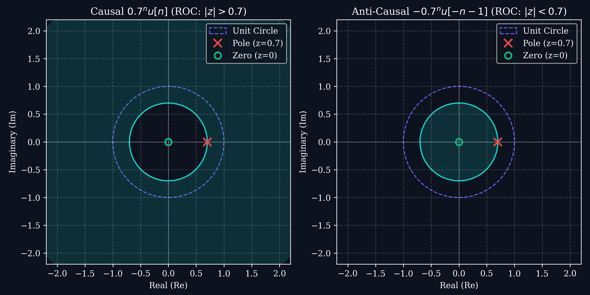
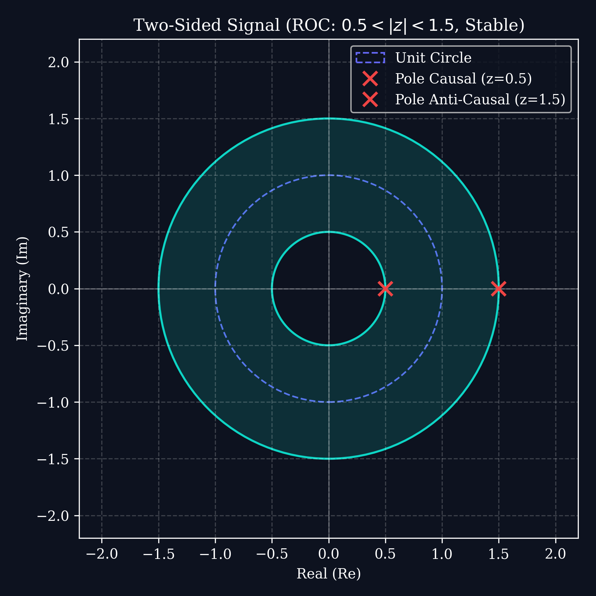

# Lecture 5: Z-Transform, ROC & Common Pairs

**Course:** EE3621 — Digital Signal Processing  
**Target Audience:** III B.Tech EEE Students  
**Duration:** 40 Minutes  

* **Available Formats:** [LaTeX Source File](file:///C:/Users/sriph/Downloads/DSP/lecture_05.tex) | [Compiled PDF Notes](file:///C:/Users/sriph/Downloads/DSP/lecture_05.pdf)

---

## 1. Lecture Plan (40 Minutes Breakdown)
* **00:00 – 08:00 (8 mins):** Motivation: Z-transform as a generalization of the DTFT ($z = r e^{j\omega}$) and convergence proof.
* **08:00 – 18:00 (10 mins):** The Region of Convergence (ROC): Detailed properties, causal vs. anti-causal vs. two-sided signals.
* **18:00 – 30:00 (12 mins):** Properties of the Z-Transform with full algebraic proofs (Linearity, Shifting, scaling, differentiation, convolution, initial/final value).
* **30:00 – 35:00 (5 mins):** Common Z-Transform Pairs and Pole-Zero plots.
* **35:00 – 40:00 (5 mins):** Checkpoint and Q\&A.

---

## 2. Definition \& Mathematical Motivation

The DTFT does not converge for signals that grow or are not absolutely summable (e.g., $u[n]$ or $2^n u[n]$). The **Z-Transform** generalizes the DTFT by replacing the complex frequency $e^{j\omega}$ with a general complex variable $z = r e^{j\omega}$, where $r$ is a real radius:

$$X(z) = \sum_{n=-\infty}^{\infty} x[n] z^{-n}$$

### Z-Transform as a DTFT of a Weighted Sequence
To see the connection between the Z-transform and the DTFT, express $z$ in polar form $z = r e^{j\omega}$:
$$X(r e^{j\omega}) = \sum_{n=-\infty}^{\infty} x[n] \left( r e^{j\omega} \right)^{-n} = \sum_{n=-\infty}^{\infty} \left( x[n] r^{-n} \right) e^{-j\omega n}$$
* **Interpretation:** The Z-transform $X(z)$ evaluated on a circle of radius $r$ is equivalent to the DTFT of the sequence $x[n]$ weighted by an exponential factor $r^{-n}$.
* **Relationship to DTFT:** If we evaluate $X(z)$ on the **unit circle** (radius $r = 1 \implies z = e^{j\omega}$), the Z-transform reduces exactly to the DTFT:
  $$X(z)\Big|_{|z|=1} = X(e^{j\omega})$$

### Convergence Condition
The infinite power series converges if the weighted sequence $x[n] r^{-n}$ is absolutely summable:
$$\sum_{n=-\infty}^{\infty} |x[n] r^{-n}| < \infty$$
The set of all values of $z$ (or radii $r$) for which this inequality holds defines the **Region of Convergence (ROC)**.

---

## 3. Detailed Properties of the ROC

The ROC has several critical properties that are essential for determining the uniqueness, causality, and stability of a system:

1. **Shape:** The ROC consists of a ring or disk centered at the origin in the z-plane.
2. **Poles Exclusion:** The ROC cannot contain any poles (points where the transfer function $X(z)$ diverges to infinity).
3. **Causal Signals (Right-sided):** If $x[n]$ is causal ($x[n] = 0$ for $n < 0$), the ROC extends outward from the outermost pole to infinity:
   $$|z| > r_{max}$$
4. **Anti-Causal Signals (Left-sided):** If $x[n]$ is left-sided ($x[n] = 0$ for $n \ge 0$), the ROC extends inward from the innermost pole to the origin:
   $$|z| < r_{min}$$
5. **Two-Sided Signals:** If $x[n]$ is two-sided, the ROC is an annular ring bounded by poles:
   $$r_{min} < |z| < r_{max}$$
6. **Stability and the Unit Circle:** An LTI system is BIBO stable if and only if the ROC **contains the unit circle** ($|z| = 1$).
   * **Causal + Stable Pole Location Criterion:** A causal LTI system is stable if and only if **all its poles lie strictly inside the unit circle** ($r_{max} < 1$).

Below is the ROC for causal vs. anti-causal exponentials:

---

## 4. Z-Transform Properties (with Proofs)

For transform pairs $x[n] \longleftrightarrow X(z)$ with ROC $R_x$ and $y[n] \longleftrightarrow Y(z)$ with ROC $R_y$:

### A. Linearity
$$a \cdot x[n] + b \cdot y[n] \longleftrightarrow a \cdot X(z) + b \cdot Y(z) \quad \text{ROC } \supseteq R_x \cap R_y$$

### B. Time Shifting
$$x[n - n_0] \longleftrightarrow z^{-n_0} X(z) \quad \text{ROC } R_x \text{ (except possibly } z=0 \text{ or } z=\infty\text{)}$$
* **Proof:**
  $$\text{Z}\left\{ x[n-n_0] \right\} = \sum_{n=-\infty}^{\infty} x[n-n_0] z^{-n}$$
  Let $m = n - n_0 \implies n = m + n_0$:
  $$\sum_{m=-\infty}^{\infty} x[m] z^{-(m+n_0)} = z^{-n_0} \sum_{m=-\infty}^{\infty} x[m] z^{-m} = z^{-n_0} X(z)$$
* In DSP block diagrams, multiplying by $z^{-1}$ represents a **unit-sample delay element**.

### C. Scaling in the Z-Domain
$$a^n x[n] \longleftrightarrow X\left(\frac{z}{a}\right) \quad \text{ROC } |a|R_x$$
* **Proof:**
  $$\text{Z}\left\{ a^n x[n] \right\} = \sum_{n=-\infty}^{\infty} a^n x[n] z^{-n} = \sum_{n=-\infty}^{\infty} x[n] \left( a^{-1} z \right)^{-n} = X\left( a^{-1} z \right) = X\left(\frac{z}{a}\right)$$

### D. Time Reversal
$$x[-n] \longleftrightarrow X\left( z^{-1} \right) \quad \text{ROC } R_x^{-1} \text{ (i.e., } z^{-1} \in R_x\text{)}$$
* **Proof:**
  $$\text{Z}\{x[-n]\} = \sum_{n=-\infty}^{\infty} x[-n] z^{-n} = \sum_{m=-\infty}^{\infty} x[m] z^m = \sum_{m=-\infty}^{\infty} x[m] \left( z^{-1} \right)^{-m} = X\left( z^{-1} \right)$$

### E. Differentiation in the Z-Domain
$$n x[n] \longleftrightarrow -z \frac{dX(z)}{dz} \quad \text{ROC } R_x$$
* **Proof:**
  $$\frac{dX(z)}{dz} = \frac{d}{dz} \left( \sum_{n=-\infty}^{\infty} x[n] z^{-n} \right) = \sum_{n=-\infty}^{\infty} x[n] \frac{d}{dz} (z^{-n}) = \sum_{n=-\infty}^{\infty} x[n] (-n) z^{-n-1}$$
  Factor out $-z^{-1}$:
  $$\frac{dX(z)}{dz} = -z^{-1} \sum_{n=-\infty}^{\infty} (n x[n]) z^{-n}$$
  Multiply both sides by $-z$:
  $$-z \frac{dX(z)}{dz} = \sum_{n=-\infty}^{\infty} (n x[n]) z^{-n} = \text{Z}\{n x[n]\}$$

### F. Convolution Property
$$x[n] * y[n] \longleftrightarrow X(z) \cdot Y(z) \quad \text{ROC } \supseteq R_x \cap R_y$$

### G. Initial Value Theorem
If $x[n]$ is a causal sequence ($x[n] = 0$ for $n < 0$), then:
$$x[0] = \lim_{z \to \infty} X(z)$$
* **Proof:**
  $$X(z) = \sum_{n=0}^{\infty} x[n] z^{-n} = x[0] + x[1]z^{-1} + x[2]z^{-2} + \dots$$
  As $z \to \infty$, terms with $z^{-k}$ for $k \ge 1$ approach 0, leaving:
  $$\lim_{z \to \infty} X(z) = x[0]$$

### H. Final Value Theorem
If $x[n]$ is causal and $X(z)$ converges for $|z| > 1$ (all poles of $(z-1)X(z)$ lie strictly inside the unit circle), then:
$$\lim_{n \to \infty} x[n] = \lim_{z \to 1} (z-1) X(z)$$

---

## 5. Common Z-Transform Pairs

| Signal $x[n]$ | Z-Transform $X(z)$ | ROC | Poles / Zeros |
| :--- | :--- | :--- | :--- |
| **Unit Impulse** $\delta[n]$ | $1$ | All $z$ | No poles, No zeros |
| **Unit Step** $u[n]$ | $\frac{1}{1 - z^{-1}} = \frac{z}{z-1}$ | $|z| > 1$ | Pole at $z=1$, Zero at $z=0$ |
| **Causal Exp** $a^n u[n]$ | $\frac{1}{1 - a z^{-1}} = \frac{z}{z-a}$ | $|z| > |a|$ | Pole at $z=a$, Zero at $z=0$ |
| **Left-Sided Exp** $-a^n u[-n-1]$ | $\frac{1}{1 - a z^{-1}} = \frac{z}{z-a}$ | $|z| < |a|$ | Pole at $z=a$, Zero at $z=0$ |

Below is an illustration of a stable two-sided signal ROC, forming an annular ring:

---

## 6. Checkpoint \& Quick Review Questions

1. **Q1:** Determine the Z-transform and ROC of $x[n] = 3^n u[n] + (0.8)^n u[n]$.
   * *Answer:* 
     * For $3^n u[n]$: $X_1(z) = \frac{z}{z-3}$ with ROC $|z| > 3$.
     * For $(0.8)^n u[n]$: $X_2(z) = \frac{z}{z-0.8}$ with ROC $|z| > 0.8$.
     * The combined Z-transform is:
       $$X(z) = \frac{z}{z-3} + \frac{z}{z-0.8} = \frac{z(z-0.8) + z(z-3)}{(z-3)(z-0.8)} = \frac{2z^2 - 3.8z}{(z-3)(z-0.8)}$$
     * The combined ROC is the intersection of both regions: **$|z| > 3$**.
     * Since this ROC does not contain the unit circle ($|z|=1$), the corresponding system is **unstable**.

2. **Q2:** Find the Z-transform of $g[n] = n a^n u[n]$ using properties.
   * *Answer:*
     * Let $x[n] = a^n u[n] \longleftrightarrow X(z) = \frac{z}{z-a} = \left( 1 - a z^{-1} \right)^{-1}$ with ROC $|z| > |a|$.
     * Using the frequency differentiation property, $\text{Z}\{n x[n]\} = -z \frac{dX(z)}{dz}$.
     * Compute the derivative of $X(z)$ with respect to $z$:
       $$\frac{dX(z)}{dz} = - \left( 1 - a z^{-1} \right)^{-2} \cdot \left( a z^{-2} \right) = -\frac{a z^{-2}}{\left(1 - a z^{-1}\right)^2}$$
     * Multiply by $-z$:
       $$G(z) = -z \left( -\frac{a z^{-2}}{\left(1 - a z^{-1}\right)^2} \right) = \frac{a z^{-1}}{\left(1 - a z^{-1}\right)^2} = \frac{a z}{(z-a)^2}$$
     * The ROC remains $|z| > |a|$.
