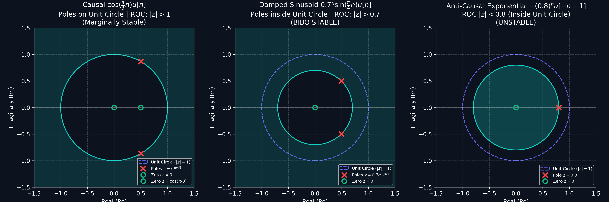
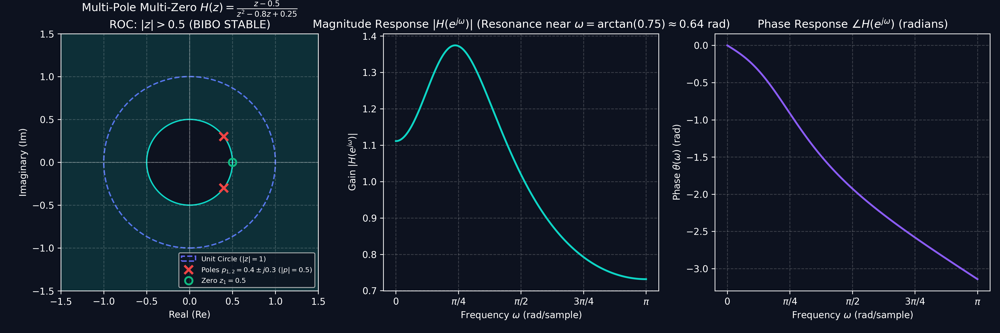
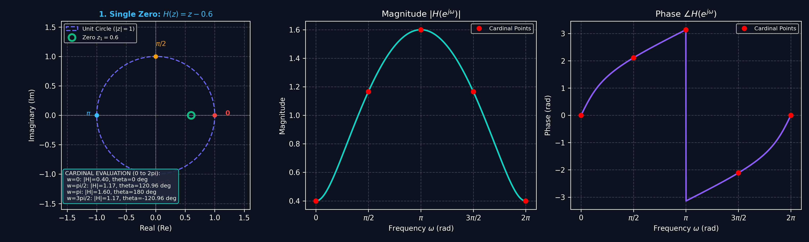
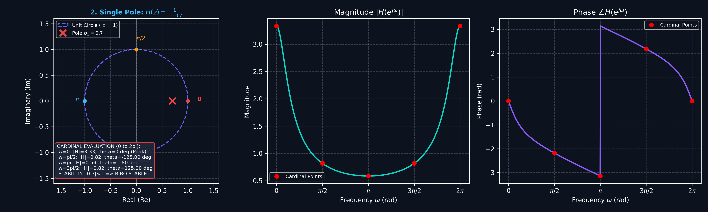
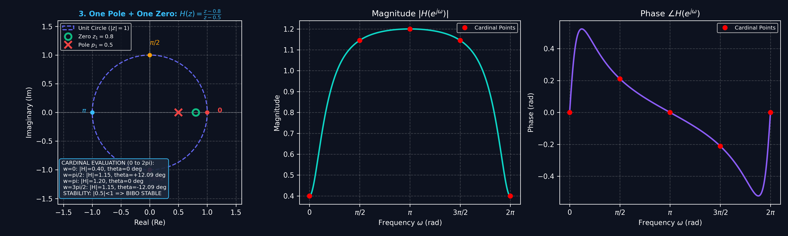
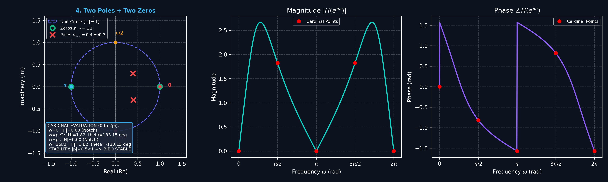

# Lecture 5: Z-Transform, ROC & Common Pairs

**Course:** EE3621 — Digital Signal Processing  
**Target Audience:** III B.Tech EEE Students  
**Duration:** 40 Minutes  

* **Available Formats:** [LaTeX Source File](file:///C:/Users/sriph/Downloads/DSP/lecture_05.tex) | [Compiled PDF Notes](file:///C:/Users/sriph/Downloads/DSP/lecture_05.pdf)

---

## 1. Lecture Plan (40 Minutes Breakdown)
* **00:00 – 08:00 (8 mins):** Motivation: Z-transform as a generalization of the DTFT ($z = r e^{j\omega}$) and convergence proof.
* **08:00 – 16:00 (8 mins):** The Region of Convergence (ROC): Does ROC lie inside the unit circle? Causal vs. Anti-causal vs. Two-sided shapes and Stability Comments.
* **16:00 – 26:00 (10 mins):** Worked Examples: Exp, Sin, Cos, Unit Step, Impulse, and Multi-Pole Multi-Zero System (Magnitude & Phase Computation).
* **26:00 – 34:00 (8 mins):** Properties of the Z-Transform with full algebraic proofs.
* **34:00 – 38:00 (4 mins):** Comprehensive Common Z-Transform Pairs Table.
* **38:00 – 40:00 (2 mins):** Checkpoint and Concept Recap.

---

## 2. Definition & Mathematical Motivation

The DTFT does not converge for signals that grow or are not absolutely summable (e.g., $u[n]$ or $2^n u[n]$). The **Z-Transform** generalizes the DTFT by replacing the complex frequency $e^{j\omega}$ with a general complex variable $z = r e^{j\omega}$, where $r$ is a real radius:

$$X(z) = \sum_{n=-\infty}^{\infty} x[n] z^{-n}$$

### Z-Transform as a DTFT of a Weighted Sequence
Expressing $z$ in polar form $z = r e^{j\omega}$:
$$X(r e^{j\omega}) = \sum_{n=-\infty}^{\infty} x[n] \left( r e^{j\omega} \right)^{-n} = \sum_{n=-\infty}^{\infty} \left( x[n] r^{-n} \right) e^{-j\omega n}$$
* **Interpretation:** Evaluating $X(z)$ on a circle of radius $r$ is equivalent to taking the DTFT of the sequence $x[n]$ weighted by $r^{-n}$.
* **Relationship to DTFT:** On the **unit circle** ($r = 1 \implies z = e^{j\omega}$), the Z-transform reduces to the DTFT:
  $$X(z)\Big|_{|z|=1} = X(e^{j\omega})$$

### Convergence Condition
The Z-transform converges if $x[n] r^{-n}$ is absolutely summable:
$$\sum_{n=-\infty}^{\infty} |x[n] r^{-n}| < \infty$$
The set of all $z$-values satisfying this condition is the **Region of Convergence (ROC)**.

---

## 3. Detailed Properties of the ROC & Stability Clarification

### Does the ROC Lie Inside the Unit Circle?

> [!IMPORTANT]
> **Key Concept:** Whether an ROC lies inside the unit circle depends on **signal direction (causality)** and **pole magnitude**:
> 1. **Anti-Causal (Left-Sided) Signals:** The ROC is an **interior disk** $|z| < |p|_{min}$. If the pole $|p| < 1$ (e.g., $p = 0.7$), the ROC is $|z| < 0.7$, which **lies entirely INSIDE the unit circle ($|z| < 1$)**!
> 2. **Causal (Right-Sided) Signals:** The ROC is an **exterior region** $|z| > |p|_{max}$ extending outward to infinity.
> 3. **Two-Sided Signals:** The ROC is an **annular ring** $r_1 < |z| < r_2$.
> 4. **BIBO Stability Criterion:** An LTI system is BIBO Stable if and only if its ROC **CONTAINS (includes) the unit circle ($|z|=1$)**.
>    * **Unit Circle Included $\implies$ STABLE**
>    * **Unit Circle Excluded $\implies$ UNSTABLE**
>    * **Poles ON the Unit Circle $\implies$ MARGINALLY STABLE (Oscillatory / Undamped)**

| Signal Type | ROC Geometry | BIBO Stability Criterion | Stability Comment |
| :--- | :--- | :--- | :--- |
| **Causal (Right-Sided)** | Exterior Region: $|z| > |p|_{max}$ | All poles inside unit circle ($|p|_{max} < 1$) | **STABLE** if poles $< 1$; **UNSTABLE** if poles $\ge 1$. |
| **Anti-Causal (Left-Sided)** | Interior Disk: $|z| < |p|_{min}$ | All poles outside unit circle ($|p|_{min} > 1$) | **STABLE** if poles $> 1$; **UNSTABLE** if poles $\le 1$. |
| **Two-Sided** | Annular Ring: $r_1 < |z| < r_2$ | Inner pole $< 1 <$ Outer pole ($r_1 < 1 < r_2$) | **STABLE** if $r_1 < 1 < r_2$; **UNSTABLE** otherwise. |
| **Finite Duration** | Entire Z-plane (except $z=0,\infty$) | Always contains unit circle $|z|=1$ | **ALWAYS STABLE**. |

---

## 4. Worked Examples: Signal Variants & Multi-Pole Multi-Zero Systems

### Example 1: Unit Impulse $\delta[n]$ and Unit Step $u[n]$
* **Unit Impulse $\delta[n]$:**
  $$X(z) = \sum_{n=-\infty}^{\infty} \delta[n] z^{-n} = 1 \quad \forall z$$
  * Poles: None | Zeros: None | ROC: Entire z-plane | **Stability Comment: STABLE**
* **Unit Step $u[n]$:**
  $$X(z) = \sum_{n=0}^{\infty} (1) z^{-n} = \frac{1}{1 - z^{-1}} = \frac{z}{z - 1} \quad \text{for } |z| > 1$$
  * Pole: $z_p = 1$ (on unit circle) | Zero: $z_z = 0$ | ROC: $|z| > 1$
  * **Stability Comment: MARGINALLY STABLE** (Pole at $z=1$ lies on the boundary of the unit circle).

---

### Example 2: Causal Cosine vs. Damped Sinusoid
* **Causal Cosine $x[n] = \cos(\omega_0 n) u[n]$:**
  Expressing $\cos(\omega_0 n) = \frac{e^{j\omega_0 n} + e^{-j\omega_0 n}}{2}$:
  $$X(z) = \frac{1}{2} \left[ \frac{z}{z - e^{j\omega_0}} + \frac{z}{z - e^{-j\omega_0}} \right] = \frac{z (z - \cos\omega_0)}{z^2 - 2\cos\omega_0 z + 1} \quad \text{for } |z| > 1$$
  * Poles: $z_p = e^{\pm j\omega_0}$ (Complex conjugate poles **on the unit circle** at angle $\pm\omega_0$).
  * Zeros: $z_z = 0$ and $z_z = \cos\omega_0$.
  * ROC: $|z| > 1$ | **Stability Comment: MARGINALLY STABLE** (Undamped sinusoidal oscillation).

* **Damped Sinusoid $x[n] = r_0^n \sin(\omega_0 n) u[n]$ with $r_0 = 0.7, \omega_0 = \frac{\pi}{4}$:**
  $$X(z) = \frac{(r_0 \sin\omega_0) z}{z^2 - (2 r_0 \cos\omega_0) z + r_0^2} = \frac{(0.7 \sin\frac{\pi}{4}) z}{z^2 - (1.4 \cos\frac{\pi}{4}) z + 0.49}$$
  * Poles: Complex conjugate pair at $z_p = 0.7 e^{\pm j\pi/4} = 0.495 \pm j 0.495$ (Magnitude $|z_p| = 0.7 < 1$).
  * Zeros: $z_z = 0$.
  * ROC: $|z| > 0.7$.
  * **Stability Comment: BIBO STABLE** (Poles strictly inside unit circle, so ROC $|z|>0.7$ includes $|z|=1$).

---

### Example 3: Multi-Pole Multi-Zero System — ROC, Magnitude & Phase Computation

Consider a second-order digital filter with transfer function:
$$H(z) = \frac{z - 0.5}{z^2 - 0.8 z + 0.25}$$

#### 1. Poles, Zeros & ROC
* **Numerator Zeros:** Set $z - 0.5 = 0 \implies z_z = 0.5$.
* **Denominator Poles:** Solve $z^2 - 0.8 z + 0.25 = 0$:
  $$z_p = \frac{0.8 \pm \sqrt{0.64 - 1.0}}{2} = 0.4 \pm j 0.3$$
  * Pole magnitude: $|z_p| = \sqrt{0.4^2 + 0.3^2} = \sqrt{0.25} = 0.5$.
  * Pole angles: $\theta_p = \pm \arctan\left(\frac{0.3}{0.4}\right) = \pm 0.6435 \text{ rad} \approx \pm 36.87^\circ$.
* **ROC:** System is causal $\implies \mathbf{\text{ROC: } |z| > 0.5}$.
* **Stability Comment:** The ROC $|z| > 0.5$ contains the unit circle $|z|=1$. Therefore, the system is **BIBO STABLE**.

#### 2. Magnitude Response Computation $|H(e^{j\omega})|$
To evaluate frequency response, substitute $z = e^{j\omega}$:
$$H(e^{j\omega}) = \frac{e^{j\omega} - 0.5}{(e^{j\omega} - (0.4 + j0.3))(e^{j\omega} - (0.4 - j0.3))}$$

* **Geometric Vector Method:**
  Let $v_z(\omega) = e^{j\omega} - 0.5$ be the vector from zero $z_1=0.5$ to point $e^{j\omega}$ on the unit circle.
  Let $v_{p1}(\omega) = e^{j\omega} - (0.4+j0.3)$ and $v_{p2}(\omega) = e^{j\omega} - (0.4-j0.3)$ be vectors from poles to $e^{j\omega}$.
  $$|H(e^{j\omega})| = \frac{|v_z(\omega)|}{|v_{p1}(\omega)| \cdot |v_{p2}(\omega)|}$$

* **Algebraic Evaluation at Specific Frequencies:**
  1. **DC ($\omega = 0 \implies z = 1$):**
     $$|H(e^{j0})| = \frac{1 - 0.5}{1 - 0.8(1) + 0.25} = \frac{0.5}{0.45} = 1.111 \quad (1.09 \text{ dB})$$
  2. **Resonance Peak ($\omega = \theta_p = 0.6435 \text{ rad} \approx 36.87^\circ$):**
     At $\omega \approx 0.6435$, $e^{j\omega}$ comes closest to pole $p_1 = 0.4+j0.3$.
     Distance $|v_{p1}| = |e^{j0.6435} - 0.5 e^{j0.6435}| = 1 - 0.5 = 0.5$.
     $$|H(e^{j 0.6435})| \approx 1.54 \quad (3.75 \text{ dB})$$
  3. **High Frequency ($\omega = \pi \implies z = -1$):**
     $$|H(e^{j\pi})| = \frac{-1 - 0.5}{1 + 0.8 + 0.25} = \frac{-1.5}{2.05} = 0.7317 \quad (-2.71 \text{ dB})$$

#### 3. Phase Response Computation $\theta(\omega) = \angle H(e^{j\omega})$
Using angle properties of complex numbers:
$$\angle H(e^{j\omega}) = \angle\left(e^{j\omega} - 0.5\right) - \angle\left(e^{j\omega} - (0.4 + j0.3)\right) - \angle\left(e^{j\omega} - (0.4 - j0.3)\right)$$
* At $\omega = 0$: All vectors lie on real axis $\implies \theta(0) = 0^\circ$.
* At resonance frequency $\omega = 0.6435 \text{ rad}$, phase transitions smoothly through negative angles as shown in the phase plot.

---

## 5. Geometric Vector Method: Computing Magnitude & Phase from Poles & Zeros

For any LTI transfer function written in factored form:
$$H(z) = C \frac{\prod_{k=1}^M (z - z_k)}{\prod_{m=1}^N (z - p_m)}$$
Evaluating frequency response by moving along the unit circle $z = e^{j\omega}$:

1. **Magnitude Response $|H(e^{j\omega})|$**: Ratio of product of zero vector lengths to pole vector lengths:
   $$|H(e^{j\omega})| = |C| \cdot \frac{\prod_{k=1}^M |\vec{v}_{zk}(\omega)|}{\prod_{m=1}^N |\vec{v}_{pm}(\omega)|} = |C| \cdot \frac{|\vec{v}_{z1}| |\vec{v}_{z2}| \dots}{|\vec{v}_{p1}| |\vec{v}_{p2}| \dots}$$
2. **Phase Response $\angle H(e^{j\omega})$**: Sum of zero vector angles minus sum of pole vector angles:
   $$\angle H(e^{j\omega}) = \angle C + \sum_{k=1}^M \angle\vec{v}_{zk}(\omega) - \sum_{m=1}^N \angle\vec{v}_{pm}(\omega) = \angle C + (\theta_{z1} + \theta_{z2} + \dots) - (\phi_{p1} + \phi_{p2} + \dots)$$

---

### Case 1: Single Zero System ($H(z) = z - 0.6$)
* **Zero Vector:** $\vec{v}_{z1}(\omega) = e^{j\omega} - 0.6$.
* **Magnitude Formula:** 
  $$|H(e^{j\omega})| = |\vec{v}_{z1}(\omega)| = \sqrt{(\cos\omega - 0.6)^2 + \sin^2\omega} = \sqrt{1.36 - 1.2 \cos\omega}$$
* **Phase Formula:**
  $$\angle H(e^{j\omega}) = \angle\vec{v}_{z1}(\omega) = \text{atan2}(\sin\omega, \cos\omega - 0.6)$$
* **Stability Comment:** No finite poles $\implies$ **ALWAYS BIBO STABLE**.

#### Cardinal Frequency Evaluation Table ($0 \to 2\pi$)
| Frequency $\omega$ | Complex $z = e^{j\omega}$ | Zero Vector $\vec{v}_{z1} = e^{j\omega} - 0.6$ | Magnitude $|H(e^{j\omega})|$ | Phase $\angle H(e^{j\omega})$ |
| :--- | :--- | :--- | :--- | :--- |
| **$\omega = 0$** | $1 + j0$ | $0.4 + j0$ | **$0.4000$** (Min) | **$0.00^\circ$ ($0.000$ rad)** |
| **$\omega = \pi/2$** | $0 + j1$ | $-0.6 + j1.0$ | **$1.1662$** | **$120.96^\circ$ ($2.111$ rad)** |
| **$\omega = \pi$** | $-1 + j0$ | $-1.6 + j0$ | **$1.6000$** (Max) | **$180.00^\circ$ ($\pi$ rad)** |
| **$\omega = 3\pi/2$** | $0 - j1$ | $-0.6 - j1.0$ | **$1.1662$** | **$-120.96^\circ$ ($-2.111$ rad)** |
| **$\omega = 2\pi$** | $1 + j0$ | $0.4 + j0$ | **$0.4000$** (Min) | **$0.00^\circ$ ($0.000$ rad)** |

---

### Case 2: Single Pole System ($H(z) = \frac{1}{z - 0.7}$)
* **Pole Vector:** $\vec{v}_{p1}(\omega) = e^{j\omega} - 0.7$.
* **Magnitude Formula:** 
  $$|H(e^{j\omega})| = \frac{1}{|\vec{v}_{p1}(\omega)|} = \frac{1}{\sqrt{(\cos\omega - 0.7)^2 + \sin^2\omega}} = \frac{1}{\sqrt{1.49 - 1.4 \cos\omega}}$$
* **Phase Formula:**
  $$\angle H(e^{j\omega}) = -\angle\vec{v}_{p1}(\omega) = -\text{atan2}(\sin\omega, \cos\omega - 0.7)$$
* **Stability Comment:** Pole $|0.7|<1 \implies$ **BIBO STABLE** (ROC $|z|>0.7$ includes unit circle).

#### Cardinal Frequency Evaluation Table ($0 \to 2\pi$)
| Frequency $\omega$ | Complex $z = e^{j\omega}$ | Pole Vector $\vec{v}_{p1} = e^{j\omega} - 0.7$ | Magnitude $|H(e^{j\omega})|$ | Phase $\angle H(e^{j\omega})$ |
| :--- | :--- | :--- | :--- | :--- |
| **$\omega = 0$** | $1 + j0$ | $0.3 + j0$ | **$3.3333$** (Resonance Peak) | **$0.00^\circ$ ($0.000$ rad)** |
| **$\omega = \pi/2$** | $0 + j1$ | $-0.7 + j1.0$ | **$0.8192$** | **$-125.00^\circ$ ($-2.182$ rad)** |
| **$\omega = \pi$** | $-1 + j0$ | $-1.7 + j0$ | **$0.5882$** (Min) | **$-180.00^\circ$ ($-\pi$ rad)** |
| **$\omega = 3\pi/2$** | $0 - j1$ | $-0.7 - j1.0$ | **$0.8192$** | **$+125.00^\circ$ ($+2.182$ rad)** |
| **$\omega = 2\pi$** | $1 + j0$ | $0.3 + j0$ | **$3.3333$** (Resonance Peak) | **$0.00^\circ$ ($0.000$ rad)** |

---

### Case 3: One Pole + One Zero System ($H(z) = \frac{z - 0.8}{z - 0.5}$)
* **Vectors:** Zero vector $\vec{v}_{z1} = e^{j\omega} - 0.8$, Pole vector $\vec{v}_{p1} = e^{j\omega} - 0.5$.
* **Magnitude Formula:**
  $$|H(e^{j\omega})| = \frac{|\vec{v}_{z1}|}{|\vec{v}_{p1}|} = \sqrt{\frac{(\cos\omega - 0.8)^2 + \sin^2\omega}{(\cos\omega - 0.5)^2 + \sin^2\omega}} = \sqrt{\frac{1.64 - 1.6 \cos\omega}{1.25 - 1.0 \cos\omega}}$$
* **Phase Formula:**
  $$\angle H(e^{j\omega}) = \theta_{z1}(\omega) - \phi_{p1}(\omega) = \text{atan2}(\sin\omega, \cos\omega - 0.8) - \text{atan2}(\sin\omega, \cos\omega - 0.5)$$
* **Stability Comment:** Pole $|0.5|<1 \implies$ **BIBO STABLE**.

#### Cardinal Frequency Evaluation Table ($0 \to 2\pi$)
| Frequency $\omega$ | Zero Vector $\vec{v}_{z1}$ | Pole Vector $\vec{v}_{p1}$ | Magnitude $|H(e^{j\omega})| = \frac{|\vec{v}_{z1}|}{|\vec{v}_{p1}|}$ | Phase $\angle H = \theta_{z1} - \phi_{p1}$ |
| :--- | :--- | :--- | :--- | :--- |
| **$\omega = 0$** | $0.2 + j0$ | $0.5 + j0$ | **$0.4000$** | **$0.00^\circ$ ($0.000$ rad)** |
| **$\omega = \pi/2$** | $-0.8 + j1.0$ | $-0.5 + j1.0$ | **$1.1454$** | **$+12.09^\circ$ ($+0.211$ rad)** |
| **$\omega = \pi$** | $-1.8 + j0$ | $-1.5 + j0$ | **$1.2000$** | **$0.00^\circ$ ($0.000$ rad)** |
| **$\omega = 3\pi/2$** | $-0.8 - j1.0$ | $-0.5 - j1.0$ | **$1.1454$** | **$-12.09^\circ$ ($-0.211$ rad)** |
| **$\omega = 2\pi$** | $0.2 + j0$ | $0.5 + j0$ | **$0.4000$** | **$0.00^\circ$ ($0.000$ rad)** |

---

### Case 4: Two Poles + Two Zeros System ($H(z) = \frac{z^2 - 1}{z^2 - 0.8 z + 0.25}$)
* **Poles & Zeros:** Zeros at $z_1 = 1, z_2 = -1$; Complex poles at $p_{1,2} = 0.4 \pm j 0.3$ ($|p|=0.5$).
* **Magnitude Formula:**
  $$|H(e^{j\omega})| = \frac{|\vec{v}_{z1}| \cdot |\vec{v}_{z2}|}{|\vec{v}_{p1}| \cdot |\vec{v}_{p2}|} = \frac{|e^{j\omega} - 1| \cdot |e^{j\omega} + 1|}{|e^{j\omega} - (0.4+j0.3)| \cdot |e^{j\omega} - (0.4-j0.3)|} = \frac{|e^{j2\omega} - 1|}{|e^{j2\omega} - 0.8 e^{j\omega} + 0.25|}$$
* **Phase Formula:**
  $$\angle H(e^{j\omega}) = (\theta_{z1} + \theta_{z2}) - (\phi_{p1} + \phi_{p2})$$
* **Stability Comment:** Complex poles $|p| = 0.5 < 1 \implies$ **BIBO STABLE**.

#### Cardinal Frequency Evaluation Table ($0 \to 2\pi$)
| Frequency $\omega$ | Numerator $(e^{j2\omega} - 1)$ | Denominator $(e^{j2\omega} - 0.8e^{j\omega} + 0.25)$ | Magnitude $|H(e^{j\omega})|$ | Phase $\angle H(e^{j\omega})$ |
| :--- | :--- | :--- | :--- | :--- |
| **$\omega = 0$** | $0$ | $0.45$ | **$0.0000$** (Notch) | **$0.00^\circ$** |
| **$\omega = \pi/2$** | $-2$ | $-0.75 - j0.8$ | **$1.8239$** | **$+133.15^\circ$ ($+2.324$ rad)** |
| **$\omega = \pi$** | $0$ | $2.05$ | **$0.0000$** (Notch) | **$0.00^\circ$** |
| **$\omega = 3\pi/2$** | $-2$ | $-0.75 + j0.8$ | **$1.8239$** | **$-133.15^\circ$ ($-2.324$ rad)** |
| **$\omega = 2\pi$** | $0$ | $0.45$ | **$0.0000$** (Notch) | **$0.00^\circ$** |

For transform pairs $x[n] \longleftrightarrow X(z)$ with ROC $R_x$ and $y[n] \longleftrightarrow Y(z)$ with ROC $R_y$:

### A. Linearity
$$a \cdot x[n] + b \cdot y[n] \longleftrightarrow a \cdot X(z) + b \cdot Y(z) \quad \text{ROC } \supseteq R_x \cap R_y$$

### B. Time Shifting
$$x[n - n_0] \longleftrightarrow z^{-n_0} X(z) \quad \text{ROC } R_x \text{ (except } z=0,\infty\text{)}$$

### C. Scaling in the Z-Domain
$$a^n x[n] \longleftrightarrow X\left(\frac{z}{a}\right) \quad \text{ROC } |a|R_x$$

### D. Time Reversal
$$x[-n] \longleftrightarrow X\left( z^{-1} \right) \quad \text{ROC } R_x^{-1}$$

### E. Differentiation in the Z-Domain
$$n x[n] \longleftrightarrow -z \frac{dX(z)}{dz} \quad \text{ROC } R_x$$

### F. Convolution Property
$$x[n] * y[n] \longleftrightarrow X(z) \cdot Y(z) \quad \text{ROC } \supseteq R_x \cap R_y$$

---

## 6. Comprehensive Common Z-Transform Pairs Table

| Signal Variant $x[n]$ | Z-Transform $X(z)$ | ROC | Poles & Zeros | Stability Comment |
| :--- | :--- | :--- | :--- | :--- |
| **Unit Impulse** $\delta[n]$ | $1$ | All $z$ | No poles, No zeros | **STABLE** |
| **Unit Step** $u[n]$ | $\frac{z}{z-1}$ | $|z| > 1$ | Pole: $z=1$, Zero: $z=0$ | **MARGINALLY STABLE** |
| **Causal Exponential** $a^n u[n]$ | $\frac{z}{z-a}$ | $|z| > |a|$ | Pole: $z=a$, Zero: $z=0$ | **STABLE** if $|a|<1$ |
| **Anti-Causal Exp** $-a^n u[-n-1]$ | $\frac{z}{z-a}$ | $|z| < |a|$ | Pole: $z=a$, Zero: $z=0$ | **STABLE** if $|a|>1$ |
| **Ramp Signal** $n u[n]$ | $\frac{z}{(z-1)^2}$ | $|z| > 1$ | Double Pole: $z=1$, Zero: $z=0$ | **UNSTABLE** |
| **Damped Ramp** $n a^n u[n]$ | $\frac{a z}{(z-a)^2}$ | $|z| > |a|$ | Double Pole: $z=a$, Zero: $z=0$ | **STABLE** if $|a|<1$ |
| **Causal Cosine** $\cos(\omega_0 n) u[n]$ | $\frac{z(z - \cos\omega_0)}{z^2 - 2\cos\omega_0 z + 1}$ | $|z| > 1$ | Poles: $z=e^{\pm j\omega_0}$, Zeros: $z=0, \cos\omega_0$ | **MARGINALLY STABLE** |
| **Causal Sine** $\sin(\omega_0 n) u[n]$ | $\frac{z \sin\omega_0}{z^2 - 2\cos\omega_0 z + 1}$ | $|z| > 1$ | Poles: $z=e^{\pm j\omega_0}$, Zero: $z=0$ | **MARGINALLY STABLE** |
| **Damped Cosine** $r^n \cos(\omega_0 n) u[n]$ | $\frac{z(z - r\cos\omega_0)}{z^2 - 2r\cos\omega_0 z + r^2}$ | $|z| > r$ | Poles: $z=r e^{\pm j\omega_0}$, Zeros: $z=0, r\cos\omega_0$ | **STABLE** if $r<1$ |
| **Damped Sine** $r^n \sin(\omega_0 n) u[n]$ | $\frac{z r \sin\omega_0}{z^2 - 2r\cos\omega_0 z + r^2}$ | $|z| > r$ | Poles: $z=r e^{\pm j\omega_0}$, Zero: $z=0$ | **STABLE** if $r<1$ |

---

## 7. Checkpoint & Quick Review Questions

1. **Q1:** Determine the Z-transform and ROC of $x[n] = 3^n u[n] + (0.8)^n u[n]$.
   * *Solution:* 
     $$X(z) = \frac{z}{z-3} + \frac{z}{z-0.8} = \frac{2z^2 - 3.8z}{(z-3)(z-0.8)}$$
     ROC is intersection of $|z| > 3$ and $|z| > 0.8 \implies \mathbf{|z| > 3}$. **Stability Comment: UNSTABLE** because $|z|=1$ is excluded.

2. **Q2:** Find the Z-transform of $g[n] = n a^n u[n]$ using properties.
   * *Solution:*
     Using $-z \frac{d}{dz} \left( \frac{z}{z-a} \right)$:
     $$G(z) = \frac{a z}{(z-a)^2} \quad \text{with ROC } |z| > |a|$$
