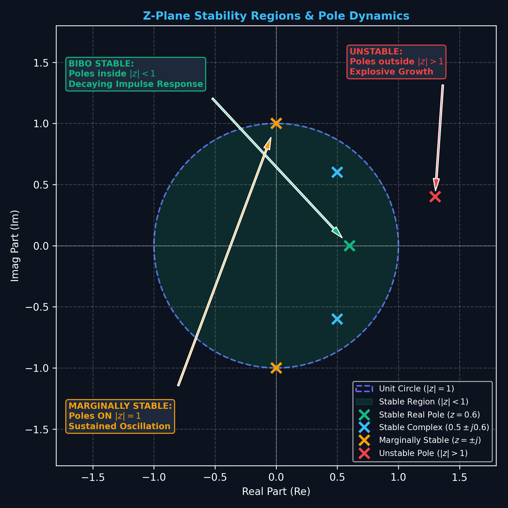
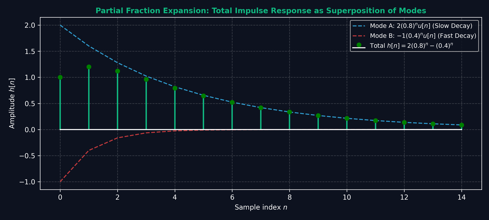

# Lecture 6: Inverse Z-Transform \& Stability Analysis

**Course:** EE3621 — Digital Signal Processing  
**Target Audience:** III B.Tech EEE Students  
**Duration:** 40 Minutes  

* **Available Formats:** [LaTeX Source File](file:///C:/Users/sriph/Downloads/DSP/lecture_06.tex) | [Compiled PDF Notes](file:///C:/Users/sriph/Downloads/DSP/lecture_06.pdf)

---

## 1. Lecture Plan (40 Minutes Breakdown)
* **00:00 – 05:00 (5 mins):** Motivation: Why do we need the Inverse Z-transform? Uniqueness of ROC.
* **05:00 – 18:00 (13 mins):** Method 1: Partial Fraction Expansion (Distinct and Repeated Poles).
* **18:00 – 25:00 (7 mins):** Method 2: Power Series Expansion (Long Division for causal vs. anti-causal).
* **25:00 – 30:00 (5 mins):** Method 3: Contour Integration (Residue Theorem).
* **30:00 – 38:00 (8 mins):** Stability \& Causality Analysis of LTI Systems based on poles.
* **38:00 – 40:00 (2 mins):** Checkpoint & Summary.

---

## 2. Overview of the Inverse Z-Transform

The Z-transform maps a sequence $x[n]$ to $X(z)$. The **Inverse Z-Transform** recovers the discrete-time sequence $x[n]$ from $X(z)$ and its associated Region of Convergence (ROC):

$$x[n] = \mathcal{Z}^{-1}\{X(z)\}$$

Without the ROC, the inverse Z-transform is **not unique**. For example, the algebraic expression $X(z) = \frac{z}{z-a}$ corresponds to:
* $x[n] = a^n u[n]$ if the ROC is $|z| > |a|$ (causal).
* $x[n] = -a^n u[-n-1]$ if the ROC is $|z| < |a|$ (anti-causal).

Therefore, **always specify the ROC** when performing inverse Z-transforms.

---

## 3. Method 1: Partial Fraction Expansion

This is the most common method for rational system functions. We expand $X(z)/z$ into a sum of simpler terms whose inverse transforms are known.

### A. Case 1: Distinct Poles
If $\frac{X(z)}{z}$ has distinct poles $p_1, p_2, \dots, p_N$:
$$\frac{X(z)}{z} = \frac{A_1}{z-p_1} + \frac{A_2}{z-p_2} + \dots + \frac{A_N}{z-p_N}$$
where the residues $A_i$ are found using the cover-up method:
$$A_i = \left[ (z - p_i) \frac{X(z)}{z} \right]_{z = p_i}$$

### B. Case 2: Repeated Poles
If $\frac{X(z)}{z}$ contains a pole $p_1$ repeated $m$ times:
$$\frac{X(z)}{z} = \frac{A_{11}}{z-p_1} + \frac{A_{12}}{(z-p_1)^2} + \dots + \frac{A_{1m}}{(z-p_1)^m} + \sum_{k=2}^{N} \frac{A_k}{z-p_k}$$
The coefficients for the repeated poles are computed using derivatives:
$$A_{1k} = \frac{1}{(m-k)!} \left[ \frac{d^{m-k}}{dz^{m-k}} \left( (z - p_1)^m \frac{X(z)}{z} \right) \right]_{z = p_1}$$
Once all residues are computed, we multiply back by $z$ to form terms like $\frac{A_j z}{z-p_j} \longleftrightarrow A_j p_j^n u[n]$ or $\frac{A z}{(z-p)^2} \longleftrightarrow A n p^{n-1} u[n]$.

---

## 4. Method 2: Power Series Expansion (Long Division)

This method is useful when only the first few values of $x[n]$ are required or when $X(z)$ is difficult to factor. We expand $X(z)$ directly as a power series:

$$X(z) = \sum_{n=-\infty}^{\infty} x[n] z^{-n} = \dots + x[-1]z^1 + x[0] + x[1]z^{-1} + x[2]z^{-2} + \dots$$

The coefficients of $z^{-n}$ are the time samples $x[n]$.
* **For a causal sequence ($|z| > |a|$):** Arrange numerator and denominator in descending powers of $z$ (or ascending powers of $z^{-1}$) and perform division to get a series of the form $x[0] + x[1]z^{-1} + x[2]z^{-2} + \dots$.
* **For an anti-causal sequence ($|z| < |a|$):** Arrange numerator and denominator in ascending powers of $z$ (or descending powers of $z^{-1}$) and perform division to get a series of the form $x[-1]z^1 + x[-2]z^2 + \dots$.

---

## 5. Method 3: Contour Integration (Residue Method)

The formal definition of the inverse Z-transform is a contour integral in the complex plane:

$$x[n] = \frac{1}{2\pi j} \oint_{C} X(z) z^{n-1} dz$$

where $C$ is a counterclockwise closed path in the ROC of $X(z)$ circling the origin.
Using Cauchy's Residue Theorem, the integral is computed as:
$$x[n] = \sum \text{Residues of } \left[ X(z) z^{n-1} \right] \text{ at the poles inside } C$$
The residue of a pole $z = p$ of order $m$ is found using:
$$\text{Res}\left\{ X(z) z^{n-1} \right\}_{z=p} = \frac{1}{(m-1)!} \lim_{z \to p} \frac{d^{m-1}}{dz^{m-1}} \left[ (z-p)^m X(z) z^{n-1} \right]$$

---

---

## 6. Comprehensive Worked Numerical: Solving via All 3 Inversion Approaches

To deeply understand the mechanics, equivalence, and nuances of the three inverse Z-transform methods, we solve the **exact same system** using all three approaches across different ROC conditions.

### Problem Statement
Given the rational Z-transform:
$$X(z) = \frac{1}{1 - 1.5 z^{-1} + 0.5 z^{-2}} = \frac{z^2}{z^2 - 1.5 z + 0.5} = \frac{z^2}{(z - 1)(z - 0.5)}$$

Determine the sequence $x[n]$ for:
* **Condition 1:** Causal Sequence (ROC: $|z| > 1$)
* **Condition 2:** Anti-Causal Sequence (ROC: $|z| < 0.5$)
* **Condition 3:** Two-Sided / BIBO Stable Sequence (ROC: $0.5 < |z| < 1$)

---

### Approach 1: Partial Fraction Expansion (PFE)

#### Step 1: Form $\frac{X(z)}{z}$
$$\frac{X(z)}{z} = \frac{z}{(z - 1)(z - 0.5)} = \frac{A}{z - 1} + \frac{B}{z - 0.5}$$

#### Step 2: Calculate Residues (Cover-Up Rule)
$$A = \left[ (z - 1) \frac{X(z)}{z} \right]_{z = 1} = \left. \frac{z}{z - 0.5} \right|_{z = 1} = \frac{1}{1 - 0.5} = 2$$
$$B = \left[ (z - 0.5) \frac{X(z)}{z} \right]_{z = 0.5} = \left. \frac{z}{z - 1} \right|_{z = 0.5} = \frac{0.5}{0.5 - 1} = -1$$

#### Step 3: Reconstruct $X(z)$
$$X(z) = 2 \left( \frac{z}{z - 1} \right) - 1 \left( \frac{z}{z - 0.5} \right) = \frac{2}{1 - z^{-1}} - \frac{1}{1 - 0.5 z^{-1}}$$

#### Step 4: Apply ROC Conditions
1. **For Causal ROC ($|z| > 1$):** Both poles ($z=1, z=0.5$) lie inside the ROC boundary $\implies$ both terms are right-sided:
   $$x[n] = 2 (1)^n u[n] - (0.5)^n u[n] = \left[ 2 - (0.5)^n \right] u[n]$$
   * *Sample values:* $x[0] = 1.0$, $x[1] = 1.5$, $x[2] = 1.75$, $x[3] = 1.875, \dots$

2. **For Anti-Causal ROC ($|z| < 0.5$):** Both poles lie outside the ROC boundary $\implies$ both terms are left-sided:
   $$x[n] = -2 (1)^n u[-n-1] + (0.5)^n u[-n-1] = \left[ (0.5)^n - 2 \right] u[-n-1]$$
   * *Sample values:* $x[-1] = 0$, $x[-2] = 2$, $x[-3] = 6$, $x[-4] = 14, \dots$

3. **For Two-Sided ROC ($0.5 < |z| < 1$):** Pole at $z=0.5$ is inside $|z|>0.5$ (causal); pole at $z=1$ is outside $|z|<1$ (anti-causal):
   $$x[n] = -(0.5)^n u[n] - 2 u[-n-1]$$

---

### Approach 2: Power Series Expansion (Long Division Method)

We express $X(z) = \sum_{n=-\infty}^{\infty} x[n] z^{-n}$ by directly dividing numerator by denominator.

#### Case A: Causal Sequence ($|z| > 1$)
Arrange numerator and denominator in **descending powers of $z$** (ascending powers of $z^{-1}$):
$$1 \div \left( 1 - 1.5 z^{-1} + 0.5 z^{-2} \right)$$

* **Division Steps:**
  1. $1 \div 1 = \mathbf{1}$. Remainder: $1 - (1 - 1.5 z^{-1} + 0.5 z^{-2}) = 1.5 z^{-1} - 0.5 z^{-2}$.
  2. $1.5 z^{-1} \div 1 = \mathbf{1.5 z^{-1}}$. Remainder: $(1.5 z^{-1} - 0.5 z^{-2}) - (1.5 z^{-1} - 2.25 z^{-2} + 0.75 z^{-3}) = 1.75 z^{-2} - 0.75 z^{-3}$.
  3. $1.75 z^{-2} \div 1 = \mathbf{1.75 z^{-2}}$. Remainder: $(1.75 z^{-2} - 0.75 z^{-3}) - (1.75 z^{-2} - 2.625 z^{-3} + 0.875 z^{-4}) = 1.875 z^{-3} - 0.875 z^{-4}$.
  4. $1.875 z^{-3} \div 1 = \mathbf{1.875 z^{-3}}$.

* **Quotient Series:**
  $$X(z) = 1 + 1.5 z^{-1} + 1.75 z^{-2} + 1.875 z^{-3} + \dots$$
  $$\implies x[0] = 1, \quad x[1] = 1.5, \quad x[2] = 1.75, \quad x[3] = 1.875$$
  *(Identical to Approach 1!)*

#### Case B: Anti-Causal Sequence ($|z| < 0.5$)
Arrange numerator and denominator in **ascending powers of $z$** (descending powers of $z^{-1}$):
$$1 \div \left( 0.5 z^{-2} - 1.5 z^{-1} + 1 \right)$$

* **Division Steps:**
  1. $1 \div 0.5 z^{-2} = \mathbf{2 z^2}$. Remainder: $1 - (1 - 3 z + 2 z^2) = 3 z - 2 z^2$.
  2. $3 z \div 0.5 z^{-2} = \mathbf{6 z^3}$. Remainder: $(3 z - 2 z^2) - (3 z - 9 z^2 + 6 z^3) = 7 z^2 - 6 z^3$.
  3. $7 z^2 \div 0.5 z^{-2} = \mathbf{14 z^4}$.

* **Quotient Series:**
  $$X(z) = 0 z^1 + 2 z^2 + 6 z^3 + 14 z^4 + \dots = \sum_{n=-\infty}^{-1} x[n] z^{-n}$$
  $$\implies x[-1] = 0, \quad x[-2] = 2, \quad x[-3] = 6, \quad x[-4] = 14$$
  *(Identical to Approach 1!)*

---

### Approach 3: Contour Integration (Cauchy's Residue Theorem)

The definition of the inverse transform is:
$$x[n] = \frac{1}{2\pi j} \oint_{C} X(z) z^{n-1} dz = \frac{1}{2\pi j} \oint_{C} \frac{z^{n+1}}{(z - 1)(z - 0.5)} dz$$

Let integrand $F(z) = \frac{z^{n+1}}{(z - 1)(z - 0.5)}$. The simple poles of $F(z)$ are at $z = 1$ and $z = 0.5$.

#### Residue Calculations at Simple Poles:
$$\text{Res}\{F(z)\}_{z=1} = \lim_{z \to 1} (z - 1) F(z) = \left. \frac{z^{n+1}}{z - 0.5} \right|_{z=1} = \frac{1^{n+1}}{1 - 0.5} = 2(1)^n$$
$$\text{Res}\{F(z)\}_{z=0.5} = \lim_{z \to 0.5} (z - 0.5) F(z) = \left. \frac{z^{n+1}}{z - 1} \right|_{z=0.5} = \frac{(0.5)^{n+1}}{0.5 - 1} = -(0.5)^n$$

#### Application to ROCs:
1. **Causal ROC ($|z| > 1$):** Contour $C$ encloses both poles $z=1$ and $z=0.5$.
   * For $n \ge 0$:
     $$x[n] = \text{Res}_{z=1} + \text{Res}_{z=0.5} = 2(1)^n - (0.5)^n = \left[ 2 - (0.5)^n \right] u[n]$$
   * For $n < 0$: The additional multiple pole at $z=0$ has a residue that exactly cancels $\text{Res}_{z=1} + \text{Res}_{z=0.5}$, yielding $x[n] = 0$.

2. **Anti-Causal ROC ($|z| < 0.5$):** Contour $C$ has radius $r < 0.5$, enclosing no poles for $n \ge 0$ ($x[n] = 0$).
   * For $n < 0$, evaluating residues on the exterior of contour $C$:
     $$x[n] = -\left( \text{Res}_{z=1} + \text{Res}_{z=0.5} \right) = -\left[ 2 - (0.5)^n \right] = \left[ (0.5)^n - 2 \right] u[-n-1]$$

3. **Two-Sided ROC ($0.5 < |z| < 1$):** Contour $C$ encloses only the pole at $z=0.5$, while $z=1$ lies outside:
   $$x[n] = \text{Res}_{z=0.5} u[n] - \text{Res}_{z=1} u[-n-1] = -(0.5)^n u[n] - 2 u[-n-1]$$

---

### Comparison & Verification Summary Table

| Method | Best Used When | Output Format | Causal Sample Values $(n=0, 1, 2, 3)$ |
| :--- | :--- | :--- | :--- |
| **1. Partial Fraction Expansion** | Closed-form time sequence $x[n]$ is required for arbitrary $n$. | Analytic closed-form equation: $[2 - (0.5)^n]u[n]$ | $\{1.0, 1.5, 1.75, 1.875\}$ |
| **2. Power Series (Long Division)** | Only the first few samples $x[0], x[1], \dots$ are needed. | Explicit sequence coefficient array | $\{1.0, 1.5, 1.75, 1.875\}$ |
| **3. Contour Integration** | Formal mathematical proofs or non-rational analytic functions. | Analytic residue summation | $\{1.0, 1.5, 1.75, 1.875\}$ |

## 7. Stability, Causality \& Pole Locations

For a discrete LTI system, the transfer function is $H(z) = \frac{Y(z)}{X(z)}$, which is the Z-transform of the impulse response $h[n]$.

### A. Causality
A system is causal if $h[n] = 0$ for $n < 0$. This requires the ROC of $H(z)$ to be the exterior of the outermost pole:
$$|z| > p_{max}$$

### B. BIBO Stability
A system is stable if and only if the ROC of $H(z)$ contains the unit circle ($|z| = 1$).

### C. Pole-Zero Stability Criterion
For a causal LTI system to be stable, the ROC $|z| > p_{max}$ must contain the unit circle. This is satisfied if and only if **all poles of $H(z)$ lie strictly inside the unit circle**:
$$|p_i| < 1 \quad \forall i$$

Below are the pole location stability regions in the complex z-plane:

Below are the four possible impulse response profiles based on pole location and ROC causality choice:

* **Left panel (Green)**: Causal stable ($|p| < 1$, decaying) and anti-causal stable ($|p| > 1$, decaying for $n \to -\infty$).
* **Right panel (Red)**: Causal unstable ($|p| > 1$, expanding) and anti-causal unstable ($|p| < 1$, expanding for $n \to -\infty$).

---

## 8. Checkpoint \& Quick Review Questions

1. **Q1:** Find the inverse Z-transform of $H(z) = \frac{z^2}{(z - 0.5)(z - 2)}$ for the stable ROC: $0.5 < |z| < 2$.
   * *Answer:*
     1. Divide by $z$:
        $$\frac{H(z)}{z} = \frac{z}{(z-0.5)(z-2)} = \frac{A}{z-0.5} + \frac{B}{z-2}$$
     2. Calculate residues:
        $$A = \left[ \frac{z}{z-2} \right]_{z=0.5} = \frac{0.5}{0.5-2} = -\frac{1}{3}$$
        $$B = \left[ \frac{z}{z-0.5} \right]_{z=2} = \frac{2}{2-0.5} = \frac{4}{3}$$
     3. Reconstruct $H(z)$:
        $$H(z) = -\frac{1}{3} \frac{z}{z-0.5} + \frac{4}{3} \frac{z}{z-2}$$
     4. Find $h[n]$ using the ROC $0.5 < |z| < 2$:
        * For the pole at $z = 0.5$, the ROC $|z| > 0.5$ implies a **causal** sequence: $-\frac{1}{3} (0.5)^n u[n]$.
        * For the pole at $z = 2$, the ROC $|z| < 2$ implies an **anti-causal** sequence: $-\frac{4}{3} (2)^n u[-n-1]$.
     5. Combining them:
        $$h[n] = -\frac{1}{3} (0.5)^n u[n] - \frac{4}{3} (2)^n u[-n-1]$$

2. **Q2:** Find the first three terms of the causal sequence corresponding to $X(z) = \frac{1}{1 - 0.5 z^{-1}}$ using long division.
   * *Answer:*
     Perform long division of $1$ by $1 - 0.5 z^{-1}$:
     * Step 1: $1 / (1 - 0.5 z^{-1}) \implies$ quotient is $1$, remainder is $0.5 z^{-1}$.
     * Step 2: $0.5 z^{-1} / (1 - 0.5 z^{-1}) \implies$ quotient is $0.5 z^{-1}$, remainder is $0.25 z^{-2}$.
     * Step 3: $0.25 z^{-2} / (1 - 0.5 z^{-1}) \implies$ quotient is $0.25 z^{-2}$, remainder is $0.125 z^{-3}$.
     * Result: $X(z) = 1 + 0.5 z^{-1} + 0.25 z^{-2} + \dots$
     * Thus, $x[0] = 1$, $x[1] = 0.5$, and $x[2] = 0.25$.

---

### Visual Illustration: Z-Plane Stability Regions & Pole Dynamics

* **Physical Insight:** 
  - **Inside Unit Circle ($|z| < 1$):** Poles generate decaying modes ($|p|^n 	o 0$ as $n 	o \infty$), guaranteeing bounded-input bounded-output (BIBO) stability.
  - **On Unit Circle ($|z| = 1$):** Poles generate sustained oscillations or step functions without decaying (Marginal Stability / Oscillators).
  - **Outside Unit Circle ($|z| > 1$):** Poles produce exponentially explosive modes ($|p|^n 	o \infty$), causing immediate system saturation/overflow.

---

### Visual Illustration: Impulse Response Modes Across the Z-Plane

* **Waveform Characteristics:**
  - **Positive Real Pole ($z=0.7$):** Smooth monotonic exponential decay.
  - **Negative Real Pole ($z=-0.7$):** Alternating sign ($\pm$) decaying oscillation with frequency $\omega = \pi$.
  - **Complex Conjugate Pair ($0.8 e^{\pm j\pi/4}$):** Damped sinusoidal oscillation with envelope decay $0.8^n$.
  - **Unit Circle Conjugate Pair ($e^{\pm j\pi/4}$):** Pure undamped sinusoidal oscillation with permanent energy.

---

### Visual Illustration: Partial Fraction Expansion Decomposition

* **Linear Superposition:** The overall system impulse response $h[n] = 2(0.8)^n u[n] - (0.4)^n u[n]$ is the exact linear superposition of its individual first-order pole modes.
