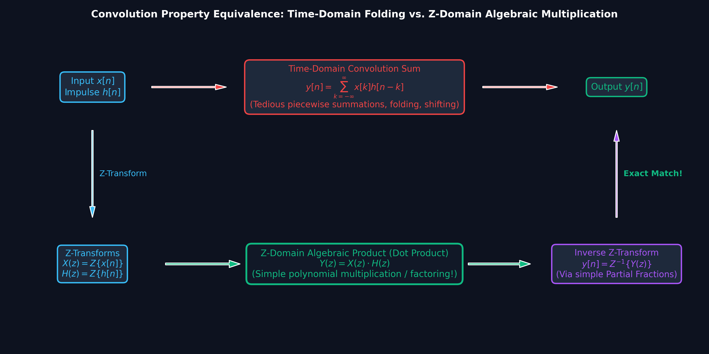
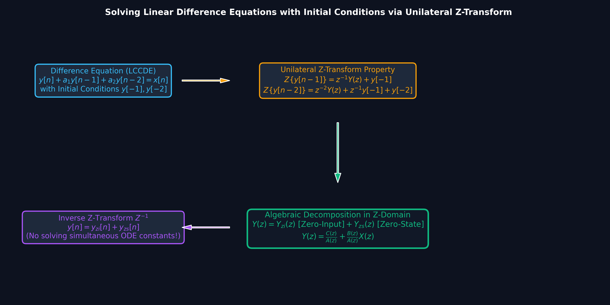
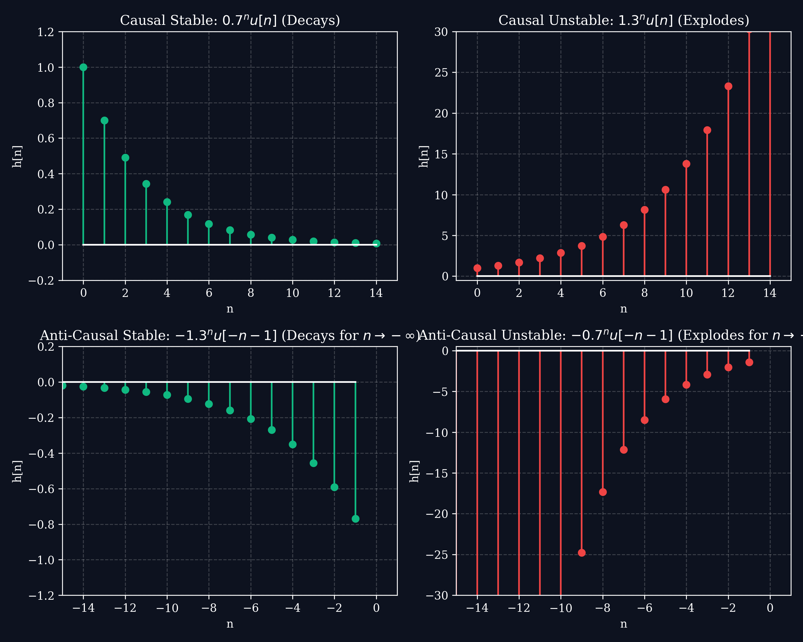

# Lecture 6: Inverse Z-Transform, System Response \& Difference Equations

**Course:** EE3621 — Digital Signal Processing  
**Target Audience:** III B.Tech EEE Students  
**Duration:** 40 Minutes  

* **Available Formats:** [LaTeX Source File](file:///C:/Users/sriph/Downloads/DSP/lecture_06.tex) | [Compiled PDF Notes](file:///C:/Users/sriph/Downloads/DSP/lecture_06.pdf)

---

## 1. Lecture Plan (40 Minutes Breakdown)
* **00:00 – 05:00 (5 mins):** Motivation: Why do we need the Inverse Z-transform? Uniqueness of ROC.
* **05:00 – 12:00 (7 mins):** Three Core Inversion Approaches (PFE, Power Series, Contour Integration).
* **12:00 – 20:00 (8 mins):** Numerical Examples: Real Exponentials ($a^n$), Repeated Poles ($n a^n$), and Complex Conjugate Poles (Damped Cosine & Sine).
* **20:00 – 27:00 (7 mins):** Equivalence of Time-Domain Convolution and Z-Domain Algebraic Dot Product.
* **27:00 – 34:00 (7 mins):** Solving Linear Constant-Coefficient Difference Equations (LCCDE) with Initial Conditions ($Y_{zi} + Y_{zs}$).
* **34:00 – 38:00 (4 mins):** Stability \& Causality Criteria from Pole Placement.
* **38:00 – 40:00 (2 mins):** Checkpoints & Concept Review.

---

## 2. Overview of the Inverse Z-Transform

The Z-transform maps a discrete sequence $x[n]$ to $X(z)$. The **Inverse Z-Transform** recovers the sequence $x[n]$ from $X(z)$ and its specified Region of Convergence (ROC):

$$x[n] = \mathcal{Z}^{-1}\{X(z)\}$$

Without the ROC, the inverse Z-transform is **not unique**. For example, the rational algebraic expression $X(z) = \frac{z}{z-a}$ corresponds to:
* $x[n] = a^n u[n]$ if the ROC is $|z| > |a|$ (Right-Sided / Causal).
* $x[n] = -a^n u[-n-1]$ if the ROC is $|z| < |a|$ (Left-Sided / Anti-Causal).

---

## 3. The Three Inversion Methods

### Method 1: Partial Fraction Expansion (PFE)
For rational transfer functions $\frac{X(z)}{z} = \frac{B(z)}{A(z)}$:
* **Distinct Poles $p_k$:** $\frac{X(z)}{z} = \sum_{k=1}^N \frac{A_k}{z-p_k}$, where $A_k = \left[ (z-p_k) \frac{X(z)}{z} \right]_{z=p_k}$.
* **Repeated Poles (order $m$ at $p_1$):** $\frac{X(z)}{z} = \sum_{k=1}^m \frac{A_{1k}}{(z-p_1)^k} + \sum_{i=2}^N \frac{A_i}{z-p_i}$, where $A_{1k} = \frac{1}{(m-k)!} \left[ \frac{d^{m-k}}{dz^{m-k}} \left( (z-p_1)^m \frac{X(z)}{z} \right) \right]_{z=p_1}$.
* **Complex Conjugate Poles ($p, p^* = r e^{\pm j\omega_0}$):** Produce damped sinusoidal modes $r^n \cos(\omega_0 n) u[n]$ and $r^n \sin(\omega_0 n) u[n]$.

### Method 2: Power Series Expansion (Polynomial Long Division)
Expands $X(z) = \sum_{n=-\infty}^\infty x[n] z^{-n}$ by direct division:
* **Causal ($|z| > |p|$):** Divide numerator by denominator arranged in **descending powers of $z$** (ascending powers of $z^{-1}$) to yield $x[0] + x[1]z^{-1} + x[2]z^{-2} + \dots$.
* **Anti-Causal ($|z| < |p|$):** Divide in **ascending powers of $z$** (descending powers of $z^{-1}$) to yield $x[-1]z^1 + x[-2]z^2 + \dots$.

### Method 3: Contour Integration (Cauchy's Residue Theorem)
$$x[n] = \frac{1}{2\pi j} \oint_{C} X(z) z^{n-1} dz = \sum \text{Residues of } \left[ X(z) z^{n-1} \right] \text{ at poles inside contour } C$$

---

## 4. Worked Numerical 1: Comparing All 3 Inversion Approaches on $X(z)$

### Problem Statement
Given $X(z) = \frac{1}{1 - 1.5 z^{-1} + 0.5 z^{-2}} = \frac{z^2}{(z - 1)(z - 0.5)}$, find $x[n]$ for:
1. **Causal Sequence (ROC: $|z| > 1$)**
2. **Anti-Causal Sequence (ROC: $|z| < 0.5$)**
3. **Two-Sided / BIBO Stable Sequence (ROC: $0.5 < |z| < 1$)**

---

### Solution via Approach 1: Partial Fraction Expansion
Form $\frac{X(z)}{z} = \frac{z}{(z - 1)(z - 0.5)} = \frac{A}{z - 1} + \frac{B}{z - 0.5}$.
* $A = \left. \frac{z}{z - 0.5} \right|_{z = 1} = \frac{1}{1 - 0.5} = 2$
* $B = \left. \frac{z}{z - 1} \right|_{z = 0.5} = \frac{0.5}{0.5 - 1} = -1$

$$X(z) = 2 \left( \frac{z}{z - 1} \right) - 1 \left( \frac{z}{z - 0.5} \right) = \frac{2}{1 - z^{-1}} - \frac{1}{1 - 0.5 z^{-1}}$$

* **1. Causal ($|z| > 1$):** $x[n] = \left[ 2(1)^n - (0.5)^n \right] u[n] \implies \{1.0, 1.5, 1.75, 1.875, \dots\}$.
* **2. Anti-Causal ($|z| < 0.5$):** $x[n] = \left[ (0.5)^n - 2 \right] u[-n-1] \implies \{\dots, 14, 6, 2, 0\}$.
* **3. Two-Sided ($0.5 < |z| < 1$):** $x[n] = -(0.5)^n u[n] - 2 u[-n-1]$.

---

### Solution via Approach 2: Power Series (Long Division)
* **Causal ($|z| > 1$):**
  $$1 \div (1 - 1.5 z^{-1} + 0.5 z^{-2}) = 1 + 1.5 z^{-1} + 1.75 z^{-2} + 1.875 z^{-3} + \dots$$
  $\implies x[0] = 1.0, \quad x[1] = 1.5, \quad x[2] = 1.75, \quad x[3] = 1.875$.
* **Anti-Causal ($|z| < 0.5$):**
  $$1 \div (0.5 z^{-2} - 1.5 z^{-1} + 1) = 0 z^1 + 2 z^2 + 6 z^3 + 14 z^4 + \dots$$
  $\implies x[-1] = 0, \quad x[-2] = 2, \quad x[-3] = 6, \quad x[-4] = 14$.

---

### Solution via Approach 3: Contour Integration
Integrand $F(z) = \frac{z^{n+1}}{(z - 1)(z - 0.5)}$.
* $\text{Res}_{z=1} = \left. \frac{z^{n+1}}{z - 0.5} \right|_{z=1} = 2(1)^n$
* $\text{Res}_{z=0.5} = \left. \frac{z^{n+1}}{z - 1} \right|_{z=0.5} = -(0.5)^n$

Summing enclosed residues yields identical analytical expressions and sample values across all ROCs!

---

## 5. Worked Numerical 2: Inversion of Complex Conjugate Poles (Sinusoids \& Damped Cosines)

### Problem Statement
Find the causal inverse Z-transform of:
$$X(z) = \frac{z^2 - \frac{\sqrt{2}}{2} z}{z^2 - \sqrt{2} z + 1}, \quad \text{ROC: } |z| > 1$$

### Analytical Solution
The denominator polynomial has complex conjugate roots on the unit circle:
$$z^2 - \sqrt{2} z + 1 = 0 \implies p_{1,2} = \frac{\sqrt{2} \pm j\sqrt{2}}{2} = e^{\pm j\pi/4} \quad (r = 1, \omega_0 = \pi/4)$$

Recall the standard transform pairs:
$$\mathcal{Z}\left\{ r^n \cos(\omega_0 n) u[n] \right\} = \frac{z (z - r \cos\omega_0)}{z^2 - 2r\cos\omega_0 z + r^2}$$
$$\mathcal{Z}\left\{ r^n \sin(\omega_0 n) u[n] \right\} = \frac{z (r \sin\omega_0)}{z^2 - 2r\cos\omega_0 z + r^2}$$

Here $r = 1$ and $\omega_0 = \pi/4 \implies r \cos\omega_0 = \cos(\pi/4) = \frac{\sqrt{2}}{2}$.
The numerator is exactly $z(z - \cos(\pi/4)) = z^2 - \frac{\sqrt{2}}{2} z$.

Therefore, by direct pattern recognition:
$$x[n] = \cos\left( \frac{\pi}{4} n \right) u[n]$$

* **Sample Values:**
  - $n=0$: $x[0] = \cos(0) = 1.0$
  - $n=1$: $x[1] = \cos(\pi/4) = \frac{\sqrt{2}}{2} \approx 0.7071$
  - $n=2$: $x[2] = \cos(\pi/2) = 0.0$
  - $n=3$: $x[3] = \cos(3\pi/4) = -\frac{\sqrt{2}}{2} \approx -0.7071$
  - $n=4$: $x[4] = \cos(\pi) = -1.0$

### General Damped Case:
For a general second-order section $X(z) = \frac{z(z - r\cos\omega_0) + K z(r\sin\omega_0)}{z^2 - 2r\cos\omega_0 z + r^2}$ with ROC $|z| > r$:
$$x[n] = r^n \left[ \cos(\omega_0 n) + K \sin(\omega_0 n) \right] u[n] = A r^n \cos(\omega_0 n - \phi) u[n]$$
where $A = \sqrt{1 + K^2}$ and $\phi = \tan^{-1}(K)$.

---

## 6. Worked Numerical 3: Inversion with Repeated Poles ($a^n$ and $n a^n$)

### Problem Statement
Find the causal inverse Z-transform of:
$$X(z) = \frac{z^2}{(z - 0.5)^2}, \quad \text{ROC: } |z| > 0.5$$

### Solution via PFE
$$\frac{X(z)}{z} = \frac{z}{(z - 0.5)^2} = \frac{A_1}{z - 0.5} + \frac{A_2}{(z - 0.5)^2}$$

* For repeated pole $p = 0.5$:
  $$A_2 = \left[ (z - 0.5)^2 \frac{X(z)}{z} \right]_{z = 0.5} = [z]_{z=0.5} = 0.5$$
  $$A_1 = \left[ \frac{d}{dz} \left( (z - 0.5)^2 \frac{X(z)}{z} \right) \right]_{z = 0.5} = \left[ \frac{d}{dz}(z) \right]_{z=0.5} = 1.0$$

Multiply back by $z$:
$$X(z) = 1.0 \left( \frac{z}{z - 0.5} \right) + 0.5 \left( \frac{z}{(z - 0.5)^2} \right)$$

Using the standard transform pairs $\frac{z}{z-a} \longleftrightarrow a^n u[n]$ and $\frac{a z}{(z-a)^2} \longleftrightarrow n a^n u[n]$:
$$x[n] = (0.5)^n u[n] + n(0.5)^n u[n] = (n + 1)(0.5)^n u[n]$$

* **Sample Values:**
  - $n=0$: $x[0] = (1)(1) = 1.0$
  - $n=1$: $x[1] = (2)(0.5) = 1.0$
  - $n=2$: $x[2] = (3)(0.25) = 0.75$
  - $n=3$: $x[3] = (4)(0.125) = 0.50$
  - $n=4$: $x[4] = (5)(0.0625) = 0.3125$

---

## 7. Convolution in Time Domain $\longleftrightarrow$ Z-Domain Dot Product \& Inverse Z

### Visual Illustration: Convolution Theorem Equivalence

### Why Transform-Domain Convolution is Vastly Superior:
In the discrete-time domain, computing linear convolution:
$$y[n] = x[n] * h[n] = \sum_{k=-\infty}^{\infty} x[k] h[n-k]$$
requires flipping $h[k] \to h[-k]$, sliding by $n$ steps, determining non-zero overlap intervals, and evaluating tedious piecewise geometric series.

In the Z-domain, convolution simplifies into **algebraic multiplication (dot product)**:
$$Y(z) = X(z) \cdot H(z)$$
The time-domain output $y[n]$ is then directly obtained by taking the **Inverse Z-Transform** of $Y(z)$ via Partial Fractions!

---

### Worked Numerical on Convolution Equivalence

**Given:**
* Input sequence: $x[n] = (0.5)^n u[n]$
* System impulse response: $h[n] = (0.8)^n u[n]$

#### Method A: Classical Time-Domain Convolution Sum
For $n \ge 0$:
$$y[n] = \sum_{k=0}^{n} (0.5)^k (0.8)^{n-k} = (0.8)^n \sum_{k=0}^{n} \left( \frac{0.5}{0.8} \right)^k = (0.8)^n \left[ \frac{1 - (5/8)^{n+1}}{1 - 5/8} \right]$$
$$y[n] = (0.8)^n \cdot \frac{8}{3} \left[ 1 - \frac{5}{8}\left(\frac{5}{8}\right)^n \right] = \frac{8}{3}(0.8)^n - \frac{5}{3}(0.5)^n, \quad n \ge 0$$

#### Method B: Z-Domain Product + Inverse Z-Transform
1. **Take Z-Transforms:**
   $$X(z) = \frac{z}{z - 0.5}, \quad |z| > 0.5$$
   $$H(z) = \frac{z}{z - 0.8}, \quad |z| > 0.8$$

2. **Multiply in Z-Domain:**
   $$Y(z) = X(z) \cdot H(z) = \frac{z^2}{(z - 0.5)(z - 0.8)}, \quad |z| > 0.8$$

3. **Take Inverse Z-Transform via PFE:**
   $$\frac{Y(z)}{z} = \frac{z}{(z - 0.5)(z - 0.8)} = \frac{A}{z - 0.5} + \frac{B}{z - 0.8}$$
   * $A = \left. \frac{z}{z - 0.8} \right|_{z=0.5} = \frac{0.5}{0.5 - 0.8} = -\frac{5}{3}$
   * $B = \left. \frac{z}{z - 0.5} \right|_{z=0.8} = \frac{0.8}{0.8 - 0.5} = \frac{8}{3}$

   $$Y(z) = -\frac{5}{3}\left(\frac{z}{z-0.5}\right) + \frac{8}{3}\left(\frac{z}{z-0.8}\right)$$
   $$y[n] = \left[ \frac{8}{3}(0.8)^n - \frac{5}{3}(0.5)^n \right] u[n]$$

*Both methods yield the exact same result, but Method B required zero summation manipulations!*

---

## 8. Solving Linear Difference Equations (LCCDE) via Unilateral Z-Transform

### Visual Illustration: Difference Equation Solution Architecture

### Why the Z-Transform Method is Vastly Superior to Classical Time-Domain Methods:

| Classical Time-Domain Method | Unilateral Z-Transform Method |
| :--- | :--- |
| Must find homogeneous solution $y_h[n]$ from characteristic equation roots. | Replaces difference operators with algebraic powers of $z^{-1}$ directly. |
| Must guess form of particular solution $y_p[n]$ based on input. | Handles arbitrary inputs automatically via standard transform lookup tables. |
| Must set up and solve simultaneous linear equations to find constants $C_1, C_2$. | Initial conditions $y[-1], y[-2]$ are directly incorporated via the time-delay property. |
| Complex, multi-step, error-prone for orders $N \ge 2$. | Output naturally decomposes into **Zero-Input Response** $y_{zi}[n]$ and **Zero-State Response** $y_{zs}[n]$. |

---

### Unilateral Z-Transform Time-Shift Property
For a causal difference equation evaluated for $n \ge 0$:
$$\mathcal{Z}\{y[n-1]\} = z^{-1} Y(z) + y[-1]$$
$$\mathcal{Z}\{y[n-2]\} = z^{-2} Y(z) + z^{-1} y[-1] + y[-2]$$

---

### Comprehensive Worked Numerical: Difference Equation with Initial Conditions

#### Problem Statement
Solve the second-order discrete difference equation:
$$y[n] - 0.7 y[n-1] + 0.1 y[n-2] = x[n] \quad \text{for } n \ge 0$$
with input $x[n] = u[n]$ (unit step) and initial conditions:
$$y[-1] = 2, \quad y[-2] = 1$$

---

#### Step 1: Apply Unilateral Z-Transform
$$Y(z) - 0.7 \left[ z^{-1} Y(z) + y[-1] \right] + 0.1 \left[ z^{-2} Y(z) + z^{-1} y[-1] + y[-2] \right] = X(z)$$

Substitute initial conditions $y[-1] = 2$ and $y[-2] = 1$:
$$Y(z) \left( 1 - 0.7 z^{-1} + 0.1 z^{-2} \right) - 0.7(2) + 0.1\left( 2 z^{-1} + 1 \right) = X(z)$$
$$Y(z) \left( 1 - 0.7 z^{-1} + 0.1 z^{-2} \right) - 1.4 + 0.2 z^{-1} + 0.1 = X(z)$$
$$Y(z) \left( 1 - 0.7 z^{-1} + 0.1 z^{-2} \right) - 1.3 + 0.2 z^{-1} = X(z)$$

Rearranging:
$$Y(z) \left( 1 - 0.7 z^{-1} + 0.1 z^{-2} \right) = \underbrace{(1.3 - 0.2 z^{-1})}_{\text{Initial Condition Term}} + X(z)$$

Divide by characteristic polynomial $A(z) = 1 - 0.7 z^{-1} + 0.1 z^{-2} = (1 - 0.5 z^{-1})(1 - 0.2 z^{-1})$:
$$Y(z) = \underbrace{\frac{1.3 - 0.2 z^{-1}}{1 - 0.7 z^{-1} + 0.1 z^{-2}}}_{Y_{zi}(z) \text{ (Zero-Input Response)}} + \underbrace{\frac{1}{1 - 0.7 z^{-1} + 0.1 z^{-2}} X(z)}_{Y_{zs}(z) \text{ (Zero-State Response)}}$$

---

#### Step 2: Compute Zero-Input Response $y_{zi}[n]$
$$Y_{zi}(z) = \frac{1.3 z^2 - 0.2 z}{z^2 - 0.7 z + 0.1} = \frac{z(1.3 z - 0.2)}{(z - 0.5)(z - 0.2)}$$
$$\frac{Y_{zi}(z)}{z} = \frac{1.3 z - 0.2}{(z - 0.5)(z - 0.2)} = \frac{A}{z - 0.5} + \frac{B}{z - 0.2}$$

* $A = \left. \frac{1.3 z - 0.2}{z - 0.2} \right|_{z=0.5} = \frac{1.3(0.5) - 0.2}{0.5 - 0.2} = \frac{0.45}{0.3} = 1.5$
* $B = \left. \frac{1.3 z - 0.2}{z - 0.5} \right|_{z=0.2} = \frac{1.3(0.2) - 0.2}{0.2 - 0.5} = \frac{0.06}{-0.3} = -0.2$

$$\implies y_{zi}[n] = \left[ 1.5(0.5)^n - 0.2(0.2)^n \right] u[n]$$

---

#### Step 3: Compute Zero-State Response $y_{zs}[n]$
With $X(z) = \mathcal{Z}\{u[n]\} = \frac{z}{z - 1}$:
$$Y_{zs}(z) = \frac{z^3}{(z - 0.5)(z - 0.2)(z - 1)}$$
$$\frac{Y_{zs}(z)}{z} = \frac{z^2}{(z - 0.5)(z - 0.2)(z - 1)} = \frac{C_1}{z - 0.5} + \frac{C_2}{z - 0.2} + \frac{C_3}{z - 1}$$

* $C_1 = \left. \frac{z^2}{(z - 0.2)(z - 1)} \right|_{z=0.5} = \frac{0.25}{(0.3)(-0.5)} = -\frac{0.25}{0.15} = -\frac{5}{3} \approx -1.667$
* $C_2 = \left. \frac{z^2}{(z - 0.5)(z - 1)} \right|_{z=0.2} = \frac{0.04}{(-0.3)(-0.8)} = \frac{0.04}{0.24} = \frac{1}{6} \approx 0.167$
* $C_3 = \left. \frac{z^2}{(z - 0.5)(z - 0.2)} \right|_{z=1} = \frac{1}{(0.5)(0.8)} = \frac{1}{0.4} = \frac{5}{2} = 2.5$

$$\implies y_{zs}[n] = \left[ 2.5 - \frac{5}{3}(0.5)^n + \frac{1}{6}(0.2)^n \right] u[n]$$

---

#### Step 4: Total Complete Response $y[n] = y_{zi}[n] + y_{zs}[n]$
$$y[n] = \left[ 1.5(0.5)^n - 0.2(0.2)^n + 2.5 - \frac{5}{3}(0.5)^n + \frac{1}{6}(0.2)^n \right] u[n]$$

Combine like terms:
* Constant term: $2.5$
* $(0.5)^n$ coefficient: $1.5 - \frac{5}{3} = \frac{3}{2} - \frac{5}{3} = -\frac{1}{6}$
* $(0.2)^n$ coefficient: $-0.2 + \frac{1}{6} = -\frac{1}{5} + \frac{1}{6} = -\frac{1}{30}$

$$\mathbf{y[n] = \left[ 2.5 - \frac{1}{6}(0.5)^n - \frac{1}{30}(0.2)^n \right] u[n]}$$

#### Verification at Initial Indices:
* $n=0$: $y[0] = 2.5 - \frac{1}{6} - \frac{1}{30} = 2.5 - \frac{6}{30} = 2.5 - 0.2 = \mathbf{2.3}$.  
  *(From difference equation: $y[0] = 0.7 y[-1] - 0.1 y[-2] + x[0] = 0.7(2) - 0.1(1) + 1 = 1.4 - 0.1 + 1 = \mathbf{2.3}$ $\checkmark$)*
* $n=1$: $y[1] = 2.5 - \frac{1}{6}(0.5) - \frac{1}{30}(0.2) = 2.5 - \frac{1}{12} - \frac{1}{150} \approx \mathbf{2.41}$.  
  *(From difference equation: $y[1] = 0.7(2.3) - 0.1(2) + 1 = 1.61 - 0.2 + 1 = \mathbf{2.41}$ $\checkmark$)*

---

## 9. Stability, Causality \& Pole Locations

### Visual Illustration: Z-Plane Stability Regions & Pole Dynamics

* **Physical Insight:** 
  - **Inside Unit Circle ($|z| < 1$):** Poles generate decaying modes ($|p|^n \to 0$ as $n \to \infty$), guaranteeing bounded-input bounded-output (BIBO) stability.
  - **On Unit Circle ($|z| = 1$):** Poles generate sustained oscillations or step functions without decaying (Marginal Stability / Oscillators).
  - **Outside Unit Circle ($|z| > 1$):** Poles produce exponentially explosive modes ($|p|^n \to \infty$), causing immediate system saturation/overflow.

---

### Visual Illustration: Impulse Response Modes Across the Z-Plane

* **Waveform Characteristics:**
  - **Positive Real Pole ($z=0.7$):** Smooth monotonic exponential decay.
  - **Negative Real Pole ($z=-0.7$):** Alternating sign ($\pm$) decaying oscillation with frequency $\omega = \pi$.
  - **Complex Conjugate Pair ($0.8 e^{\pm j\pi/4}$):** Damped sinusoidal oscillation with envelope decay $0.8^n$.
  - **Unit Circle Conjugate Pair ($e^{\pm j\pi/4}$):** Pure undamped sinusoidal oscillation with permanent energy.

---

### Visual Illustration: Partial Fraction Expansion Decomposition

* **Linear Superposition:** The overall system impulse response $h[n] = 2(0.8)^n u[n] - (0.4)^n u[n]$ is the exact linear superposition of its individual first-order pole modes.

---

## 10. Checkpoint \& Review Questions

1. **Q1:** How does the Z-transform convert time-domain convolution into algebra?
   * *Answer:* Time-domain convolution $y[n] = x[n]*h[n]$ maps to polynomial dot product $Y(z) = X(z)H(z)$. Finding $y[n]$ requires only algebraic multiplication followed by Partial Fraction Expansion.
2. **Q2:** Why does solving difference equations via Unilateral Z-transform avoid solving simultaneous ODE constants?
   * *Answer:* Initial conditions $y[-1], y[-2]$ enter directly into the algebraic polynomial equation through the time-delay property $\mathcal{Z}\{y[n-k]\}$, splitting the response into Zero-Input ($Y_{zi}$) and Zero-State ($Y_{zs}$) terms immediately.
3. **Q3:** What time-domain sequence corresponds to complex conjugate poles $z = r e^{\pm j\omega_0}$ inside the unit circle?
   * *Answer:* A damped sinusoidal oscillation of the form $A r^n \cos(\omega_0 n + \theta) u[n]$, with exponential envelope decay $r^n$.
