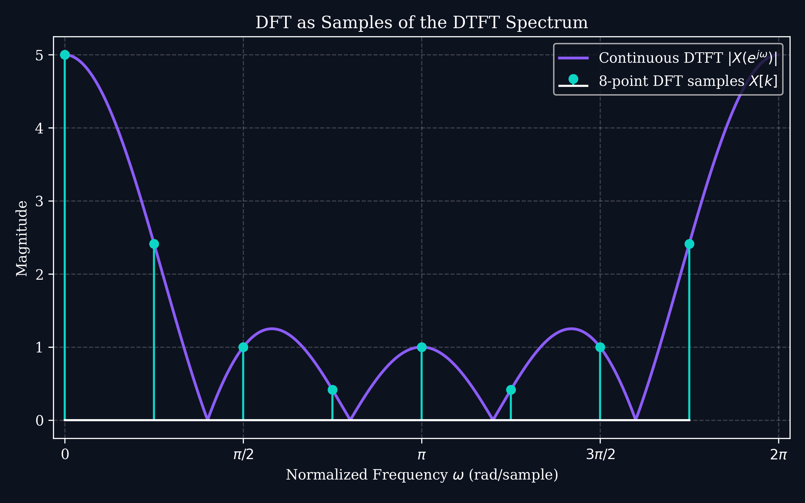
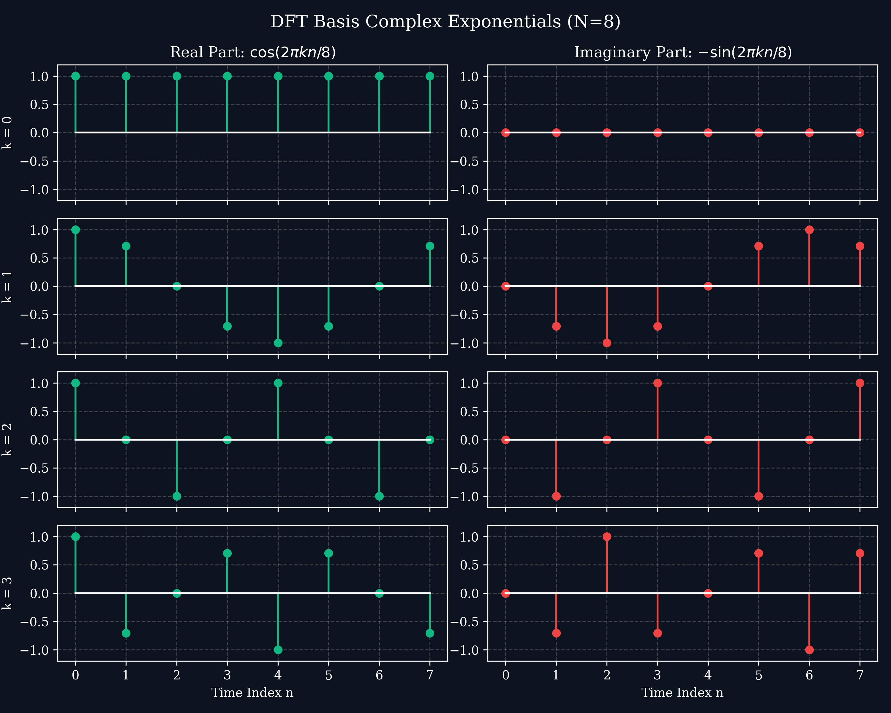

# Lecture 7: The Discrete Fourier Transform (DFT) & Matrix Formulation

**Course:** EE3621 — Digital Signal Processing  
**Target Audience:** III B.Tech EEE Students  
**Duration:** 40 Minutes  

* **Available Formats:** [LaTeX Source File](file:///C:/Users/sriph/Downloads/DSP/lecture_07.tex) | [Compiled PDF Notes](file:///C:/Users/sriph/Downloads/DSP/lecture_07.pdf)

---

## 1. Lecture Plan (40 Minutes Breakdown)

* **00:00 – 08:00 (8 mins):** **Motivation \& Introduction:** Why do we need the DFT? Transitioning from the continuous-frequency DTFT to the computable discrete-frequency DFT. The finite duration constraint.
* **08:00 – 15:00 (7 mins):** **Twiddle Factor Properties:** Mathematical definition, periodicity, and conjugate symmetry.
* **15:00 – 22:00 (7 mins):** **Orthogonality \& IDFT Derivation:** Proving the orthogonality of complex exponentials and deriving the IDFT formula step-by-step.
* **22:00 – 28:00 (6 mins):** **Matrix Formulation:** The $N \times N$ DFT matrix, explicit demonstration for $N=4$, and DFT of common sequences.
* **28:00 – 34:00 (6 mins):** **Properties \& Zero-Padding:** Key DFT properties (table), spectral resolution, and the effect of zero-padding.
* **34:00 – 40:00 (6 mins):** **Worked Example \& Checkpoints:** Step-by-step 4-point DFT calculation and conceptual checkpoint questions.

---

## 2. Motivation: From DTFT to DFT

### The Problem with the DTFT
Recall the Discrete-Time Fourier Transform (DTFT) for a discrete-time sequence $x[n]$:
$$X(e^{j\omega}) = \sum_{n=-\infty}^{\infty} x[n] e^{-j\omega n}$$

While the input signal $x[n]$ is discrete in time, the resulting frequency spectrum $X(e^{j\omega})$ is a **continuous function** of the continuous frequency variable $\omega \in [-\pi, \pi)$. 

In practical engineering applications, we use digital computers (microprocessors, DSP chips) which can only store and process finite, discrete sets of numbers. A computer cannot evaluate or store a continuous function defined over infinitely many points. Moreover, we can only observe signals for a **finite duration**.

### The Solution: The Discrete Fourier Transform (DFT)
To make frequency analysis computable, we must:
1. **Truncate** or window the signal so we only deal with a finite number of samples, $N$.
2. **Sample** the continuous frequency spectrum $X(e^{j\omega})$ at $N$ equally spaced discrete frequencies.

By evaluating the DTFT at $N$ uniformly spaced frequencies $\omega_k = \frac{2\pi}{N}k$ for $k = 0, 1, \dots, N-1$, we arrive at the **Discrete Fourier Transform (DFT)**. This gives us $N$ discrete frequency bins from $N$ discrete time samples, perfectly mapping a finite array to a finite array!

---

## 3. The Twiddle Factor and Its Properties

To simplify the notation of the complex exponential $e^{-j\frac{2\pi}{N}}$, we introduce the **Twiddle Factor**:
$$W_N = e^{-j\frac{2\pi}{N}}$$

Using this, the $N$-point DFT of a sequence $x[n]$ of length $N$ is defined as:
$$X[k] = \sum_{n=0}^{N-1} x[n] W_N^{kn}, \quad 0 \le k \le N-1$$

### Properties of the Twiddle Factor
The twiddle factor plays a crucial role in fast algorithms (like the FFT) because of its periodic and symmetric properties.

1. **Exponentiation to N:**
   $$W_N^N = \left(e^{-j\frac{2\pi}{N}}\right)^N = e^{-j2\pi} = \cos(2\pi) - j\sin(2\pi) = 1$$
   By extension, $W_N^{kN} = (W_N^N)^k = 1^k = 1$ for any integer $k$.

2. **Periodicity:**
   $$W_N^{k+N} = W_N^k \cdot W_N^N = W_N^k \cdot 1 = W_N^k$$
   This periodicity reflects the periodic nature of the frequency spectrum in discrete-time systems.

3. **Conjugate Symmetry:**
   $$W_N^{k(N-n)} = W_N^{kN} \cdot W_N^{-kn} = 1 \cdot (W_N^{kn})^{-1} = e^{j\frac{2\pi}{N}kn} = (e^{-j\frac{2\pi}{N}kn})^* = (W_N^{kn})^*$$

---

## 4. Orthogonality Proof and IDFT Derivation

To find the original sequence $x[n]$ from its frequency components $X[k]$, we need the Inverse Discrete Fourier Transform (IDFT). The IDFT relies fundamentally on the orthogonality of complex exponentials.

### Orthogonality Proof
We want to evaluate the sum of the product of two complex exponentials over one period $N$:
$$S = \sum_{n=0}^{N-1} W_N^{kn} W_N^{-ln} = \sum_{n=0}^{N-1} W_N^{(k-l)n}$$

Let $m = k - l$. Then $S = \sum_{n=0}^{N-1} (W_N^m)^n$. This is a geometric series with common ratio $r = W_N^m = e^{-j\frac{2\pi}{N}m}$.

**Case 1: $k = l$ (or $m = 0$)**
If $k = l$, then $m = 0$, and the ratio is $r = e^0 = 1$.
$$S = \sum_{n=0}^{N-1} 1^n = \sum_{n=0}^{N-1} 1 = N$$

**Case 2: $k \neq l$ (and $m$ is not an integer multiple of $N$)**
For a geometric series $\sum_{n=0}^{N-1} r^n$, the sum is $\frac{1 - r^N}{1 - r}$.
$$S = \frac{1 - (W_N^m)^N}{1 - W_N^m} = \frac{1 - W_N^{mN}}{1 - W_N^m}$$
Since $W_N^{mN} = (W_N^N)^m = 1^m = 1$, the numerator becomes $1 - 1 = 0$.
Thus, $S = 0$.

**KEY RESULT: Orthogonality Condition**
$$\sum_{n=0}^{N-1} W_N^{kn} W_N^{-ln} = N \delta[k-l]$$
where $\delta[k-l]$ is the Kronecker delta (1 if $k=l$, 0 otherwise).

### Derivation of the IDFT
Start with the DFT formula:
$$X[k] = \sum_{m=0}^{N-1} x[m] W_N^{km}$$
Multiply both sides by $W_N^{-kn}$ and sum over all $k$ from $0$ to $N-1$:
$$\sum_{k=0}^{N-1} X[k] W_N^{-kn} = \sum_{k=0}^{N-1} \left( \sum_{m=0}^{N-1} x[m] W_N^{km} \right) W_N^{-kn}$$
Interchange the order of summation on the right side:
$$\sum_{k=0}^{N-1} X[k] W_N^{-kn} = \sum_{m=0}^{N-1} x[m] \left( \sum_{k=0}^{N-1} W_N^{k(m-n)} \right)$$
Using our orthogonality result, the inner sum is $N \delta[m-n]$, which is $N$ only when $m = n$ and $0$ otherwise.
$$\sum_{k=0}^{N-1} X[k] W_N^{-kn} = x[n] \cdot N$$
Divide by $N$ to isolate $x[n]$:
$$x[n] = \frac{1}{N} \sum_{k=0}^{N-1} X[k] W_N^{-kn}, \quad 0 \le n \le N-1$$
This is the IDFT formula!

---

## 5. Matrix Formulation of the DFT

The DFT is a linear transformation. We can express it elegantly as a matrix-vector multiplication.

Let the input sequence and the DFT sequence be written as column vectors:
$$\mathbf{x} = \begin{bmatrix} x[0] \\ x[1] \\ \vdots \\ x[N-1] \end{bmatrix}, \quad \mathbf{X} = \begin{bmatrix} X[0] \\ X[1] \\ \vdots \\ X[N-1] \end{bmatrix}$$

The DFT equation $\mathbf{X} = \mathbf{W}_N \mathbf{x}$ uses the $N \times N$ **DFT Matrix** $\mathbf{W}_N$, where the element at row $k$ and column $n$ is $\mathbf{W}_N[k, n] = W_N^{kn}$:
$$\mathbf{W}_N = \begin{bmatrix}
1 & 1 & 1 & \dots & 1 \\
1 & W_N^1 & W_N^2 & \dots & W_N^{N-1} \\
1 & W_N^2 & W_N^4 & \dots & W_N^{2(N-1)} \\
\vdots & \vdots & \vdots & \ddots & \vdots \\
1 & W_N^{N-1} & W_N^{2(N-1)} & \dots & W_N^{(N-1)(N-1)}
\end{bmatrix}$$

### Example: N = 4 Matrix
For $N=4$, the twiddle factor is $W_4 = e^{-j\frac{2\pi}{4}} = e^{-j\pi/2} = -j$.
The matrix entries are $W_4^{kn}$. Let's construct it:
* Row $k=0$: $(W_4^0, W_4^0, W_4^0, W_4^0) = (1, 1, 1, 1)$
* Row $k=1$: $(W_4^0, W_4^1, W_4^2, W_4^3) = (1, -j, -1, j)$
* Row $k=2$: $(W_4^0, W_4^2, W_4^4, W_4^6) = (1, -1, 1, -1)$
* Row $k=3$: $(W_4^0, W_4^3, W_4^6, W_4^9) = (1, j, -1, -j)$

$$\mathbf{W}_4 = \begin{bmatrix}
1 & 1 & 1 & 1 \\
1 & -j & -1 & j \\
1 & -1 & 1 & -1 \\
1 & j & -1 & -j
\end{bmatrix}$$

### The IDFT Matrix
Due to orthogonality, $\mathbf{W}_N^* \mathbf{W}_N = N \mathbf{I}$, where $\mathbf{W}_N^*$ is the conjugate transpose.
The IDFT is naturally:
$$\mathbf{x} = \frac{1}{N} \mathbf{W}_N^* \mathbf{X}$$

---

## 6. DFT of Common Sequences

Building intuition involves seeing what the DFT of basic signals looks like.

1. **Unit Impulse** $x[n] = \delta[n]$
   $$X[k] = \sum_{n=0}^{N-1} \delta[n] W_N^{kn} = W_N^{k(0)} = 1$$
   *Physical Intuition:* An impulse contains all frequencies equally. The spectrum is flat.

2. **Constant (DC) Sequence** $x[n] = 1$ for $0 \le n \le N-1$
   $$X[k] = \sum_{n=0}^{N-1} 1 \cdot W_N^{kn}$$
   Using the geometric sum formula (or our orthogonality result with $l=0$), this evaluates to $N$ for $k=0$ and $0$ for $k \neq 0$.
   $$X[k] = N \delta[k]$$
   *Physical Intuition:* A constant signal has only a zero-frequency (DC) component.

3. **Complex Exponential** $x[n] = e^{j\frac{2\pi}{N} m n}$ (for integer $m$)
   $$X[k] = \sum_{n=0}^{N-1} e^{j\frac{2\pi}{N} m n} e^{-j\frac{2\pi}{N} k n} = \sum_{n=0}^{N-1} W_N^{(k-m)n} = N \delta[k-m]$$
   *Physical Intuition:* A pure frequency component perfectly hits one frequency bin in the DFT, yielding a single spike at bin $m$.

---

## 7. Spectral Resolution and Zero-Padding

When we compute an $N$-point DFT, we get frequency samples spaced by $\Delta \omega = \frac{2\pi}{N}$ (or $\Delta f = \frac{f_s}{N}$ in Hz, where $f_s$ is the sampling rate).
This spacing is the **frequency resolution** of our discrete spectrum.

### What if we want finer frequency resolution?
We can artificially increase the length of the signal by appending zeros at the end. If $x[n]$ has length $L$, we can zero-pad it to length $N > L$:
$$x_{pad}[n] = \begin{cases} x[n] & 0 \le n \le L-1 \\ 0 & L \le n \le N-1 \end{cases}$$

Computing the $N$-point DFT of $x_{pad}[n]$ gives samples spaced by $\frac{2\pi}{N}$, which is a smaller spacing than $\frac{2\pi}{L}$.
**Important Concept:** Zero-padding does *not* add new information to the signal. It simply interpolates the continuous DTFT spectrum at more points, providing a smoother, higher-density visual representation of the spectrum. It improves *display* resolution, but does not improve the *fundamental ability to distinguish two closely spaced frequencies* (which depends strictly on the observation window length $L$).

---

## 8. DFT Properties Table

Like the continuous-time Fourier transform, the DFT has properties that simplify operations. Note that shifts and convolutions in the DFT domain are **circular** due to the implicit periodic nature of the discrete spectrum.

| Property | Time Domain $x[n]$ | Frequency Domain $X[k]$ |
| :--- | :--- | :--- |
| **Linearity** | $a x_1[n] + b x_2[n]$ | $a X_1[k] + b X_2[k]$ |
| **Circular Time Shift** | $x[(n - m) \pmod N]$ | $X[k] W_N^{km}$ |
| **Circular Frequency Shift**| $x[n] W_N^{-ln}$ | $X[(k - l) \pmod N]$ |
| **Circular Convolution** | $x_1[n] \circledast x_2[n]$ | $X_1[k] X_2[k]$ |
| **Multiplication** | $x_1[n] x_2[n]$ | $\frac{1}{N} (X_1[k] \circledast X_2[k])$ |
| **Parseval's Theorem** | $\sum_{n=0}^{N-1} \|x[n]\|^2$ | $\frac{1}{N} \sum_{k=0}^{N-1} \|X[k]\|^2$ |
| **Conjugate Symmetry** | If $x[n]$ is real | $X[k] = X^*[-k \pmod N] = X^*[N-k]$ |

---

## 9. Worked Example: Step-by-Step DFT Computation

Let's manually compute the 4-point DFT of the sequence $x[n] = \{1, 1, 0, 0\}$.

### Method 1: Using the Summation Formula
Here $N=4$, so $W_4 = -j$.
$X[k] = \sum_{n=0}^{3} x[n] (-j)^{kn} = x[0] + x[1](-j)^k + x[2](-j)^{2k} + x[3](-j)^{3k}$
Since $x[2] = x[3] = 0$, the formula simplifies to:
$X[k] = 1 + (-j)^k$

* For $k=0$: $X[0] = 1 + (-j)^0 = 1 + 1 = 2$
* For $k=1$: $X[1] = 1 + (-j)^1 = 1 - j$
* For $k=2$: $X[2] = 1 + (-j)^2 = 1 - 1 = 0$
* For $k=3$: $X[3] = 1 + (-j)^3 = 1 + j$

The result is $X[k] = \{2, 1-j, 0, 1+j\}$.

### Method 2: Using the Matrix Formulation
Using our pre-derived $\mathbf{W}_4$ matrix:
$$\mathbf{X} = \mathbf{W}_4 \mathbf{x} = \begin{bmatrix}
1 & 1 & 1 & 1 \\
1 & -j & -1 & j \\
1 & -1 & 1 & -1 \\
1 & j & -1 & -j
\end{bmatrix} \begin{bmatrix} 1 \\ 1 \\ 0 \\ 0 \end{bmatrix}$$

Multiplying row by column:
* Row 0: $1(1) + 1(1) + 1(0) + 1(0) = 2$
* Row 1: $1(1) + (-j)(1) + (-1)(0) + j(0) = 1 - j$
* Row 2: $1(1) + (-1)(1) + 1(0) + (-1)(0) = 0$
* Row 3: $1(1) + j(1) + (-1)(0) + (-j)(0) = 1 + j$

Both methods yield exactly the same DFT sequence!

---

## 10. Checkpoint Questions

1. **Question 1:** Prove that the 4-point DFT of the sequence $x[n] = \{1, -1, 1, -1\}$ is $X[k] = \{0, 0, 4, 0\}$ without using matrix multiplication.
   * **Answer:** This sequence is a cosine wave at the Nyquist frequency: $x[n] = \cos(\pi n)$. We know from Euler's identity that $e^{j\pi n} = (e^{j\pi})^n = (-1)^n$. This matches exactly with a complex exponential basis function for $N=4$ at $k=2$, where $W_4^{-2n} = e^{j\frac{2\pi}{4} 2 n} = e^{j\pi n} = (-1)^n$. Thus, the signal perfectly aligns with the $k=2$ basis vector. By the orthogonality property discussed in Section 4, the inner product of this signal with the $k=2$ basis vector will yield $N=4$, and 0 for all other bins. Thus $X[k] = \{0, 0, 4, 0\}$.

2. **Question 2:** If you have a 1-second recording of audio sampled at $8000 \text{ Hz}$, and you want a frequency bin spacing (resolution) of $0.5 \text{ Hz}$ in your DFT, how many points $N$ must your DFT have, and how do you achieve this if your signal only has 8000 samples?
   * **Answer:** The frequency resolution $\Delta f$ of an $N$-point DFT for a signal sampled at $f_s$ is given by $\Delta f = \frac{f_s}{N}$. To achieve $\Delta f = 0.5 \text{ Hz}$ with $f_s = 8000 \text{ Hz}$, we require $N = \frac{8000}{0.5} = 16000$ points. Since the recording is 1 second long, it only contains $L = 8000 \text{ samples}$. To perform a 16000-point DFT, we must **zero-pad** the signal by appending $16000 - 8000 = 8000$ zeros to the end of the sequence before computing the DFT.

3. **Question 3:** Let $X[k]$ be the 8-point DFT of a real-valued sequence $x[n]$. If $X[1] = 3 + j2$, what is the value of $X[7]$? Why?
   * **Answer:** $X[7] = 3 - j2$. For a strictly real-valued sequence $x[n]$, the DFT exhibits conjugate symmetry, defined as $X[k] = X^*[N-k]$. Here, $N=8$, so $X[7] = X^*[8-7] = X^*[1]$. The complex conjugate of $3 + j2$ is $3 - j2$. This conjugate symmetry ensures that when reconstructing the signal via the IDFT, the imaginary components perfectly cancel out, leaving a purely real time-domain signal.
