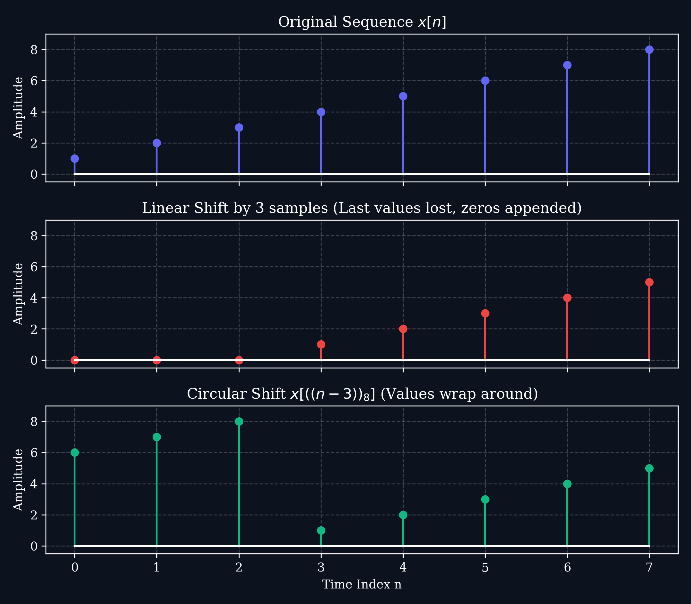
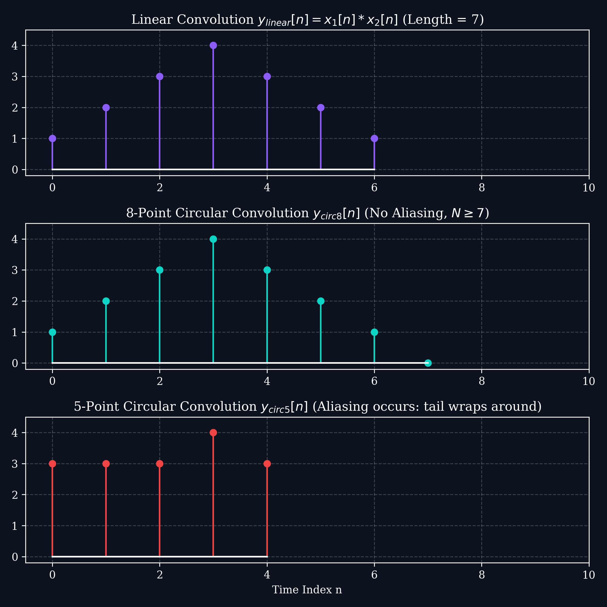

# Lecture 8: Properties of the DFT & Circular Convolution

**Course:** EE3621 — Digital Signal Processing
**Target Audience:** III B.Tech EEE Students
**Duration:** 40 Minutes

* **Available Formats:** [LaTeX Source File](file:///C:/Users/sriph/Downloads/DSP/lecture_08.tex) | [Compiled PDF Notes](file:///C:/Users/sriph/Downloads/DSP/lecture_08.pdf)

---

## 1. Lecture Plan (40 Minutes Breakdown)
* **00:00 – 05:00 (5 mins):** Motivation: Why study DFT properties? (FFT derivations and filtering applications).
* **05:00 – 15:00 (10 mins):** Fundamental properties: Periodicity, Linearity, and Conjugate Symmetry.
* **15:00 – 25:00 (10 mins):** Circular Shift of a sequence in time and frequency domains; comparison with linear shift.
* **25:00 – 35:00 (10 mins):** Circular Convolution — definition, properties, and comparison with linear convolution. Matrix methods.
* **35:00 – 40:00 (5 mins):** Parseval's Theorem, Review checkpoints, and Q&A.

---

## 2. Fundamental Properties of the DFT

Let $x[n] \longleftrightarrow X[k]$ represent an $N$-point DFT pair, defined as:
$$X[k] = \sum_{n=0}^{N-1} x[n] W_N^{kn}$$
$$x[n] = \frac{1}{N} \sum_{k=0}^{N-1} X[k] W_N^{-kn}$$
where $W_N = e^{-j\frac{2\pi}{N}}$ is the twiddle factor.

### 2.1 Periodicity
A fundamental property of the DFT is its inherent periodicity in both the time and frequency domains.

**Theorem (Periodicity):**
If $x[n]$ and $X[k]$ form an $N$-point DFT pair, then they are implicitly periodic with period $N$:
1. $X[k+N] = X[k]$
2. $x[n+N] = x[n]$

**Proof for Frequency Domain ($X[k+N] = X[k]$):**
We start with the definition of the DFT at index $k+N$:
$$X[k+N] = \sum_{n=0}^{N-1} x[n] W_N^{(k+N)n}$$
Expand the exponent in the twiddle factor:
$$X[k+N] = \sum_{n=0}^{N-1} x[n] W_N^{kn + Nn}$$
Using the property of exponents:
$$X[k+N] = \sum_{n=0}^{N-1} x[n] W_N^{kn} W_N^{Nn}$$
Recall that $W_N = e^{-j\frac{2\pi}{N}}$. Therefore, $W_N^{Nn}$:
$$W_N^{Nn} = \left(e^{-j\frac{2\pi}{N}}\right)^{Nn} = e^{-j2\pi n} = 1$$
Since $n$ is an integer, $e^{-j2\pi n} = 1$ always. Substituting this back:
$$X[k+N] = \sum_{n=0}^{N-1} x[n] W_N^{kn} (1)$$
$$X[k+N] = X[k]$$
This completes the proof.

**Proof for Time Domain ($x[n+N] = x[n]$):**
Using the IDFT equation:
$$x[n+N] = \frac{1}{N} \sum_{k=0}^{N-1} X[k] W_N^{-k(n+N)}$$
$$x[n+N] = \frac{1}{N} \sum_{k=0}^{N-1} X[k] W_N^{-kn} W_N^{-kN}$$
Since $W_N^{-kN} = e^{j2\pi k} = 1$ for any integer $k$:
$$x[n+N] = \frac{1}{N} \sum_{k=0}^{N-1} X[k] W_N^{-kn} = x[n]$$
This completes the proof.

**Engineering Intuition:** 
Sampling in the frequency domain (which is what DFT does to DTFT) inherently causes a periodic extension in the time domain. A finite sequence length $N$ is mathematically treated as one period of a periodic signal extending to infinity.

### 2.2 Conjugate Symmetry (Hermitian Symmetry)
For real-world signals, the time-domain sequence $x[n]$ is completely real. This leads to redundant information in the DFT spectrum.

**Theorem (Symmetry for Real Signals):**
If $x[n]$ is real ($x[n] = x^*[n]$), then the DFT exhibits **conjugate symmetry**:
$$X[k] = X^*[N-k]$$

**Proof:**
Start with the DFT definition:
$$X[k] = \sum_{n=0}^{N-1} x[n] e^{-j \frac{2\pi}{N} kn}$$
Take the complex conjugate of both sides:
$$X^*[k] = \sum_{n=0}^{N-1} x^*[n] e^{j \frac{2\pi}{N} kn}$$
Since $x[n]$ is real, $x^*[n] = x[n]$:
$$X^*[k] = \sum_{n=0}^{N-1} x[n] e^{j \frac{2\pi}{N} kn}$$
Now, let's evaluate $X[N-k]$:
$$X[N-k] = \sum_{n=0}^{N-1} x[n] e^{-j \frac{2\pi}{N} (N-k)n}$$
$$X[N-k] = \sum_{n=0}^{N-1} x[n] e^{-j 2\pi n} e^{j \frac{2\pi}{N} kn}$$
Since $e^{-j 2\pi n} = 1$:
$$X[N-k] = \sum_{n=0}^{N-1} x[n] e^{j \frac{2\pi}{N} kn} = X^*[k]$$
This completes the proof.

**Consequences of Symmetry:**
* **DC Value:** $k=0 \implies X[0] = \sum x[n]$. It is purely real.
* **Nyquist Bin:** If $N$ is even, $k=N/2$ is the Nyquist frequency. $X[N/2] = X^*[N/2]$, so it is purely real.
* **One-sided Spectrum:** For $N$ samples, bins from $k=1$ to $N/2-1$ contain all the unique frequency information. The bins from $k=N/2+1$ to $N-1$ are redundant conjugates. We only need to compute half the DFT!

---

## 3. Circular Shift of a Sequence

Because the DFT assumes the time sequence is periodic with period $N$, shifting a sequence does not mean shifting values off to infinity. Instead, they wrap around.

### Definition of Circular Shift
A circular shift of $x[n]$ by $m$ samples is denoted using modulo indexing:
$$x_c[n] = x[((n - m))_N]$$
This means if an index $(n-m)$ goes below $0$ or above $N-1$, we add or subtract $N$ until it falls in the range $[0, N-1]$.

### Circular Time Shift Theorem
Shifting a sequence circularly in the time domain corresponds to multiplying its DFT by a linear phase factor:
$$x[((n - m))_N] \longleftrightarrow X[k] W_N^{km}$$

**Proof:**
Let $x_c[n] = x[((n-m))_N]$. Its DFT is:
$$X_c[k] = \sum_{n=0}^{N-1} x_c[n] W_N^{kn} = \sum_{n=0}^{N-1} x[((n-m))_N] W_N^{kn}$$
Let $l = n - m$. Then $n = l + m$. The summation index changes, but since both the sequence $x$ and the twiddle factor $W_N$ are periodic with period $N$, summing over any one full period yields the same result:
$$X_c[k] = \sum_{l=0}^{N-1} x[((l))_N] W_N^{k(l+m)}$$
$$X_c[k] = \sum_{l=0}^{N-1} x[l] W_N^{kl} W_N^{km}$$
Factor out $W_N^{km}$, which does not depend on $l$:
$$X_c[k] = W_N^{km} \sum_{l=0}^{N-1} x[l] W_N^{kl}$$
$$X_c[k] = W_N^{km} X[k]$$
This completes the proof.

---

## 4. Circular Convolution

Circular convolution is a core operation in DSP because multiplying two DFTs yields the circular convolution of their time sequences, not the linear convolution.

### Mathematical Definition
The **circular convolution** of two $N$-point sequences $x_1[n]$ and $x_2[n]$ is defined as:
$$y[n] = x_1[n] \circledast_N x_2[n] = \sum_{m=0}^{N-1} x_1[m] x_2[((n - m))_N], \quad 0 \le n \le N-1$$

### Circular Convolution Theorem
$$y[n] = x_1[n] \circledast_N x_2[n] \longleftrightarrow Y[k] = X_1[k] \cdot X_2[k]$$

**Proof:**
$$Y[k] = \sum_{n=0}^{N-1} y[n] W_N^{kn}$$
$$Y[k] = \sum_{n=0}^{N-1} \left[ \sum_{m=0}^{N-1} x_1[m] x_2[((n - m))_N] \right] W_N^{kn}$$
Interchange the order of summation:
$$Y[k] = \sum_{m=0}^{N-1} x_1[m] \left[ \sum_{n=0}^{N-1} x_2[((n - m))_N] W_N^{kn} \right]$$
The inner sum is the DFT of a circularly shifted sequence $x_2[((n-m))_N]$. Using the Circular Time Shift Theorem, this inner sum evaluates to $X_2[k] W_N^{km}$:
$$Y[k] = \sum_{m=0}^{N-1} x_1[m] \left[ X_2[k] W_N^{km} \right]$$
$$Y[k] = X_2[k] \sum_{m=0}^{N-1} x_1[m] W_N^{km}$$
The remaining sum is exactly $X_1[k]$:
$$Y[k] = X_2[k] \cdot X_1[k]$$
This completes the proof.

### 4.1 Circulant Matrix Representation
Circular convolution can be elegantly represented using matrix multiplication. The operation $y = x_1 \circledast x_2$ is equivalent to:
$$\mathbf{y} = \mathbf{H} \mathbf{x_1}$$
Where $\mathbf{H}$ is a **circulant matrix** constructed from $x_2[n]$. Each column is a circularly shifted version of the previous column.
$$\begin{bmatrix} y[0] \\ y[1] \\ y[2] \\ \vdots \\ y[N-1] \end{bmatrix} = \begin{bmatrix} x_2[0] & x_2[N-1] & x_2[N-2] & \cdots & x_2[1] \\ x_2[1] & x_2[0] & x_2[N-1] & \cdots & x_2[2] \\ x_2[2] & x_2[1] & x_2[0] & \cdots & x_2[3] \\ \vdots & \vdots & \vdots & \ddots & \vdots \\ x_2[N-1] & x_2[N-2] & x_2[N-3] & \cdots & x_2[0] \end{bmatrix} \begin{bmatrix} x_1[0] \\ x_1[1] \\ x_1[2] \\ \vdots \\ x_1[N-1] \end{bmatrix}$$

**Key Properties of Circulant Matrices:**
1. The eigenvectors of ANY circulant matrix are the columns of the inverse DFT matrix.
2. The eigenvalues of the circulant matrix constructed from $h[n]$ are precisely the DFT coefficients $H[k]$.
This is a profound mathematical reason why the DFT diagonalizes linear shift-invariant systems!

### 4.2 Linear vs. Circular Convolution (Time Aliasing)
Linear convolution $y_{lin}[n] = x_1[n] * x_2[n]$ of sequences of length $L_1$ and $L_2$ has length $L_1 + L_2 - 1$. 

If we perform an $N$-point circular convolution instead:
$$y_{circ}[n] = \sum_{r=-\infty}^{\infty} y_{lin}[n - rN], \quad 0 \le n \le N-1$$

* **Zero-Padding Rule:** If $N \ge L_1 + L_2 - 1$, then $y_{circ}[n] = y_{lin}[n]$. The circular convolution is identical to the linear convolution because there is enough space.
* **Aliasing:** If $N < L_1 + L_2 - 1$, the circular convolution suffers from **time-domain aliasing**. The tail of the linear convolution wraps around and adds to the beginning.

### 4.3 Full Numerical Example: 4-Point Circular Convolution
Let $x_1[n] = \{1, 2, 3, 4\}$ and $x_2[n] = \{1, 0, 1, 0\}$. We want to find $y[n] = x_1[n] \circledast_4 x_2[n]$.

**Method 1: Circulant Matrix Approach**
Construct the circulant matrix from $x_2[n]$:
$$\mathbf{H} = \begin{bmatrix} 1 & 0 & 1 & 0 \\ 0 & 1 & 0 & 1 \\ 1 & 0 & 1 & 0 \\ 0 & 1 & 0 & 1 \end{bmatrix}$$
Multiply by $\mathbf{x_1}$:
$$\begin{bmatrix} y[0] \\ y[1] \\ y[2] \\ y[3] \end{bmatrix} = \begin{bmatrix} 1 & 0 & 1 & 0 \\ 0 & 1 & 0 & 1 \\ 1 & 0 & 1 & 0 \\ 0 & 1 & 0 & 1 \end{bmatrix} \begin{bmatrix} 1 \\ 2 \\ 3 \\ 4 \end{bmatrix} = \begin{bmatrix} 1(1) + 1(3) \\ 1(2) + 1(4) \\ 1(1) + 1(3) \\ 1(2) + 1(4) \end{bmatrix} = \begin{bmatrix} 4 \\ 6 \\ 4 \\ 6 \end{bmatrix}$$
So, $y[n] = \{4, 6, 4, 6\}$.

**Method 2: DFT Multiplication Approach**
1. Compute 4-point DFT of $x_1[n]$:
   $X_1[0] = 1+2+3+4 = 10$
   $X_1[1] = 1 - j2 - 3 + j4 = -2 + j2$
   $X_1[2] = 1 - 2 + 3 - 4 = -2$
   $X_1[3] = 1 + j2 - 3 - j4 = -2 - j2$
2. Compute 4-point DFT of $x_2[n]$:
   $X_2[0] = 1+0+1+0 = 2$
   $X_2[1] = 1 - j0 - 1 + j0 = 0$
   $X_2[2] = 1 - 0 + 1 - 0 = 2$
   $X_2[3] = 1 + j0 - 1 - j0 = 0$
3. Multiply DFTs: $Y[k] = X_1[k] X_2[k]$
   $Y[0] = 10 \times 2 = 20$
   $Y[1] = (-2+j2) \times 0 = 0$
   $Y[2] = -2 \times 2 = -4$
   $Y[3] = (-2-j2) \times 0 = 0$
4. Compute IDFT of $Y[k]$:
   $y[n] = \frac{1}{4} \sum Y[k] W_4^{-kn}$
   $y[0] = \frac{1}{4}(20 + 0 - 4 + 0) = \frac{16}{4} = 4$
   $y[1] = \frac{1}{4}(20 + 0(j) - 4(-1) + 0(-j)) = \frac{24}{4} = 6$
   $y[2] = \frac{1}{4}(20 + 0(-1) - 4(1) + 0(-1)) = \frac{16}{4} = 4$
   $y[3] = \frac{1}{4}(20 + 0(-j) - 4(-1) + 0(j)) = \frac{24}{4} = 6$
Result matches: $y[n] = \{4, 6, 4, 6\}$.

---

## 5. Parseval's Theorem for DFT

Parseval's theorem relates the energy of a signal in the time domain to its energy in the frequency domain.

**Theorem:**
$$\sum_{n=0}^{N-1} |x[n]|^2 = \frac{1}{N} \sum_{k=0}^{N-1} |X[k]|^2$$

**Proof:**
Start with the left-hand side:
$$E = \sum_{n=0}^{N-1} x[n] x^*[n]$$
Substitute the IDFT formula for $x[n]$:
$$E = \sum_{n=0}^{N-1} \left( \frac{1}{N} \sum_{k=0}^{N-1} X[k] W_N^{-kn} \right) x^*[n]$$
Interchange sums:
$$E = \frac{1}{N} \sum_{k=0}^{N-1} X[k] \left( \sum_{n=0}^{N-1} x^*[n] W_N^{-kn} \right)$$
Notice that the inner sum is the conjugate of the DFT definition:
$$\sum_{n=0}^{N-1} x^*[n] W_N^{-kn} = \left( \sum_{n=0}^{N-1} x[n] W_N^{kn} \right)^* = X^*[k]$$
Substitute this back:
$$E = \frac{1}{N} \sum_{k=0}^{N-1} X[k] X^*[k] = \frac{1}{N} \sum_{k=0}^{N-1} |X[k]|^2$$
This completes the proof.

---

## 6. Table of Key DFT Properties

| Property | Time Domain $x[n]$ | Frequency Domain $X[k]$ |
| :--- | :--- | :--- |
| Linearity | $a x_1[n] + b x_2[n]$ | $a X_1[k] + b X_2[k]$ |
| Circular Time Shift | $x[((n-m))_N]$ | $W_N^{km} X[k]$ |
| Circular Freq Shift | $W_N^{-ln} x[n]$ | $X[((k-l))_N]$ |
| Conjugation | $x^*[n]$ | $X^*[((-k))_N]$ |
| Time Reversal | $x[((-n))_N]$ | $X[((-k))_N]$ |
| Circular Convolution| $x_1[n] \circledast_N x_2[n]$ | $X_1[k] X_2[k]$ |
| Multiplication | $x_1[n] x_2[n]$ | $\frac{1}{N} X_1[k] \circledast_N X_2[k]$ |
| Parseval's Relation | $\sum_{n=0}^{N-1} \|x[n]\|^2$ | $\frac{1}{N} \sum_{k=0}^{N-1} \|X[k]\|^2$ |

---

## 7. Checkpoint Questions

1. **Q1:** If $x[n]$ is a 5-point sequence with DFT $X[k] = \{10, 2-j, 3+j2, 3-j2, 2+j\}$. What is the energy of the signal in the time domain?
   * **Answer:** By Parseval's Theorem, $\sum |x[n]|^2 = \frac{1}{N} \sum |X[k]|^2$. 
   * $|X[0]|^2 = 10^2 = 100$
   * $|X[1]|^2 = 2^2 + (-1)^2 = 5$
   * $|X[2]|^2 = 3^2 + 2^2 = 13$
   * $|X[3]|^2 = 3^2 + (-2)^2 = 13$
   * $|X[4]|^2 = 2^2 + 1^2 = 5$
   * Sum of squares = $100 + 5 + 13 + 13 + 5 = 136$.
   * Energy = $136 / 5 = 27.2$.

2. **Q2:** A system has impulse response $h[n] = \{1, -1, 1\}$ and input $x[n] = \{2, 1, 0, -1\}$. To avoid aliasing in circular convolution, what is the minimum DFT length $N$ required?
   * **Answer:** The lengths are $L_1 = 4$ and $L_2 = 3$. 
   * The length of linear convolution is $L_1 + L_2 - 1 = 4 + 3 - 1 = 6$. 
   * Therefore, the minimum DFT length to avoid time-domain aliasing is $N = 6$.

3. **Q3:** Compute the 3-point circular convolution of $x_1[n] = \{1, 2, 3\}$ and $x_2[n] = \{0, 1, 2\}$ using the circulant matrix method.
   * **Answer:** 
   * Form the circulant matrix $\mathbf{H}$ from $x_2[n] = \{0, 1, 2\}$.
   * Column 1: $\{0, 1, 2\}^T$
   * Column 2: Shift down by 1 circularly: $\{2, 0, 1\}^T$
   * Column 3: Shift down by 1 circularly: $\{1, 2, 0\}^T$
   * $\mathbf{H} = \begin{bmatrix} 0 & 2 & 1 \\ 1 & 0 & 2 \\ 2 & 1 & 0 \end{bmatrix}$
   * Multiply by $x_1[n]$ column vector:
   * $\begin{bmatrix} 0 & 2 & 1 \\ 1 & 0 & 2 \\ 2 & 1 & 0 \end{bmatrix} \begin{bmatrix} 1 \\ 2 \\ 3 \end{bmatrix} = \begin{bmatrix} 0(1) + 2(2) + 1(3) \\ 1(1) + 0(2) + 2(3) \\ 2(1) + 1(2) + 0(3) \end{bmatrix} = \begin{bmatrix} 4 + 3 \\ 1 + 6 \\ 2 + 2 \end{bmatrix} = \begin{bmatrix} 7 \\ 7 \\ 4 \end{bmatrix}$
   * The result is $y[n] = \{7, 7, 4\}$.
