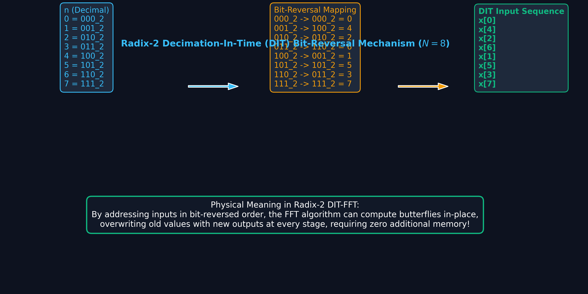
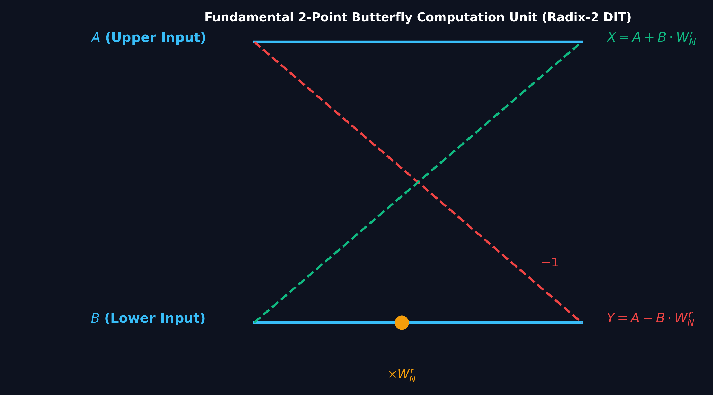

# Lecture 9: Fast Fourier Transform (FFT) — Decimation in Time (DIT)

**Course:** EE3621 — Digital Signal Processing  
**Target Audience:** III B.Tech EEE Students  
**Duration:** 40 Minutes  

* **Available Formats:** [LaTeX Source File](file:///C:/Users/sriph/Downloads/DSP/lecture_09.tex) | [Compiled PDF Notes](file:///C:/Users/sriph/Downloads/DSP/lecture_09.pdf)

---

## 1. Lecture Plan (40 Minutes Breakdown)
* **00:00 – 05:00 (5 mins):** Welcome, Unit II Intro. The problem with Direct DFT — Computational Complexity Motivation.
* **05:00 – 15:00 (10 mins):** The core idea of FFT: Divide and Conquer strategy. Decimating the time-domain signal into even and odd indices.
* **15:00 – 20:00 (5 mins):** Twiddle factor mathematics and reduction proofs.
* **20:00 – 25:00 (5 mins):** The 2-point Butterfly operation. Understanding the basic building block.
* **25:00 – 30:00 (5 mins):** Signal Flow Graph for $N=8$, Bit-Reversal permutation, and intuitive understanding.
* **30:00 – 35:00 (5 mins):** Complexity Analysis and Comparison Table. Implementing IFFT via FFT.
* **35:00 – 40:00 (5 mins):** Checkpoint questions with detailed answers and conclusion.

---

## 2. Computational Complexity Motivation

The Direct Discrete Fourier Transform (DFT) of an $N$-point sequence $x[n]$ is given by:

$$X[k] = \sum_{n=0}^{N-1} x[n] W_N^{kn}$$

where $W_N = e^{-j \frac{2\pi}{N}}$ is the twiddle factor, and $0 \le k \le N-1$.

Let's carefully count the operations for the direct calculation:
1. For each frequency bin $X[k]$, we must multiply $N$ complex numbers $x[n]$ by $N$ complex twiddle factors $W_N^{kn}$. This requires $N$ complex multiplications.
2. Summing these $N$ terms requires $N-1$ complex additions.
3. Since there are $N$ frequency bins (from $k=0$ to $N-1$), the total operations are:
   - **Total Complex Multiplications:** $N \times N = N^2$
   - **Total Complex Additions:** $N \times (N-1) = N^2 - N$

For small $N$, this is fine. But consider a typical audio block of $N=1024$:
- Number of complex multiplications = $1024^2 = 1,048,576 > 10^6$.
- Since one complex multiplication requires 4 real multiplications and 2 real additions, the burden is massive. Real-time processing becomes impossible for longer sequences without a better algorithm.

The Fast Fourier Transform (FFT) is an algorithm that reduces this complexity from $O(N^2)$ to $O(N \log_2 N)$. For $N=1024$, the FFT requires only $\frac{N}{2}\log_2 N = 512 \times 10 = 5120$ multiplications. This is a massive speedup!

---

## 3. Divide & Conquer Decomposition: Decimation in Time (DIT)

The Radix-2 DIT FFT algorithm works by recursively dividing an $N$-point sequence (where $N$ is a power of 2) into two shorter sequences of length $N/2$. 

Let us separate $x[n]$ into its even-indexed and odd-indexed samples:
- Even samples: $x_e[m] = x[2m]$ for $m = 0, 1, \dots, \frac{N}{2}-1$
- Odd samples: $x_o[m] = x[2m+1]$ for $m = 0, 1, \dots, \frac{N}{2}-1$

Now, substitute this into the DFT equation:
$$X[k] = \sum_{n=0}^{N-1} x[n] W_N^{kn}$$

Split the sum into even and odd indices ($n=2m$ and $n=2m+1$):
$$X[k] = \sum_{m=0}^{N/2-1} x[2m] W_N^{2mk} + \sum_{m=0}^{N/2-1} x[2m+1] W_N^{(2m+1)k}$$

Factor out $W_N^k$ from the second summation:
$$X[k] = \sum_{m=0}^{N/2-1} x[2m] W_N^{2mk} + W_N^k \sum_{m=0}^{N/2-1} x[2m+1] W_N^{2mk}$$

This is the foundational equation of the DIT FFT!

---

## 4. Twiddle Factor Reduction

To proceed, we need a mathematical property of the twiddle factor $W_N$.
**Theorem:** $W_N^{2} = W_{N/2}$

**Proof:**
$$W_N^2 = \left( e^{-j \frac{2\pi}{N}} \right)^2$$
$$W_N^2 = e^{-j \frac{4\pi}{N}}$$
$$W_N^2 = e^{-j \frac{2\pi}{N/2}}$$
$$W_N^2 = W_{N/2}$$
This completes the proof.

By applying this identity: $W_N^{2mk} = (W_N^2)^{mk} = W_{N/2}^{mk}$, we can rewrite our split DFT equation:
$$X[k] = \sum_{m=0}^{N/2-1} x_e[m] W_{N/2}^{mk} + W_N^k \sum_{m=0}^{N/2-1} x_o[m] W_{N/2}^{mk}$$

Notice that:
- The first sum is exactly the $N/2$-point DFT of the even sequence, let's call it $G[k]$.
- The second sum is exactly the $N/2$-point DFT of the odd sequence, let's call it $H[k]$.

So we have:
**KEY RESULT:** $$X[k] = G[k] + W_N^k H[k]$$

Since $G[k]$ and $H[k]$ are periodic with period $N/2$, $G[k+N/2] = G[k]$ and $H[k+N/2] = H[k]$.
For the upper half of the spectrum ($k \ge N/2$), we use the symmetry property $W_N^{k+N/2} = -W_N^k$:
$$X[k+N/2] = G[k] - W_N^k H[k]$$

---

## 5. The Butterfly Operation

The pair of equations:
$$X[k] = G[k] + W_N^k H[k]$$
$$X[k+N/2] = G[k] - W_N^k H[k]$$
forms the fundamental computing block of the FFT, known as the **Butterfly Operation**.

If we let $A = G[k]$ and $B = H[k]$, the outputs $A'$ and $B'$ are:
$$A' = A + W_N^k B$$
$$B' = A - W_N^k B$$

**Engineering Intuition:** 
Instead of multiplying $B$ by $W_N^k$ and separately by $-W_N^k$, we calculate $(W_N^k B)$ once. We then add it to $A$ for the top branch and subtract it from $A$ for the bottom branch. This cuts the required multiplications in half at each stage!

---

## 6. Signal Flow Graph & Bit-Reversal Permutation

For $N=8$, we divide the sequence until we reach 2-point DFTs. 
First, split into 2 sequences of 4:
- Even: $x[0], x[2], x[4], x[6]$
- Odd: $x[1], x[3], x[5], x[7]$

Split each of these again into sequences of 2:
- From even: $\{x[0], x[4]\}$ and $\{x[2], x[6]\}$
- From odd: $\{x[1], x[5]\}$ and $\{x[3], x[7]\}$

The final input order for the FFT is: $x[0], x[4], x[2], x[6], x[1], x[5], x[3], x[7]$.

**Why is it ordered this way?**
Look at the binary index representation of the original order ($n$) and the final order:
- $0 \rightarrow 000 \rightarrow$ reversed: $000 \rightarrow 0$
- $1 \rightarrow 001 \rightarrow$ reversed: $100 \rightarrow 4$
- $2 \rightarrow 010 \rightarrow$ reversed: $010 \rightarrow 2$
- $3 \rightarrow 011 \rightarrow$ reversed: $110 \rightarrow 6$
- $4 \rightarrow 100 \rightarrow$ reversed: $001 \rightarrow 1$
- $5 \rightarrow 101 \rightarrow$ reversed: $101 \rightarrow 5$
- $6 \rightarrow 110 \rightarrow$ reversed: $011 \rightarrow 3$
- $7 \rightarrow 111 \rightarrow$ reversed: $111 \rightarrow 7$

This is called the **Bit-Reversal Permutation**. 

### The 8-Point DIT-FFT Stages
The Signal Flow Graph consists of $\log_2(8) = 3$ stages:
- **Stage 1:** Four 2-point butterflies combining pairs of bit-reversed inputs.
- **Stage 2:** Two 4-point FFT blocks, each combining pairs of 2-point outputs using twiddles $W_8^0$ and $W_8^2$.
- **Stage 3:** One 8-point FFT block combining the two 4-point outputs using twiddles $W_8^0, W_8^1, W_8^2, W_8^3$.

---

## 7. Complexity Analysis

Let $T(N)$ be the number of complex multiplications to compute an $N$-point FFT.
According to the decomposition, an $N$-point DFT requires:
1. Two $N/2$-point DFTs: $2 \times T(N/2)$
2. One multiplication by $W_N^k$ for each butterfly. There are $N/2$ butterflies per stage: $N/2$ multiplications.

So the recurrence relation is:
$$T(N) = 2T(N/2) + \frac{N}{2}$$

**Proof by Recursion:**
Substitute $T(N/2)$:
$$T(N) = 2 \left( 2T(N/4) + \frac{N/4}{2} \right) + \frac{N}{2}$$
$$T(N) = 4T(N/4) + \frac{N}{2} + \frac{N}{2} = 4T(N/4) + 2\frac{N}{2}$$

After $\nu = \log_2 N$ stages, we reach $T(1) = 0$:
$$T(N) = 2^{\nu}T(N/2^{\nu}) + \nu \frac{N}{2}$$
$$T(N) = N \cdot T(1) + (\log_2 N) \frac{N}{2} = \frac{N}{2}\log_2 N$$

This derivation formally proves the $O(N \log N)$ complexity!

---

## 8. Comparison Table: DFT vs FFT

| Signal Length $N$ | Direct Multiplications ($N^2$) | FFT Multiplications ($\frac{N}{2}\log_2 N$) | Speedup Factor |
| :--- | :--- | :--- | :--- |
| **8** | 64 | 12 | 5.3x |
| **64** | 4,096 | 192 | 21.3x |
| **256** | 65,536 | 1,024 | 64.0x |
| **1024** | 1,048,576 | 5,120 | 204.8x |
| **4096** | 16,777,216 | 24,576 | 682.7x |

---

## 9. Computing IFFT using FFT

The Inverse DFT (IDFT) is given by:
$$x[n] = \frac{1}{N} \sum_{k=0}^{N-1} X[k] W_N^{-kn}$$

We can compute the IDFT using a forward FFT algorithm using the **conjugate trick**.
Take the complex conjugate of $x[n]$:
$$x^*[n] = \frac{1}{N} \sum_{k=0}^{N-1} X^*[k] W_N^{kn}$$

Notice that the sum is now exactly the forward DFT of $X^*[k]$. Thus:
$$x^*[n] = \frac{1}{N} \text{FFT}\{X^*[k]\}$$

Taking the conjugate again:
$$x[n] = \frac{1}{N} \left( \text{FFT}\{X^*[k]\} \right)^*$$

**Physical Intuition:** You do not need to write a separate IFFT program. Just conjugate the frequency domain data, run it through the standard forward FFT, conjugate the output, and divide by $N$.

---

## 10. Checkpoint Questions

**Q1: In an 8-point Radix-2 DIT FFT, what are the sequence of inputs fed to the first stage? Explain how to find the index for the 5th element in this sequence.**
* **Answer:** 
  The sequence must be bit-reversed. The indices are $0, 4, 2, 6, 1, 5, 3, 7$.
  To find the 5th element (which corresponds to normal index 4, since we start at 0):
  1. The normal index is 4 in decimal.
  2. Convert 4 to binary (using $\log_2(8)=3$ bits): $100_2$.
  3. Reverse the bits: $001_2$.
  4. Convert back to decimal: 1.
  Therefore, the element is $x[1]$.

**Q2: A certain DSP processor can execute one complex multiplication in 20 ns. Calculate the time saved by using FFT instead of Direct DFT for $N=4096$.**
* **Answer:**
  1. **Direct DFT Multiplications:** $N^2 = 4096^2 = 16,777,216$.
  2. **Direct DFT Time:** $16,777,216 \times 20\,\text{ns} = 335.54\,\text{ms}$.
  3. **FFT Multiplications:** $\frac{N}{2}\log_2 N = 2048 \times 12 = 24,576$.
  4. **FFT Time:** $24,576 \times 20\,\text{ns} = 0.491\,\text{ms}$.
  5. **Time Saved:** $335.54\,\text{ms} - 0.491\,\text{ms} \approx \mathbf{335.05\,\text{ms}}$.

**Q3: Prove that $W_N^{k+N/2} = -W_N^k$. Explain how this property is used in the butterfly operation.**
* **Answer:**
  $$W_N^{k+N/2} = W_N^k \cdot W_N^{N/2}$$
  Since $W_N = e^{-j\frac{2\pi}{N}}$, we have:
  $$W_N^{N/2} = e^{-j\frac{2\pi}{N} \cdot \frac{N}{2}} = e^{-j\pi} = -1$$
  Therefore, $W_N^{k+N/2} = W_N^k (-1) = -W_N^k$.
  In the butterfly operation, calculating $X[k]$ and $X[k+N/2]$ requires terms $+W_N^k H[k]$ and $+W_N^{k+N/2} H[k]$ respectively. Because of this property, the second term is simply $-W_N^k H[k]$. We calculate $W_N^k H[k]$ once, add it to $G[k]$ for $X[k]$, and subtract it from $G[k]$ for $X[k+N/2]$, saving one complex multiplication.

---

## 11. Table of Key Formulas

| Concept | Formula / Property |
| :--- | :--- |
| **Direct DFT** | $X[k] = \sum_{n=0}^{N-1} x[n] W_N^{kn}$ |
| **Twiddle Factor** | $W_N = e^{-j \frac{2\pi}{N}}$ |
| **Symmetry Property** | $W_N^{k + N/2} = -W_N^k$ |
| **Periodicity Property**| $W_N^{k + N} = W_N^k$ |
| **Square Property** | $W_N^2 = W_{N/2}$ |
| **DIT Decomposition** | $X[k] = G[k] + W_N^k H[k]$ |
| **Butterfly Top** | $A' = A + W_N^k B$ |
| **Butterfly Bottom** | $B' = A - W_N^k B$ |
| **FFT Multiplications**| $\frac{N}{2}\log_2 N$ |
| **IFFT via FFT** | $x[n] = \frac{1}{N} \left( \text{FFT}\{X^*[k]\} \right)^*$ |

---

### Visual Illustration: Computational Scaling — Direct DFT $O(N^2)$ vs. FFT $O(N \log_2 N)$

* **Exponential Speedup:** For an $N=1024$ transform:
  - Direct DFT requires $N^2 = 1,048,576$ complex multiplications.
  - Radix-2 FFT requires $rac{N}{2} \log_2 N = 5,120$ multiplications.
  - **Computational Reduction:** Over $99.5\%$ savings!

---

### Visual Illustration: Radix-2 Decimation-in-Time Bit-Reversal Indexing

* **Why Bit Reversal?** Decomposing the DFT recursively into even and odd index subsets reorders the input indices according to their reversed binary bits (e.g. $001_2 	o 100_2 = 4$). This allows in-place butterfly computation without requiring extra memory buffers.

---

### Visual Illustration: Fundamental Dual-Node 2-Point Butterfly

* **Butterfly Equations:**
  $$X = A + B \cdot W_N^r$$
  $$Y = A - B \cdot W_N^r$$
* **In-Place Property:** Outputs $X$ and $Y$ can be written back into the exact same memory locations previously holding inputs $A$ and $B$.
