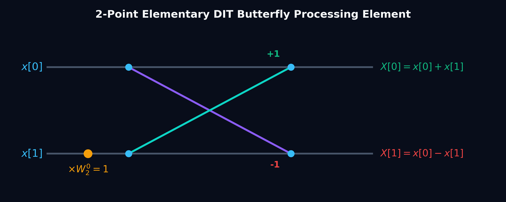
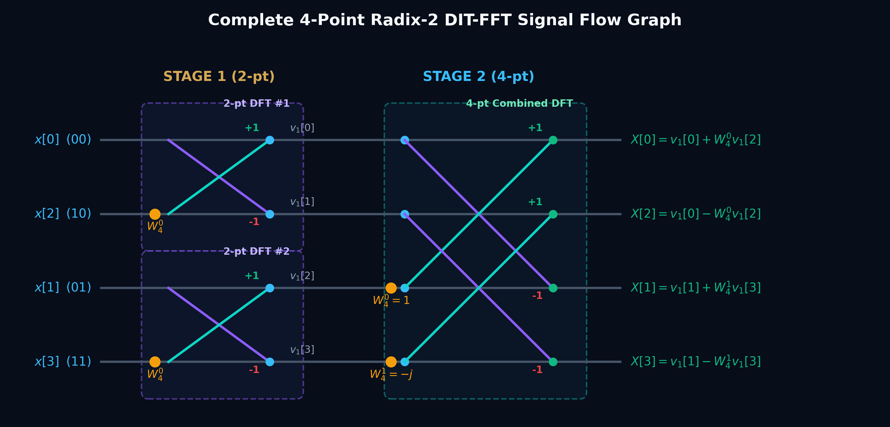
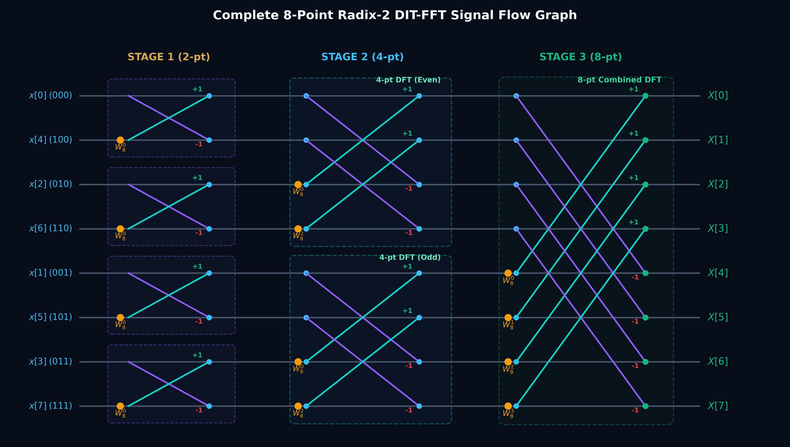

# Lecture 10: Radix-2 Decimation-in-Time (DIT) FFT Algorithm
## EE3621: Digital Signal Processing | III B.Tech EEE

---
## 1. LEARNING OBJECTIVES
By the end of this lecture, students will be able to:
1. **Derive** and compute the 2-point, 4-point, and 8-point DIT-FFT butterfly equations.
2. **Construct** complete signal flow graphs (SFG) for $N=2, 4, 8$ with accurate twiddle factors and branch signs.
3. **Compute** bit-reversed index mappings for $N=2, 4, 8, 16$.
4. **Evaluate** intermediate and final butterfly outputs for given numerical sequences step-by-step.
5. **Analyze** arithmetic complexity savings ($\frac{N}{2}\log_2 N$ vs $N^2$).

---
## 2. MATHEMATICAL FOUNDATIONS & SIGNAL FLOW GRAPHS

### 2.1 General Radix-2 DIT Decomposition
Let $x[n]$ be an $N$-point sequence ($N = 2^M$). Splitting $x[n]$ into even and odd samples:
$$ X[k] = \sum_{r=0}^{N/2-1} x[2r] W_{N/2}^{rk} + W_N^k \sum_{r=0}^{N/2-1} x[2r+1] W_{N/2}^{rk} = X_e[k] + W_N^k X_o[k] $$
Using the twiddle symmetry $W_N^{k + N/2} = -W_N^k$:
$$ X[k] = X_e[k] + W_N^k X_o[k], \quad 0 \le k < N/2 $$
$$ X[k + N/2] = X_e[k] - W_N^k X_o[k], \quad 0 \le k < N/2 $$

---

### 2.2 The 2-Point FFT ($N = 2$, 1 Stage, 1 Butterfly)

For $N = 2$, $M = \log_2 2 = 1$ stage. The twiddle factor is $W_2^0 = e^{-j 0} = 1$.

#### Mathematical Equations:
$$ X[0] = x[0] + W_2^0 x[1] = x[0] + x[1] $$
$$ X[1] = x[0] - W_2^0 x[1] = x[0] - x[1] $$

#### 2-Point Signal Flow Graph:



* **Complexity:** 1 addition, 1 subtraction, 0 non-trivial multiplications.

---

### 2.3 The 4-Point DIT-FFT ($N = 4$, 2 Stages, 4 Butterflies)

For $N = 4$, $M = \log_2 4 = 2$ stages.
* **Twiddle Factors:**
  * $W_4^0 = e^{-j 0} = 1$
  * $W_4^1 = e^{-j \frac{2\pi}{4}} = e^{-j \pi / 2} = -j$
* **Bit-Reversal Permutation ($2$-bit):**
  * $n = 0 \, (00)_2 \to 0 \, (00)_2 \implies x[0]$
  * $n = 1 \, (01)_2 \to 2 \, (10)_2 \implies x[2]$
  * $n = 2 \, (10)_2 \to 1 \, (01)_2 \implies x[1]$
  * $n = 3 \, (11)_2 \to 3 \, (11)_2 \implies x[3]$
  Input array ordering: $\{x[0], x[2], x[1], x[3]\}$.

#### Stage-by-Stage Equations:
* **Stage 1 (Two 2-point Sub-DFTs, Twiddle $W_4^0 = 1$):**
  * Upper 2-pt DFT:
    $$ v_1[0] = x[0] + W_4^0 x[2] = x[0] + x[2] $$
    $$ v_1[1] = x[0] - W_4^0 x[2] = x[0] - x[2] $$
  * Lower 2-pt DFT:
    $$ v_1[2] = x[1] + W_4^0 x[3] = x[1] + x[3] $$
    $$ v_1[3] = x[1] - W_4^0 x[3] = x[1] - x[3] $$
* **Stage 2 (One 4-point DFT, Twiddles $W_4^0 = 1, W_4^1 = -j$):**
  $$ X[0] = v_1[0] + W_4^0 v_1[2] = v_1[0] + v_1[2] $$
  $$ X[1] = v_1[1] + W_4^1 v_1[3] = v_1[1] - j v_1[3] $$
  $$ X[2] = v_1[0] - W_4^0 v_1[2] = v_1[0] - v_1[2] $$
  $$ X[3] = v_1[1] - W_4^1 v_1[3] = v_1[1] + j v_1[3] $$

#### Complete 4-Point DIT-FFT Signal Flow Graph:



---

### 2.4 The 8-Point DIT-FFT ($N = 8$, 3 Stages, 12 Butterflies)


* **Bit-Reversal Permutation ($3$-bit):**
  $x_{\text{rev}} = [x[0], x[4], x[2], x[6], x[1], x[5], x[3], x[7]]$.
* **Twiddle Factors:**
  * $W_8^0 = 1$
  * $W_8^1 = e^{-j \pi/4} = \frac{\sqrt{2}}{2}(1 - j) \approx 0.7071 - 0.7071j$
  * $W_8^2 = e^{-j \pi/2} = -j$
  * $W_8^3 = e^{-j 3\pi/4} = -\frac{\sqrt{2}}{2}(1 + j) \approx -0.7071 - 0.7071j$

#### Complete 8-Point DIT-FFT Signal Flow Graph:



---
## 3. WORKED NUMERICAL EXAMPLES

### Example 10.1: 2-Point FFT Computation
**Problem:** Compute the 2-point DFT of $x[n] = \{ \underset{\uparrow}{3}, 1 \}$ using the butterfly equations.

**Solution:**
* $X[0] = x[0] + x[1] = 3 + 1 = \mathbf{4}$
* $X[1] = x[0] - x[1] = 3 - 1 = \mathbf{2}$
* **Result:** $X[k] = \{ \underset{\uparrow}{4}, 2 \}$.

---

### Example 10.2: 4-Point DIT-FFT Step-by-Step
**Problem:** Compute the 4-point DFT of $x[n] = \{ \underset{\uparrow}{1}, 2, 3, 4 \}$ using the Radix-2 DIT-FFT algorithm.

**Solution:**
1. **Bit-Reversed Input Array:**
   $$ x_{\text{rev}} = [x[0], x[2], x[1], x[3]] = [1, 3, 2, 4] $$
2. **Stage 1 (Two 2-Point Butterflies with $W_4^0 = 1$):**
   * Upper pair $(x[0], x[2])$:
     $$ v_1[0] = 1 + 3 = \mathbf{4} $$
     $$ v_1[1] = 1 - 3 = \mathbf{-2} $$
   * Lower pair $(x[1], x[3])$:
     $$ v_1[2] = 2 + 4 = \mathbf{6} $$
     $$ v_1[3] = 2 - 4 = \mathbf{-2} $$
   Stage 1 output: $v_1 = [4, -2, 6, -2]$.
3. **Stage 2 (One 4-Point Butterfly with $W_4^0 = 1, W_4^1 = -j$):**
   * $X[0] = v_1[0] + W_4^0 v_1[2] = 4 + 1(6) = \mathbf{10}$
   * $X[1] = v_1[1] + W_4^1 v_1[3] = -2 + (-j)(-2) = \mathbf{-2 + 2j}$
   * $X[2] = v_1[0] - W_4^0 v_1[2] = 4 - 1(6) = \mathbf{-2}$
   * $X[3] = v_1[1] - W_4^1 v_1[3] = -2 - (-j)(-2) = \mathbf{-2 - 2j}$
* **Final Result:**
  $$ X[k] = \{ \underset{\uparrow}{10}, -2 + 2j, -2, -2 - 2j \} $$

---

### Example 10.3: 8-Point DIT-FFT Execution
**Problem:** Compute the 8-point DFT of $x[n] = \{ 1, 2, 3, 4, 4, 3, 2, 1 \}$ using Radix-2 DIT-FFT.

**Solution:**
1. **Input Bit-Reversal:**
   $x_{\text{rev}} = [x[0], x[4], x[2], x[6], x[1], x[5], x[3], x[7]] = [1, 4, 3, 2, 2, 3, 4, 1]$.
2. **Stage 1 (2-Point Butterflies, $W_8^0 = 1$):**
   $v_1 = [5, -3, 5, 1, 5, -1, 5, 3]$.
3. **Stage 2 (4-Point Butterflies, $W_8^0 = 1, W_8^2 = -j$):**
   $v_2 = [10, -3 - j, 0, -3 + j, 10, -1 - 3j, 0, -1 + 3j]$.
4. **Stage 3 (8-Point Butterflies, $W_8^0, W_8^1, W_8^2, W_8^3$):**
   * $X[0] = 10 + 10 = \mathbf{20}$
   * $X[1] = (-3 - j) + (0.7071 - 0.7071j)(-1 - 3j) = \mathbf{-5.8284 - 2.4142j}$
   * $X[2] = 0 + (-j)(0) = \mathbf{0}$
   * $X[3] = (-3 + j) + (-0.7071 - 0.7071j)(-1 + 3j) = \mathbf{-0.1716 - 0.4142j}$
   * $X[4] = 10 - 10 = \mathbf{0}$
   * $X[5] = X[3]^* = \mathbf{-0.1716 + 0.4142j}$
   * $X[6] = X[2]^* = \mathbf{0}$
   * $X[7] = X[1]^* = \mathbf{-5.8284 + 2.4142j}$

---
## 4. UNIVERSITY EXAMINATION QUESTIONS & MARKING RUBRIC

### Question 1 (15 Marks)
**(a)** Draw the 2-point butterfly computation block and explain how it is used to construct 4-point and 8-point DIT-FFT networks. *(5 Marks)*
**(b)** Given $x[n] = \{ \underset{\uparrow}{1}, 2, 3, 4 \}$, compute its 4-point DFT using the Radix-2 DIT-FFT algorithm. Show all intermediate stage values and draw the labeled signal flow graph. *(10 Marks)*

**Model Answer & Step-by-Step Marking Rubric:**
* **Part (a):**
  * 2-point butterfly diagram with equations $A \pm W_N^r B$ *(3 Marks)*
  * Explanation of hierarchical sub-DFT combining ($N/2 \to N$) *(2 Marks)*
* **Part (b):**
  * Bit-reversal input ordering $\{1, 3, 2, 4\}$ *(2 Marks)*
  * Stage 1 calculations: $v_1 = [4, -2, 6, -2]$ *(3 Marks)*
  * Stage 2 calculations with $W_4^0 = 1$ and $W_4^1 = -j$:
    $X[0]=10, X[1]=-2+2j, X[2]=-2, X[3]=-2-2j$ *(3 Marks)*
  * Labeled 4-point Signal Flow Graph *(2 Marks)*

---
## 5. PYTHON VERIFICATION SCRIPT
```python
import numpy as np

# 2-Point FFT
x2 = np.array([3, 1])
print("2-Point FFT:", np.fft.fft(x2))

# 4-Point FFT
x4 = np.array([1, 2, 3, 4])
print("4-Point FFT:", np.fft.fft(x4))

# 8-Point FFT
x8 = np.array([1, 2, 3, 4, 4, 3, 2, 1])
print("8-Point FFT:", np.round(np.fft.fft(x8), 4))
```
