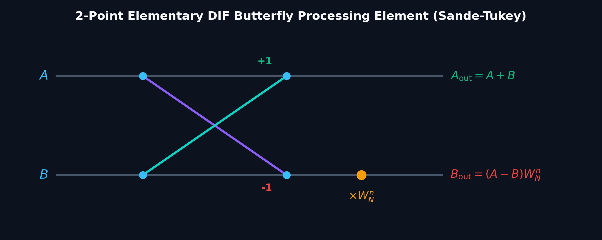
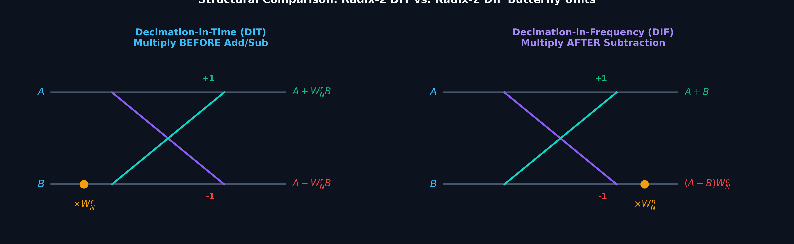
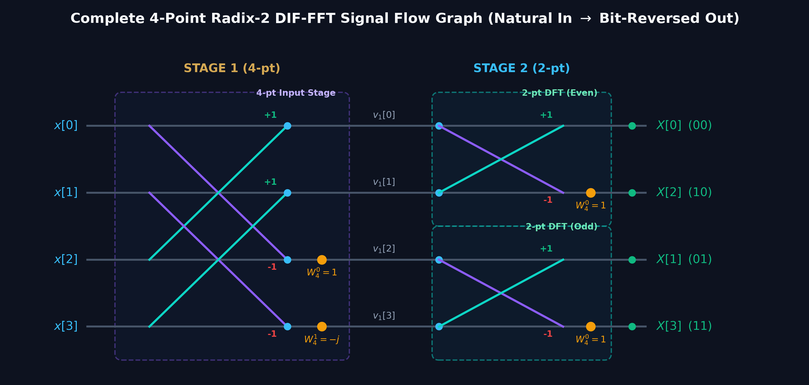
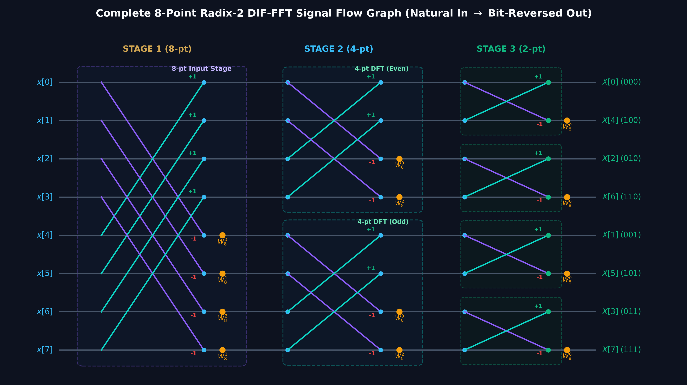

# Lecture 11: Radix-2 Decimation-in-Frequency (DIF) FFT Algorithm
## EE3621: Digital Signal Processing | III B.Tech EEE

---
## 1. LEARNING OBJECTIVES
By the end of this lecture, students will be able to:
1. **Derive** the Decimation-in-Frequency (DIF) butterfly equations mathematically from first principles.
2. **Construct** complete signal flow graphs for $N=2$, $N=4$, and $N=8$ DIF-FFTs with accurate twiddle factors and branch weights.
3. **Compare** DIT and DIF algorithms across computational complexity, butterfly structure, and memory ordering.
4. **Evaluate** numerical DIF-FFT butterfly stages step-by-step for given sequences.
5. **Compute** the Inverse DFT (IDFT) using standard forward FFT routines.

---
## 2. MATHEMATICAL FOUNDATIONS & SIGNAL FLOW GRAPHS

### 2.1 Derivation of the DIF Algorithm
Divide the $N$-point input sum into two halves of length $N/2$:
$$ X[k] = \sum_{n=0}^{N/2-1} x[n] W_N^{nk} + \sum_{n=N/2}^{N-1} x[n] W_N^{nk} $$
Substitute $n \to n + N/2$ in the second summation:
$$ X[k] = \sum_{n=0}^{N/2-1} x[n] W_N^{nk} + \sum_{n=0}^{N/2-1} x[n + N/2] W_N^{(n + N/2)k} = \sum_{n=0}^{N/2-1} [x[n] + x[n + N/2] W_N^{Nk/2}] W_N^{nk} $$
Since $W_N^{Nk/2} = (W_N^{N/2})^k = (-1)^k$:
$$ X[k] = \sum_{n=0}^{N/2-1} [x[n] + (-1)^k x[n + N/2]] W_N^{nk} $$

* **For even frequency indices ($k = 2r$):**
  $$ X[2r] = \sum_{n=0}^{N/2-1} [x[n] + x[n + N/2]] W_N^{2nr} = \sum_{n=0}^{N/2-1} [x[n] + x[n + N/2]] W_{N/2}^{nr} = \text{DFT}_{N/2}\{x[n] + x[n + N/2]\} $$
* **For odd frequency indices ($k = 2r + 1$):**
  $$ X[2r + 1] = \sum_{n=0}^{N/2-1} [x[n] - x[n + N/2]] W_N^n W_{N/2}^{nr} = \text{DFT}_{N/2}\{(x[n] - x[n + N/2]) W_N^n\} $$

---

### 2.2 The 2-Point Elementary DIF Butterfly

In the Decimation-in-Frequency butterfly, addition and subtraction are performed first, and the twiddle factor $W_N^n$ is multiplied on the **lower difference branch**:

$$ A_{\text{out}} = A + B $$
$$ B_{\text{out}} = (A - B) W_N^n $$



---

### 2.3 Structural Comparison: DIT vs. DIF Butterfly Units



| Feature | Radix-2 DIT (Cooley-Tukey) | Radix-2 DIF (Sande-Tukey) |
| :--- | :--- | :--- |
| **Decimation Domain** | Time Domain (Even / Odd samples) | Frequency Domain (Even / Odd bins) |
| **Input Ordering** | Bit-Reversed Order | Natural Sequential Order |
| **Output Ordering** | Natural Sequential Order | Bit-Reversed Order |
| **Butterfly Structure** | $A \pm W_N^r B$ (Multiply *before* add/sub) | $(A+B)$ and $(A-B)W_N^n$ (Multiply *after* sub) |
| **Twiddle Location** | Lower Input Branch | Lower Output Branch |
| **Complex Multiplications** | $\frac{N}{2} \log_2 N$ | $\frac{N}{2} \log_2 N$ |
| **Complex Additions** | $N \log_2 N$ | $N \log_2 N$ |

---

### 2.4 The 4-Point DIF-FFT ($N = 4$, 2 Stages)

For $N = 4$, $M = \log_2 4 = 2$ stages.
* **Stage 1 (One 4-pt block, distance 2):**
  * $v_1[0] = x[0] + x[2]$
  * $v_1[1] = x[1] + x[3]$
  * $v_1[2] = (x[0] - x[2]) W_4^0 = x[0] - x[2]$
  * $v_1[3] = (x[1] - x[3]) W_4^1 = (x[1] - x[3])(-j)$
* **Stage 2 (Two 2-pt blocks, distance 1):**
  * Upper 2-pt DFT: $X[0] = v_1[0] + v_1[1]$, $X[2] = (v_1[0] - v_1[1]) W_4^0 = v_1[0] - v_1[1]$
  * Lower 2-pt DFT: $X[1] = v_1[2] + v_1[3]$, $X[3] = (v_1[2] - v_1[3]) W_4^0 = v_1[2] - v_1[3]$
* **Outputs:** In bit-reversed order: $\{ X[0], X[2], X[1], X[3] \}$.



---

### 2.5 The 8-Point DIF-FFT ($N = 8$, 3 Stages, 12 Butterflies)

For $N = 8$, $M = 3$ stages:
* **Stage 1:** 4 butterflies with span 4, twiddles $W_8^0, W_8^1, W_8^2, W_8^3$ on lower outputs.
* **Stage 2:** 4 butterflies with span 2 (two 4-pt DFTs), twiddles $W_8^0, W_8^2$ on lower outputs.
* **Stage 3:** 4 butterflies with span 1 (four 2-pt DFTs), twiddles $W_8^0 = 1$ on lower outputs.
* **Outputs:** In bit-reversed order: $\{ X[0], X[4], X[2], X[6], X[1], X[5], X[3], X[7] \}$.



---
## 3. WORKED NUMERICAL EXAMPLES

### Example 11.1: 4-Point DIF-FFT Step-by-Step
**Problem:** Compute the 4-point DFT of $x[n] = \{ \underset{\uparrow}{1}, 2, 3, 4 \}$ using the Radix-2 DIF-FFT algorithm.

**Solution:**
1. **Stage 1 (Span = 2, $W_4^0 = 1, W_4^1 = -j$):**
   * $v_1[0] = x[0] + x[2] = 1 + 3 = \mathbf{4}$
   * $v_1[1] = x[1] + x[3] = 2 + 4 = \mathbf{6}$
   * $v_1[2] = (x[0] - x[2]) W_4^0 = (1 - 3)(1) = \mathbf{-2}$
   * $v_1[3] = (x[1] - x[3]) W_4^1 = (2 - 4)(-j) = \mathbf{2j}$
   Stage 1 output: $v_1 = [4, 6, -2, 2j]$.

2. **Stage 2 (Span = 1, $W_4^0 = 1$):**
   * Upper pair $(v_1[0], v_1[1])$:
     * $X[0] = v_1[0] + v_1[1] = 4 + 6 = \mathbf{10}$
     * $X[2] = (v_1[0] - v_1[1]) W_4^0 = (4 - 6)(1) = \mathbf{-2}$
   * Lower pair $(v_1[2], v_1[3])$:
     * $X[1] = v_1[2] + v_1[3] = -2 + 2j = \mathbf{-2 + 2j}$
     * $X[3] = (v_1[2] - v_1[3]) W_4^0 = -2 - 2j = \mathbf{-2 - 2j}$

3. **Bit-Reversal Reordering:**
   * Rail 0: $X[0] = 10$
   * Rail 1: $X[2] = -2$
   * Rail 2: $X[1] = -2 + 2j$
   * Rail 3: $X[3] = -2 - 2j$
* **Final Result in Natural Order:**
  $$ X[k] = \{ \underset{\uparrow}{10}, -2 + 2j, -2, -2 - 2j \} $$
  *(Exactly matches the DIT-FFT result from Lecture 10, verifying algebraic equivalence).*

---

### Example 11.2: 8-Point DIF-FFT Execution
**Problem:** Compute the 8-point DFT of $x[n] = \{ 1, 2, 3, 4, 4, 3, 2, 1 \}$ using Radix-2 DIF-FFT.

**Solution:**
1. **Stage 1 (Span = 4, $W_8^0, W_8^1, W_8^2, W_8^3$):**
   * $v_1[0] = 1 + 4 = 5$
   * $v_1[1] = 2 + 3 = 5$
   * $v_1[2] = 3 + 2 = 5$
   * $v_1[3] = 4 + 1 = 5$
   * $v_1[4] = (1 - 4) W_8^0 = -3$
   * $v_1[5] = (2 - 3) W_8^1 = (-1)(0.7071 - 0.7071j) = -0.7071 + 0.7071j$
   * $v_1[6] = (3 - 2) W_8^2 = (1)(-j) = -j$
   * $v_1[7] = (4 - 1) W_8^3 = (3)(-0.7071 - 0.7071j) = -2.1213 - 2.1213j$
2. **Stage 2 (Span = 2, $W_8^0, W_8^2$):**
   * $v_2[0] = 5 + 5 = 10$
   * $v_2[1] = 5 + 5 = 10$
   * $v_2[2] = (5 - 5)(1) = 0$
   * $v_2[3] = (5 - 5)(-j) = 0$
   * $v_2[4] = -3 + (-j) = -3 - j$
   * $v_2[5] = (-0.7071 + 0.7071j) + (-2.1213 - 2.1213j) = -2.8284 - 1.4142j$
   * $v_2[6] = (-3 - (-j))(1) = -3 + j$
   * $v_2[7] = [(-0.7071 + 0.7071j) - (-2.1213 - 2.1213j)](-j) = -2.8284 + 1.4142j$
3. **Stage 3 (Span = 1, $W_8^0 = 1$):**
   * $X[0] = 10 + 10 = \mathbf{20}$
   * $X[4] = 10 - 10 = \mathbf{0}$
   * $X[2] = 0 + 0 = \mathbf{0}$
   * $X[6] = 0 - 0 = \mathbf{0}$
   * $X[1] = (-3 - j) + (-2.8284 - 1.4142j) = \mathbf{-5.8284 - 2.4142j}$
   * $X[5] = (-3 - j) - (-2.8284 - 1.4142j) = \mathbf{-0.1716 + 0.4142j}$
   * $X[3] = (-3 + j) + (-2.8284 + 1.4142j) = \mathbf{-0.1716 - 0.4142j}$
   * $X[7] = (-3 + j) - (-2.8284 + 1.4142j) = \mathbf{-5.8284 + 2.4142j}$
4. **Natural Order Output:**
   $X[k] = \{ 20, -5.8284 - 2.4142j, 0, -0.1716 - 0.4142j, 0, -0.1716 + 0.4142j, 0, -5.8284 + 2.4142j \}$.

---
## 4. UNIVERSITY EXAMINATION QUESTIONS & MARKING RUBRIC

### Question 1 (15 Marks)
**(a)** Compare and contrast Radix-2 DIT and DIF FFT algorithms with respect to input/output ordering, twiddle factor placement, and butterfly equations. *(6 Marks)*
**(b)** Compute the 4-point DFT of $x[n] = \{ 1, 2, 3, 4 \}$ using Radix-2 DIF-FFT. Draw the labeled signal flow graph and list all intermediate stage outputs. *(9 Marks)*

**Model Answer & Step-by-Step Marking Rubric:**
* **Part (a):**
  * Comparison table covering 4+ key architectural features *(4 Marks)*
  * DIT vs DIF butterfly sketches with twiddle placements *(2 Marks)*
* **Part (b):**
  * Stage 1 intermediate values $v_1 = [4, 6, -2, 2j]$ *(3 Marks)*
  * Stage 2 intermediate values and bit-reversed outputs *(3 Marks)*
  * Fully labeled 4-point DIF signal flow graph *(3 Marks)*

---
## 5. PYTHON VERIFICATION SCRIPT
```python
import numpy as np

# 4-Point DIF-FFT Verification
x4 = np.array([1, 2, 3, 4])
X4 = np.fft.fft(x4)
print("4-Point DIF-FFT Output:", np.round(X4, 4))

# 8-Point DIF-FFT Verification
x8 = np.array([1, 2, 3, 4, 4, 3, 2, 1])
X8 = np.fft.fft(x8)
print("8-Point DIF-FFT Output:", np.round(X8, 4))
```
