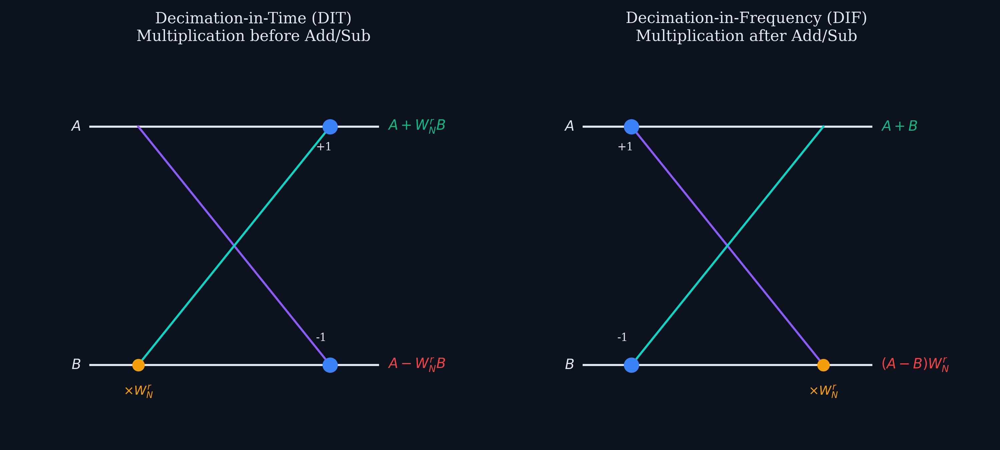

# Lecture 11: Radix-2 Decimation-in-Frequency (DIF) FFT Algorithm
## EE3621: Digital Signal Processing | III B.Tech EEE

---
## 1. LEARNING OBJECTIVES
By the end of this lecture, students will be able to:
1. **Derive** the Decimation-in-Frequency (DIF) butterfly equations mathematically.
2. **Draw** complete signal flow graphs for $N=4$ and $N=8$ DIF-FFTs.
3. **Compare** DIT and DIF algorithms across computational complexity, butterfly structure, and memory ordering.
4. **Compute** the Inverse DFT (IDFT) using standard forward FFT routines.

---
## 2. MATHEMATICAL FOUNDATIONS

### 2.1 Derivation of the DIF Algorithm
Divide the $N$-point input sum into two halves of length $N/2$:
$$ X[k] = \sum_{n=0}^{N/2-1} x[n] W_N^{nk} + \sum_{n=N/2}^{N-1} x[n] W_N^{nk} $$
Substitute $n \to n + N/2$ in the second summation:
$$ X[k] = \sum_{n=0}^{N/2-1} x[n] W_N^{nk} + \sum_{n=0}^{N/2-1} x[n + N/2] W_N^{(n + N/2)k} = \sum_{n=0}^{N/2-1} [x[n] + x[n + N/2] W_N^{Nk/2}] W_N^{nk} $$
Since $W_N^{Nk/2} = (W_N^{N/2})^k = (-1)^k$:
$$ X[k] = \sum_{n=0}^{N/2-1} [x[n] + (-1)^k x[n + N/2]] W_N^{nk} $$

* **For even frequency indices ($k = 2r$):**
  $$ X[2r] = \sum_{n=0}^{N/2-1} [x[n] + x[n + N/2]] W_N^{2nr} = \sum_{n=0}^{N/2-1} [x[n] + x[n + N/2]] W_{N/2}^{nr} = \text{DFT}_{N/2}\{x[n] + x[n + N/2]\} $$
* **For odd frequency indices ($k = 2r + 1$):**
  $$ X[2r + 1] = \sum_{n=0}^{N/2-1} [x[n] - x[n + N/2]] W_N^n W_{N/2}^{nr} = \text{DFT}_{N/2}\{(x[n] - x[n + N/2]) W_N^n\} $$

---

### 2.2 The DIF Butterfly Processing Element



$$ A_{\text{out}} = A + B $$
$$ B_{\text{out}} = (A - B) W_N^n $$

```
   A (in) ──────●──────────────────────────────────────────────> A_out = A + B
                 \                                            /
                  \                                          /
                   \    (+1)                                /
                    \                                      /
                     \                                    /
                      \                                  /
                       \                                /
                        \   (-1)                       /
                         \                            /
                          \                          /
                           \                        /
                            X                      /
                           / \                    /
                          /   \                  /
   B (in) ───────────────●─────\───[ x W_N^n ]──●──────────────> B_out = (A - B) * W_N^n
```

---

### 2.3 Comprehensive Comparison: DIT vs. DIF FFT

| Feature | Radix-2 DIT (Cooley-Tukey) | Radix-2 DIF (Sande-Tukey) |
| :--- | :--- | :--- |
| **Decimation Domain** | Time Domain (Even / Odd samples) | Frequency Domain (Even / Odd bins) |
| **Input Ordering** | Bit-Reversed Order | Natural Sequential Order |
| **Output Ordering** | Natural Sequential Order | Bit-Reversed Order |
| **Butterfly Structure** | $A \pm W_N^r B$ (Multiply *before* add/sub) | $(A+B)$ and $(A-B)W_N^n$ (Multiply *after* sub) |
| **Complex Multiplications** | $\frac{N}{2} \log_2 N$ | $\frac{N}{2} \log_2 N$ |
| **Complex Additions** | $N \log_2 N$ | $N \log_2 N$ |

---

### 2.4 Complete 8-Point DIF-FFT Signal Flow Graph (SFG)

```
Input (Natural)            Stage 1 (8-pt)          Stage 2 (4-pt)          Stage 3 (2-pt)         Output (Bit-Reversed)
x[0] ───────────────────────●───────────────────────●───────────────────────●────────────────────> X[0]
                             \                     / \                     / \
                              \                   /   \                   /   \
x[1] ──────────────────────────●─────────────────/─────●─────────────────/─────●──────────────────> X[4]
                                \               /       \               /       \
                                 \             /         \             /         \
x[2] ─────────────────────────────●───────────/───────────●───────────/───────────●──────────────> X[2]
                                   \         /             \         /             \
                                    \       /               \       /               \
x[3] ────────────────────────────────●─────/─────────────────●─────/─────────────────●────────────> X[6]
                                      \   /                   \   /                   \
                                       \ /                     \ /                     \
x[4] ────●──[x W_8^0]───────────────────●───────────────────────●───────────────────────●─────────> X[1]
          \                                              / \                     /
           \                                            /   \                   /
x[5] ───────●──[x W_8^1]───────────────────────────────/─────●──[x W_4^1]──────/──────────●──────> X[5]
             \                                        /       \               /
              \                                      /         \             /
x[6] ──────────●──[x W_8^2]─────────────────────────/───────────●───────────/──────────────●──────> X[3]
                \                                  /             \         /
                 \                                /               \       /
x[7] ─────────────●──[x W_8^3]───────────────────/─────────────────●──[x W_4^1]─────────────●────> X[7]
```

---
## 3. WORKED NUMERICAL EXAMPLES

### Example 11.1: 8-Point DIF-FFT Step-by-Step
**Problem:** Compute the 8-point DFT of $x[n] = \{ \underset{\uparrow}{1}, 1, 1, 1, 0, 0, 0, 0 \}$ using Radix-2 DIF-FFT.

**Solution:**
* **Stage 1 (Twiddles $W_8^n, \; n=0,1,2,3$):**
  * $v_1[0] = x[0] + x[4] = 1 + 0 = 1$
  * $v_1[1] = x[1] + x[5] = 1 + 0 = 1$
  * $v_1[2] = x[2] + x[6] = 1 + 0 = 1$
  * $v_1[3] = x[3] + x[7] = 1 + 0 = 1$
  * $v_1[4] = (x[0] - x[4]) W_8^0 = (1 - 0)(1) = 1$
  * $v_1[5] = (x[1] - x[5]) W_8^1 = (1 - 0)(0.7071 - 0.7071j) = 0.7071 - 0.7071j$
  * $v_1[6] = (x[2] - x[6]) W_8^2 = (1 - 0)(-j) = -j$
  * $v_1[7] = (x[3] - x[7]) W_8^3 = (1 - 0)(-0.7071 - 0.7071j) = -0.7071 - 0.7071j$
* **Stage 2 (Twiddles $W_4^0=1, W_4^1=-j$):**
  * Upper half:
    * $v_2[0] = v_1[0] + v_1[2] = 1 + 1 = 2$
    * $v_2[1] = v_1[1] + v_1[3] = 1 + 1 = 2$
    * $v_2[2] = (v_1[0] - v_1[2]) W_4^0 = (1 - 1)(1) = 0$
    * $v_2[3] = (v_1[1] - v_1[3]) W_4^1 = (1 - 1)(-j) = 0$
  * Lower half:
    * $v_2[4] = v_1[4] + v_1[6] = 1 - j$
    * $v_2[5] = v_1[5] + v_1[7] = (0.7071 - 0.7071j) + (-0.7071 - 0.7071j) = -1.4142j$
    * $v_2[6] = (v_1[4] - v_1[6]) W_4^0 = (1 - (-j))(1) = 1 + j$
    * $v_2[7] = (v_1[5] - v_1[7]) W_4^1 = (1.4142)(-j) = -1.4142j$
* **Stage 3 (Twiddle $W_2^0 = 1$):**
  * $X_{\text{br}}[0] = v_2[0] + v_2[1] = 4 \implies X[0] = 4$
  * $X_{\text{br}}[1] = v_2[0] - v_2[1] = 0 \implies X[4] = 0$
  * $X_{\text{br}}[2] = v_2[2] + v_2[3] = 0 \implies X[2] = 0$
  * $X_{\text{br}}[3] = v_2[2] - v_2[3] = 0 \implies X[6] = 0$
  * $X_{\text{br}}[4] = v_2[4] + v_2[5] = 1 - 2.4142j \implies X[1] = 1 - 2.4142j$
  * $X_{\text{br}}[5] = v_2[4] - v_2[5] = 1 + 0.4142j \implies X[5] = 1 + 0.4142j$
  * $X_{\text{br}}[6] = v_2[6] + v_2[7] = 1 - 0.4142j \implies X[3] = 1 - 0.4142j$
  * $X_{\text{br}}[7] = v_2[6] - v_2[7] = 1 + 2.4142j \implies X[7] = 1 + 2.4142j$

---
## 4. UNIVERSITY EXAMINATION QUESTIONS & MARKING RUBRIC

### Question 1 (15 Marks)
**(a)** Derive the Radix-2 Decimation-in-Frequency FFT equations and construct the complete 8-point DIF signal flow graph. *(10 Marks)*
**(b)** Compare Radix-2 DIT and Radix-2 DIF FFT algorithms in terms of input/output data ordering, butterfly equations, and hardware complexity. *(5 Marks)*

**Model Answer & Step-by-Step Marking Rubric:**
* **Part (a):**
  * Splitting summation into first/second halves and separating into even/odd frequency bins *(4 Marks)*
  * Butterfly equations $A+B$ and $(A-B)W_N^n$ *(2 Marks)*
  * Neatly drawn 8-point DIF SFG showing natural inputs, 3 stages, and bit-reversed outputs *(4 Marks)*
* **Part (b):**
  * Comprehensive comparison table covering all items listed in Section 2.3 *(5 Marks)*

---
## 5. PYTHON VERIFICATION SCRIPT
```python
import numpy as np

x = np.array([1, 1, 1, 1, 0, 0, 0, 0])
X = np.fft.fft(x)
print("8-Point DIF-FFT Output:")
for k in range(8):
    print(f"X[{k}] = {X[k].real:.4f} + {X[k].imag:.4f}j")
```
