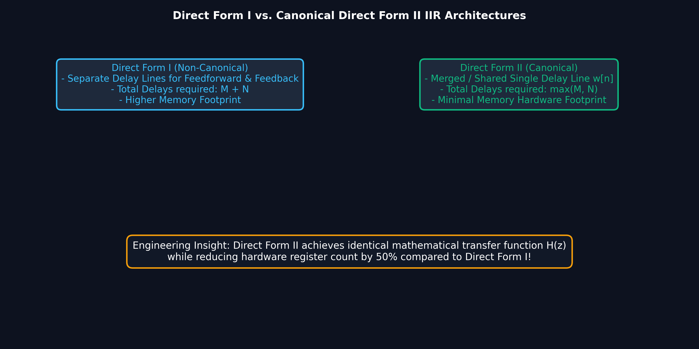
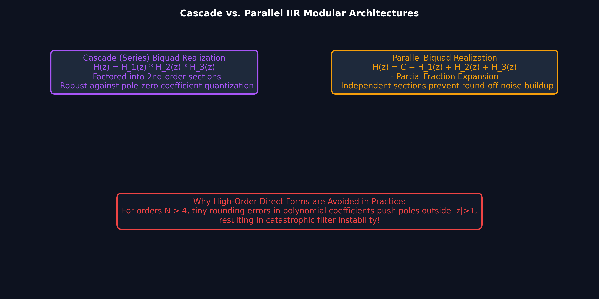

# Lecture 13: IIR Filter Structures — Direct, Cascade & Parallel Forms

**Course:** EE3621 — Digital Signal Processing  
**Target Audience:** III B.Tech EEE Students  
**Duration:** 40 Minutes  

* **Available Formats:** [LaTeX Source File](lecture_13.tex) | [Compiled PDF Notes](lecture_13.pdf)

---

## 1. Lecture Plan (40 Minutes Breakdown)

* **00:00 – 05:00 (5 mins):** Welcome & Introduction to IIR Systems. The general transfer function, difference equations, and flow graph basic elements.
* **05:00 – 12:00 (7 mins):** Direct Form I. Derivation from the transfer function, separate delay lines for zeros (feedforward) and poles (feedback). Node equations and text-based signal flow graph.
* **12:00 – 18:00 (6 mins):** Direct Form II (Canonical Form). Combining delay lines to save memory. State variable equations. Transposed forms.
* **18:00 – 25:00 (7 mins):** Cascade (Series) Form. Factoring the transfer function into second-order sections (biquads). Complex conjugate poles and real coefficients.
* **25:00 – 32:00 (7 mins):** Parallel Form. Partial fraction expansion into second-order sections.
* **32:00 – 35:00 (3 mins):** Coefficient Sensitivity, Quantization Effects, and Lattice-Ladder structures (AR/ARMA).
* **35:00 – 40:00 (5 mins):** Checkpoints & Numerical Examples.

---

## 2. General IIR Transfer Function

An Infinite Impulse Response (IIR) filter has a rational system function of the form:

$$ H(z) = \frac{B(z)}{A(z)} $$
$$ H(z) = \frac{\sum_{k=0}^{M} b_k z^{-k}}{1 + \sum_{k=1}^{N} a_k z^{-k}} $$

By dividing the output $Y(z)$ by the input $X(z)$, we have:

$$ \frac{Y(z)}{X(z)} = \frac{\sum_{k=0}^{M} b_k z^{-k}}{1 + \sum_{k=1}^{N} a_k z^{-k}} $$

Cross-multiplying gives the frequency domain relationship:

$$ Y(z) \left( 1 + \sum_{k=1}^{N} a_k z^{-k} \right) = X(z) \left( \sum_{k=0}^{M} b_k z^{-k} \right) $$

$$ Y(z) + \sum_{k=1}^{N} a_k z^{-k} Y(z) = \sum_{k=0}^{M} b_k z^{-k} X(z) $$

Isolating $Y(z)$:

$$ Y(z) = \sum_{k=0}^{M} b_k z^{-k} X(z) - \sum_{k=1}^{N} a_k z^{-k} Y(z) $$

Taking the inverse Z-transform yields the general linear constant-coefficient difference equation:

$$ y[n] = \sum_{k=0}^{M} b_k x[n-k] - \sum_{k=1}^{N} a_k y[n-k] $$

**Physical/Engineering Intuition:**
* The sequence $x[n], x[n-1], \dots, x[n-M]$ represents the current and past inputs. The coefficients $b_k$ dictate the "feedforward" paths (zeros of the system).
* The sequence $y[n-1], y[n-2], \dots, y[n-N]$ represents the past outputs. The coefficients $-a_k$ dictate the "feedback" paths (poles of the system), which is what gives the filter an infinite impulse response.
* In signal flow graphs, nodes represent variables (e.g., $x[n], y[n]$), branches represent multipliers, and $z^{-1}$ blocks represent unit delays (memory registers in DSP hardware).

---

## 3. Direct Form I Structure

### Visual Illustration: Direct Form I vs. Canonical Direct Form II Architectures



* **Canonical Advantage:** Direct Form II shares a single central delay line $w[n]$, reducing hardware delay register count from $M+N$ down to $\max(M,N)$ ($50\%$ memory hardware savings).

---

### Visual Illustration: Modular Cascade & Parallel Biquad Realizations



* **Preventing Numerical Instability:** For filter orders $N > 4$, direct form polynomial coefficients are hyper-sensitive to quantization. Factoring into second-order cascade sections (Biquads) or parallel partial fractions maintains robust numerical stability.


The Direct Form I structure implements the difference equation exactly as written above. It essentially cascades an all-zero (FIR) system with an all-pole (IIR) system.

Let $w[n]$ be an intermediate sequence representing the feedforward (FIR) part:

$$ w[n] = \sum_{k=0}^{M} b_k x[n-k] $$

Then the output $y[n]$ is formed by adding the feedback (IIR) part:

$$ y[n] = w[n] - \sum_{k=1}^{N} a_k y[n-k] $$

### Signal Flow Graph (Textual Representation)

Assume a 2nd-order system ($M=N=2$):
$$ y[n] = b_0 x[n] + b_1 x[n-1] + b_2 x[n-2] - a_1 y[n-1] - a_2 y[n-2] $$

```text
x[n] ---> (x) b0 ---------------------> (+) --------> y[n]
  |                                      ^      |
  v z^{-1}                               |      v z^{-1}
x[n-1]--> (x) b1 ---> (+)                |    (-a1)
  |                    ^                 |      |
  v z^{-1}             |                 |      v z^{-1}
x[n-2]--> (x) b2 ------+                 +----(-a2)
```

**Memory Requirements:**
The Direct Form I structure requires separate delay lines for the input ($M$ delays) and the output ($N$ delays). Total memory elements = $M + N$. 

**Node Equations:**
* Node 1: $x_1[n] = x[n]$
* Node 2: $x_2[n] = x[n-1]$
* Node 3: $x_3[n] = x[n-2]$
* Node 4 (Intermediate sum): $w[n] = b_0 x[n] + b_1 x[n-1] + b_2 x[n-2]$
* Node 5 (Output): $y[n] = w[n] - a_1 y[n-1] - a_2 y[n-2]$

---

## 4. Direct Form II (Canonical Form)

The Direct Form I consists of an FIR filter followed by an all-pole filter. Because these are linear time-invariant (LTI) systems, we can swap their order without changing the overall transfer function.

$$ H(z) = H_{FIR}(z) \cdot H_{IIR}(z) = H_{IIR}(z) \cdot H_{FIR}(z) $$

$$ H(z) = \left( \frac{1}{1 + \sum_{k=1}^{N} a_k z^{-k}} \right) \cdot \left( \sum_{k=0}^{M} b_k z^{-k} \right) $$

Let $V(z)$ be the output of the all-pole part:

$$ V(z) = X(z) \cdot \frac{1}{1 + \sum_{k=1}^{N} a_k z^{-k}} $$

$$ V(z) \left( 1 + \sum_{k=1}^{N} a_k z^{-k} \right) = X(z) $$

$$ V(z) = X(z) - \sum_{k=1}^{N} a_k z^{-k} V(z) $$

In the time domain, this is the state variable equation:

$$ v[n] = x[n] - \sum_{k=1}^{N} a_k v[n-k] $$

Now, pass $V(z)$ through the FIR part:

$$ Y(z) = V(z) \cdot \left( \sum_{k=0}^{M} b_k z^{-k} \right) $$

In the time domain:

$$ y[n] = \sum_{k=0}^{M} b_k v[n-k] $$

**Key Insight:** Both the feedback part and the feedforward part now use the *same* delayed sequences $v[n-1], v[n-2], \dots$. We can merge the two delay lines into a single delay line!

**Memory Requirements:**
The number of delay elements is now $\max(M, N)$. Because it uses the minimum possible memory, Direct Form II is called the **Canonical Form**.

### Transposed Forms
By applying Flow Graph Reversal (Transposition Theorem):
1. Reverse the direction of all branches.
2. Swap the input and output nodes.
3. Keep the same branch transmittances.

Transposing Direct Form II yields the **Transposed Direct Form II**, which is heavily used in DSP because it avoids an adder bottleneck at the output and handles coefficient quantization slightly better for single-precision arithmetic.

---

## 5. Cascade (Series) Form

High-order polynomials are highly sensitive to coefficient quantization. A slight rounding error in $a_k$ can move the poles significantly, potentially pushing a pole outside the unit circle and making the filter unstable.

To fix this, we factor $H(z)$ into smaller, 1st and 2nd-order sections (biquads).

$$ H(z) = A \frac{\prod_{k=1}^{M} (1 - z_k z^{-1})}{\prod_{k=1}^{N} (1 - p_k z^{-1})} $$

Since $h[n]$ is real-valued, complex poles and zeros must occur in conjugate pairs. We group a complex conjugate pair of poles $(p, p^*)$ and zeros $(z_1, z_1^*)$ into a single 2nd-order section with real coefficients.

$$ H(z) = G \prod_{k=1}^{K} H_k(z) $$

Where $K = \lceil \max(M,N) / 2 \rceil$, and each biquad is:

$$ H_k(z) = \frac{b_{k0} + b_{k1} z^{-1} + b_{k2} z^{-2}}{1 + a_{k1} z^{-1} + a_{k2} z^{-2}} $$

**Advantages:** 
* Less sensitive to quantization errors. 
* Easy to implement in hardware/software by repeatedly calling a biquad function.

---

## 6. Parallel Form

Another way to decompose $H(z)$ is using Partial Fraction Expansion (PFE). Assuming $M \le N$ and simple poles:

$$ H(z) = C + \sum_{k=1}^{N} \frac{A_k}{1 - p_k z^{-1}} $$

Again, grouping complex conjugate poles yields 2nd-order sections with real coefficients:

$$ H(z) = C + \sum_{k=1}^{K} H_k(z) $$

Where:

$$ H_k(z) = \frac{\gamma_{k0} + \gamma_{k1} z^{-1}}{1 + a_{k1} z^{-1} + a_{k2} z^{-2}} $$

The parallel form implies the input is fed to all sections simultaneously, and their outputs are summed. It is highly robust against quantization noise and allows parallel processing in hardware like FPGAs.

---

## 7. Coefficient Sensitivity and Quantization Effects

When coefficients are quantized to $B$ bits, they can only take discrete values. For a high-order polynomial, the roots (poles/zeros) are extremely sensitive to changes in the coefficients. 

Let a root be $p_i$. The sensitivity of $p_i$ to a change in coefficient $a_k$ is proportional to:
$$ \frac{\partial p_i}{\partial a_k} \propto \frac{1}{\prod_{j \neq i} (p_i - p_j)} $$

If poles are clustered tightly, the denominator is small, so the sensitivity is massive! Cascade and parallel forms isolate poles into independent 2nd-order sections, so a change in one section's coefficient only affects its own poles, keeping stability intact.

---

## 8. Lattice-Ladder Structures

Lattice-Ladder filters use a series of lattice stages instead of direct delays and multipliers.
* **All-Pole (AR):** Uses only a lattice structure, controlled by reflection coefficients (PARCOR coefficients), $K_m$.
* **Pole-Zero (ARMA):** Uses a lattice for the poles and a ladder network for the zeros.

**Why Useful?**
1. **Orthogonality:** The stages decouple the filter characteristics.
2. **Stability Check:** An all-pole IIR filter is strictly stable if and only if all reflection coefficients satisfy $|K_m| < 1$.
3. Excellent robustness to round-off noise and widely used in speech synthesis (Linear Predictive Coding, LPC).

---

## 9. Key Formulas Summary

| Concept | Equation / Transfer Function |
|---------|-----------------------------|
| Difference Equation | $y[n] = \sum_{k=0}^{M} b_k x[n-k] - \sum_{k=1}^{N} a_k y[n-k]$ |
| General $H(z)$ | $H(z) = \frac{\sum_{k=0}^{M} b_k z^{-k}}{1 + \sum_{k=1}^{N} a_k z^{-k}}$ |
| Direct Form II State Eq | $v[n] = x[n] - \sum_{k=1}^{N} a_k v[n-k]$; $y[n] = \sum_{k=0}^{M} b_k v[n-k]$ |
| Biquad Section (Cascade) | $H_k(z) = \frac{b_{k0} + b_{k1} z^{-1} + b_{k2} z^{-2}}{1 + a_{k1} z^{-1} + a_{k2} z^{-2}}$ |
| Parallel Section | $H_k(z) = \frac{\gamma_{k0} + \gamma_{k1} z^{-1}}{1 + a_{k1} z^{-1} + a_{k2} z^{-2}}$ |
| Stability via Lattice | $|K_m| < 1 \quad \forall m$ |

---

## 10. Checkpoint & Quick Review Questions

1. **Q1:** An IIR filter has the transfer function $H(z) = \frac{1 + 2z^{-1} + z^{-2}}{1 - 0.5z^{-1} + 0.25z^{-2}}$. How many delay elements are required to implement this using Direct Form I versus Direct Form II?
   * **Answer:** 
     * In Direct Form I, we need separate delays for the numerator ($M=2$) and denominator ($N=2$). Total delays = $M + N = 4$.
     * In Direct Form II, delays are shared. Total delays = $\max(M, N) = \max(2, 2) = 2$.

2. **Q2:** Decompose $H(z) = \frac{1}{(1 - 0.5z^{-1})(1 - 0.25z^{-1})}$ into a Parallel Form. Show all numerical steps.
   * **Answer:** 
     * Use Partial Fraction Expansion. Let $p_1 = 0.5$ and $p_2 = 0.25$.
     * $H(z) = \frac{A}{1 - 0.5z^{-1}} + \frac{B}{1 - 0.25z^{-1}}$
     * $A = H(z)(1 - 0.5z^{-1}) \big|_{z^{-1}=2} = \frac{1}{1 - 0.25(2)} = \frac{1}{1 - 0.5} = 2$
     * $B = H(z)(1 - 0.25z^{-1}) \big|_{z^{-1}=4} = \frac{1}{1 - 0.5(4)} = \frac{1}{1 - 2} = -1$
     * Parallel Form: $H(z) = \frac{2}{1 - 0.5z^{-1}} - \frac{1}{1 - 0.25z^{-1}}$

3. **Q3:** Why are Cascade and Parallel forms preferred over Direct Form I for high-order IIR filters?
   * **Answer:** 
     * High-order polynomials are extremely sensitive to coefficient quantization. A small rounding error in a Direct Form structure can significantly shift the roots, moving a pole outside the unit circle and causing instability. 
     * Cascade and Parallel forms break the system down into isolated 1st or 2nd-order sections. A rounding error in one section only affects the localized poles/zeros of that specific section, making the system far more robust and stable in fixed-point DSP hardware.
