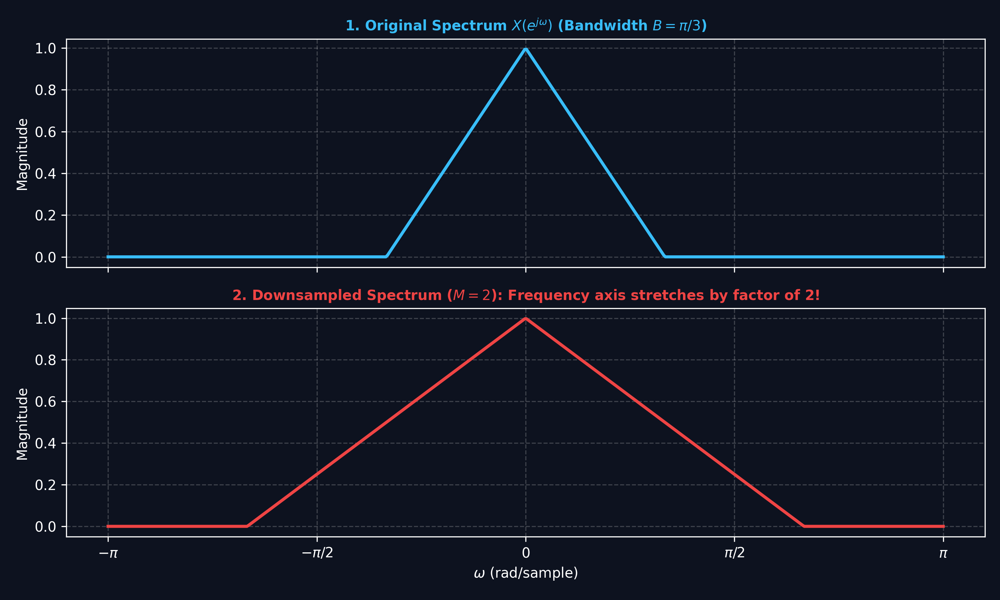
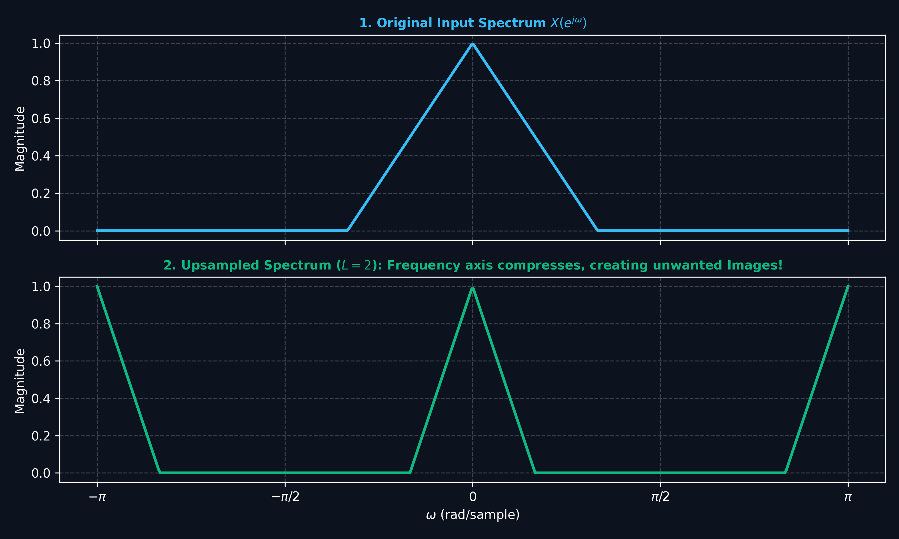
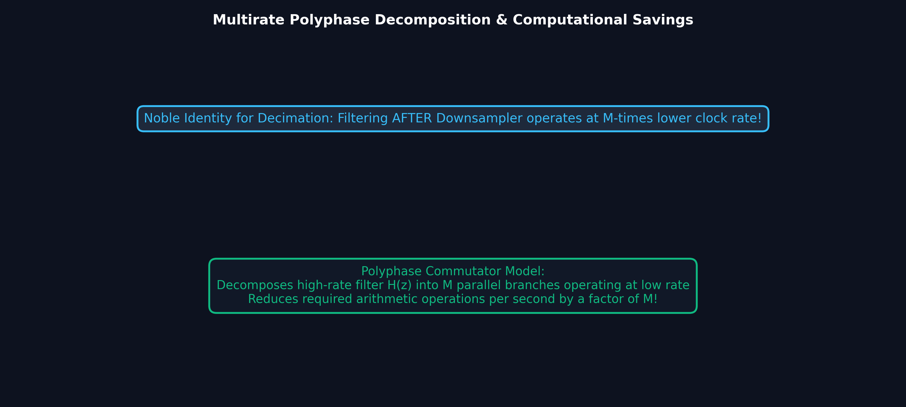

# Lecture 14: Multirate DSP — Downsampling, Upsampling & Polyphase

**Course:** EE3621 — Digital Signal Processing  
**Target Audience:** III B.Tech EEE Students  
**Duration:** 40 Minutes  

* **Available Formats:** [LaTeX Source File](lecture_14.tex) | [Compiled PDF Notes](lecture_14.pdf)

---

## 1. Lecture Plan (40 Minutes Breakdown)

* **00:00 – 05:00 (5 mins):** Why Multirate? Real-world applications (audio, video) and the need for efficiency.
* **05:00 – 12:00 (7 mins):** Downsampling by $M$: time-domain definition, rigorous spectrum derivation step-by-step, understanding aliasing, and the role of the anti-aliasing filter.
* **12:00 – 18:00 (6 mins):** Upsampling by $L$: zero-insertion in the time domain, full spectrum derivation, imaging artifacts, and the anti-imaging (interpolation) filter design.
* **18:00 – 22:00 (4 mins):** Rational rate change ($L/M$), cascade structures, and combining filters.
* **22:00 – 28:00 (6 mins):** Noble Identities: statement and full algebraic proofs for both decimation and interpolation.
* **28:00 – 35:00 (7 mins):** Polyphase Decomposition: components $E_k(z)$, detailed mathematical formulation, commutator models, and achieving maximum efficiency in multirate operations.
* **35:00 – 40:00 (5 mins):** Checkpoints & Full Worked Numerical Examples.

---

## 2. Why Multirate DSP?

In many modern communication and multimedia systems, signal processing must occur at multiple sampling rates simultaneously. This is done to optimize computational efficiency, interface with different hardware standards, and minimize memory usage.

### Key Real-World Applications

* **Audio Processing and Format Conversion:** 
  A high-fidelity audio system (like a CD) samples at $44.1\text{ kHz}$. Digital Audio Tape (DAT) uses $48\text{ kHz}$. Converting between these formats requires multirate processing. Furthermore, for a voice-only transmission channel (like legacy telephone networks), the signal is often downsampled to $8\text{ kHz}$ to save bandwidth, as human speech is mostly intelligible below $4\text{ kHz}$.
* **Video Frame Rate Conversion:** 
  Converting video from the European PAL standard (25 frames per second) to the US NTSC standard (30 frames per second) requires changing the effective sampling rate by a rational factor.
* **Efficient Filterbanks and Subband Coding:** 
  Techniques like subband coding (used heavily in MP3 and AAC compression) split wideband signals into multiple narrow frequency bands. Because each individual band has a smaller bandwidth than the original signal, Nyquist's theorem allows each band to be processed at a much lower sampling rate.
* **Oversampling ADCs/DACs:** 
  Delta-sigma ($\Delta\Sigma$) analog-to-digital converters initially sample the analog signal at very high rates (oversampling) to spread out quantization noise over a wide frequency band. This is followed by heavy digital lowpass filtering and decimation (downsampling) down to the target Nyquist rate.

### Physical and Engineering Intuition
Whenever we reduce the sampling rate, we are fundamentally reducing the amount of data we hold. If the original data contained high-frequency information that cannot be represented at the new, lower rate (due to the Nyquist limit), that high-frequency energy will fold back and ruin the low-frequency information. This phenomenon is known as aliasing. 
Conversely, when we increase the sampling rate by inserting zeros, we are adding "blank" space without adding new information. This creates high-frequency artifacts (images) that must be smoothed out. Multirate DSP provides the rigorous mathematical framework to perform these rate changes safely without destroying the underlying signal integrity.

---

## 3. Downsampling by $M$ (Decimation)

### Visual Illustration: Downsampling (Decimation) Spectrum & Aliasing

* **Spectral Stretching:** Downsampling by factor $M$ expands the frequency axis by $M$. To prevent irreversible spectral overlap (aliasing), the input must be lowpass filtered to $\omega_c = \pi/M$ prior to decimation.

---

### Visual Illustration: Upsampling (Interpolation) Spectrum & Imaging

* **Spectral Compression:** Inserting $L-1$ zeros compresses the frequency axis, creating $L-1$ unwanted duplicate spectral images that must be removed by an anti-imaging lowpass filter.

---

### Visual Illustration: Polyphase Decomposition & Noble Identities

* **Noble Identity Efficiency:** Moving filtering operations to after downsamplers (or before upsamplers) allows digital filtering to run at the lowest sampling rate, cutting computational power by factor $M$.

### Time-Domain Operation
Downsampling (or sub-sampling) by an integer factor $M$ means we keep every $M$-th sample of the sequence and discard all the rest.
The mathematical input-output relation in the discrete time domain is:
$$y[n] = x[Mn]$$
For example, if $M=2$, the sequence $y[n]$ consists of $x[0], x[2], x[4], x[6], \dots$.

### Rigorous Frequency-Domain Derivation
We want to find $Y(e^{j\omega})$, the Discrete-Time Fourier Transform (DTFT) of the downsampled signal $y[n]$, strictly in terms of the original spectrum $X(e^{j\omega})$.

**Step 1:** Define an intermediate sequence $v[n]$ that sets the discarded samples to zero, rather than removing them entirely.
$$v[n] = x[n] \cdot p[n]$$
where $p[n]$ is a discrete-time impulse train:
$$p[n] = \begin{cases} 1, & n = kM \text{ for integer } k \\ 0, & \text{otherwise} \end{cases}$$

**Step 2:** Express the periodic sequence $p[n]$ using its Discrete Fourier Series (DFS) representation:
$$p[n] = \frac{1}{M} \sum_{k=0}^{M-1} e^{j \frac{2\pi k}{M} n}$$

**Step 3:** Substitute the DFS of $p[n]$ back into the equation for $v[n]$:
$$v[n] = x[n] \left( \frac{1}{M} \sum_{k=0}^{M-1} e^{j \frac{2\pi k}{M} n} \right)$$
$$v[n] = \frac{1}{M} \sum_{k=0}^{M-1} x[n] e^{j \frac{2\pi k}{M} n}$$

**Step 4:** Take the DTFT of $v[n]$. Recall the frequency shifting property: multiplying by $e^{j \theta n}$ shifts the spectrum by $\theta$.
$$V(e^{j\omega}) = \sum_{n=-\infty}^{\infty} v[n] e^{-j\omega n}$$
$$V(e^{j\omega}) = \sum_{n=-\infty}^{\infty} \left( \frac{1}{M} \sum_{k=0}^{M-1} x[n] e^{j \frac{2\pi k}{M} n} \right) e^{-j\omega n}$$
$$V(e^{j\omega}) = \frac{1}{M} \sum_{k=0}^{M-1} \left( \sum_{n=-\infty}^{\infty} x[n] e^{-j(\omega - \frac{2\pi k}{M}) n} \right)$$
$$V(e^{j\omega}) = \frac{1}{M} \sum_{k=0}^{M-1} X(e^{j(\omega - \frac{2\pi k}{M})})$$

**Step 5:** Now, relate the final output $y[n]$ to the intermediate sequence $v[n]$. Notice that $v[n]$ has zeros everywhere except at integer multiples of $M$. At those multiples, $v[Mn] = x[Mn] = y[n]$.
Therefore, computing the DTFT of $y[n]$:
$$Y(e^{j\omega}) = \sum_{n=-\infty}^{\infty} y[n] e^{-j\omega n}$$
$$Y(e^{j\omega}) = \sum_{n=-\infty}^{\infty} v[Mn] e^{-j\omega n}$$
Let us make a change of variables, setting $m = Mn$. Since $v[m]=0$ whenever $m$ is not a multiple of $M$, we can sum over all $m$:
$$Y(e^{j\omega}) = \sum_{m=-\infty}^{\infty} v[m] e^{-j\omega (m/M)}$$
$$Y(e^{j\omega}) = V(e^{j\omega / M})$$

**Step 6 (KEY RESULT):** Substitute the expression for $V(e^{j\omega})$ evaluated at $\omega / M$:
$$Y(e^{j\omega}) = \frac{1}{M} \sum_{k=0}^{M-1} X(e^{j(\frac{\omega}{M} - \frac{2\pi k}{M})})$$
$$Y(e^{j\omega}) = \frac{1}{M} \sum_{k=0}^{M-1} X(e^{j\frac{\omega - 2\pi k}{M}})$$

### Aliasing and Anti-Aliasing Filter Design
The final sum contains $M$ shifted copies of the original spectrum $X(e^{j\omega})$. Because we scale the frequency axis by $1/M$, the spectrum stretches outwards.
* If the original spectrum $X(e^{j\omega})$ has energy at frequencies higher than $\pi/M$, the stretched, shifted copies will overlap with the baseband copy ($k=0$). This catastrophic overlapping is **aliasing**.
* **Anti-Aliasing Filter:** To completely prevent this overlapping, we must ensure the signal is strictly band-limited to $|\omega| < \pi/M$ *before* the downsampling step. 
* We achieve this by applying a digital lowpass filter $H(e^{j\omega})$ with a cutoff frequency of $\omega_c = \pi/M$. The overall cascade of filtering followed immediately by downsampling is formally called **decimation**.

---

## 4. Upsampling by $L$ (Interpolation)

### Time-Domain Operation
Upsampling by an integer factor $L$ involves expanding the time base by inserting $L-1$ zeros between every pair of consecutive samples in the input sequence.
$$y[n] = \begin{cases} x[n/L], & n = kL \text{ for integer } k \\ 0, & \text{otherwise} \end{cases}$$
For example, if $L=3$, the sequence $y[n]$ consists of $x[0], 0, 0, x[1], 0, 0, x[2], \dots$.

### Rigorous Frequency-Domain Derivation
Taking the DTFT of the upsampled sequence $y[n]$ directly:
$$Y(e^{j\omega}) = \sum_{n=-\infty}^{\infty} y[n] e^{-j\omega n}$$
Since $y[n]$ is strictly non-zero only for indices $n$ that are multiples of $L$ (i.e., $n = kL$):
$$Y(e^{j\omega}) = \sum_{k=-\infty}^{\infty} y[kL] e^{-j\omega (kL)}$$
Substitute the relation $y[kL] = x[k]$:
$$Y(e^{j\omega}) = \sum_{k=-\infty}^{\infty} x[k] e^{-j(\omega L)k}$$
Recognizing the standard form of the DTFT, we see that the frequency variable has simply been scaled by $L$.

**KEY RESULT:**
$$Y(e^{j\omega}) = X(e^{j\omega L})$$

### Imaging and Anti-Imaging Filter Design
Because of the $\omega L$ term inside the argument of $X(\cdot)$, the original spectrum $X(e^{j\omega})$ is compressed along the frequency axis by a factor of $L$.
* A signal that originally occupied the full fundamental interval from $-\pi$ to $\pi$ will now occupy a narrow band from $-\pi/L$ to $\pi/L$.
* Because all DTFT spectra are inherently $2\pi$-periodic, the compressed baseband spectrum repeats itself $L$ times within the $[-\pi, \pi]$ interval. These unwanted extra copies are called **spectral images**.
* **Anti-Imaging Filter:** To remove these zero-inserted artifacts and smoothly "interpolate" between the non-zero samples, we must apply a lowpass filter with a cutoff frequency $\omega_c = \pi/L$.
* Furthermore, since inserting $L-1$ zeros reduces the average energy per sample by a factor of $L$, this interpolation filter must have a DC gain of exactly $L$ to restore the original signal amplitude.

---

## 5. Rational Rate Change ($L/M$)

Often, the required sampling rate conversion is not an integer. To change the sampling rate by a non-integer, rational factor like $L/M$, we cascade the upsampling and downsampling operations.

**The correct sequence of operations is:**
1. **Upsample by $L$** (insert $L-1$ zeros).
2. **Apply Interpolation Filter** (lowpass, cutoff $\pi/L$, gain $L$).
3. **Apply Anti-Aliasing Filter** (lowpass, cutoff $\pi/M$, gain $1$).
4. **Downsample by $M$** (keep every $M$-th sample).

Because the two filters are linear and time-invariant, they appear consecutively in the cascade. We combine them into a single, highly efficient lowpass filter.
* The combined filter must satisfy both constraints simultaneously, so its cutoff frequency is $\omega_c = \min(\pi/L, \pi/M)$.
* The combined filter must preserve the gain required by the interpolation step, so its gain remains $L$.

**Crucial engineering note:** You must *always* upsample first, filter, and then downsample. If you were to downsample first, you would cause aliasing that permanently destroys high-frequency information before it can ever reach the upsampler!

---

## 6. Noble Identities

The **Noble Identities** are fundamental theorems that allow us to commute (swap the order of) filters and multirate blocks. This is mathematically rigorous and enormously useful for optimizing computational efficiency.

### First Noble Identity: Decimation Identity
**Statement:** Filtering with a transfer function $H(z)$ followed by downsampling $\downarrow M$ is exactly equivalent to downsampling $\downarrow M$ first, followed by filtering with $H(z^M)$.

**Proof:**
Consider the right side block diagram: an input $x[n]$ is first downsampled by $M$ to produce $w[n]$, which is then passed through a filter $H(z)$ to produce output $y[n]$.
Let $W(z)$ be the z-transform of $w[n]$. From our derivation earlier:
$$W(z) = \frac{1}{M} \sum_{k=0}^{M-1} X(z^{1/M} W_M^k)$$
where $W_M = e^{-j2\pi/M}$ is the root of unity.
Filtering $w[n]$ with $H(z)$ yields the output $Y(z)$:
$$Y(z) = W(z)H(z)$$
$$Y(z) = H(z) \left[ \frac{1}{M} \sum_{k=0}^{M-1} X(z^{1/M} W_M^k) \right]$$

Now consider the left side block diagram: the input $x[n]$ is passed through a filter with transfer function $H(z^M)$ to produce $v[n]$, which is then downsampled by $M$ to produce output $y'[n]$.
Let $V(z)$ be the z-transform of the filter output.
$$V(z) = X(z)H(z^M)$$
After downsampling $v[n]$ by $M$, we get $Y'(z)$:
$$Y'(z) = \frac{1}{M} \sum_{k=0}^{M-1} V(z^{1/M} W_M^k)$$
Substitute the expression for $V(z)$:
$$Y'(z) = \frac{1}{M} \sum_{k=0}^{M-1} \left[ X(z^{1/M} W_M^k) \cdot H((z^{1/M} W_M^k)^M) \right]$$
Let us carefully evaluate the term inside the filter argument:
$$(z^{1/M} W_M^k)^M = (z^{1/M})^M \cdot (W_M^k)^M$$
$$(z^{1/M} W_M^k)^M = z \cdot (e^{-j2\pi k / M})^M$$
$$(z^{1/M} W_M^k)^M = z \cdot e^{-j2\pi k}$$
Since $k$ is an integer, $e^{-j2\pi k} = 1$. Therefore, the argument simplifies perfectly to $z$.
$$Y'(z) = \frac{1}{M} \sum_{k=0}^{M-1} \left[ X(z^{1/M} W_M^k) \cdot H(z) \right]$$
Since $H(z)$ does not depend on the summation index $k$, we can pull it out:
$$Y'(z) = H(z) \left[ \frac{1}{M} \sum_{k=0}^{M-1} X(z^{1/M} W_M^k) \right]$$
Comparing this with our right-side derivation, we see that $Y(z) = Y'(z)$. The identity is rigorously proved.

### Second Noble Identity: Interpolation Identity
**Statement:** Upsampling $\uparrow L$ followed by filtering with $H(z^L)$ is exactly equivalent to filtering with $H(z)$ followed by upsampling $\uparrow L$.

**Proof:**
Left side diagram: an input $x[n]$ passes through a filter $H(z)$ to produce $v[n]$, which is then upsampled by $L$ to produce output $y[n]$.
After the filter $H(z)$, we have:
$$V(z) = H(z)X(z)$$
After upsampling, the z-transform is scaled by $L$:
$$Y(z) = V(z^L)$$
$$Y(z) = H(z^L)X(z^L)$$

Right side diagram: an input $x[n]$ is first upsampled by $L$ to produce $w[n]$, which then passes through a filter $H(z^L)$ to produce output $y'[n]$.
After upsampling, the z-transform is:
$$W(z) = X(z^L)$$
After filtering with $H(z^L)$, we have:
$$Y'(z) = H(z^L)W(z)$$
$$Y'(z) = H(z^L)X(z^L)$$
Since $Y(z) = Y'(z)$, the interpolation identity is proved.

---

## 7. Polyphase Decomposition

Polyphase structures are the key to realizing multirate filters efficiently in practical hardware (FPGAs, DSP chips).

### Detailed Mathematical Formulation
Any generic discrete-time transfer function $H(z) = \sum h[n]z^{-n}$ can be deterministically split into $M$ parallel sub-filters, known as polyphase components.
We achieve this by grouping the impulse response coefficients $h[n]$ into $M$ interleaved sub-sequences.
The overall transfer function is written as:
$$H(z) = \sum_{k=0}^{M-1} z^{-k} E_k(z^M)$$
where the $k$-th polyphase component is defined as:
$$E_k(z) = \sum_{n=-\infty}^{\infty} h[Mn+k]z^{-n}$$

### Why is this massively useful for Decimation ($M:1$)?
In a direct, naive implementation of a decimation filter, we compute the convolution to calculate *every single output sample*, and then the downsampler simply throws away $M-1$ out of every $M$ samples. This wastes huge amounts of arithmetic logic and power!

Using polyphase decomposition, we completely restructure the filter:
1. We write the filter as $H(z) = E_0(z^M) + z^{-1}E_1(z^M) + \dots + z^{-(M-1)}E_{M-1}(z^M)$.
2. The downsampler $\downarrow M$ is situated after this massive sum.
3. Because downsampling is a linear operation, we can distribute the $\downarrow M$ block backwards through the sum, placing one downsampler after each branch $z^{-k} E_k(z^M)$.
4. By applying the **First Noble Identity**, we can move the downsampler $\downarrow M$ to sit *before* the filters $E_k(z)$.
5. This profoundly means we downsample the input data stream *first*, and then run the sub-filters $E_k(z)$ at the much *lower* sampling rate!

This optimization reduces the arithmetic workload (the number of multiplications and additions per second) exactly by a factor of $M$.

### The Commutator Model
Instead of explicitly writing delay chains ($z^{-k}$) and individual downsamplers, engineers model the input routing as a counter-clockwise rotating switch (a commutator). This switch distributes the incoming high-rate input samples sequentially to the $M$ parallel polyphase filters, which operate continuously at the lower rate.

*(Note: While the diagram references overlap-save processing, the architectural concept of segmenting and discarding data streams visually perfectly maps to how commutators slice data in polyphase filter implementations!)*

---

## 8. Summary of Key Formulas

| Operation | Time Domain | Frequency/Z Domain |
| :--- | :--- | :--- |
| **Downsample by $M$** | $y[n] = x[Mn]$ | $Y(z) = \frac{1}{M}\sum_{k=0}^{M-1} X(z^{1/M} e^{-j2\pi k/M})$ |
| **Upsample by $L$** | $y[n] = x[n/L]$ for $n=kL$, else $0$ | $Y(z) = X(z^L)$ |
| **Noble ID (Decimation)** | $H(z^M)$ followed by $\downarrow M$ | equals $\downarrow M$ followed by $H(z)$ |
| **Noble ID (Interpolation)**| $\uparrow L$ followed by $H(z^L)$ | equals $H(z)$ followed by $\uparrow L$ |
| **Polyphase Expansion** | $E_k(z) = \sum h[Mn+k]z^{-n}$ | $H(z) = \sum_{k=0}^{M-1} z^{-k} E_k(z^M)$ |

---

## 9. Checkpoint Questions & Detailed Worked Examples

1. **Q1: Downsampling Spectra and Bandwidth Tracking**
   Suppose a discrete-time signal $x[n]$ has a spectrum $X(e^{j\omega})$ that is non-zero only for $|\omega| \le \pi/4$. We wish to downsample this signal by a factor of $M=3$. 
   *(a)* Will there be aliasing? Provide mathematical justification.
   *(b)* What is the absolute bandwidth of the new downsampled signal $y[n]$?
   * **Complete Answer:**
     * *(a)* The fundamental condition to avoid aliasing during decimation is that the original signal must be strictly bandlimited to $\pi/M$.
     * In this scenario, $M=3$. We calculate the maximum allowable unaliased frequency as $\omega_{max} = \pi/3 \approx 1.047 \text{ rad/s}$.
     * We are given that the signal is bandlimited to $\omega_0 = \pi/4 \approx 0.785 \text{ rad/s}$.
     * Because $\pi/4 < \pi/3$, the shifted spectral copies will not overlap with the baseband. Therefore, **there is absolutely no aliasing**.
     * *(b)* The operation of downsampling stretches the spectrum by a factor of $M=3$ along the frequency axis. 
     * The new bandwidth boundary is computed as $3 \times (\pi/4) = 3\pi/4$.
     * Thus, the new signal occupies frequencies up to $3\pi/4$.

2. **Q2: Extracting Polyphase Components**
   Given an FIR filter with the impulse response sequence $h[n] = \{1, 2, 3, 4, 5, 6, 7\}$ (with the origin at $h[0]=1$). 
   Extract and write the exact z-domain expressions for the polyphase components $E_0(z)$ and $E_1(z)$ when $M=2$.
   * **Complete Answer:**
     * To find the polyphase components for $M=2$, we must split $h[n]$ into two interleaved sequences, corresponding to even and odd indices.
     * $M=2$, so the index $k$ takes the values $0$ and $1$.
     * **Finding $E_0(z)$:** This component takes the even-indexed samples ($n = 0, 2, 4, 6$).
       The sample values are $\{h[0], h[2], h[4], h[6]\} = \{1, 3, 5, 7\}$.
       Constructing the z-transform for this sub-sequence:
       $$E_0(z) = 1 + 3z^{-1} + 5z^{-2} + 7z^{-3}$$
     * **Finding $E_1(z)$:** This component takes the odd-indexed samples ($n = 1, 3, 5$).
       The sample values are $\{h[1], h[3], h[5]\} = \{2, 4, 6\}$.
       Constructing the z-transform for this sub-sequence:
       $$E_1(z) = 2 + 4z^{-1} + 6z^{-2}$$
     * **Verification:** By the polyphase definition, $H(z) = E_0(z^2) + z^{-1}E_1(z^2)$.
       $E_0(z^2) = 1 + 3z^{-2} + 5z^{-4} + 7z^{-6}$
       $z^{-1}E_1(z^2) = 2z^{-1} + 4z^{-3} + 6z^{-5}$
       Adding them yields $1 + 2z^{-1} + 3z^{-2} + 4z^{-3} + 5z^{-4} + 6z^{-5} + 7z^{-6}$, which perfectly matches the original $h[n]$.

3. **Q3: Rational Rate Conversion Architecture Design**
   A digital audio file originally recorded at a CD-quality sampling rate of $44.1\text{ kHz}$ needs to be seamlessly converted to the DAT-quality rate of $48\text{ kHz}$ for a studio master. 
   *(a)* What are the minimal integer factors for $L$ and $M$? 
   *(b)* What is the exact digital cutoff frequency (in radians per sample) required for the intermediate lowpass filter to prevent both aliasing and imaging?
   * **Complete Answer:**
     * *(a)* The desired multirate ratio is computed as $48000 / 44100$.
     * We simplify this fraction by dividing both the numerator and denominator by their greatest common divisor (which is $300$).
     * $48000 / 300 = 160$
     * $44100 / 300 = 147$
     * The simplified rational ratio is $160 / 147$.
     * Therefore, the system must first upsample by $L = 160$ and then downsample by $M = 147$.
     * *(b)* The intermediate filter must satisfy two distinct roles. To prevent imaging from the upsampling stage, it needs a cutoff of $\pi/L$. To prevent aliasing in the subsequent downsampling stage, it needs a cutoff of $\pi/M$.
     * The combined filter must use the most restrictive (lowest) of these two cutoffs.
     * We calculate $\omega_c = \min(\pi/160, \pi/147)$.
     * Because $160 > 147$, the fraction $\pi/160$ is smaller than $\pi/147$.
     * The required digital cutoff frequency is exactly $\omega_c = \pi/160 \text{ radians/sample}$.

4. **Q4: The Noble Identity in Practice**
   An engineer has designed a system that upsamples a signal by $L=4$, and then applies a filter with the transfer function $H(z) = 1 - z^{-8} + 0.5z^{-12}$. 
   Use the Noble Identities to draw a computationally cheaper, mathematically equivalent system. What is the new filter transfer function?
   * **Complete Answer:**
     * The current architecture is: $x[n] \to \uparrow 4 \to H_{old}(z) \to y[n]$.
     * We observe that $H_{old}(z) = 1 - (z^4)^{-2} + 0.5(z^4)^{-3}$.
     * This implies the filter can be written entirely as a function of $z^4$. Let $H_{new}(z) = 1 - z^{-2} + 0.5z^{-3}$.
     * Thus, $H_{old}(z) = H_{new}(z^4)$.
     * By the **Second Noble Identity**, upsampling by $4$ followed by filtering with $H_{new}(z^4)$ is precisely equivalent to filtering with $H_{new}(z)$ *first*, and then upsampling by $4$.
     * The equivalent, cheaper system is: $x[n] \to H_{new}(z) \to \uparrow 4 \to y[n]$.
     * The new filter transfer function is $H_{new}(z) = 1 - z^{-2} + 0.5z^{-3}$. 
     * This is computationally cheaper because the filter now has fewer taps and operates entirely at the lower sampling rate before the zeros are inserted.
