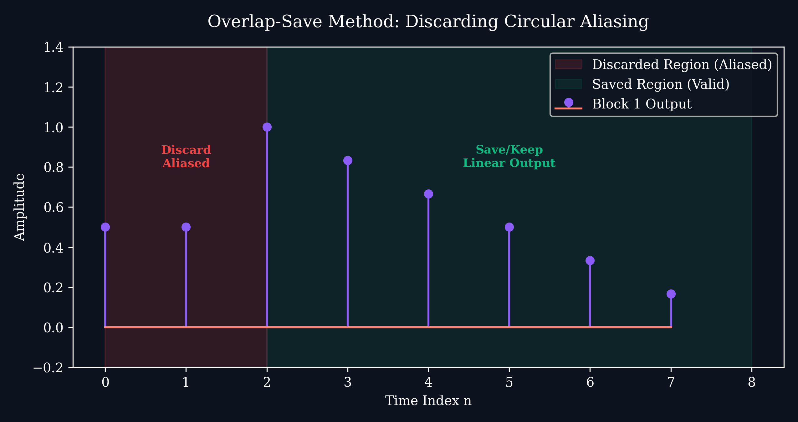

# Lecture 14: Fast Convolution — The Overlap-Save Method
## EE3621: Digital Signal Processing | III B.Tech EEE

---
## 1. LEARNING OBJECTIVES
By the end of this lecture, students will be able to:
1. **Understand** the intuitive mechanism of Time-Aliasing during FFT circular convolution.
2. **Visualize** the Overlap-Save block processing pipeline without heavy mathematics.
3. **Compare** the structural differences between Overlap-Add (Lecture 13) and Overlap-Save.
4. **Execute** a simple numerical block filtering using the Overlap-Save method.

---
## 2. THE INTUITION: WHY OVERLAP-SAVE?

In Lecture 13, we explored the **Overlap-Add (OLA)** method. In OLA, we chopped our infinite audio stream into independent blocks, padded them with zeros, and used the FFT. Because of the zeros, the linear convolution created a "tail" that spilled over the block length. We had to physically **add** those overlapping tails together to reconstruct the signal.

**The Overlap-Save (OLS) Alternative:**
What if we want to avoid that final addition step? (Addition takes extra CPU cycles and memory management). 
* What happens if we just feed full blocks of data into the FFT without padding them with zeros?
* **The Problem:** The FFT inherently computes **Circular Convolution**. If the signal isn't padded, the "tail" of the convolution doesn't have empty space to stretch into. Instead, it wraps around the circle and crashes into the beginning of your block. This corruption is called **Time Aliasing**.
* **The Brilliant Solution (The "Trash" Method):** If a filter has $M$ taps, we know exactly how much of the signal gets corrupted: exactly the first $M-1$ samples. 
Instead of trying to prevent the corruption, Overlap-Save deliberately lets it happen! We intentionally overlap our input blocks so that the FFT corrupts old data we already processed. Then, we simply throw the corrupted $M-1$ samples in the **trash** and **save** the good ones.

---
## 3. STEP-BY-STEP VISUAL WALKTHROUGH

Instead of heavy matrix math, let's look at the purely visual, diagrammatic flow of Overlap-Save.

### Step 1: Overlapping the Input Blocks
We take blocks of length $N$. Unlike Overlap-Add (where blocks sit side-by-side), Overlap-Save blocks physically overlap by $M-1$ samples. 
The first $M-1$ samples of **Block 2** are simply a copy of the last $M-1$ samples of **Block 1**.

### Step 2: Circular Convolution (The FFT Magic)
We take the FFT of the block, multiply it by the FFT of the filter, and take the Inverse FFT. 
Because it's circular, the end of the signal wraps around and mathematically mangles the beginning of the block.

### Step 3: The Trash Can (Discarding the Garbage)
We look at the resulting block of length $N$. We take a pair of scissors and cut off the first $M-1$ samples. They are time-aliased garbage. We throw them away.

### Step 4: Direct Concatenation (Saving)
We take the remaining $L$ good samples (where $L = N - M + 1$) and place them directly into our output stream. **No addition is required!** We just snap the saved blocks together like Lego bricks.

### Pictorial Representation

*(Notice how the overlapped input data leads to discarded garbage at the front of every output block, leaving perfectly seamless output data).*

---
## 4. INTUITIVE NUMERICAL EXAMPLE

Let's see this in action without the confusing modulo matrices.

**The Setup:**
* Input signal $x[n] = \{1, 2, 3, 4, 5, 6, 7, 8\}$
* Filter $h[n] = \{1, 1\}$ (Length $M=2$. This means $M-1 = \mathbf{1}$ sample of overlap/garbage).
* Let's use an FFT block size of $N=4$.

**Step 1: Chop and Overlap the Input**
Since $M-1 = 1$, every block must overlap the previous block by 1 sample. The very first block prepends a zero.
* **Block 1:** $\{0, 1, 2, 3\}$
* **Block 2:** $\{3, 4, 5, 6\}$ *(Notice the '3' is copied from the end of Block 1)*
* **Block 3:** $\{6, 7, 8, 0\}$ *(Notice the '6' is copied from Block 2, padded with 0 at the end)*

**Step 2 & 3: Circular Convolution & The Trash Can**
If we circularly convolve each block with $\{1, 1, 0, 0\}$:
* **Output 1 Raw:** $\{\mathbf{3}, 1, 3, 5\}$ $\rightarrow$ The first sample ('3') wrapped around and is corrupted!
  * **Action:** Throw the first sample in the trash. **Save:** $\{1, 3, 5\}$
* **Output 2 Raw:** $\{\mathbf{9}, 7, 9, 11\}$ $\rightarrow$ The first sample ('9') is corrupted!
  * **Action:** Throw the first sample in the trash. **Save:** $\{7, 9, 11\}$
* **Output 3 Raw:** $\{\mathbf{6}, 13, 15, 8\}$ $\rightarrow$ The first sample ('6') is corrupted!
  * **Action:** Throw the first sample in the trash. **Save:** $\{13, 15, 8\}$

**Step 4: Concatenate**
Snap the saved blocks together perfectly:
$$ y[n] = \{1, 3, 5, 7, 9, 11, 13, 15, 8\} $$
*(You can verify this matches standard linear convolution perfectly!)*

---
## 5. SUMMARY: OVERLAP-ADD VS. OVERLAP-SAVE

| Feature | Overlap-Add (OLA) | Overlap-Save (OLS) |
| :--- | :--- | :--- |
| **Input Blocks** | Non-overlapping | Overlapping by $M-1$ samples |
| **Zero Padding** | Yes (Padded with $M-1$ zeros) | No |
| **FFT Effect** | Tails expand into the zero-padding | Wrap-around corrupts the head |
| **Output Assembly** | Must **ADD** overlapping tails | **DISCARD** heads, directly concatenate |
| **Hardware Benefit** | Simple input slicing | Extremely fast output (No adders needed) |
