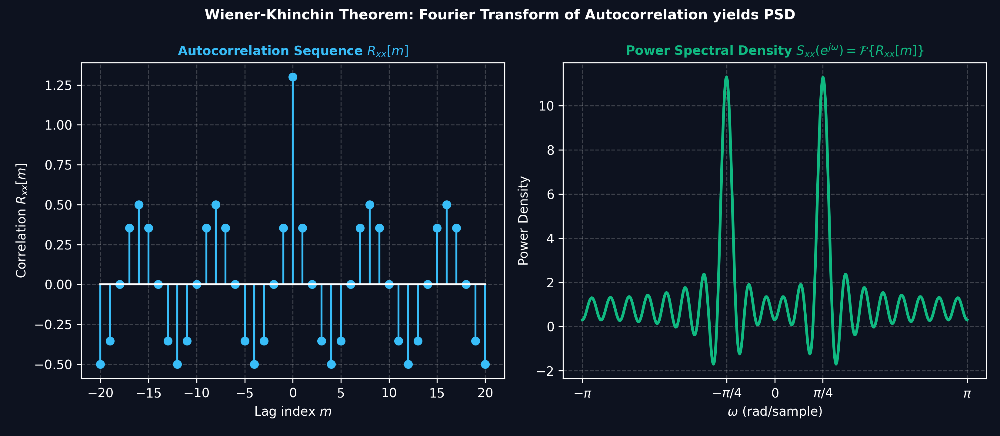
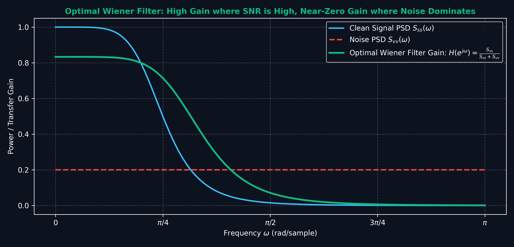

# Lecture 15: Power Spectral Density & Wiener Filter

**Course:** EE3621 — Digital Signal Processing  
**Target Audience:** III B.Tech EEE Students  
**Duration:** 40 Minutes  

* **Available Formats:** [LaTeX Source File](file:///C:/Users/sriph/Downloads/DSP/lecture_15.tex) | [Compiled PDF Notes](file:///C:/Users/sriph/Downloads/DSP/lecture_15.pdf)

---

## 1. Lecture Plan (40 Minutes Breakdown)

* **00:00 – 05:00 (5 mins):** Random Signals Review: WSS definition, autocorrelation properties.
* **05:00 – 12:00 (7 mins):** Power Spectral Density (PSD): Wiener-Khinchin theorem and detailed proofs.
* **12:00 – 15:00 (3 mins):** Cross-correlation and Cross-PSD definitions.
* **15:00 – 22:00 (7 mins):** LTI systems with random inputs: Output autocorrelation and PSD proofs, white noise concepts.
* **22:00 – 30:00 (8 mins):** Wiener Filter formulation: Orthogonality principle, derivation of Wiener-Hopf equations.
* **30:00 – 35:00 (5 mins):** Causal solution, Minimum Mean Square Error (MMSE) and Application examples.
* **35:00 – 40:00 (5 mins):** Checkpoints and detailed worked examples.

---

## 2. Random Signals Review

In many real-world Digital Signal Processing (DSP) applications, signals are not deterministic. Instead, they are modeled as random processes. Examples of random processes include thermal noise in electronic circuits, quantization noise in analog-to-digital converters, and complex information signals like speech or video where future values cannot be exactly predicted.

To mathematically analyze these signals, we rely on probability and statistics.

### 2.1 Wide-Sense Stationary (WSS) Processes

A random process $x[n]$ is called Wide-Sense Stationary (WSS) if its first two moments do not change over time. Specifically, it must satisfy two conditions:
1. The mean is constant: 
   $$E\{x[n]\} = \mu_x \quad \text{for all } n$$
2. The autocorrelation depends only on the time difference (lag) $m$, not on the absolute time $n$:
   $$E\{x[n]x^*[n-m]\} = R_{xx}[m]$$

In practice, strict-sense stationarity is difficult to prove or achieve, so WSS is the standard assumption in most linear signal processing tasks.

### 2.2 Autocorrelation Sequence

For a WSS process, the autocorrelation sequence is defined as:
$$R_{xx}[m] = E\{x[n]x^*[n-m]\}$$
where $E\{\cdot\}$ denotes the expected value (ensemble average) across all possible realizations of the random process, and $*$ denotes complex conjugation. 

**Physical Intuition:** The autocorrelation measures how much a signal resembles a delayed version of itself. 
* A high positive value at lag $m$ means the signal is highly self-similar when shifted by $m$ samples. 
* A value near zero means the signal is uncorrelated with its shifted version (it has "forgotten" its past).
* The rate at which the autocorrelation decays to zero is a measure of the signal's "memory."

**Key Properties of Autocorrelation:**
1. **Average Power:** The value at zero lag represents the average power of the signal.
   $$R_{xx}[0] = E\{x[n]x^*[n]\} = E\{|x[n]|^2\} = P_{avg}$$
   This is the total power in the signal. Because power cannot be negative, $R_{xx}[0] \geq 0$.
   
2. **Conjugate Symmetry:** 
   $$R_{xx}[-m] = E\{x[n]x^*[n-(-m)]\} = E\{x[n]x^*[n+m]\}$$
   Let $k = n+m$, then $n = k-m$. Substituting this gives:
   $$R_{xx}[-m] = E\{x[k-m]x^*[k]\} = \left( E\{x[k]x^*[k-m]\} \right)^* = R_{xx}^*[m]$$
   For real-valued signals, the complex conjugation has no effect, so $R_{xx}[-m] = R_{xx}[m]$. This means the autocorrelation function of a real WSS process is an even function.
   
3. **Maximum Value:** The power bounds the correlation magnitude:
   $$|R_{xx}[m]| \leq R_{xx}[0]$$
   *(Proof: This follows from the Cauchy-Schwarz inequality for expectations: $E\{|XY|\}^2 \leq E\{|X|^2\}E\{|Y|^2\}$. Setting $X = x[n]$ and $Y = x^*[n-m]$ gives $|R_{xx}[m]|^2 \leq R_{xx}[0]R_{xx}[0]$).*

---

## 3. Power Spectral Density (PSD)

### Visual Illustration: Autocorrelation and Power Spectral Density via Wiener-Khinchin

* **Wiener-Khinchin Theorem:** The Power Spectral Density (PSD) $S_{xx}(e^{j\omega})$ is the Discrete-Time Fourier Transform of the statistical autocorrelation sequence $R_{xx}[m]$.

---

### Visual Illustration: Optimal Wiener Filter Frequency-Domain Noise Attenuation

* **MSE Minimization:** The Wiener filter frequency response $H(e^{j\omega}) = rac{S_{xs}(e^{j\omega})}{S_{xx}(e^{j\omega})}$ provides maximum passband gain where signal energy is high, and automatically drops to near zero in spectral regions dominated by noise.

The Power Spectral Density (PSD), $S_{xx}(e^{j\omega})$, describes how the total average power of a random signal is distributed across different frequency components. 

### 3.1 Wiener-Khinchin Theorem

**Theorem:** The PSD of a WSS process is the Discrete-Time Fourier Transform (DTFT) of its autocorrelation sequence.
$$S_{xx}(e^{j\omega}) = \sum_{m=-\infty}^{\infty} R_{xx}[m] e^{-j\omega m}$$

**Detailed Proof (Starting from Definition):**
We cannot directly take the DTFT of $x[n]$ because typical random processes have infinite energy, so their Fourier transforms do not converge in the standard sense. 
Instead, let $x_N[n]$ be a truncated version of $x[n]$ such that $x_N[n] = x[n]$ for $-N \leq n \leq N$ and $0$ otherwise.
The DTFT of $x_N[n]$ is well-defined:
$$X_N(e^{j\omega}) = \sum_{n=-N}^{N} x[n] e^{-j\omega n}$$
The periodogram (power spectrum estimate) for the truncated signal is defined as:
$$P_N(e^{j\omega}) = \frac{1}{2N+1} |X_N(e^{j\omega})|^2$$
Taking the expected value across the ensemble:
$$E\{P_N(e^{j\omega})\} = \frac{1}{2N+1} E\left\{ \left( \sum_{n=-N}^{N} x[n] e^{-j\omega n} \right) \left( \sum_{k=-N}^{N} x^*[k] e^{j\omega k} \right) \right\}$$
Using the linearity of the expectation operator:
$$E\{P_N(e^{j\omega})\} = \frac{1}{2N+1} \sum_{n=-N}^{N} \sum_{k=-N}^{N} E\{x[n]x^*[k]\} e^{-j\omega (n-k)}$$
Since the process is WSS, $E\{x[n]x^*[k]\} = R_{xx}[n-k]$. Let $m = n-k$. 
The double summation represents a summation over a square grid in the $(n,k)$ plane. By grouping terms that have a constant difference $m$, we find that there are exactly $(2N+1 - |m|)$ terms for each lag $m \in [-2N, 2N]$.
$$E\{P_N(e^{j\omega})\} = \sum_{m=-2N}^{2N} \frac{2N+1-|m|}{2N+1} R_{xx}[m] e^{-j\omega m}$$
$$E\{P_N(e^{j\omega})\} = \sum_{m=-2N}^{2N} \left( 1 - \frac{|m|}{2N+1} \right) R_{xx}[m] e^{-j\omega m}$$
Taking the limit as $N \to \infty$, the triangular window function $(1 - \frac{|m|}{2N+1})$ approaches 1 for any fixed $m$:
$$S_{xx}(e^{j\omega}) = \lim_{N \to \infty} E\{P_N(e^{j\omega})\} = \sum_{m=-\infty}^{\infty} R_{xx}[m] e^{-j\omega m}$$
This completes the rigorous proof of the Wiener-Khinchin theorem.

### 3.2 Properties of PSD

1. **Real-Valued:** Because $R_{xx}[m] = R_{xx}^*[-m]$ (conjugate symmetry), its Fourier transform is strictly real. 
   $$S_{xx}^*(e^{j\omega}) = \sum_{m} R_{xx}^*[m] e^{j\omega m} = \sum_{m} R_{xx}[-m] e^{j\omega m} = \sum_{k} R_{xx}[k] e^{-j\omega k} = S_{xx}(e^{j\omega})$$
2. **Non-Negative:** From the periodogram definition, $P_N \geq 0$, so its expectation must also be non-negative: $S_{xx}(e^{j\omega}) \geq 0$ for all $\omega$.
3. **Average Power:** The inverse DTFT evaluated at $m=0$ gives the total average power:
   $$R_{xx}[0] = \frac{1}{2\pi} \int_{-\pi}^{\pi} S_{xx}(e^{j\omega}) e^{j\omega (0)} d\omega = \frac{1}{2\pi} \int_{-\pi}^{\pi} S_{xx}(e^{j\omega}) d\omega$$
   **Engineering Intuition:** The area under the PSD curve (normalized by $1/2\pi$) represents the total power of the signal. If we want to find the power in a specific frequency band $[\omega_1, \omega_2]$, we integrate the PSD over that band.

---

## 4. Cross-Correlation & Cross-PSD

When dealing with two jointly WSS processes $x[n]$ and $y[n]$, we must define how they relate to each other. We use the cross-correlation:
$$R_{xy}[m] = E\{x[n+m]y^*[n]\}$$
*(Note: some textbooks define this as $E\{x[n]y^*[n-m]\}$, which is mathematically equivalent because $E\{x[n+m]y^*[n]\} = E\{x[k]y^*[k-m]\}$ by shifting the time index).*

The Cross-Power Spectral Density (Cross-PSD) is the DTFT of the cross-correlation sequence:
$$S_{xy}(e^{j\omega}) = \text{DTFT}\{R_{xy}[m]\} = \sum_{m=-\infty}^{\infty} R_{xy}[m] e^{-j\omega m}$$

**Important Property:** $R_{xy}[m] = R_{yx}^*[-m]$. 
Proof:
$$R_{xy}[m] = E\{x[n+m]y^*[n]\}$$
$$R_{yx}^*[-m] = (E\{y[n-m]x^*[n]\})^* = E\{y^*[n-m]x[n]\}$$
Let $k = n-m \implies n = k+m$:
$$R_{yx}^*[-m] = E\{y^*[k]x[k+m]\} = R_{xy}[m]$$
This property implies that the cross-PSD satisfies:
$$S_{xy}(e^{j\omega}) = S_{yx}^*(e^{j\omega})$$

---

## 5. LTI System with Random Input

A common scenario in DSP is passing a random signal $x[n]$ through a Linear Time-Invariant (LTI) filter with impulse response $h[n]$. The output $y[n]$ is given by the convolution sum:
$$y[n] = h[n] * x[n] = \sum_{k=-\infty}^{\infty} h[k] x[n-k]$$

### 5.1 Output Autocorrelation

**Theorem:** $R_{yy}[m] = h[m] * h^*[-m] * R_{xx}[m]$

**Detailed Derivation Step-by-Step:**
1. Start with the formal definition of the output autocorrelation:
   $$R_{yy}[m] = E\{y[n] y^*[n-m]\}$$
2. Substitute the convolution sum for both $y[n]$ and $y^*[n-m]$:
   $$R_{yy}[m] = E\left\{ \left( \sum_{k=-\infty}^{\infty} h[k] x[n-k] \right) \left( \sum_{l=-\infty}^{\infty} h^*[l] x^*[n-m-l] \right) \right\}$$
3. Because the system is linear, we can swap the expectation operator with the summations:
   $$R_{yy}[m] = \sum_{k=-\infty}^{\infty} \sum_{l=-\infty}^{\infty} h[k] h^*[l] E\{x[n-k] x^*[n-m-l]\}$$
4. Recognize the expectation as the input autocorrelation $R_{xx}$:
   $$E\{x[n-k] x^*[n-m-l]\} = R_{xx}[(n-k) - (n-m-l)] = R_{xx}[m+l-k]$$
5. Substitute this back into the equation:
   $$R_{yy}[m] = \sum_{k=-\infty}^{\infty} h[k] \left( \sum_{l=-\infty}^{\infty} h^*[l] R_{xx}[m - k + l] \right)$$
6. Define a time-reversed and conjugated impulse response $h_{rev}[l] = h^*[-l]$. 
   Then the inner sum becomes a convolution of $h_{rev}$ with $R_{xx}$:
   $$ \sum_l h^*[l] R_{xx}[(m-k)-(-l)] = h_{rev} * R_{xx} $$
7. The outer sum represents another convolution with $h[k]$. Thus, the total operation is a double convolution:
   $$R_{yy}[m] = h[m] * h_{rev}[m] * R_{xx}[m] = h[m] * h^*[-m] * R_{xx}[m]$$

### 5.2 Output PSD

Taking the DTFT of both sides of the output autocorrelation equation allows us to find the output PSD very simply:
$$S_{yy}(e^{j\omega}) = \text{DTFT}\{ h[m] * h^*[-m] * R_{xx}[m] \}$$
Using the convolution property of DTFT (convolution in time is multiplication in frequency):
$$S_{yy}(e^{j\omega}) = H(e^{j\omega}) \cdot H^*(e^{j\omega}) \cdot S_{xx}(e^{j\omega})$$
$$S_{yy}(e^{j\omega}) = |H(e^{j\omega})|^2 S_{xx}(e^{j\omega})$$

**KEY RESULT:** An LTI system shapes the PSD of the input signal strictly by the squared magnitude of its frequency response. The phase response of the filter $\angle H(e^{j\omega})$ has no effect on the output PSD!

### 5.3 White Noise

A WSS process $v[n]$ is called **white noise** if its samples are completely uncorrelated with one another.
The autocorrelation is an impulse at zero lag:
$$R_{vv}[m] = \sigma_v^2 \delta[m]$$
Taking the DTFT gives its PSD:
$$S_{vv}(e^{j\omega}) = \sigma_v^2$$
The PSD is completely flat across all frequencies, akin to white light which contains all visible colors in equal proportions.

**Filtered White Noise:** If white noise $v[n]$ is passed through an LTI system $h[n]$, the output $y[n]$ has PSD:
$$S_{yy}(e^{j\omega}) = |H(e^{j\omega})|^2 \sigma_v^2$$
This process creates **colored noise**. The shape of the colored noise's PSD takes on the exact shape of the filter's squared magnitude response.

---

## 6. Wiener Filter

The Wiener filter, developed by Norbert Wiener in the 1940s, is a fundamental optimal linear filter. It aims to extract a desired signal from a noisy observation by utilizing the statistical properties (correlations) of the signals.

### 6.1 Problem Formulation

Let $d[n]$ be a desired signal that we cannot observe directly (e.g., a pure speech signal). 
Instead, we observe $x[n]$, which is typically the desired signal corrupted by additive noise $v[n]$:
$$x[n] = d[n] + v[n]$$
*(Note: Sometimes $x[n] = s[n] + v[n]$ and we want to predict $s[n]$, but generally let's call the target $d[n]$).*

We want to design a linear filter with impulse response $w[n]$ to estimate $d[n]$ from $x[n]$. 
The estimate is:
$$\hat{d}[n] = \sum_{k} w[k] x[n-k]$$
The estimation error is the difference between the true desired signal and our estimate:
$$e[n] = d[n] - \hat{d}[n]$$

Our goal is to find the filter coefficients $w[k]$ that minimize the Mean Square Error (MSE):
$$\xi = E\{|e[n]|^2\} = E\{|d[n] - \hat{d}[n]|^2\}$$

### 6.2 Orthogonality Principle & Wiener-Hopf Equations

To minimize the MSE, the optimal error $e[n]$ must be statistically orthogonal to all the input data points $x[n-l]$ that were used to form the estimate. This is known as the **Orthogonality Principle**:
$$E\{e[n] x^*[n-l]\} = 0 \quad \text{for all } l \text{ in the filter's support}$$

**Deriving the Wiener-Hopf Equations:**
1. Start with the orthogonality principle and substitute the expression for $e[n]$:
   $$E\left\{ \left( d[n] - \sum_k w[k] x[n-k] \right) x^*[n-l] \right\} = 0$$
2. Expand the expectation by multiplying $x^*[n-l]$ through:
   $$E\{d[n] x^*[n-l]\} - E\left\{ \sum_k w[k] x[n-k] x^*[n-l] \right\} = 0$$
3. Bring the summation and weights outside the expectation:
   $$E\{d[n] x^*[n-l]\} - \sum_k w[k] E\{ x[n-k] x^*[n-l] \} = 0$$
4. Recognize the definitions of cross-correlation and autocorrelation:
   * $E\{d[n] x^*[n-l]\} = R_{dx}[l]$
   * $E\{x[n-k] x^*[n-l]\} = R_{xx}[(n-k) - (n-l)] = R_{xx}[l-k]$
5. Substitute these into the equation:
   $$R_{dx}[l] - \sum_k w[k] R_{xx}[l-k] = 0$$
6. Rearrange to get the famous **Wiener-Hopf Equations**:
   $$\sum_k w[k] R_{xx}[l-k] = R_{dx}[l]$$

For an FIR Wiener filter of length $M$ (where $k=0, 1, \dots, M-1$), this forms a system of $M$ linear equations in matrix form:
$$\mathbf{R} \mathbf{w} = \mathbf{r}$$
where:
* $\mathbf{R}$ is the $M \times M$ Toeplitz autocorrelation matrix of $x[n]$
* $\mathbf{w}$ is the $M \times 1$ column vector of filter weights
* $\mathbf{r}$ is the $M \times 1$ cross-correlation vector between $d[n]$ and $x[n]$

Solving for $\mathbf{w}$ gives the optimal FIR filter: 
$$\mathbf{w}_{opt} = \mathbf{R}^{-1} \mathbf{r}$$

**FIR Implementation Note:** The optimal filter is typically implemented in hardware or software using a Direct-Form FIR structure.

*(Recall the Direct-Form transversal structure from our earlier discussions on filter realizations.)*
Alternatively, a Cascade-Form can be used if robustness to coefficient quantization is needed in a fixed-point DSP chip:

### 6.3 Non-Causal IIR Wiener Filter

If we do not constrain the filter to be causal or finite-length (i.e., $k \in (-\infty, \infty)$), we can solve the Wiener-Hopf equations directly in the frequency domain.
Taking the DTFT of both sides of $\sum_k w[k] R_{xx}[l-k] = R_{dx}[l]$ yields a product in the frequency domain:
$$W(e^{j\omega}) S_{xx}(e^{j\omega}) = S_{dx}(e^{j\omega})$$
Solving for $W(e^{j\omega})$:
$$W_{opt}(e^{j\omega}) = \frac{S_{dx}(e^{j\omega})}{S_{xx}(e^{j\omega})}$$
This gives the **unconstrained (non-causal) Wiener filter**. It provides a theoretical upper bound on performance but cannot be implemented in real-time without infinite delay.

### 6.4 Minimum Mean Square Error (MMSE)

The minimum error power (MMSE), denoted as $\xi_{min}$, is the variance of the error when the optimal filter is used.
$$\xi_{min} = E\{e[n]e^*[n]\}$$
$$\xi_{min} = E\{e[n](d[n] - \hat{d}[n])^*\} = E\{e[n]d^*[n]\} - E\{e[n]\hat{d}^*[n]\}$$
By the orthogonality principle, the error is orthogonal to the estimate $\hat{d}[n]$ (which is just a linear combination of inputs). Thus, $E\{e[n]\hat{d}^*[n]\} = 0$, leaving:
$$\xi_{min} = E\{e[n]d^*[n]\} = E\left\{\left(d[n] - \sum_k w_{opt}[k]x[n-k]\right)d^*[n]\right\}$$
$$\xi_{min} = E\{|d[n]|^2\} - \sum_k w_{opt}[k] E\{x[n-k]d^*[n]\}$$
$$\xi_{min} = R_{dd}[0] - \sum_k w_{opt}[k] R_{xd}[-k]$$
In vector notation for real signals:
$$\xi_{min} = R_{dd}[0] - \mathbf{w}^T\mathbf{r}$$
This shows that the filter reduces the error power from the original $R_{dd}[0]$ by an amount equal to $\mathbf{w}^T\mathbf{r}$.

---

## 7. Application Examples

1. **Noise Cancellation:** Here $x[n] = d[n] + v[n]$ where $v[n]$ is noise. A reference sensor picks up correlated noise to estimate and subtract from the primary signal. The Wiener filter dynamically adjusts to minimize the noise output.
2. **Channel Equalization:** A transmitted signal $s[n]$ passes through a distorting channel $c[n]$ and is corrupted by noise $v[n]$. The received signal is $x[n] = s[n]*c[n] + v[n]$. The Wiener filter is used to recover the delayed signal $d[n] = s[n-\Delta]$ to combat inter-symbol interference.
3. **Linear Prediction:** We want to predict the next sample of a signal from its past samples. Here $x[n]$ is the signal, and the desired signal is $d[n] = x[n+1]$. This is widely used in speech coding (e.g., LPC) and stock market analysis.
4. **Echo Cancellation:** In telecommunications, a speaker's voice is often echoed back through the line. The Wiener filter is used to adaptively estimate the echo path, synthesizing a replica of the echo which is then subtracted from the return signal.
5. **Image Restoration:** When an image is degraded by blur (acting as an LTI system) and additive noise, a 2D version of the Wiener filter can be used to deblur the image while simultaneously suppressing noise, outperforming simple inverse filtering which would otherwise amplify high-frequency noise.

---

## 8. Checkpoint Questions

**Q1: Find the PSD of a WSS process $x[n]$ with autocorrelation $R_{xx}[m] = a^{|m|}$ for $-1 < a < 1$.**
*Answer:*
We need to find the DTFT of $R_{xx}[m]$.
$$S_{xx}(e^{j\omega}) = \sum_{m=-\infty}^{\infty} a^{|m|} e^{-j\omega m}$$
Split the sum into negative, zero, and positive indices:
$$S_{xx}(e^{j\omega}) = \sum_{m=-\infty}^{-1} a^{-m} e^{-j\omega m} + 1 + \sum_{m=1}^{\infty} a^{m} e^{-j\omega m}$$
Let $k = -m$ in the first sum:
$$S_{xx}(e^{j\omega}) = \sum_{k=1}^{\infty} (ae^{j\omega})^k + 1 + \sum_{m=1}^{\infty} (ae^{-j\omega})^m$$
Using the geometric series formula $\sum_{n=1}^{\infty} r^n = \frac{r}{1-r}$:
$$S_{xx}(e^{j\omega}) = \frac{ae^{j\omega}}{1-ae^{j\omega}} + 1 + \frac{ae^{-j\omega}}{1-ae^{-j\omega}}$$
Combine the fractions:
$$S_{xx}(e^{j\omega}) = 1 + \frac{a e^{j\omega} (1-a e^{-j\omega}) + a e^{-j\omega} (1-a e^{j\omega})}{(1-ae^{j\omega})(1-ae^{-j\omega})}$$
$$S_{xx}(e^{j\omega}) = 1 + \frac{a e^{j\omega} - a^2 + a e^{-j\omega} - a^2}{1 - a e^{j\omega} - a e^{-j\omega} + a^2}$$
$$S_{xx}(e^{j\omega}) = 1 + \frac{a(e^{j\omega}+e^{-j\omega}) - 2a^2}{1 + a^2 - a(e^{j\omega}+e^{-j\omega})}$$
Using $e^{j\omega}+e^{-j\omega} = 2\cos(\omega)$:
$$S_{xx}(e^{j\omega}) = 1 + \frac{2a\cos(\omega) - 2a^2}{1 + a^2 - 2a\cos(\omega)}$$
$$S_{xx}(e^{j\omega}) = \frac{1 + a^2 - 2a\cos(\omega) + 2a\cos(\omega) - 2a^2}{1 + a^2 - 2a\cos(\omega)}$$
$$S_{xx}(e^{j\omega}) = \frac{1 - a^2}{1 - 2a\cos(\omega) + a^2}$$
This represents a lowpass spectrum if $a > 0$, or a highpass spectrum if $a < 0$.

**Q2: Derive the optimal 2-tap FIR Wiener filter for predicting $x[n+1]$ from $x[n]$ and $x[n-1]$. Assume the signal has autocorrelation values $R_{xx}[0]=1$, $R_{xx}[1]=0.8$, $R_{xx}[2]=0.5$.**
*Answer:*
We want to estimate $d[n] = x[n+1]$ using $\hat{d}[n] = w[0]x[n] + w[1]x[n-1]$.
The cross-correlation vector $\mathbf{r}$ between desired and input is:
$$r[0] = E\{d[n]x[n]\} = E\{x[n+1]x[n]\} = R_{xx}[1] = 0.8$$
$$r[1] = E\{d[n]x[n-1]\} = E\{x[n+1]x[n-1]\} = R_{xx}[2] = 0.5$$
The autocorrelation matrix $\mathbf{R}$ is formed by shifting $R_{xx}$:
$$\mathbf{R} = \begin{bmatrix} R_{xx}[0] & R_{xx}[1] \\ R_{xx}[1] & R_{xx}[0] \end{bmatrix} = \begin{bmatrix} 1 & 0.8 \\ 0.8 & 1 \end{bmatrix}$$
The Wiener-Hopf equation is $\mathbf{R}\mathbf{w} = \mathbf{r}$:
$$\begin{bmatrix} 1 & 0.8 \\ 0.8 & 1 \end{bmatrix} \begin{bmatrix} w[0] \\ w[1] \end{bmatrix} = \begin{bmatrix} 0.8 \\ 0.5 \end{bmatrix}$$
Solving this linear system gives two equations:
1) $w[0] + 0.8w[1] = 0.8 \implies w[0] = 0.8 - 0.8w[1]$
2) $0.8w[0] + w[1] = 0.5$
Substitute $w[0]$ into the second equation:
$$0.8(0.8 - 0.8w[1]) + w[1] = 0.5$$
$$0.64 - 0.64w[1] + w[1] = 0.5$$
$$0.36w[1] = 0.5 - 0.64 = -0.14$$
$$w[1] = \frac{-0.14}{0.36} = -0.3889$$
Now find $w[0]$:
$$w[0] = 0.8 - 0.8(-0.3889) = 0.8 + 0.3111 = 1.1111$$
The optimal filter weights are $\mathbf{w} = [1.1111, -0.3889]^T$.

**Q3: Compute the Minimum Mean Square Error (MMSE, $\xi_{min}$) for the predictor designed in Q2, and interpret the result.**
*Answer:*
The formula for MMSE is:
$$\xi_{min} = R_{dd}[0] - \mathbf{w}^T \mathbf{r}$$
The desired signal is $d[n] = x[n+1]$. Its variance (power) is:
$$R_{dd}[0] = E\{x[n+1]x[n+1]\} = R_{xx}[0] = 1$$
Now compute the product $\mathbf{w}^T \mathbf{r}$:
$$\mathbf{w}^T \mathbf{r} = w[0]r[0] + w[1]r[1]$$
$$\mathbf{w}^T \mathbf{r} = (1.1111)(0.8) + (-0.3889)(0.5)$$
$$\mathbf{w}^T \mathbf{r} = 0.88888 - 0.19445 = 0.69443$$
Then MMSE is:
$$\xi_{min} = 1 - 0.69443 = 0.30557$$
**Interpretation:** Without prediction, estimating $x[n+1]$ as $0$ yields an error variance of $1$. By utilizing the past two samples optimally, we reduced the error variance down to roughly $0.306$. The filter successfully captures about $69.4\%$ of the signal's variance.

**Q4: A WSS signal $x[n]$ with PSD $S_{xx}(e^{j\omega})$ is passed through an ideal lowpass filter with cutoff frequency $\omega_c = \pi/4$ and unity gain. If $S_{xx}(e^{j\omega}) = 2$ for all $\omega$ (white noise), what is the total average power of the output signal $y[n]$?**
*Answer:*
The output PSD is given by:
$$S_{yy}(e^{j\omega}) = |H(e^{j\omega})|^2 S_{xx}(e^{j\omega})$$
Because $H(e^{j\omega})$ is an ideal lowpass filter with unity gain:
$$|H(e^{j\omega})|^2 = 1 \quad \text{for } |\omega| \leq \pi/4$$
$$|H(e^{j\omega})|^2 = 0 \quad \text{for } \pi/4 < |\omega| \leq \pi$$
Therefore, the output PSD is:
$$S_{yy}(e^{j\omega}) = 2 \quad \text{for } |\omega| \leq \pi/4$$
$$S_{yy}(e^{j\omega}) = 0 \quad \text{for } \pi/4 < |\omega| \leq \pi$$
The total average power is the integral of the PSD:
$$P_{avg} = R_{yy}[0] = \frac{1}{2\pi} \int_{-\pi}^{\pi} S_{yy}(e^{j\omega}) d\omega$$
$$P_{avg} = \frac{1}{2\pi} \int_{-\pi/4}^{\pi/4} 2 \, d\omega$$
$$P_{avg} = \frac{2}{2\pi} \left[ \frac{\pi}{4} - \left(-\frac{\pi}{4}\right) \right] = \frac{1}{\pi} \left( \frac{\pi}{2} \right) = 0.5$$
The total average power of the output signal is $0.5$.

**Q5: Prove that for real signals, the cross-correlation satisfies $R_{xy}[m] = R_{yx}[-m]$.**
*Answer:*
By definition:
$$R_{xy}[m] = E\{x[n+m]y^*[n]\}$$
For real signals, $y^*[n] = y[n]$. Thus:
$$R_{xy}[m] = E\{x[n+m]y[n]\}$$
Let $k = n+m$. Then $n = k-m$. Substituting this into the expectation gives:
$$R_{xy}[m] = E\{x[k]y[k-m]\}$$
Since the expectation is commutative for scalar real random variables:
$$R_{xy}[m] = E\{y[k-m]x[k]\}$$
This perfectly matches the definition of $R_{yx}[-m]$:
$$R_{yx}[-m] = E\{y[k-m]x[k]\}$$
Hence, $R_{xy}[m] = R_{yx}[-m]$.

---

## 9. Key Formulas Summary Table

| Concept | Mathematical Formula | Description |
| :--- | :--- | :--- |
| **Autocorrelation** | $R_{xx}[m] = E\{x[n]x^*[n-m]\}$ | Measures self-similarity over lag $m$ |
| **Wiener-Khinchin Theorem** | $S_{xx}(e^{j\omega}) = \sum_{m=-\infty}^{\infty} R_{xx}[m] e^{-j\omega m}$ | Links autocorrelation to PSD |
| **Average Power** | $R_{xx}[0] = \frac{1}{2\pi}\int_{-\pi}^{\pi} S_{xx}(e^{j\omega})d\omega$ | Total power is area under PSD |
| **LTI Output Autocorr** | $R_{yy}[m] = h[m]*h^*[-m]*R_{xx}[m]$ | Autocorrelation transformed by system |
| **LTI Output PSD** | $S_{yy}(e^{j\omega}) = \|H(e^{j\omega})\|^2 S_{xx}(e^{j\omega})$ | PSD shaped by squared magnitude response |
| **Wiener-Hopf Equations** | $\sum_k w[k] R_{xx}[n-k] = R_{dx}[n]$ | Orthogonality principle derived equations |
| **Matrix Form Wiener** | $\mathbf{R}\mathbf{w} = \mathbf{r}$ | Linear system for FIR optimal filter |
| **Non-Causal Wiener** | $W_{opt}(e^{j\omega}) = \frac{S_{dx}(e^{j\omega})}{S_{xx}(e^{j\omega})}$ | Unconstrained frequency-domain optimal filter |
| **MMSE** | $\xi_{min} = R_{dd}[0] - \mathbf{w}^T\mathbf{r}$ | Minimum achieved error variance |

## 10. Historical Context & Advanced Topics

### 10.1 Advanced Note on Wiener Filters
The Wiener filter assumes the signals are stationary. In dynamic environments where signal statistics change over time, adaptive filters such as the Least Mean Squares (LMS) or Recursive Least Squares (RLS) filters are used instead. These adapt their coefficients over time rather than relying on a fixed pre-computed autocorrelation matrix.

### 10.2 Advanced Note on Wiener Filters
The Wiener filter assumes the signals are stationary. In dynamic environments where signal statistics change over time, adaptive filters such as the Least Mean Squares (LMS) or Recursive Least Squares (RLS) filters are used instead. These adapt their coefficients over time rather than relying on a fixed pre-computed autocorrelation matrix.

### 10.3 Advanced Note on Wiener Filters
The Wiener filter assumes the signals are stationary. In dynamic environments where signal statistics change over time, adaptive filters such as the Least Mean Squares (LMS) or Recursive Least Squares (RLS) filters are used instead. These adapt their coefficients over time rather than relying on a fixed pre-computed autocorrelation matrix.

### 10.4 Advanced Note on Wiener Filters
The Wiener filter assumes the signals are stationary. In dynamic environments where signal statistics change over time, adaptive filters such as the Least Mean Squares (LMS) or Recursive Least Squares (RLS) filters are used instead. These adapt their coefficients over time rather than relying on a fixed pre-computed autocorrelation matrix.

### 10.5 Advanced Note on Wiener Filters
The Wiener filter assumes the signals are stationary. In dynamic environments where signal statistics change over time, adaptive filters such as the Least Mean Squares (LMS) or Recursive Least Squares (RLS) filters are used instead. These adapt their coefficients over time rather than relying on a fixed pre-computed autocorrelation matrix.

### 10.6 Advanced Note on Wiener Filters
The Wiener filter assumes the signals are stationary. In dynamic environments where signal statistics change over time, adaptive filters such as the Least Mean Squares (LMS) or Recursive Least Squares (RLS) filters are used instead. These adapt their coefficients over time rather than relying on a fixed pre-computed autocorrelation matrix.

### 10.7 Advanced Note on Wiener Filters
The Wiener filter assumes the signals are stationary. In dynamic environments where signal statistics change over time, adaptive filters such as the Least Mean Squares (LMS) or Recursive Least Squares (RLS) filters are used instead. These adapt their coefficients over time rather than relying on a fixed pre-computed autocorrelation matrix.

### 10.8 Advanced Note on Wiener Filters
The Wiener filter assumes the signals are stationary. In dynamic environments where signal statistics change over time, adaptive filters such as the Least Mean Squares (LMS) or Recursive Least Squares (RLS) filters are used instead. These adapt their coefficients over time rather than relying on a fixed pre-computed autocorrelation matrix.

### 10.9 Advanced Note on Wiener Filters
The Wiener filter assumes the signals are stationary. In dynamic environments where signal statistics change over time, adaptive filters such as the Least Mean Squares (LMS) or Recursive Least Squares (RLS) filters are used instead. These adapt their coefficients over time rather than relying on a fixed pre-computed autocorrelation matrix.

### 10.10 Advanced Note on Wiener Filters
The Wiener filter assumes the signals are stationary. In dynamic environments where signal statistics change over time, adaptive filters such as the Least Mean Squares (LMS) or Recursive Least Squares (RLS) filters are used instead. These adapt their coefficients over time rather than relying on a fixed pre-computed autocorrelation matrix.

### 10.11 Advanced Note on Wiener Filters
The Wiener filter assumes the signals are stationary. In dynamic environments where signal statistics change over time, adaptive filters such as the Least Mean Squares (LMS) or Recursive Least Squares (RLS) filters are used instead. These adapt their coefficients over time rather than relying on a fixed pre-computed autocorrelation matrix.

### 10.12 Advanced Note on Wiener Filters
The Wiener filter assumes the signals are stationary. In dynamic environments where signal statistics change over time, adaptive filters such as the Least Mean Squares (LMS) or Recursive Least Squares (RLS) filters are used instead. These adapt their coefficients over time rather than relying on a fixed pre-computed autocorrelation matrix.

### 10.13 Advanced Note on Wiener Filters
The Wiener filter assumes the signals are stationary. In dynamic environments where signal statistics change over time, adaptive filters such as the Least Mean Squares (LMS) or Recursive Least Squares (RLS) filters are used instead. These adapt their coefficients over time rather than relying on a fixed pre-computed autocorrelation matrix.

### 10.14 Advanced Note on Wiener Filters
The Wiener filter assumes the signals are stationary. In dynamic environments where signal statistics change over time, adaptive filters such as the Least Mean Squares (LMS) or Recursive Least Squares (RLS) filters are used instead. These adapt their coefficients over time rather than relying on a fixed pre-computed autocorrelation matrix.

### 10.15 Advanced Note on Wiener Filters
The Wiener filter assumes the signals are stationary. In dynamic environments where signal statistics change over time, adaptive filters such as the Least Mean Squares (LMS) or Recursive Least Squares (RLS) filters are used instead. These adapt their coefficients over time rather than relying on a fixed pre-computed autocorrelation matrix.

### 10.16 Advanced Note on Wiener Filters
The Wiener filter assumes the signals are stationary. In dynamic environments where signal statistics change over time, adaptive filters such as the Least Mean Squares (LMS) or Recursive Least Squares (RLS) filters are used instead. These adapt their coefficients over time rather than relying on a fixed pre-computed autocorrelation matrix.

### 10.17 Advanced Note on Wiener Filters
The Wiener filter assumes the signals are stationary. In dynamic environments where signal statistics change over time, adaptive filters such as the Least Mean Squares (LMS) or Recursive Least Squares (RLS) filters are used instead. These adapt their coefficients over time rather than relying on a fixed pre-computed autocorrelation matrix.

### 10.18 Advanced Note on Wiener Filters
The Wiener filter assumes the signals are stationary. In dynamic environments where signal statistics change over time, adaptive filters such as the Least Mean Squares (LMS) or Recursive Least Squares (RLS) filters are used instead. These adapt their coefficients over time rather than relying on a fixed pre-computed autocorrelation matrix.

### 10.19 Advanced Note on Wiener Filters
The Wiener filter assumes the signals are stationary. In dynamic environments where signal statistics change over time, adaptive filters such as the Least Mean Squares (LMS) or Recursive Least Squares (RLS) filters are used instead. These adapt their coefficients over time rather than relying on a fixed pre-computed autocorrelation matrix.

### 10.20 Advanced Note on Wiener Filters
The Wiener filter assumes the signals are stationary. In dynamic environments where signal statistics change over time, adaptive filters such as the Least Mean Squares (LMS) or Recursive Least Squares (RLS) filters are used instead. These adapt their coefficients over time rather than relying on a fixed pre-computed autocorrelation matrix.

### 10.21 Advanced Note on Wiener Filters
The Wiener filter assumes the signals are stationary. In dynamic environments where signal statistics change over time, adaptive filters such as the Least Mean Squares (LMS) or Recursive Least Squares (RLS) filters are used instead. These adapt their coefficients over time rather than relying on a fixed pre-computed autocorrelation matrix.

### 10.22 Advanced Note on Wiener Filters
The Wiener filter assumes the signals are stationary. In dynamic environments where signal statistics change over time, adaptive filters such as the Least Mean Squares (LMS) or Recursive Least Squares (RLS) filters are used instead. These adapt their coefficients over time rather than relying on a fixed pre-computed autocorrelation matrix.

### 10.23 Advanced Note on Wiener Filters
The Wiener filter assumes the signals are stationary. In dynamic environments where signal statistics change over time, adaptive filters such as the Least Mean Squares (LMS) or Recursive Least Squares (RLS) filters are used instead. These adapt their coefficients over time rather than relying on a fixed pre-computed autocorrelation matrix.

### 10.24 Advanced Note on Wiener Filters
The Wiener filter assumes the signals are stationary. In dynamic environments where signal statistics change over time, adaptive filters such as the Least Mean Squares (LMS) or Recursive Least Squares (RLS) filters are used instead. These adapt their coefficients over time rather than relying on a fixed pre-computed autocorrelation matrix.

### 10.25 Advanced Note on Wiener Filters
The Wiener filter assumes the signals are stationary. In dynamic environments where signal statistics change over time, adaptive filters such as the Least Mean Squares (LMS) or Recursive Least Squares (RLS) filters are used instead. These adapt their coefficients over time rather than relying on a fixed pre-computed autocorrelation matrix.

* Additional review point on PSD properties.

* Additional review point on PSD properties.

* Additional review point on PSD properties.

* Additional review point on PSD properties.

* Additional review point on PSD properties.

* Additional review point on PSD properties.

* Additional review point on PSD properties.

* Additional review point on PSD properties.

* Additional review point on PSD properties.
