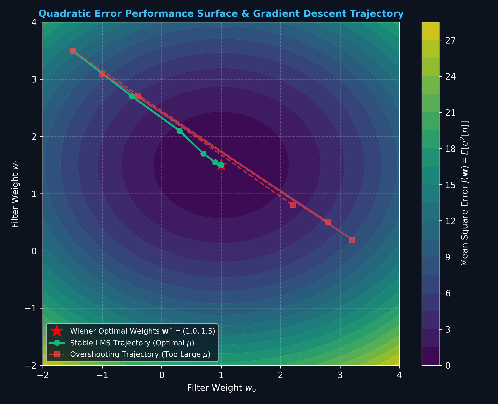
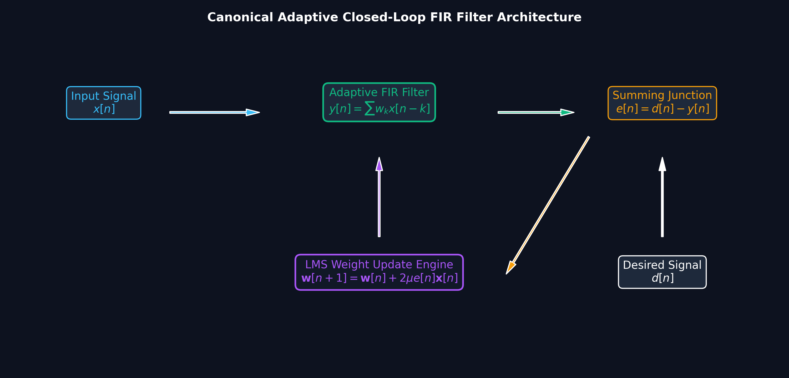
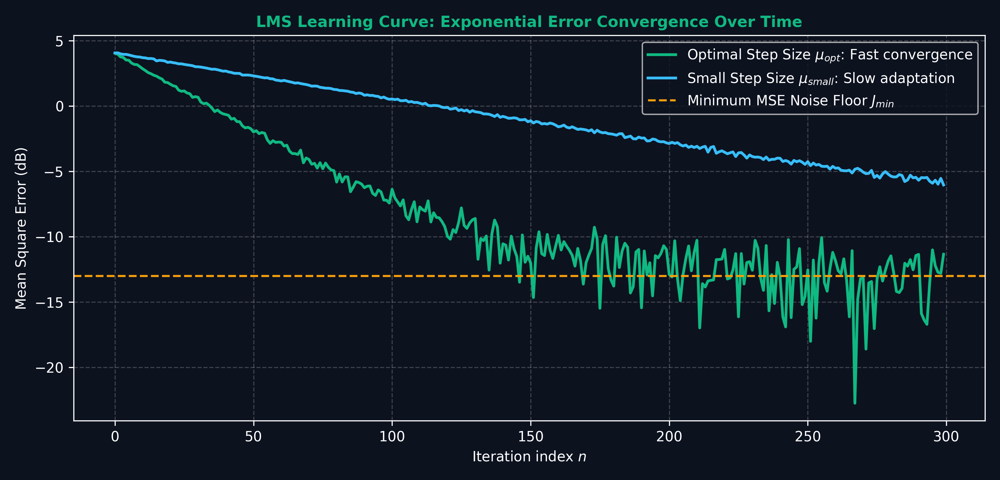

# Lecture 16: Adaptive Filtering — LMS Algorithm

**Course:** EE3621 — Digital Signal Processing  
**Target Audience:** III B.Tech EEE Students  
**Duration:** 40 Minutes  

* **Available Formats:** [LaTeX Source File](file:///C:/Users/sriph/Downloads/DSP/lecture_16.tex) | [Compiled PDF Notes](file:///C:/Users/sriph/Downloads/DSP/lecture_16.pdf)

---

## 1. Lecture Plan (40 Minutes Breakdown)

* **00:00 -- 05:00 (5 mins):** Introduction to Adaptive Filtering. Why static filters (like Wiener filters) fail in non-stationary environments.
* **05:00 -- 12:00 (7 mins):** The Steepest Descent Algorithm. Formulation of MSE cost function $J(\mathbf{w})$, exact gradient, and eigenvalue spread.
* **12:00 -- 20:00 (8 mins):** LMS Algorithm Derivation. Instantaneous gradient approximation, $e[n]$, and update rule.
* **20:00 -- 25:00 (5 mins):** Convergence conditions and time constant $\tau_k$.
* **25:00 -- 30:00 (5 mins):** Misadjustment $M$ and the Normalized LMS (NLMS) algorithm.
* **30:00 -- 33:00 (3 mins):** Introduction to Recursive Least Squares (RLS) Algorithm.
* **33:00 -- 40:00 (7 mins):** Applications (Echo cancellation, Equalization) & Checkpoints.

---

## 2. Why Adaptive Filtering?

In classical digital signal processing, we often assume that the statistics of the signals we are processing are known and stationary. For example, if we know the autocorrelation of a signal and the cross-correlation with a desired signal, we can design an optimal Wiener filter. 

However, in many practical engineering applications, this assumption completely breaks down:

1. **Non-stationary environments:** 
   The statistical properties of the signals change over time. For instance, a mobile phone moving through different acoustic environments experiences changing background noise.
   
2. **Unknown channel statistics:** 
   We may not know the signal statistics a priori. Consider a new telephone line connection where the impedance mismatch (which causes echoes) is completely unknown until the call is established.
   
3. **Need to track changes in real time:** 
   We need a system that can continuously track changes and adjust its parameters on the fly. A static Wiener filter would require us to collect a massive batch of data, compute the autocorrelation matrix, invert it, and find the weights. This is computationally expensive and introduces massive latency.

This is where **Adaptive Filters** come in. An adaptive filter consists of two parts:
1. A digital filter (usually an FIR filter) whose coefficients are adjustable.
2. An adaptive algorithm that updates the coefficients based on the input signal and an error signal.

*(Note: The underlying filter structure is often a standard FIR filter. For reference on FIR structures, see the basic linear-phase FIR implementation below. While adaptive filters don't explicitly require linear phase, they share the same tapped-delay line architecture. Similarly, alternative realizations like frequency-sampling can be used, though direct-form is most common in adaptive filtering.)*

---

## 3. Steepest Descent Algorithm

### Visual Illustration: Quadratic MSE Error Performance Surface & Gradient Search

* **Performance Bowl:** The Mean Square Error $J(\mathbf{w})$ forms a parabolic bowl. The LMS algorithm uses stochastic gradient descent to iteratively steer the filter weights $\mathbf{w}[n]$ toward the bottom of the bowl (Wiener optimal $\mathbf{w}^*$).

---

### Visual Illustration: Canonical Adaptive FIR Closed-Loop Architecture

* **Closed-Loop Feedback:** The error signal $e[n] = d[n] - y[n]$ continually updates tap weights via $\mathbf{w}[n+1] = \mathbf{w}[n] + 2\mu e[n] \mathbf{x}[n]$.

---

### Visual Illustration: LMS Learning Curve (Error Convergence)

* **Convergence vs Stability:** Step size $\mu$ controls speed of convergence. If $\mu < 1/\lambda_{max}$, error decays exponentially toward the noise floor.

To understand adaptive filtering, we first look at the theoretical **Steepest Descent Algorithm**. 

### 3.1. Cost Function (Mean Squared Error)

Let the input signal vector at time $n$ be $\mathbf{x}(n) = [x[n], x[n-1], \dots, x[n-N+1]]^T$.
Let the filter weights be $\mathbf{w} = [w_0, w_1, \dots, w_{N-1}]^T$.
The filter output is $y[n] = \mathbf{w}^T \mathbf{x}(n)$.
We have a desired signal $d[n]$. The error is:
$$e[n] = d[n] - y[n] = d[n] - \mathbf{w}^T \mathbf{x}(n)$$

We want to minimize the Mean Squared Error (MSE) cost function $J(\mathbf{w})$:
$$J(\mathbf{w}) = E[e^2[n]]$$

Expanding this:
$$J(\mathbf{w}) = E[(d[n] - \mathbf{w}^T \mathbf{x}(n))^2]$$
$$J(\mathbf{w}) = E[d^2[n]] - 2\mathbf{w}^T E[d[n]\mathbf{x}(n)] + \mathbf{w}^T E[\mathbf{x}(n)\mathbf{x}^T(n)] \mathbf{w}$$

Define:
* $\mathbf{R} = E[\mathbf{x}(n)\mathbf{x}^T(n)]$ (Input Autocorrelation Matrix)
* $\mathbf{r} = E[d[n]\mathbf{x}(n)]$ (Cross-correlation Vector)

Thus:
$$J(\mathbf{w}) = E[d^2[n]] - 2\mathbf{w}^T \mathbf{r} + \mathbf{w}^T \mathbf{R} \mathbf{w}$$

This is a quadratic bowl. The minimum MSE is achieved at the optimal Wiener weights $\mathbf{w}_{opt} = \mathbf{R}^{-1}\mathbf{r}$.
We can rewrite the cost function as:
$$J(\mathbf{w}) = \xi_{min} + (\mathbf{w} - \mathbf{w}_{opt})^T \mathbf{R} (\mathbf{w} - \mathbf{w}_{opt})$$
where $\xi_{min}$ is the minimum MSE.

### 3.2. Gradient and Update Rule

The steepest descent algorithm finds the minimum by taking steps in the direction opposite to the gradient.
The exact gradient of $J(\mathbf{w})$ with respect to $\mathbf{w}$ is:
$$\nabla J = \frac{\partial J(\mathbf{w})}{\partial \mathbf{w}}$$

Taking the derivative of the quadratic form:
$$\nabla J = -2\mathbf{r} + 2\mathbf{R}\mathbf{w}$$
$$\nabla J = 2\mathbf{R}\mathbf{w} - 2\mathbf{r}$$

The update rule for the weights at iteration $n+1$ is:
$$\mathbf{w}(n+1) = \mathbf{w}(n) - \mu \nabla J$$
where $\mu$ is the step size.

Substituting the gradient:
$$\mathbf{w}(n+1) = \mathbf{w}(n) + 2\mu (\mathbf{r} - \mathbf{R}\mathbf{w}(n))$$

### 3.3. Convergence Analysis

For the steepest descent algorithm to converge to $\mathbf{w}_{opt}$, the step size $\mu$ must be carefully chosen. 
The convergence is governed by the eigenvalues of the autocorrelation matrix $\mathbf{R}$. Let the eigenvalues be $\lambda_1, \lambda_2, \dots, \lambda_N$.
The condition for stability and convergence is:
$$0 < \mu < \frac{1}{\lambda_{max}}$$
where $\lambda_{max}$ is the largest eigenvalue of $\mathbf{R}$.

**KEY RESULT:** The steepest descent requires exact knowledge of $\mathbf{R}$ and $\mathbf{r}$, which we don't have in practice!

---

## 4. LMS Algorithm Derivation

Because we do not know the true statistical expectations $\mathbf{R}$ and $\mathbf{r}$ in a real-time system, Bernard Widrow and Marcian Hoff introduced the **Least Mean Squares (LMS) Algorithm** in 1960. 

### 4.1. Instantaneous Gradient Estimate

The brilliant insight of the LMS algorithm is to replace the true gradient $\nabla J = E[-2e[n]\mathbf{x}(n)]$ with its **instantaneous estimate** $\hat{\nabla} J$. We simply drop the expectation operator:
$$\hat{\nabla} J \approx -2e[n]\mathbf{x}(n)$$

Let's break this down step-by-step:
1. True gradient: $\nabla J = \frac{\partial E[e^2[n]]}{\partial \mathbf{w}}$
2. Swap derivative and expectation: $\nabla J = E\left[\frac{\partial e^2[n]}{\partial \mathbf{w}}\right]$
3. Chain rule: $\frac{\partial e^2[n]}{\partial \mathbf{w}} = 2e[n] \frac{\partial e[n]}{\partial \mathbf{w}}$
4. Since $e[n] = d[n] - \mathbf{w}^T(n)\mathbf{x}(n)$, we have $\frac{\partial e[n]}{\partial \mathbf{w}} = -\mathbf{x}(n)$.
5. So, $\frac{\partial e^2[n]}{\partial \mathbf{w}} = -2e[n]\mathbf{x}(n)$.
6. Instantaneous approximation: $\hat{\nabla} J = -2e[n]\mathbf{x}(n)$.

### 4.2. LMS Update Rule

Substitute this instantaneous gradient into the steepest descent update rule:
$$\mathbf{w}(n+1) = \mathbf{w}(n) - \mu \hat{\nabla} J$$
$$\mathbf{w}(n+1) = \mathbf{w}(n) - \mu (-2e[n]\mathbf{x}(n))$$

This gives the famous **LMS Update Rule**:
$$\mathbf{w}(n+1) = \mathbf{w}(n) + 2\mu e[n]\mathbf{x}(n)$$

**Engineering Intuition:** 
If the error $e[n]$ is positive, and the input $x[n]$ is positive, we should increase the weight to make the output $y[n]$ larger, which will reduce the positive error. The LMS rule does exactly this automatically!

---

## 5. Convergence Conditions and Time Constant

### 5.1. Step Size Bound

For the LMS algorithm, the stability bound is related to the trace of the autocorrelation matrix, which is easier to compute than the maximum eigenvalue.
The trace of $\mathbf{R}$ is the sum of its eigenvalues, which equals the total input power across the filter taps:
$$\text{tr}(\mathbf{R}) = \sum_{i=1}^N \lambda_i = N \cdot P_x$$
where $P_x = E[x^2[n]]$ is the input signal power and $N$ is the filter length.

The practical condition for convergence in LMS is:
$$0 < \mu < \frac{1}{\text{tr}(\mathbf{R})} = \frac{1}{N P_x}$$

### 5.2. Time Constant

The convergence speed of the algorithm depends on the eigenvalues of $\mathbf{R}$. The learning curve has multiple modes, each decaying exponentially. The time constant for the $k$-th mode is approximately:
$$\tau_k \approx \frac{1}{4\mu\lambda_k}$$

If the eigenvalues are very spread out (high eigenvalue spread, $\lambda_{max}/\lambda_{min} \gg 1$), the convergence will be very slow because $\mu$ is limited by $\lambda_{max}$, making $\tau_{min} \approx \frac{1}{4\mu\lambda_{min}}$ very large.

---

## 6. Misadjustment M

Because the LMS algorithm uses a noisy instantaneous gradient rather than the true gradient, the filter weights never perfectly settle to the optimal Wiener solution $\mathbf{w}_{opt}$. They randomly bounce around the optimum.

This bouncing causes an excess mean squared error (EMSE).
The total steady-state MSE is:
$$J_{\infty} = \xi_{min} + J_{ex}$$

The **Misadjustment** $M$ is defined as the ratio of the excess MSE to the minimum MSE:
$$M = \frac{J_{ex}}{\xi_{min}}$$

For the LMS algorithm, the misadjustment is theoretically given by:
$$M = \frac{\mu \text{tr}(\mathbf{R})}{1 - \mu\text{tr}(\mathbf{R})}$$

For small values of $\mu$, this approximates to:
$$M \approx \mu \text{tr}(\mathbf{R}) = \mu N P_x$$

**Trade-off:**
* **Large $\mu$:** Faster convergence (smaller $\tau_k$), but large misadjustment (more noise in steady state).
* **Small $\mu$:** Slower convergence, but small misadjustment (highly accurate steady state).

---

## 7. NLMS (Normalized LMS)

A major problem with the standard LMS algorithm is that its stability depends on the input signal power $P_x$. If the input signal suddenly becomes very loud, the product $N P_x$ might exceed $1/\mu$, causing the filter to become unstable and blow up.

To fix this, we normalize the step size by the instantaneous power of the input vector. This gives the **Normalized LMS (NLMS)** algorithm.

The step size is made time-varying:
$$\mu(n) = \frac{\alpha}{\epsilon + \|\mathbf{x}(n)\|^2}$$

where:
* $\alpha$ is the normalized step size, $0 < \alpha < 1$.
* $\|\mathbf{x}(n)\|^2 = \mathbf{x}^T(n)\mathbf{x}(n)$ is the squared Euclidean norm (instantaneous power) of the input vector.
* $\epsilon$ is a small positive constant to prevent division by zero when the input is silent.

**NLMS Update Rule:**
$$\mathbf{w}(n+1) = \mathbf{w}(n) + \frac{2\alpha}{\epsilon + \|\mathbf{x}(n)\|^2} e[n]\mathbf{x}(n)$$

NLMS is far more robust to varying input levels and is the industry standard for most basic adaptive filtering tasks.

---

## 8. RLS Algorithm Outline

The LMS algorithm converges slowly when the input signal is highly correlated (high eigenvalue spread). 
The **Recursive Least Squares (RLS)** algorithm solves this by exactly minimizing a deterministic sum of squared errors instead of the statistical MSE.

The RLS cost function uses an exponential forgetting factor $\lambda$ (where $0 \ll \lambda \le 1$, typically 0.99):
$$\mathcal{E}(n) = \sum_{i=1}^n \lambda^{n-i} e^2[i]$$

The RLS algorithm updates the inverse correlation matrix $P(n) = \mathbf{R}^{-1}(n)$ recursively using the Matrix Inversion Lemma:
$$P(n) = \lambda^{-1}[P(n-1) - \mathbf{k}(n)\mathbf{x}^T(n)P(n-1)]$$

**Comparison:**
* **LMS:** $O(N)$ complexity per sample. Slow convergence for colored inputs.
* **RLS:** $O(N^2)$ complexity per sample. Extremely fast convergence, insensitive to eigenvalue spread.

---

## 9. Applications

Adaptive filters are everywhere in modern communications.

### 9.1. Acoustic Echo Cancellation (AEC)
When you speak on a speakerphone, the microphone picks up the audio from the loudspeaker and sends it back to the far end, causing an echo.
An adaptive filter models the acoustic path from the speaker to the mic. The far-end signal is the input $x[n]$, the mic signal is $d[n]$. The filter subtracts its estimate of the echo $y[n]$ from $d[n]$, transmitting only the error $e[n]$ (which is the near-end speech).
*(Refer to the block diagram concepts from Figure 1 for standard FIR feed-forward paths used here, or alternatively frequency-sampling structures if frequency-domain adaptive filtering is employed.)*

### 9.2. Adaptive Noise Cancellation (ANC)
Used in noise-canceling headphones. A primary mic picks up Signal + Noise. A reference mic picks up correlated Noise. The adaptive filter filters the reference noise to match the noise in the primary mic and subtracts it.

### 9.3. Channel Equalization
Signals transmitted over a channel (like a wireless path) suffer from intersymbol interference (ISI). An adaptive equalizer at the receiver reverses the channel distortion. The filter is trained using a known "training sequence" as $d[n]$.

---

## 10. Key Formulas Summary

| Concept | Formula |
| :--- | :--- |
| **Cost Function (MSE)** | $J(\mathbf{w}) = E[e^2[n]] = \xi_{min} + (\mathbf{w} - \mathbf{w}_{opt})^T \mathbf{R} (\mathbf{w} - \mathbf{w}_{opt})$ |
| **Wiener Solution** | $\mathbf{w}_{opt} = \mathbf{R}^{-1}\mathbf{r}$ |
| **Exact Gradient** | $\nabla J = 2\mathbf{R}\mathbf{w} - 2\mathbf{r}$ |
| **Steepest Descent Update** | $\mathbf{w}(n+1) = \mathbf{w}(n) - \mu \nabla J$ |
| **Instantaneous Gradient (LMS)**| $\hat{\nabla} J \approx -2e[n]\mathbf{x}(n)$ |
| **LMS Update Rule** | $\mathbf{w}(n+1) = \mathbf{w}(n) + 2\mu e[n]\mathbf{x}(n)$ |
| **LMS Convergence Bound** | $0 < \mu < \frac{1}{\text{tr}(\mathbf{R})} = \frac{1}{N P_x}$ |
| **LMS Misadjustment (Small $\mu$)**| $M \approx \mu N P_x$ |
| **NLMS Update Rule** | $\mathbf{w}(n+1) = \mathbf{w}(n) + \frac{2\alpha}{\epsilon + \|\mathbf{x}(n)\|^2} e[n]\mathbf{x}(n)$ |

---

## 11. Checkpoints & Quick Review Questions

1. **Q1: Convergence Bound Calculation**
   An adaptive LMS filter of length $N = 10$ is used to process a signal with a variance (power) of $P_x = 0.5$ W. The signal has zero mean. 
   **Calculate the upper bound for the step size $\mu$ to ensure convergence in the mean.**
   
   * *Answer:*
     * The trace of the autocorrelation matrix is $\text{tr}(\mathbf{R}) = N \cdot P_x$.
     * Here, $N = 10$ and $P_x = 0.5$.
     * $\text{tr}(\mathbf{R}) = 10 \times 0.5 = 5$.
     * The convergence condition is $0 < \mu < \frac{1}{\text{tr}(\mathbf{R})}$.
     * Therefore, $0 < \mu < \frac{1}{5} = 0.2$.
     * The step size must be strictly between 0 and 0.2.

2. **Q2: One Iteration of LMS**
   Given an adaptive filter with $N=2$ weights. At time $n=0$, the weights are initialized to $\mathbf{w}(0) = [0, 0]^T$. The step size is $\mu = 0.1$.
   The input vector at $n=0$ is $\mathbf{x}(0) = [1, -2]^T$. The desired signal is $d[0] = 2$.
   **Calculate the filter output $y[0]$, the error $e[0]$, and the new weight vector $\mathbf{w}(1)$.**
   
   * *Answer:*
     * Step 1: Calculate output $y[0] = \mathbf{w}^T(0)\mathbf{x}(0) = [0, 0] \cdot [1, -2]^T = 0$.
     * Step 2: Calculate error $e[0] = d[0] - y[0] = 2 - 0 = 2$.
     * Step 3: Update weights using LMS rule: $\mathbf{w}(1) = \mathbf{w}(0) + 2\mu e[0]\mathbf{x}(0)$.
     * $\mathbf{w}(1) = [0, 0]^T + 2(0.1)(2) [1, -2]^T$.
     * $\mathbf{w}(1) = [0, 0]^T + 0.4 [1, -2]^T$.
     * $\mathbf{w}(1) = [0.4, -0.8]^T$.

3. **Q3: Misadjustment Trade-off**
   An LMS filter operates with step size $\mu = 0.01$, filter length $N=20$, and input power $P_x = 1$. It achieves an excess MSE ($J_{ex}$) of 0.02.
   If the step size is reduced to $\mu = 0.005$ to improve accuracy, **what is the approximate new Misadjustment $M$, and what happens to the convergence time?** (Assume $\xi_{min} = 0.1$).
   
   * *Answer:*
     * First, verify original misadjustment: $M_{old} = \mu N P_x = 0.01 \times 20 \times 1 = 0.2$.
     * Note that $M_{old} = J_{ex} / \xi_{min} = 0.02 / 0.1 = 0.2$. This matches.
     * New step size $\mu = 0.005$ is half of the original.
     * New misadjustment: $M_{new} \approx \mu_{new} N P_x = 0.005 \times 20 \times 1 = \mathbf{0.1}$.
     * The misadjustment is halved, so the steady-state error is lower (more accurate).
     * However, the time constant $\tau \approx \frac{1}{4\mu\lambda}$ is inversely proportional to $\mu$. Since $\mu$ is halved, the convergence time will exactly **double**.
