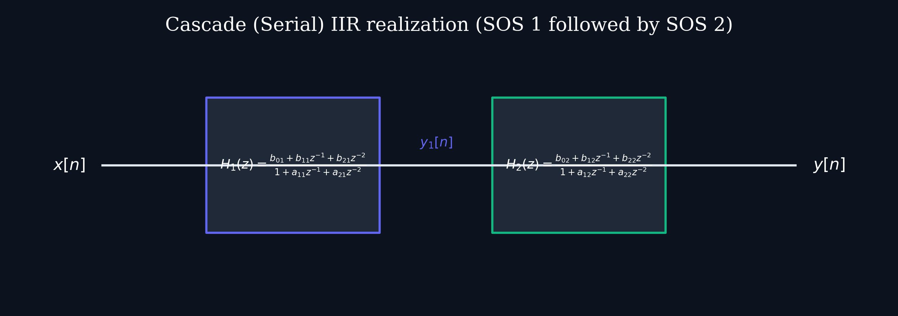

# Lecture 18: Wavelet Transform & Multiresolution Analysis

**Course:** EE3621 — Digital Signal Processing  
**Target Audience:** III B.Tech EEE Students  
**Duration:** 40 Minutes  

* **Available Formats:** [LaTeX Source File](file:///C:/Users/sriph/Downloads/DSP/lecture_18.tex) | [Compiled PDF Notes](file:///C:/Users/sriph/Downloads/DSP/lecture_18.pdf)

---

## 1. Lecture Plan (40 Minutes Breakdown)

* **00:00 – 07:00 (7 mins):** **Why Wavelets?** Limitations of STFT, time-frequency resolution trade-offs, and the concept of constant-Q analysis.
* **07:00 – 14:00 (7 mins):** **Continuous Wavelet Transform (CWT):** Definition, mother wavelet, scaling and translation, and the admissibility condition.
* **14:00 – 18:00 (4 mins):** **Common Mother Wavelets:** Haar, Morlet, Mexican Hat, Daubechies.
* **18:00 – 25:00 (7 mins):** **Multiresolution Analysis (MRA):** Nested subspaces, scaling function, wavelet function, and two-scale equations.
* **25:00 – 32:00 (7 mins):** **Discrete Wavelet Transform (DWT) & Mallat's Algorithm:** Filter banks, decimation, and perfect reconstruction.
* **32:00 – 37:00 (5 mins):** **Numerical Example:** Haar DWT of a 4-point signal.
* **37:00 – 40:00 (3 mins):** **Applications & Checkpoints:** JPEG 2000, ECG denoising, Checkpoint Q&A.

---

## 2. Why Wavelets? The Limitations of STFT

### The Resolution Problem
The Fourier Transform provides the frequency content of a signal but loses all time information. To overcome this, the Short-Time Fourier Transform (STFT) was introduced. The STFT multiplies the signal $x(t)$ by a sliding window function $w(t)$ of fixed width.

The STFT is defined as:
$$ X(t, \omega) = \int_{-\infty}^{\infty} x(\tau) w(\tau - t) e^{-j\omega \tau} d\tau $$

**Physical/Engineering Intuition:** 
Think of the window $w(t)$ as a lens. A narrow window gives excellent time resolution (you know exactly when something happened) but poor frequency resolution (the frequency is smeared out). A wide window gives excellent frequency resolution but poor time resolution.
Because the window size in STFT is fixed, the resolution in the time-frequency plane is exactly the same everywhere. 

However, natural signals (like speech or music) typically have:
1. Low-frequency components that last for a long duration.
2. High-frequency components (like transients, clicks, or plucks) that are very short-lived.

### The Wavelet Solution: Constant-Q Analysis
Wavelets solve the fixed-window problem by using a **variable time-frequency window**. 
Instead of a fixed window, we use short, high-frequency windows to analyze high frequencies (good time resolution for transients) and long, low-frequency windows to analyze low frequencies (good frequency resolution for slow changes).

This is known as **Constant-Q analysis**, where the ratio of the center frequency to the bandwidth is kept constant. This closely matches the human auditory system, which is more sensitive to frequency changes at low frequencies and more sensitive to time changes at high frequencies.

---

## 3. Continuous Wavelet Transform (CWT)

The Continuous Wavelet Transform projects a continuous-time signal $x(t)$ onto a set of basis functions known as wavelets. All wavelets are derived from a single prototype function $\psi(t)$ called the **mother wavelet**.

### The CWT Equation
The CWT is defined as:
$$ W_x(a,b) = \frac{1}{\sqrt{|a|}} \int_{-\infty}^{\infty} x(t)\psi^*\left(\frac{t-b}{a}\right)dt $$

Here:
* $a$: The **scale parameter** ($a > 0$). It inversely corresponds to frequency. Large $a$ means stretched wavelet (low frequency). Small $a$ means compressed wavelet (high frequency).
* $b$: The **translation parameter**. It shifts the wavelet along the time axis to analyze different parts of the signal.
* $\frac{1}{\sqrt{|a|}}$: An energy normalization factor ensuring that wavelets at different scales have the same energy.
* $\psi^*(t)$: The complex conjugate of the mother wavelet.

### The Admissibility Condition
For the inverse wavelet transform to exist (i.e., to perfectly reconstruct the signal), the mother wavelet must satisfy the **admissibility condition**:
$$ C_\psi = \int_0^\infty \frac{|\Psi(\omega)|^2}{\omega}d\omega < \infty $$

Where $\Psi(\omega)$ is the Fourier Transform of $\psi(t)$.

**Theorem: Zero Mean Property**
If $C_\psi < \infty$ and $\Psi(\omega)$ is continuous at $\omega = 0$, then $\Psi(0) = 0$.

**Proof:**
1. Assume $\Psi(0) = c \neq 0$.
2. As $\omega \to 0$, $|\Psi(\omega)|^2 \to |c|^2$.
3. The integrand in the admissibility condition behaves like $\frac{|c|^2}{\omega}$ near $\omega=0$.
4. $\int_0^\epsilon \frac{|c|^2}{\omega} d\omega = |c|^2 \left[ \ln(\omega) \right]_0^\epsilon \to \infty$.
5. This violates $C_\psi < \infty$. Therefore, $\Psi(0)$ must be 0.

Physical meaning: $\Psi(0) = \int \psi(t) dt = 0$. The wavelet must have zero average value; it must oscillate and look like a "small wave" (a wavelet).

---

## 4. Common Mother Wavelets

Different applications require different wavelets. 

1. **Haar Wavelet:**
   The simplest wavelet. It is a step function.
   $$ \psi(t) = \begin{cases} 1 & 0 \le t < 1/2 \\ -1 & 1/2 \le t < 1 \\ 0 & \text{otherwise} \end{cases} $$
   It is excellent for detecting sudden transitions but poor for frequency analysis due to lack of smoothness.

2. **Morlet Wavelet:**
   A complex sinusoid modulated by a Gaussian envelope.
   $$ \psi(t) = e^{-t^2/2}e^{j\omega_0 t} $$
   Widely used in time-frequency analysis (e.g., EEG/audio) because it offers the best joint time-frequency resolution (uncertainty principle bound).

3. **Mexican Hat Wavelet:**
   The negative second derivative of a Gaussian.
   $$ \psi(t) = -\frac{d^2}{dt^2}e^{-t^2/2} = (1-t^2)e^{-t^2/2} $$
   Commonly used in computer vision and edge detection.

4. **Daubechies Wavelets (dbN):**
   A family of compactly supported orthogonal wavelets that are maximally smooth. They don't have an explicit analytical formula but are defined by their filter coefficients. Used heavily in signal compression.

---

## 5. Multiresolution Analysis (MRA)

MRA is the mathematical foundation for the Discrete Wavelet Transform (DWT). It formalizes the idea of analyzing a signal at multiple scales.

### Nested Subspaces
MRA defines a sequence of nested closed subspaces $V_j$ in $L^2(\mathbb{R})$:
$$ \dots \subset V_2 \subset V_1 \subset V_0 \subset V_{-1} \subset \dots $$

* $V_0$ represents the space of signals at a base resolution.
* $V_1$ contains signals at a coarser resolution (half the resolution of $V_0$).
* $V_{-1}$ contains signals at a finer resolution (double the resolution of $V_0$).

**Properties of MRA:**
1. $\bigcup_{j \in \mathbb{Z}} V_j$ is dense in $L^2(\mathbb{R})$.
2. $\bigcap_{j \in \mathbb{Z}} V_j = \{0\}$.
3. $x(t) \in V_j \iff x(2t) \in V_{j-1}$ (Scale invariance).
4. $x(t) \in V_0 \iff x(t-k) \in V_0$ for all $k \in \mathbb{Z}$ (Translation invariance).

### Scaling Function and Wavelet Function
There exists a **scaling function** $\phi(t)$ such that its integer translates $\{\phi(t-k)\}_{k\in\mathbb{Z}}$ form an orthonormal basis for $V_0$.

The difference in detail between resolution $V_0$ and the coarser resolution $V_1$ is captured by the orthogonal complement space $W_1$, such that:
$$ V_0 = V_1 \oplus W_1 $$
Generalizing:
$$ V_{j-1} = V_j \oplus W_j $$

The **wavelet function** $\psi(t)$ is designed such that its integer translates $\{\psi(t-k)\}_{k\in\mathbb{Z}}$ form an orthonormal basis for $W_0$.

### Two-Scale Relations
Since $V_0 \subset V_{-1}$, and $\phi(2t)$ is a basis for $V_{-1}$, we can express $\phi(t)$ in terms of $\phi(2t)$:
$$ \phi(t) = \sqrt{2}\sum_{k} h_0[k]\phi(2t-k) $$
This is the **scaling equation**.

Similarly, since $W_0 \subset V_{-1}$, we can express $\psi(t)$ in terms of $\phi(2t)$:
$$ \psi(t) = \sqrt{2}\sum_{k} h_1[k]\phi(2t-k) $$
This is the **wavelet equation**.

Here, $h_0[k]$ and $h_1[k]$ are discrete filter coefficients. This connects the continuous theory of MRA to discrete digital filters!

---

## 6. Discrete Wavelet Transform (DWT) & Perfect Reconstruction

The DWT is implemented not by calculating integrals, but by passing the discrete signal through a **filter bank**. This is the realization of Mallat's Algorithm.

### The Filter Bank Implementation
At each stage of the DWT, the signal $x[n]$ is passed through a lowpass filter $H_0(z)$ and a highpass filter $H_1(z)$. The outputs are then downsampled by a factor of 2 (keeping only even-indexed samples).

* **Approximation Coefficients ($cA$):** The output of the lowpass branch. Contains the low-frequency, coarse features.
* **Detail Coefficients ($cD$):** The output of the highpass branch. Contains the high-frequency, fine details.

**Quadrature Mirror Filter (QMF) Relation:**
To form an orthogonal wavelet system, the highpass filter coefficients are derived from the lowpass coefficients by reversing the order and alternating the sign:
$$ h_1[k] = (-1)^k h_0[N-1-k] $$

### Mallat’s Algorithm
The decomposition is iterated on the approximation coefficients $cA$ to create a multi-level DWT.
For a $J$-level DWT, we obtain $J$ sets of detail coefficients and 1 final set of approximation coefficients, resulting in $J+1$ subbands.

*Level 1:* $x \to cA_1, cD_1$
*Level 2:* $cA_1 \to cA_2, cD_2$
*Level 3:* $cA_2 \to cA_3, cD_3$

### Perfect Reconstruction (PR)
To recover the original signal exactly from the DWT coefficients, we use a synthesis filter bank with upsampling (inserting zeros) and synthesis filters $G_0(z)$ (lowpass) and $G_1(z)$ (highpass).

The reconstructed signal in the Z-domain is:
$$ \hat{X}(z) = \frac{1}{2} \left[ G_0(z)H_0(z) + G_1(z)H_1(z) \right] X(z) + \frac{1}{2} \left[ G_0(z)H_0(-z) + G_1(z)H_1(-z) \right] X(-z) $$

The term with $X(-z)$ represents **aliasing** caused by decimation.
For Perfect Reconstruction:
1. **Alias Cancellation:** $G_0(z)H_0(-z) + G_1(z)H_1(-z) = 0$
2. **Distortion-free condition:** $G_0(z)H_0(z) + G_1(z)H_1(z) = 2z^{-L}$

When these conditions are met, $\hat{X}(z) = z^{-L} X(z)$, meaning the reconstructed signal is just a delayed version of the original.

*(We can visualize multi-stage cascaded filtering architectures using structures similar to Cascade IIR setups, although for DWT we incorporate decimation between stages).*

*Figure: A sequential cascade structure. In DWT, Mallat's algorithm cascades the lowpass outputs iteratively.*

---

## 7. Numerical Example: Haar DWT

Let's compute the 1-level DWT of a sequence $x = [4, 6, 8, 2]$.

The Haar wavelet filter coefficients are:
$$ h_0 = \left[ \frac{1}{\sqrt{2}}, \frac{1}{\sqrt{2}} \right] $$
$$ h_1 = \left[ \frac{1}{\sqrt{2}}, -\frac{1}{\sqrt{2}} \right] $$

**Step 1: Compute Approximation Coefficients ($cA$)**
Convolve $x$ with $h_0$ and downsample by 2.
$cA[n] = \sum_{k} x[k] h_0[2n-k]$

For $n=0$: (Inner product of $x[0,1]$ with $h_0$)
$cA[0] = x[0]h_0[0] + x[1]h_0[1] = 4 \times \frac{1}{\sqrt{2}} + 6 \times \frac{1}{\sqrt{2}} = \frac{10}{\sqrt{2}} = 5\sqrt{2}$

For $n=1$: (Inner product of $x[2,3]$ with $h_0$)
$cA[1] = x[2]h_0[0] + x[3]h_0[1] = 8 \times \frac{1}{\sqrt{2}} + 2 \times \frac{1}{\sqrt{2}} = \frac{10}{\sqrt{2}} = 5\sqrt{2}$

Result: $cA = [5\sqrt{2}, 5\sqrt{2}]$

**Step 2: Compute Detail Coefficients ($cD$)**
Convolve $x$ with $h_1$ and downsample by 2.
$cD[n] = \sum_{k} x[k] h_1[2n-k]$

For $n=0$: (Note: $h_1$ is applied as $[1/\sqrt{2}, -1/\sqrt{2}]$)
$cD[0] = x[0]h_1[0] + x[1]h_1[1] = 4 \times \frac{1}{\sqrt{2}} + 6 \times \left(-\frac{1}{\sqrt{2}}\right) = \frac{4-6}{\sqrt{2}} = -\frac{2}{\sqrt{2}} = -\sqrt{2}$

For $n=1$:
$cD[1] = x[2]h_1[0] + x[3]h_1[1] = 8 \times \frac{1}{\sqrt{2}} + 2 \times \left(-\frac{1}{\sqrt{2}}\right) = \frac{8-2}{\sqrt{2}} = \frac{6}{\sqrt{2}} = 3\sqrt{2}$

Result: $cD = [-\sqrt{2}, 3\sqrt{2}]$

The original 4-point signal is now represented perfectly by 2 approximation coefficients and 2 detail coefficients. Energy is preserved (Parseval's theorem for wavelets).

---

## 8. Applications of Wavelets

1. **Image Compression (JPEG 2000):** 
   Unlike standard JPEG which uses the Discrete Cosine Transform (DCT) on 8x8 blocks (causing blocking artifacts at low bitrates), JPEG 2000 uses the 2D DWT over the entire image. This provides superior compression without blocking artifacts and allows progressive transmission (resolution scalability).

2. **ECG Signal Denoising:** 
   ECG signals contain important transient features (QRS complexes) mixed with noise. By applying DWT, setting small detail coefficients to zero (thresholding), and performing the Inverse DWT, noise is removed while preserving the sharp clinical features.

3. **Seismic Signal Processing:** 
   Wavelets effectively analyze non-stationary seismic traces to identify variations in underground rock structures.

4. **Edge Detection:** 
   The Mexican Hat wavelet (derivative of a Gaussian) is used to find rapid intensity changes in images, making it a robust edge detector.

---

## 9. Key Formulas Table

| Concept | Formula |
|---------|---------|
| Continuous Wavelet Transform | $W_x(a,b) = \frac{1}{\sqrt{|a|}} \int_{-\infty}^{\infty} x(t)\psi^*\left(\frac{t-b}{a}\right)dt$ |
| Admissibility Condition | $C_\psi = \int_0^\infty \frac{|\Psi(\omega)|^2}{\omega}d\omega < \infty$ |
| Two-Scale Scaling Equation | $\phi(t) = \sqrt{2}\sum_{k} h_0[k]\phi(2t-k)$ |
| Two-Scale Wavelet Equation | $\psi(t) = \sqrt{2}\sum_{k} h_1[k]\phi(2t-k)$ |
| QMF Relation | $h_1[k] = (-1)^k h_0[N-1-k]$ |
| PR Alias Cancellation | $G_0(z)H_0(-z) + G_1(z)H_1(-z) = 0$ |
| PR Distortion-Free | $G_0(z)H_0(z) + G_1(z)H_1(z) = 2z^{-L}$ |

---

## 10. Checkpoint & Quick Review Questions

1. **Q1:** Why does the Short-Time Fourier Transform (STFT) struggle with analyzing signals that contain both very short, high-frequency transients and very long, low-frequency drifts?
   * *Answer:* The STFT relies on a sliding window of a fixed time duration. According to the uncertainty principle, a window has a fixed time-frequency resolution. If a short window is chosen to accurately locate the high-frequency transients in time, it will have a wide bandwidth, destroying frequency resolution for the low-frequency drifts. If a wide window is chosen to accurately measure the low-frequency drifts, it will smear the high-frequency transients in time. Wavelets solve this using a variable window (constant-Q) that adapts to the frequency.

2. **Q2:** For a mother wavelet to be valid for perfect reconstruction, it must satisfy the admissibility condition. Prove that this implies the wavelet must have zero mean.
   * *Answer:* The admissibility condition is $C_\psi = \int_0^\infty \frac{|\Psi(\omega)|^2}{\omega}d\omega < \infty$. If the wavelet had a non-zero mean, its Fourier transform at DC ($\omega = 0$) would be non-zero, i.e., $\Psi(0) = c \neq 0$. In this case, near $\omega=0$, the integrand becomes $\frac{|c|^2}{\omega}$. The integral of $1/\omega$ near 0 diverges to infinity (logarithmic singularity), which would mean $C_\psi = \infty$, violating the condition. Therefore, $\Psi(0)$ must equal 0. By definition, $\Psi(0) = \int_{-\infty}^{\infty} \psi(t) dt$, meaning the area under the wavelet (its mean) must be zero.

3. **Q3:** In Mallat’s algorithm for the Discrete Wavelet Transform, how many subbands are produced if a signal is decomposed using a 3-level DWT? What do these subbands contain?
   * *Answer:* A $J$-level DWT produces $J+1$ subbands. For a 3-level DWT, there are 4 subbands: $cD_1, cD_2, cD_3,$ and $cA_3$. 
     * $cD_1$ contains the highest frequency details (level 1).
     * $cD_2$ contains intermediate high-frequency details (level 2).
     * $cD_3$ contains lower-frequency details (level 3).
     * $cA_3$ contains the remaining lowest frequency approximation (the coarse trend of the signal).

---
*End of Lecture 18 Notes.*
