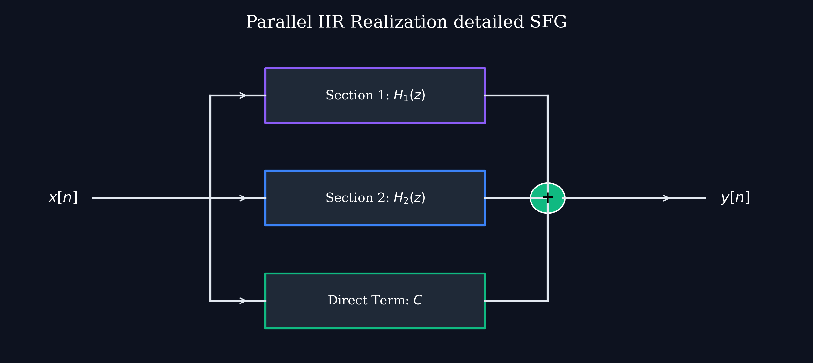

# Lecture 19: Digital Filter Structures — FIR Structures & Lattice Filters

**Course:** EE3621 — Digital Signal Processing  
**Target Audience:** III B.Tech EEE Students  
**Duration:** 40 Minutes  

* **Available Formats:** [LaTeX Source File](lecture_19.tex) | [Compiled PDF Notes](lecture_19.pdf)

---

## 1. Lecture Plan (40 Minutes Breakdown)

* **00:00 – 05:00 (5 mins):** Introduction to FIR Transversal Structures and Direct Convolution.
* **05:00 – 10:00 (5 mins):** Linear Phase FIR Exploitation and complexity reduction.
* **10:00 – 17:00 (7 mins):** FIR Lattice Structure, PARCOR coefficients, forward/backward prediction.
* **17:00 – 22:00 (5 mins):** Levinson-Durbin algorithm mapping direct form to lattice.
* **22:00 – 26:00 (4 mins):** IIR Lattice-Ladder structures for pole-zero models.
* **26:00 – 30:00 (4 mins):** Polyphase FIR Decomposition for decimation/interpolation.
* **30:00 – 35:00 (5 mins):** Fast Convolution: Overlap-Save and Overlap-Add.
* **35:00 – 37:00 (2 mins):** Hardware Implementation (MAC units, pipelining).
* **37:00 – 40:00 (3 mins):** Checkpoints and Q&A.

---

## 2. FIR Transversal (Tapped-Delay-Line) Structure

An FIR filter of length $M$ (order $N = M-1$) performs a direct convolution sum:
$$ y[n] = \sum_{k=0}^{M-1} h[k]x[n-k] $$

### Step-by-Step Expansion:
1. At time $n$, the output is:
   $$ y[n] = h[0]x[n] + h[1]x[n-1] + \dots + h[M-1]x[n-M+1] $$
2. This implies we need current and past input samples: $x[n], x[n-1], \dots, x[n-M+1]$.
3. To store these, we require $M-1$ delay elements ($z^{-1}$ blocks).
4. Each delayed sample is multiplied by a tap weight $h[k]$. This gives $M$ multipliers.
5. The products are summed together using $M-1$ adders.

**Engineering Intuition:**
This is called a **tapped-delay-line** because the signal propagates down a chain of delay registers, and at each stage we "tap" the line, multiply by a coefficient, and accumulate. Since there is no feedback loop, the system is unconditionally stable.

**Computational Complexity:**
For every output sample $y[n]$, we compute exactly $M$ multiplications and $M-1$ additions. In real-time DSP, $M$ MAC (Multiply-Accumulate) operations per sample determine the required processing bandwidth.

---

## 3. Exploiting Linear Phase in FIR Filters

If an FIR filter has a symmetric (or anti-symmetric) impulse response, it has exact linear phase. For a symmetric filter:
$$ h[n] = h[M-1-n] $$

### Complexity Reduction Derivation:
1. Let's assume $M$ is odd. The center tap is at $(M-1)/2$.
2. The convolution sum is:
   $$ y[n] = \sum_{k=0}^{M-1} h[k]x[n-k] $$
3. Split the sum into two halves and the center tap:
   $$ y[n] = \sum_{k=0}^{(M-3)/2} h[k]x[n-k] + h[(M-1)/2]x[n-(M-1)/2] + \sum_{k=(M+1)/2}^{M-1} h[k]x[n-k] $$
4. In the second sum, let $m = M - 1 - k$. Then $k = M - 1 - m$.
5. The sum bounds become $m = 0$ to $(M-3)/2$.
   $$ \sum_{m=0}^{(M-3)/2} h[M-1-m]x[n-M+1+m] $$
6. Using the symmetry property $h[M-1-m] = h[m]$:
   $$ \sum_{m=0}^{(M-3)/2} h[m]x[n-M+1+m] $$
7. Recombine the sums by factoring out $h[k]$:
   $$ y[n] = \sum_{k=0}^{(M-3)/2} h[k] \left( x[n-k] + x[n-M+1+k] \right) + h[(M-1)/2]x[n-(M-1)/2] $$

**KEY RESULT:**
Instead of $M$ multiplications, we only need $(M+1)/2$ multiplications. The adders increase slightly because we add the symmetric delayed samples before multiplication, but multipliers are much more expensive in hardware than adders. Halving the number of multipliers saves significant silicon area.

---

## 4. FIR Lattice Structure

Lattice structures offer a highly modular, stage-by-stage way to implement filters. They are widely used in speech processing (Linear Predictive Coding) and adaptive filters.

### All-Zero Lattice
The lattice structure connects forward prediction errors $f_m[n]$ and backward prediction errors $b_m[n]$ at stage $m$. The parameters defining the lattice are the **PARCOR** (Partial Correlation) coefficients or reflection coefficients, $K_m$.

### The Recursion Equations:
For $m = 1, 2, \dots, M-1$, we have:
1. $f_0[n] = b_0[n] = x[n]$
2. Forward error update:
   $$ f_m[n] = f_{m-1}[n] + K_m b_{m-1}[n-1] $$
3. Backward error update:
   $$ b_m[n] = K_m^* f_{m-1}[n] + b_{m-1}[n-1] $$
(Note: for real signals, $K_m^* = K_m$).

**Engineering Intuition:**
* $f_m[n]$ represents the error in predicting $x[n]$ from $m$ past samples.
* $b_m[n]$ represents the error in predicting $x[n-m]$ from $m$ future samples.
* As we add stages, we are orthogonalizing the signal. 
* **Advantage:** If we want to increase the filter order, we simply tack on another lattice stage without recalculating the previous $K_m$ coefficients (unlike direct form, where increasing order changes all coefficients).

---

## 5. Relationship Between FIR Coefficients and PARCOR

How do we find $K_m$ given $h[n]$ (where $h[0]=1$ for a monic polynomial)?
The **Levinson-Durbin algorithm** recursively bridges the direct form coefficients $\alpha_m(k)$ and lattice coefficients $K_m$.

### Derivation (Step-down recursion):
Given the $m$-th order polynomial $A_m(z) = 1 + \sum_{k=1}^m \alpha_m(k) z^{-k}$.
1. The reflection coefficient is the highest order coefficient:
   $$ K_m = \alpha_m(m) $$
2. Compute the $(m-1)$-th order coefficients:
   $$ \alpha_{m-1}(k) = \frac{\alpha_m(k) - K_m \alpha_m(m-k)}{1 - K_m^2} $$
   for $k = 1, 2, \dots, m-1$.
3. Repeat this step down to $m=1$.
4. The system is minimum phase (all zeros inside the unit circle) if and only if $|K_m| < 1$ for all $m$.

---

## 6. IIR Lattice-Ladder Structure

While FIR filters use an all-zero lattice, IIR filters require feedback, forming an all-pole (AR) lattice. 
For a general pole-zero IIR system (ARMA), we use a combined **Lattice-Ladder** structure.

### All-Pole Lattice (Feedback)
Instead of predicting forward, we run the lattice backward to synthesize the signal:
1. $f_{m-1}[n] = f_m[n] - K_m b_{m-1}[n-1]$
2. $b_m[n] = K_m f_{m-1}[n] + b_{m-1}[n-1]$
This forms the denominator $1/A(z)$.

### Ladder Section (Feedforward zeros)
To implement zeros $B(z)$, we tap the backward error signals $b_m[n]$ (which form an orthogonal basis) and sum them using ladder coefficients $v_m$:
$$ y[n] = \sum_{m=0}^M v_m b_m[n] $$

**Comparison to Parallel Form:**
In a previous lecture, we looked at the Parallel IIR structure, which breaks $H(z)$ into parallel sum of Second Order Sections. 
For context, recall the Parallel IIR structure:

While the parallel form prevents coefficient quantization errors from affecting other poles, the Lattice-Ladder form gives robust stability checking ($|K_m| < 1$) even under severe quantization.

---

## 7. Polyphase FIR Decomposition

When dealing with multirate DSP (decimation or interpolation), computing the full convolution before downsampling wastes power, because many computed outputs are immediately discarded.

### Mathematical Formulation:
Let $M$ be the decimation factor. We decompose $H(z)$ into $M$ polyphase components $E_k(z)$:
1. The transfer function is:
   $$ H(z) = \sum_{n=0}^{N-1} h[n]z^{-n} $$
2. Group the terms by index modulo $M$:
   $$ H(z) = \sum_{k=0}^{M-1} z^{-k} \left( \sum_{n=0}^{\infty} h[nM+k] (z^M)^{-n} \right) $$
3. Define the $k$-th polyphase component:
   $$ E_k(z) = \sum_{n=0}^{\infty} h[nM+k] z^{-n} $$
4. The filter is exactly represented as:
   $$ H(z) = \sum_{k=0}^{M-1} z^{-k} E_k(z^M) $$

**Computational Savings:**
For decimation by $M$, we push the downsampler *through* the filter (Noble Identity). We downsample the input by $M$ first, and run the shorter filters $E_k(z)$ at the lower sample rate. 
The computational workload drops by a factor of $M$.

---

## 8. Block Processing: Overlap-Save and Overlap-Add

For very long FIR filters (e.g., $N=1000$), time-domain convolution $O(N^2)$ is too slow. We use the FFT for fast convolution, which is $O(N \log N)$. However, FFTs perform *circular* convolution, not linear convolution.

To filter continuous streams, we segment the input into blocks of length $L$, zero-pad to length $N_{fft} \ge L + M - 1$, and use the FFT.

### Overlap-Add Method:
1. **Segment:** Break $x[n]$ into non-overlapping blocks $x_k[n]$ of length $L$.
2. **Zero-pad:** Pad $x_k[n]$ and $h[n]$ to length $N_{fft}$.
3. **FFT:** Compute $Y_k[k] = X_k[k]H[k]$ and take IFFT.
4. **Overlap:** The resulting block length is $L+M-1$. The tail of size $M-1$ overlaps with the start of the next block. We physically *add* the overlapping segments.

### Overlap-Save Method:
1. **Segment:** Break $x[n]$ into *overlapping* blocks of length $N_{fft}$, where the first $M-1$ samples are saved from the previous block.
2. **FFT:** Perform circular convolution $Y_k[k] = X_k[k]H[k]$ and take IFFT.
3. **Discard:** The first $M-1$ samples of the IFFT output suffer from time-aliasing (circular wrap-around). We *discard* them and keep the remaining $L$ valid samples.

**When to prefer each:**
Overlap-save is generally preferred because adding samples in Overlap-add requires extra memory and cycles. Overlap-save just involves dropping data and concatenating.

---

## 9. Hardware Implementation Considerations

When designing an FIR filter on an ASIC or FPGA:
1. **MAC Units:** Multiply-Accumulate elements are the core blocks. DSP slices in FPGAs are specifically optimized for $A \times B + C$.
2. **Pipelining:** To increase clock speed (throughput), we insert pipeline registers between the multiplier and the adder. This adds a few clock cycles of latency but drastically improves the maximum clock frequency $f_{max}$.
3. **Area vs. Speed:** A fully parallel FIR uses $M$ multipliers and outputs one sample per clock cycle (high speed, large area). A fully serial FIR uses 1 multiplier and computes 1 tap per cycle (low speed, small area).
4. **Coefficient Quantization:** Real hardware uses fixed-point math. Truncating coefficients shifts the frequency response.

---

## 10. Checkpoint Questions

**Q1:** Given an FIR filter with $h[n] = \{1, 2.5, 2.5, 1\}$, determine the number of multipliers required if linear phase symmetry is exploited.
* **Answer:**
  * The length is $M = 4$ (even length).
  * The coefficients are symmetric: $h[0]=h[3]=1$, $h[1]=h[2]=2.5$.
  * Direct convolution requires $M=4$ multipliers.
  * Using symmetry, $y[n] = 1 \cdot (x[n] + x[n-3]) + 2.5 \cdot (x[n-1] + x[n-2])$.
  * Therefore, we only need $M/2 = 2$ multipliers.

**Q2:** A 100-tap FIR filter processes a 10 kHz audio signal. Compare the number of multiplications per second for direct convolution vs. decimation-by-4 using a polyphase structure.
* **Answer:**
  * **Direct:** $M=100$ multiplications per output sample. At 10 kHz, that's $100 \times 10,000 = 1,000,000$ multiplications/sec.
  * **Polyphase Decimation (M=4):** The output rate is $10/4 = 2.5$ kHz. There are 4 polyphase filters, each of length $100/4 = 25$. 
  * Each output sample from the decimated stream requires $25 \times 4 = 100$ multiplications, but they are computed at the lower rate of $2.5$ kHz.
  * Total MACs/sec = $100 \times 2,500 = 250,000$. The computation drops exactly by a factor of 4.

**Q3:** In the Overlap-Save method, why do we discard the first $M-1$ samples of the IFFT output?
* **Answer:**
  * The FFT computes a circular convolution of size $N_{fft}$.
  * When linearly convolving a block of data with an impulse response of length $M$, the transient response takes $M-1$ samples to settle.
  * In circular convolution, these $M-1$ samples wrap around and corrupt the beginning of the block (time-aliasing). 
  * By overlapping the input blocks by $M-1$ samples, the first $M-1$ samples of the output block contain the invalid wrapped data, which must be discarded. The remaining samples exactly match the linear convolution.

---

## 11. Key Formulas

| Concept | Formula |
|---------|---------|
| FIR Difference Equation | $y[n] = \sum_{k=0}^{M-1} h[k]x[n-k]$ |
| Linear Phase Output (odd M) | $y[n] = \sum_{k=0}^{(M-3)/2} h[k] ( x[n-k] + x[n-M+1+k] ) + h[\frac{M-1}{2}]x[n-\frac{M-1}{2}]$ |
| Lattice Forward Error | $f_m[n] = f_{m-1}[n] + K_m b_{m-1}[n-1]$ |
| Lattice Backward Error | $b_m[n] = K_m^* f_{m-1}[n] + b_{m-1}[n-1]$ |
| Polyphase Decomposition | $H(z) = \sum_{k=0}^{M-1} z^{-k} E_k(z^M)$ |
