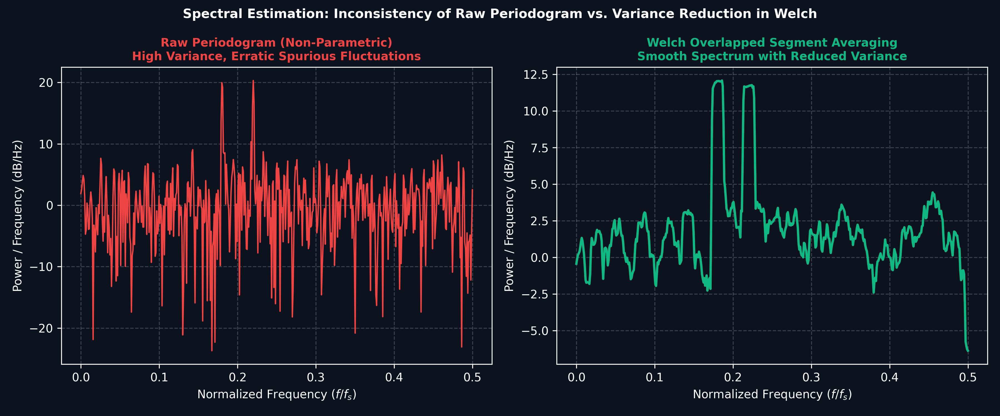
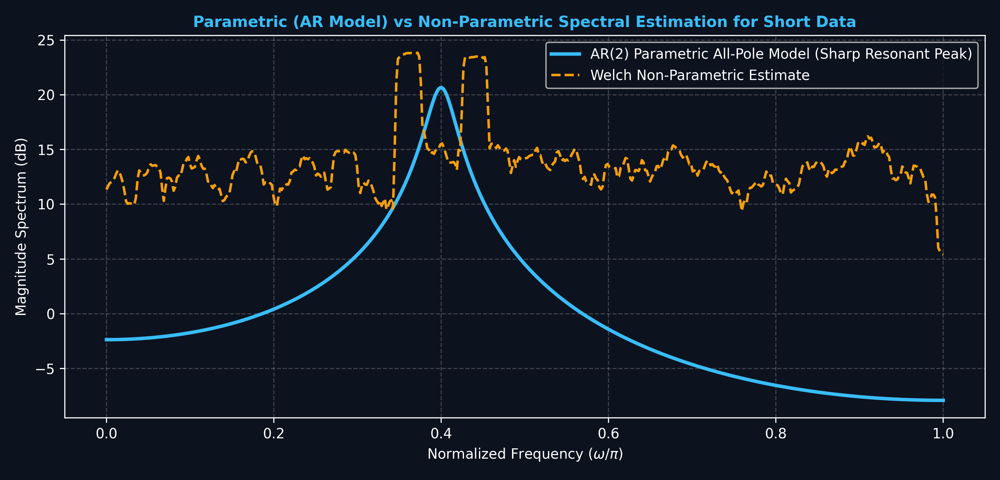

# Lecture 20: Spectral Estimation — Periodogram & Parametric Methods

**Course:** EE3621 — Digital Signal Processing  
**Target Audience:** III B.Tech EEE Students  
**Duration:** 40 Minutes  

* **Available Formats:** [LaTeX Source File](file:///C:/Users/sriph/Downloads/DSP/lecture_20.tex) | [Compiled PDF Notes](file:///C:/Users/sriph/Downloads/DSP/lecture_20.pdf)

---

## 1. Lecture Plan (40 Minutes Breakdown)
* **00:00 – 05:00 (5 mins):** Problem Statement: Estimating PSD from a finite record. Parametric vs. Non-parametric approaches.
* **05:00 – 15:00 (10 mins):** The Periodogram: Definition, Expected Value, Bias, and Variance (inconsistency).
* **15:00 – 22:00 (7 mins):** Improved Non-parametric Methods: Bartlett's, Welch's, and Blackman-Tukey methods.
* **22:00 – 32:00 (10 mins):** Parametric (AR) Spectral Estimation: AR modeling, Yule-Walker equations, Levinson-Durbin, and Lattice structures.
* **32:00 – 35:00 (3 mins):** Subspace Methods: Brief introduction to the MUSIC algorithm.
* **35:00 – 40:00 (5 mins):** Comparison Table, Checkpoints & Interactive Q&A.

---

## 2. Problem Statement: Spectral Estimation

In practical DSP applications (radar, speech processing, seismology), we never have an infinite-length signal. We are given a **finite data record**:
$$x[0], x[1], \dots, x[N-1]$$
Our goal is to estimate the **Power Spectral Density (PSD)**, denoted as $S_{xx}(e^{j\omega})$, of the underlying wide-sense stationary (WSS) random process.

There are two primary approaches to spectral estimation:
1.  **Non-parametric methods**: Make no assumptions about how the data was generated. These rely directly on the Fourier transform of the data or its estimated autocorrelation sequence.
2.  **Parametric methods**: Assume the signal is the output of a specific linear system (usually an All-Pole or AR model) driven by white noise. We estimate the model parameters and use them to compute the PSD analytically.

---

## 3. The Periodogram (Non-parametric)

### Visual Illustration: Spectral Estimation — Raw Periodogram vs. Welch Variance Reduction

* **Inconsistency of Periodogram:** The raw sample periodogram does not converge as record length increases ($	ext{Var}\{\hat{P}\} pprox P^2$). The Welch method segments data with $50\%$ overlap and averages windowed periodograms, dramatically suppressing noise variance.

---

### Visual Illustration: Parametric (AR Model) vs. Non-Parametric Spectrum

* **Parametric High Resolution:** For short data records, fitting an all-pole Autoregressive (AR) model avoids window leakage and resolves closely spaced spectral peaks far better than FFT methods.

The most intuitive way to estimate the power spectrum is to compute the Discrete-Time Fourier Transform (DTFT) of the finite segment and square its magnitude.

Let the truncated signal be $x_N[n] = x[n]w_R[n]$, where $w_R[n]$ is a rectangular window of length $N$. Its DTFT is:
$$X_N(e^{j\omega}) = \sum_{n=0}^{N-1} x[n]e^{-j\omega n}$$

The **Periodogram** estimate of the PSD is defined as:
$$\hat{S}_{xx}^P(e^{j\omega}) = \frac{1}{N} \left| X_N(e^{j\omega}) \right|^2$$

### Expected Value and Bias
Let's analyze the statistical properties of the periodogram. The expected value is:
$$E[\hat{S}_{xx}^P(e^{j\omega})] = E\left[ \frac{1}{N} X_N(e^{j\omega}) X_N^*(e^{j\omega}) \right]$$
$$= \frac{1}{N} \sum_{n=0}^{N-1} \sum_{m=0}^{N-1} E[x[n]x^*[m]] e^{-j\omega (n-m)}$$
Using the definition of autocorrelation $R_{xx}[n-m] = E[x[n]x^*[m]]$, and applying a change of variables $k = n-m$:
$$E[\hat{S}_{xx}^P(e^{j\omega})] = \sum_{k=-(N-1)}^{N-1} \left( 1 - \frac{|k|}{N} \right) R_{xx}[k] e^{-j\omega k}$$

This is exactly the DTFT of the true autocorrelation sequence multiplied by a Bartlett (triangular) window $w_B[k] = 1 - \frac{|k|}{N}$. In the frequency domain, multiplication becomes convolution:
$$E[\hat{S}_{xx}^P(e^{j\omega})] = \frac{1}{2\pi} \int_{-\pi}^{\pi} S_{xx}(e^{j\theta}) W_B(e^{j(\omega-\theta)}) d\theta$$
where $W_B(e^{j\omega}) = \frac{1}{N} |W_R(e^{j\omega})|^2$. 

**Physical Intuition**: The expected value is the true PSD convolved with the squared magnitude of the rectangular window's Fourier transform. This convolution smears the true spectrum (leakage) and limits resolution. As $N \to \infty$, $W_B(e^{j\omega})$ approaches an impulse, making the periodogram **asymptotically unbiased**.

### Variance and Inconsistency
For a Gaussian random process, the variance of the periodogram is approximately:
$$\text{Var}[\hat{S}_{xx}^P(e^{j\omega})] \approx S_{xx}^2(e^{j\omega})$$
Notice that the variance does **not** decrease as the data record length $N$ increases. It remains proportional to the square of the true spectrum! 
**KEY RESULT:** Because its variance does not tend to zero as $N \to \infty$, the periodogram is an **inconsistent estimator**. 

---

## 4. Improved Non-parametric Methods

To overcome the inconsistency of the periodogram, we can trade frequency resolution for reduced variance.

### 4.1 Bartlett's Method
Bartlett's method averages multiple independent periodograms to reduce variance.
1. Divide the $N$-point sequence into $K$ **non-overlapping** segments, each of length $L = N/K$.
2. Compute the periodogram for each segment: $\hat{S}_i(e^{j\omega})$.
3. Average them: 
   $$\hat{S}_{xx}^B(e^{j\omega}) = \frac{1}{K} \sum_{i=1}^K \hat{S}_i(e^{j\omega})$$

**Performance:**
* **Variance**: Reduced by a factor of $K$: $\text{Var} \approx \frac{1}{K} S_{xx}^2(e^{j\omega})$.
* **Resolution**: Reduced by a factor of $K$ because the mainlobe of the window of length $L$ is $K$ times wider than that of length $N$.

### 4.2 Welch's Method
Welch's method is the most widely used practical non-parametric method (e.g., `pwelch` in MATLAB/Python). It improves on Bartlett's method by:
1. Using **overlapping segments** (typically 50% to 75% overlap). This yields more segments $K$ for a given $N$, providing more averaging.
2. Applying a non-rectangular **window** (like Hanning or Hamming) to each segment before taking the FFT. This drastically reduces spectral leakage (sidelobes).

Because of the window, the normalization factor changes, but the variance is further reduced, yielding a much smoother PSD estimate.

### 4.3 Blackman-Tukey Method
Instead of averaging periodograms, the Blackman-Tukey method operates on the estimated autocorrelation.
1. Estimate the autocorrelation sequence $\hat{R}_{xx}[m]$ from the data for lags $|m| \le M$ (where $M \ll N$).
2. Multiply the estimate by a lag window $w[m]$ (e.g., Bartlett or Hamming) to suppress high-variance estimates at large lags.
3. Compute the DTFT:
   $$\hat{S}_{BT}(e^{j\omega}) = \sum_{m=-M}^{M} \hat{R}_{xx}[m]w[m]e^{-j\omega m}$$
This provides a smoothed spectrum by explicitly windowing the autocorrelation.

---

## 5. Parametric Spectral Estimation (AR Model)

Parametric methods can achieve **high resolution** even with short data records because they extrapolate the autocorrelation sequence beyond the available data based on a mathematical model.

The most common model is the **Autoregressive (AR) model**. We assume the signal $x[n]$ is the output of an all-pole filter of order $p$, driven by white noise $w[n]$ with variance $\sigma_w^2$.
$$x[n] = -\sum_{k=1}^p a_k x[n-k] + w[n]$$
Taking the Z-transform, the system transfer function is $H(z) = \frac{1}{A(z)} = \frac{1}{1 + \sum_{k=1}^p a_k z^{-k}}$.
The theoretical PSD is:
$$S_{xx}(e^{j\omega}) = |H(e^{j\omega})|^2 S_{ww}(e^{j\omega}) = \frac{\sigma_w^2}{|A(e^{j\omega})|^2}$$

To find the PSD, we just need to estimate the AR coefficients $\{a_1, a_2, \dots, a_p\}$ and $\sigma_w^2$ from the data.

### Yule-Walker Equations
By multiplying the AR difference equation by $x^*[n-m]$ and taking the expectation, we get the Yule-Walker equations:
$$\sum_{k=1}^p a_k R_{xx}[m-k] = -R_{xx}[m], \quad \text{for } m = 1, 2, \dots, p$$
In matrix form: $\mathbf{R}_{xx}\mathbf{a} = -\mathbf{r}_{xx}$.

### Lattice Structures and Levinson-Durbin
Solving $\mathbf{R}_{xx}\mathbf{a} = -\mathbf{r}_{xx}$ by direct inversion takes $O(p^3)$ operations. Since $\mathbf{R}_{xx}$ is a Toeplitz matrix, we can use the **Levinson-Durbin recursion** to solve it in $O(p^2)$ operations.

Levinson-Durbin is deeply related to **Lattice filters**. The algorithm recursively computes **reflection coefficients** $K_m$ (also called PARCOR coefficients), which can be mapped directly to the FIR lattice structure used in forward/backward prediction.
A single stage of an FIR lattice filter, representing the prediction error updates, is shown below:

By estimating these reflection coefficients directly from data (using methods like Burg's algorithm), we ensure the stability of the estimated AR model, which can also be embedded into a Lattice-Ladder structure for IIR filtering:

---

## 6. MUSIC Algorithm (Subspace Method)

The **Multiple Signal Classification (MUSIC)** algorithm is a high-resolution technique designed specifically to estimate the frequencies of sinusoids buried in noise.

1. Construct the empirical autocorrelation matrix $\hat{\mathbf{R}}$.
2. Perform Eigendecomposition: $\hat{\mathbf{R}} = \mathbf{V} \mathbf{\Lambda} \mathbf{V}^H$.
3. Partition the eigenvectors into a **Signal Subspace** (eigenvectors corresponding to the largest eigenvalues) and a **Noise Subspace** $\mathbf{V}_n$ (eigenvectors for the smallest eigenvalues).
4. The signal vectors are strictly orthogonal to the noise subspace. The MUSIC pseudospectrum is defined as:
   $$P_{\text{MUSIC}}(e^{j\omega}) = \frac{1}{\mathbf{v}^H(e^{j\omega}) \mathbf{V}_n \mathbf{V}_n^H \mathbf{v}(e^{j\omega})}$$
where $\mathbf{v}(e^{j\omega}) = [1, e^{j\omega}, \dots, e^{j\omega(M-1)}]^T$. 

$P_{\text{MUSIC}}$ exhibits extremely sharp peaks at the true frequencies, offering **super-resolution** far beyond the Fourier limit.

---

## 7. Comparison Table

| Method | Type | Resolution | Variance | Computational Cost | Best Used For |
| :--- | :--- | :--- | :--- | :--- | :--- |
| **Periodogram** | Non-parametric | Good ($1/N$) | High (Inconsistent) | Low ($O(N \log N)$) | Quick looks, theoretical baseline |
| **Bartlett** | Non-parametric | Poor ($K/N$) | Medium | Low | Seldom used (Welch is better) |
| **Welch** | Non-parametric | Medium | Low | Moderate | General practical spectral estimation |
| **AR (Levinson)** | Parametric | Very High | Low | Moderate ($O(p^2)$) | Short data records, peaked spectra |
| **MUSIC** | Subspace | Super-resolution | Very Low | High ($O(M^3)$ for SVD) | Resolving closely spaced sinusoids |

---

## 8. Summary of Key Formulas

| Concept | Formula |
| :--- | :--- |
| **Periodogram PSD** | $\hat{S}_{xx}^P(e^{j\omega}) = \frac{1}{N} \left| \sum_{n=0}^{N-1} x[n]e^{-j\omega n} \right|^2$ |
| **Expected Value (Bias)** | $E[\hat{S}^P] = \frac{1}{2\pi} \int_{-\pi}^{\pi} S_{xx}(e^{j\theta}) W_B(e^{j(\omega-\theta)}) d\theta$ |
| **AR Model Spectrum** | $S_{xx}(e^{j\omega}) = \frac{\sigma_w^2}{|1 + \sum_{k=1}^p a_k e^{-j\omega k}|^2}$ |
| **Yule-Walker Eq.** | $\mathbf{R}_{xx}\mathbf{a} = -\mathbf{r}_{xx}$ |

---

## 9. Checkpoint & Quick Review Questions

1. **Q1:** Why is the raw periodogram considered an "inconsistent estimator" of the power spectral density?
   * *Answer:* An estimator is consistent if its variance approaches zero as the number of data points $N \to \infty$. For the raw periodogram, the variance is approximately equal to the square of the true PSD ($S_{xx}^2(e^{j\omega})$) regardless of how large $N$ becomes. Because the variance does not decrease with increasing data length, it remains inconsistent.

2. **Q2:** In Welch's method, what is the purpose of using overlapping segments and non-rectangular windows (like Hanning) compared to Bartlett's method?
   * *Answer:* 
     * **Overlapping segments:** By overlapping segments (e.g., 50%), we can extract more segments $K$ from the same total record length $N$. Averaging over a larger number of segments further reduces the variance of the estimate.
     * **Non-rectangular windows:** Windowing smooths the edges of each data segment, dramatically reducing sidelobe levels (spectral leakage) compared to the rectangular windows implicitly used in Bartlett's method. This improves dynamic range and ensures weak signals aren't overwhelmed by leakage from strong signals.

3. **Q3:** How does an Autoregressive (AR) parametric spectral estimator achieve higher frequency resolution than the Periodogram for short data records?
   * *Answer:* Non-parametric methods implicitly assume that data outside the measurement window is zero, causing the spectrum to be convolved with the window's Fourier transform (broadening peaks). AR models fit a linear all-pole equation to the available data and analytically evaluate the transfer function. This effectively extrapolates the signal's autocorrelation to infinity, avoiding the sharp windowing effect and allowing it to resolve extremely closely spaced peaks even with a short data record.
