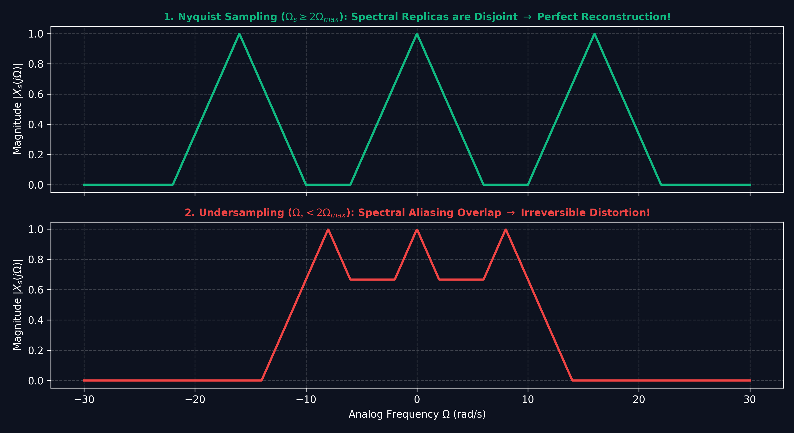
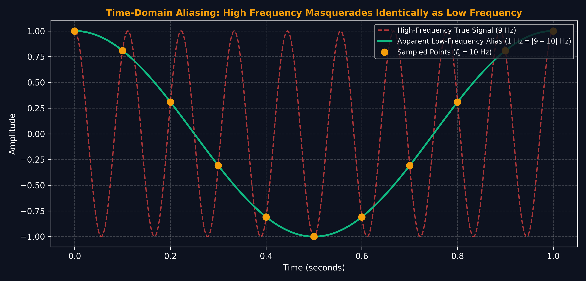

# Lecture 22: Sampling Theorem, Aliasing & A/D and D/A Conversion

**Course:** EE3621 — Digital Signal Processing  
**Target Audience:** III B.Tech EEE Students  
**Duration:** 40 Minutes  

* **Available Formats:** [LaTeX Source File](lecture_22.tex) | [Compiled PDF Notes](lecture_22.pdf)

---

## 1. Lecture Plan (40 Minutes Breakdown)
* **00:00 – 05:00 (5 mins):** Introduction to Continuous-Time Sampling & Mathematical modeling.
* **05:00 – 12:00 (7 mins):** Nyquist-Shannon Sampling Theorem: Formal statement, proof, and conditions.
* **12:00 – 17:00 (5 mins):** Aliasing phenomenon, folding frequency, and numerical example.
* **17:00 – 22:00 (5 mins):** Practical ADC Pipeline: Anti-aliasing, Sample-and-Hold, Quantization.
* **22:00 – 27:00 (5 mins):** Reconstruction (DAC): Zero-Order Hold (ZOH) droop and interpolation filters.
* **27:00 – 31:00 (4 mins):** Oversampling ADC: SNR improvement and quantization noise spreading.
* **31:00 – 35:00 (4 mins):** Sigma-Delta ADC: First-order and second-order noise shaping.
* **35:00 – 38:00 (3 mins):** Sample Rate Conversion: Rational $L/M$ factor and polyphase implementation.
* **38:00 – 40:00 (2 mins):** Checkpoints, Q&A, and conclusion.

---

## 2. Continuous-Time Sampling

### Physical Intuition
Sampling is the process of taking a continuous-time signal and measuring its value at discrete time intervals. Think of it like taking a stroboscopic video of a moving fan. If you take pictures fast enough, you capture the true motion. If too slow, the fan might appear to spin backward!

### Mathematical Model: Ideal Sampling
We model the ideal sampling of a continuous-time signal $x(t)$ by multiplying it with an impulse train (or Dirac comb) $p(t)$.

1. Let $T$ be the sampling period.
2. The sampling frequency is $f_s = 1/T$.
3. The impulse train is defined as:
   $$p(t) = \sum_{n=-\infty}^{\infty} \delta(t - nT)$$
4. The sampled signal $x_s(t)$ is the product:
   $$x_s(t) = x(t) \cdot p(t) = \sum_{n=-\infty}^{\infty} x(nT) \delta(t - nT)$$

### Frequency Domain Analysis (Derivation)
To understand what sampling does to the frequency content, we take the Fourier transform of $x_s(t)$.

1. The Fourier transform of a product in time is a convolution in frequency:
   $$X_s(f) = X(f) * P(f)$$
2. The Fourier transform of the impulse train $p(t)$ is another impulse train in the frequency domain:
   $$P(f) = \frac{1}{T} \sum_{k=-\infty}^{\infty} \delta\left(f - \frac{k}{T}\right) = f_s \sum_{k=-\infty}^{\infty} \delta(f - kf_s)$$
3. Substituting $P(f)$ into the convolution equation:
   $$X_s(f) = X(f) * \left( f_s \sum_{k=-\infty}^{\infty} \delta(f - kf_s) \right)$$
4. Using the distributive property of convolution and the sifting property of the Dirac delta function ($X(f) * \delta(f - f_0) = X(f - f_0)$):
   $$X_s(f) = f_s \sum_{k=-\infty}^{\infty} X(f - kf_s)$$

**KEY RESULT:** The spectrum of the sampled signal, $X_s(f)$, consists of periodically repeating copies (images) of the original baseband spectrum $X(f)$, scaled by $f_s$ and shifted by integer multiples of the sampling frequency $f_s$.

---

## 3. Nyquist-Shannon Sampling Theorem

### Visual Illustration: Continuous Sampling & Frequency Replicas

* **Nyquist Criterion:** Sampling in time duplicates the baseband spectrum at integer multiples of sampling frequency $\Omega_s$. If $\Omega_s \geq 2\Omega_{max}$, replicas remain disjoint and the signal can be perfectly recovered.

---

### Visual Illustration: Time-Domain Aliasing (High Frequency Masquerading)

* **Aliasing Pitfall:** When a $9	ext{ Hz}$ sine wave is sampled at $10	ext{ Hz}$, the discrete samples fall on points identical to a $1	ext{ Hz}$ wave, creating an inescapable false low-frequency alias.

### Formal Statement
If a continuous-time signal $x(t)$ is bandlimited to $f_{max}$ (meaning $X(f) = 0$ for $|f| > f_{max}$), then $x(t)$ can be perfectly reconstructed from its discrete samples $x(nT)$ if and only if the sampling frequency $f_s$ satisfies:
$$f_s \geq 2f_{max}$$
The minimum required sampling rate, $2f_{max}$, is called the **Nyquist rate**.

### Proof of Reconstruction
1. If $f_s \geq 2f_{max}$, the spectral copies in $X_s(f)$ do not overlap. The baseband copy is perfectly preserved in the interval $[-f_s/2, f_s/2]$.
2. To recover $x(t)$, we apply an ideal lowpass filter (brick-wall filter) $H(f)$ with a gain of $T$ and a cutoff frequency $f_c$ such that $f_{max} \leq f_c \leq f_s - f_{max}$. Typically, we choose $f_c = f_s/2$.
3. The frequency response of this ideal filter is:
   $$H(f) = T \cdot \text{rect}\left(\frac{f}{f_s}\right)$$
4. The recovered spectrum is $X_r(f) = X_s(f) H(f) = X(f)$.
5. In the time domain, multiplication in frequency becomes convolution in time. The inverse Fourier transform of $H(f)$ is the sinc function:
   $$h(t) = \text{sinc}(f_s t) = \frac{\sin(\pi f_s t)}{\pi f_s t}$$
6. The reconstructed signal is:
   $$x(t) = x_s(t) * h(t) = \left( \sum_{n=-\infty}^{\infty} x(nT) \delta(t - nT) \right) * \text{sinc}(f_s t)$$
7. Evaluating the convolution yields the ideal sinc interpolation formula:
   $$x(t) = \sum_{n=-\infty}^{\infty} x[n] \text{sinc}(f_s (t - nT)) = \sum_{n=-\infty}^{\infty} x[n] \text{sinc}(f_s t - n)$$

---

## 4. Aliasing

### When the Nyquist Criterion is Violated
If $f_s < 2f_{max}$, the shifted spectral copies in $X_s(f)$ will overlap. This overlapping of high-frequency components into the lower-frequency bands is called **aliasing**. Once aliasing occurs, the original signal is irreversibly distorted, and perfect reconstruction is impossible.

### Aliased Frequency Calculation
When a frequency component $f$ is sampled at $f_s$, it can appear at multiple alias frequencies. The apparent (aliased) frequency in the baseband $[-f_s/2, f_s/2]$ is given by:
$$f_a = |f - kf_s|$$
where $k$ is the integer that brings $f_a$ into the range $[0, f_s/2]$.

### Numerical Example:
**Problem:** A 3 kHz tone is sampled at 4 kHz. What frequency will be observed in the reconstructed signal?
**Calculation:**
1. Original frequency: $f = 3$ kHz.
2. Sampling frequency: $f_s = 4$ kHz.
3. Check Nyquist: $2f = 6 \text{ kHz} > 4 \text{ kHz}$. Aliasing will occur!
4. Calculate alias for $k=1$:
   $$f_a = |3 \text{ kHz} - 1 \times 4 \text{ kHz}| = |-1| \text{ kHz} = 1 \text{ kHz}$$
**Conclusion:** The 3 kHz tone masquerades as a 1 kHz tone. 

---

## 5. Practical ADC Pipeline

A real-world Analog-to-Digital Converter (ADC) requires several stages:

1. **Anti-Aliasing Filter (AAF):** An analog Low-Pass Filter (LPF) placed before sampling to strictly enforce the bandlimit $f_{max} < f_s/2$. Because practical analog filters cannot have a perfect "brick-wall" roll-off, we must sample at a rate somewhat higher than $2f_{max}$ to provide a transition band. For example, CD audio has $f_{max} = 20$ kHz, but uses $f_s = 44.1$ kHz (leaving a 2.05 kHz transition band).
2. **Sample-and-Hold (S/H):** Captures the continuous voltage and holds it steady while the quantizer resolves the bits.
3. **Quantizer:** Maps the continuous voltage level to the nearest discrete level.
4. **Encoder:** Assigns a digital binary code to the quantized level.

---

## 6. Reconstruction (DAC)

### Zero-Order Hold (ZOH)
Practical DACs cannot output infinitely narrow Dirac impulses. Instead, they hold the sample value constant for the entire sampling period $T$.
1. The impulse response of a ZOH is a rectangular pulse:
   $$h_{ZOH}(t) = 1 \quad \text{for } 0 \leq t < T$$
2. The frequency response is the Fourier transform of this pulse:
   $$H_{ZOH}(f) = T \text{sinc}(fT) e^{-j\pi fT}$$
3. **ZOH Distortion (Droop):** The magnitude $|H_{ZOH}(f)|$ rolls off, attenuating higher frequencies in the baseband. At $f = f_s/2$, the attenuation is $\text{sinc}(0.5) \approx 0.636$ (or about -4 dB).

### Interpolation Filter
To compensate for the ZOH droop and to remove the spectral images at multiples of $f_s$, a digital or analog **interpolation filter** is used. Designing this filter involves specifying a flat passband (sometimes with inverse-sinc equalization) and high stopband attenuation.

These filters are often FIR filters designed using the window method. The choice of window affects the stopband rejection. The time-domain shapes of standard windows are shown below.

A poor window choice (like rectangular) results in the Gibbs phenomenon, causing passband ripples and poor image rejection, as shown here:

---

## 7. Oversampling ADC

Oversampling means sampling at $k f_s$, where $f_s$ is the required Nyquist rate and $k \gg 1$ is the oversampling ratio (OSR).

### Benefits of Oversampling
1. **Simplified Analog Anti-Aliasing Filter:** The transition band is massively widened, allowing the use of simple, low-order analog RC filters.
2. **Quantization Noise Reduction:** A standard quantizer introduces a noise power $P_q = \Delta^2 / 12$. If assumed white, this noise is spread evenly over the Nyquist bandwidth $[0, kf_s/2]$.
3. **Digital Filtering:** After conversion, a digital lowpass filter removes noise outside the baseband $[0, f_s/2]$.
4. The remaining noise power in the baseband is reduced by a factor of $1/k$.
5. **SQNR Improvement:** The Signal-to-Quantization-Noise Ratio (SQNR) improves by:
   $$\Delta \text{SQNR} = 10 \log_{10}(k) \text{ dB}$$
   Every doubling of the sampling rate ($k$ multiplied by 2) yields a 3 dB improvement, equivalent to gaining 0.5 bits of resolution.

---

## 8. Sigma-Delta ($\Sigma\Delta$) ADC

Sigma-Delta ADCs combine massive oversampling with **noise shaping**.

### First-Order Noise Shaping
By placing the quantizer inside a feedback loop with an integrator, the quantization noise is high-pass filtered (pushed to high frequencies), while the signal passes through unchanged.
1. The noise transfer function (NTF) is $1 - z^{-1}$.
2. In the frequency domain, $|NTF(f)| = 2 \sin(\pi f / (k f_s))$.
3. At low frequencies (baseband), the noise is severely attenuated.
4. The shaped noise is then filtered out by a digital decimation filter.
5. First-order shaping provides a 9 dB SQNR improvement per octave of oversampling (1.5 bits).

### Second-Order Noise Shaping
Using two integrators in the loop gives a second-order noise shaping:
$$NTF(z) = (1 - z^{-1})^2$$
This provides a 15 dB SQNR improvement per octave (2.5 bits), allowing a simple 1-bit quantizer (comparator) running at MHz speeds to achieve 24-bit audio resolution after decimation!

---

## 9. Sample Rate Conversion

Often, we need to interface systems operating at different sample rates (e.g., 44.1 kHz CD audio to 48 kHz DVD audio).

### Rational $L/M$ Factor Conversion
If the ratio of the new rate to the old rate is a rational number $L/M$:
1. **Interpolation (Up-sampling) by $L$:** Insert $L-1$ zeros between each sample. This expands the sample rate to $L f_s$.
2. **Low-Pass Filter:** Apply a digital low-pass filter at the intermediate high rate to remove imaging.
3. **Decimation (Down-sampling) by $M$:** Keep only every $M$-th sample, reducing the rate to $(L/M) f_s$.

### Polyphase Filter Implementation
To avoid computing filter outputs that will just be discarded by the decimator, or multiplying by zero during interpolation, the filter is decomposed into $L$ sub-filters (polyphase decomposition). This allows the filtering to happen at the lower, more computationally efficient sample rates.

---

## 10. Key Formulas Table

| Concept | Formula |
| :--- | :--- |
| Sampled Spectrum | $X_s(f) = f_s \sum_k X(f - kf_s)$ |
| Nyquist Criterion | $f_s \geq 2f_{max}$ |
| Ideal Reconstruction | $x(t) = \sum_n x[n]\text{sinc}(f_s t - n)$ |
| Aliased Frequency | $f_a = \|f - kf_s\|$ |
| ZOH Frequency Response | $H_{ZOH}(f) = T\text{sinc}(fT)e^{-j\pi fT}$ |
| Oversampling SQNR Gain | $10\log_{10}(k)$ dB |

---

## 11. Checkpoints & Quick Review Questions

1. **Q1:** An analog signal with frequency components up to 15 kHz is sampled at 20 kHz. Is the Nyquist criterion met? If a 12 kHz component exists in the signal, at what frequency will it appear in the sampled digital signal?
   * *Answer:*
     * The Nyquist criterion requires $f_s \geq 2 f_{max}$. Here, $2f_{max} = 30$ kHz, but $f_s = 20$ kHz. Thus, $20 < 30$, so the **Nyquist criterion is NOT met**.
     * To find the aliased frequency of the 12 kHz tone, we use $f_a = |f - kf_s|$. For $k=1$:
       $$f_a = |12 \text{ kHz} - 1(20 \text{ kHz})| = |-8 \text{ kHz}| = 8 \text{ kHz}$$
     * The 12 kHz tone will appear as an **8 kHz alias**.

2. **Q2:** Explain physically why a Zero-Order Hold (ZOH) circuit introduces distortion (droop) in the reconstructed signal's passband, and how a digital interpolation filter can correct this.
   * *Answer:*
     * Physically, holding a sample constant for duration $T$ creates a stair-step waveform. The sharp edges of these steps contain high-frequency energy, but the "flat" part essentially acts as a low-pass averager in the time domain, which attenuates the higher frequencies of the original baseband signal.
     * Mathematically, this is the $\text{sinc}(fT)$ frequency response.
     * An interpolation filter can correct this by applying an "inverse-sinc" equalization in its passband—meaning its gain slightly increases at higher frequencies to perfectly cancel out the ZOH attenuation before sharply cutting off to remove images.

3. **Q3:** Why does a Sigma-Delta ADC use a 1-bit quantizer instead of a multi-bit quantizer, given that 1-bit quantization introduces massive quantization noise?
   * *Answer:*
     * A 1-bit quantizer is perfectly linear, eliminating the differential non-linearity (DNL) errors inherent in multi-bit resistor ladders.
     * While 1-bit quantization adds huge noise, the feedback loop in the $\Sigma\Delta$ architecture performs **noise shaping**, pushing this noise to very high frequencies outside the signal band.
     * Massive **oversampling** combined with a digital low-pass decimation filter completely removes this high-frequency noise, leaving an incredibly high Signal-to-Noise Ratio (equivalent to 24 bits of resolution) in the baseband.
