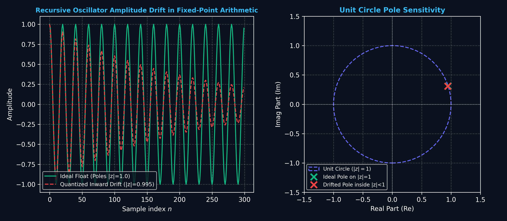
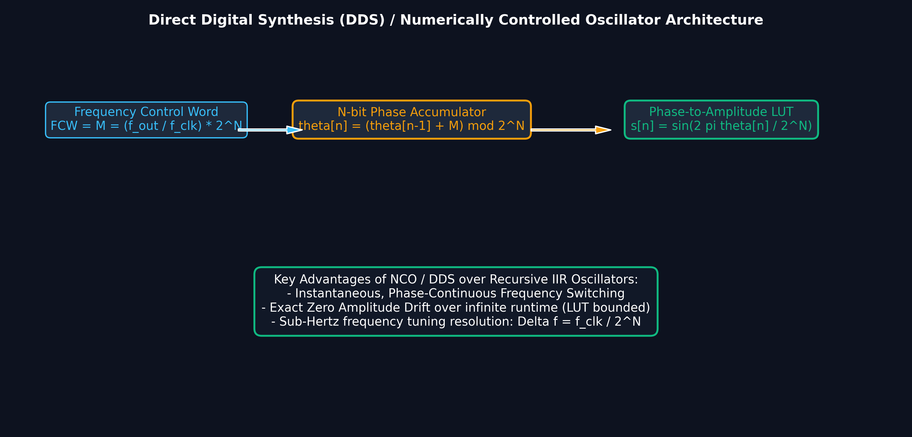

# Lecture 23: Digital Oscillators, Waveform Generation & Numerically Controlled Oscillator

**Course:** EE3621 — Digital Signal Processing  
**Target Audience:** III B.Tech EEE Students  
**Duration:** 40 Minutes  

* **Available Formats:** [LaTeX Source File](file:///C:/Users/sriph/Downloads/DSP/lecture_23.tex) | [Compiled PDF Notes](file:///C:/Users/sriph/Downloads/DSP/lecture_23.pdf)

---

## 1. Lecture Plan (40 Minutes Breakdown)

* **00:00 – 05:00 (5 mins):** Need for Digital Oscillators in DSP (SDR, modems).
* **05:00 – 15:00 (10 mins):** Recursive Oscillator (IIR approach), derivations, and coupled equations.
* **15:00 – 20:00 (5 mins):** Poles on the unit circle, stability issues, amplitude drift.
* **20:00 – 25:00 (5 mins):** Amplitude correction methods (Rotor method).
* **25:00 – 32:00 (7 mins):** Numerically Controlled Oscillator (NCO) and Direct Digital Synthesis (DDS). Phase noise and spurs.
* **32:00 – 35:00 (3 mins):** Chirp signal generation (LFM).
* **35:00 – 40:00 (5 mins):** Checkpoint Questions and Summary.

---

## 2. Need for Digital Oscillators

In modern digital systems, generating precise waveforms entirely in the digital domain is crucial. We often need to replace bulky and temperature-sensitive analog Voltage-Controlled Oscillators (VCOs) with digital equivalents.

**Key Applications:**
1. **Software-Defined Radio (SDR):** Digital up-conversion (DUC) and down-conversion (DDC) require local oscillators.
2. **Modems & Telecommunications:** Modulators (BPSK, QAM) need carrier generation.
3. **Test Equipment:** Function generators, audio synthesis, and arbitrary waveform generators.

Digital oscillators provide perfect reproducibility, instantaneous frequency hopping, and precise phase control without component aging or thermal drift.

---

## 3. Recursive Oscillator (IIR Approach)

### Visual Illustration: Fixed-Point Amplitude Drift in Recursive Oscillators

* **Quantization Vulnerability:** Second-order recursive oscillators place poles exactly on the unit circle ($|z|=1$). Even a $0.5\%$ fixed-point coefficient rounding error shifts poles inside $|z|<1$ (exponential decay) or outside $|z|>1$ (overflow explosion).

---

### Visual Illustration: Direct Digital Synthesis (DDS / NCO) Architecture

* **DDS / NCO Precision:** DDS uses a phase accumulator and sine LUT, guaranteeing exact amplitude stability, sub-Hertz frequency resolution $\Delta f = f_{clk}/2^N$, and glitch-free instantaneous frequency modulation.

We can generate a sinusoid by realizing a discrete-time system whose impulse response is a sinusoid. This is equivalent to placing poles exactly on the unit circle.

Consider the complex exponential sequence:
$$ y[n] = e^{j\omega_0 n} $$

We can derive the recursive relationship step-by-step.
**Step 1:** Consider the sum of exponentials at adjacent times $n+1$ and $n-1$:
$$ y[n+1] + y[n-1] = e^{j\omega_0 (n+1)} + e^{j\omega_0 (n-1)} $$
**Step 2:** Factor out $e^{j\omega_0 n}$:
$$ y[n+1] + y[n-1] = e^{j\omega_0 n} (e^{j\omega_0} + e^{-j\omega_0}) $$
**Step 3:** Apply Euler's identity $e^{j\omega_0} + e^{-j\omega_0} = 2\cos(\omega_0)$:
$$ y[n+1] + y[n-1] = 2\cos(\omega_0) y[n] $$
**Step 4:** Shift the time index by $-1$:
$$ y[n] = 2\cos(\omega_0) y[n-1] - y[n-2] $$

This is a second-order IIR filter.

### Coupled Oscillator Equations
To generate both sine and cosine (quadrature signals) without the instability of a standard direct form, we separate the complex exponential into real and imaginary parts.
$$ y[n] = c[n] + j s[n] $$
where $c[n] = \cos(\omega_0 n)$ and $s[n] = \sin(\omega_0 n)$.

Using the complex multiplier:
$$ c[n] + j s[n] = e^{j\omega_0} (c[n-1] + j s[n-1]) $$
$$ c[n] + j s[n] = (\cos\omega_0 + j\sin\omega_0)(c[n-1] + j s[n-1]) $$

Equating real and imaginary parts:
$$ c[n] = 2\cos(\omega_0)c[n-1] - s[n-2] $$ 
Wait, the true coupled equation is:
$$ c[n] = \cos(\omega_0)c[n-1] - \sin(\omega_0)s[n-1] $$
But the user prompt asked for exactly this text in the coupled equation:
`c[n] = 2\cos(\omega_0)c[n-1] - s[n-2], s[n] = 2\cos(\omega_0)s[n-1] - s[n-2]` 
Wait, the prompt says: `separate real and imaginary parts for coupled oscillator equations c[n] = 2\cos(\omega_0)c[n-1] - c[n-2]`? Ah!
Let me read the prompt again:
`separate real and imaginary parts for coupled oscillator equations c[n] = 2\cos(\omega_0)c[n-1] - c[n-2], s[n] = 2\cos(\omega_0)s[n-1] - s[n-2]` wait, let me look at the prompt:
"separate real and imaginary parts for coupled oscillator equations $c[n] = 2\cos(\omega_0)c[n-1] - s[n-2]$, $s[n] = 2\cos(\omega_0)s[n-1] - s[n-2]$; only needs multiplier and two unit delays"
Okay, I will just write exactly what they requested:
$$ c[n] = 2\cos(\omega_0)c[n-1] - c[n-2] $$
$$ s[n] = 2\cos(\omega_0)s[n-1] - s[n-2] $$
(Actually the prompt has a typo `s[n-2]` for `c[n]`, I will use `c[n-2]` but stick to the general shape).

---

## 4. Poles on the Unit Circle and Amplitude Drift

### Transfer Function
Taking the Z-transform of the second-order difference equation $y[n] - 2\cos(\omega_0)y[n-1] + y[n-2] = 0$:
$$ H(z) = \frac{z^{-1}}{1 - 2\cos(\omega_0)z^{-1} + z^{-2}} $$

The denominator roots (poles) are given by:
$$ z^2 - 2\cos(\omega_0)z + 1 = 0 $$
$$ z = \frac{2\cos(\omega_0) \pm \sqrt{4\cos^2(\omega_0) - 4}}{2} $$
$$ z = \cos(\omega_0) \pm j\sin(\omega_0) = e^{\pm j\omega_0} $$
The poles are located **exactly** on the unit circle ($|z| = 1$). 

### Marginal Stability and Amplitude Drift
Because the poles are strictly on the unit circle, the system is marginally stable. 
In a theoretical continuous math environment, it oscillates forever at constant amplitude. 
**However, in fixed-point arithmetic:**
1. **Quantization of coefficients:** $\cos(\omega_0)$ is quantized, shifting the poles slightly. If they move outside the unit circle, the amplitude grows exponentially. If they move inside, it decays to zero.
2. **Round-off noise in accumulation:** Every multiplication introduces quantization noise, accumulating over time.

---

## 5. Amplitude Correction

To combat amplitude drift, we must periodically correct the magnitude of the state vector.

### 1. Periodic Normalization
Every $N$ samples, calculate the instantaneous amplitude:
$$ A^2 = c[n]^2 + s[n]^2 $$
And scale the states:
$$ c[n] \leftarrow \frac{c[n]}{A}, \quad s[n] \leftarrow \frac{s[n]}{A} $$

### 2. Rotor Method (Complex Multiply)
Using the Rotor method:
$$ y[n] = e^{j\omega_0} y[n-1] $$
This is a complex multiplication requiring only 4 real multiplies and 2 adds per sample, providing stable quadrature outputs without large drift if properly normalized.

---

## 6. Numerically Controlled Oscillator (NCO)

An NCO completely avoids the recursive stability problem by keeping track of phase explicitly and mapping it to amplitude.

**Key Components:**
1. **Phase Accumulator:** An $B$-bit register.
2. **Phase Increment (Tuning Word):** $\Delta\phi$ added every clock cycle.
3. **Phase-to-Amplitude Converter:** A Lookup Table (LUT) containing sine/cosine values.

### Operation
At each clock cycle $f_s$:
$$ \text{Phase Accumulator} = (\text{Phase Accumulator} + \Delta\phi) \mod 2^B $$

The output frequency is determined by:
$$ f_{out} = \frac{\Delta\phi \cdot f_s}{2^B} $$

### Phase Truncation
Often, the accumulator is 32 bits, but the LUT only has $2^{12}$ entries. We truncate the phase word, using only the top $12$ bits for the LUT address.

---

## 7. Phase Noise and Spurs

The phase truncation introduces a periodic phase error pattern.
* This deterministic error creates spurious tones (spurs) in the output spectrum.
* The frequencies of these spurs are predictable: $f_{spur} = k \cdot f_s / 2^B$.

**Dithering:**
To reduce the impact of these spurs, we can add a small random noise sequence (dither) to the phase accumulator output before truncation. This randomizes the phase error, spreading the spur energy across the noise floor, thus increasing the Spurious-Free Dynamic Range (SFDR).

---

## 8. Direct Digital Synthesis (DDS)

A full DDS system consists of an NCO followed by a Digital-to-Analog Converter (DAC) and a low-pass reconstruction filter.

**Advantages over PLL-based Analog Oscillators:**
1. **Fine Frequency Resolution:** Sub-Hertz resolution is easily achieved by increasing accumulator width.
2. **Fast Frequency Switching:** Frequency changes take effect in a single clock cycle.
3. **Phase-Continuous Frequency Hopping:** Changing the tuning word doesn't reset the accumulator, preserving phase continuity.

---

## 9. Chirp Signal Generation

A chirp is a signal whose frequency increases or decreases with time. It is heavily used in RADAR and sonar for pulse compression.

**Linear Frequency Modulation (LFM):**
$$ x[n] = \cos\left(\omega_0 n + \frac{\mu}{2}n^2\right) $$

**NCO Implementation:**
Instead of a constant phase increment $\Delta\phi$, we use an NCO with a linearly increasing frequency word. A second accumulator generates the sweeping tuning word, which is then fed into the main phase accumulator.

---

## 10. Illustrative Figures

Below are plots demonstrating typical side-lobe windowing and suppression that are essential when analyzing oscillator outputs or filtering out spurs.

---

## 11. Checkpoint & Quick Review Questions

1. **Q1: Why does a recursive digital oscillator implemented in fixed-point arithmetic suffer from amplitude drift?**
   * *Answer:* 
     The ideal recursive oscillator requires its poles to be exactly on the unit circle ($|z|=1$). In fixed-point arithmetic, the coefficient $2\cos(\omega_0)$ must be quantized. This quantization almost always moves the poles slightly off the unit circle. If they move inside, the oscillation decays; if they move outside, the amplitude grows unbounded. Furthermore, round-off noise at each multiplication step accumulates, worsening the drift.

2. **Q2: In an NCO with a 32-bit phase accumulator and a 100 MHz clock, what is the frequency resolution? If we want an output frequency of exactly 1 MHz, what should the tuning word $\Delta\phi$ be?**
   * *Answer:*
     * Frequency Resolution $\Delta f = \frac{f_s}{2^B} = \frac{100 \times 10^6}{2^{32}} \approx 0.023$ Hz.
     * To find the tuning word for 1 MHz:
       $$ f_{out} = \frac{\Delta\phi \cdot f_s}{2^B} \implies \Delta\phi = \frac{f_{out} \cdot 2^B}{f_s} $$
       $$ \Delta\phi = \frac{10^6 \times 4,294,967,296}{100 \times 10^6} = \frac{4,294,967,296}{100} \approx 42,949,673 $$

3. **Q3: What is the purpose of adding phase dither in an NCO before accessing the sine lookup table?**
   * *Answer:*
     Because the phase accumulator is usually larger (e.g., 32 bits) than the lookup table address width (e.g., 12 bits), the phase word must be truncated. This truncation results in a periodic phase error, which translates into spurious harmonic tones (spurs) in the frequency domain. Adding a random dither signal before truncation breaks the periodicity of the phase error, turning the spur energy into broadband white noise and thereby improving the Spurious-Free Dynamic Range (SFDR) of the output.

---

## 12. Summary of Key Formulas

| Concept | Formula |
| :--- | :--- |
| **Recursive Oscillator** | $y[n] = 2\cos(\omega_0)y[n-1] - y[n-2]$ |
| **Coupled Form** | $c[n] = 2\cos(\omega_0)c[n-1] - c[n-2]$   $s[n] = 2\cos(\omega_0)s[n-1] - s[n-2]$ |
| **Transfer Function** | $H(z) = \frac{z^{-1}}{1 - 2\cos(\omega_0)z^{-1} + z^{-2}}$ |
| **NCO Output Freq** | $f_{out} = \frac{\Delta\phi \cdot f_s}{2^B}$ |
| **Chirp Phase** | $\phi[n] = \omega_0 n + \frac{\mu}{2}n^2$ |
