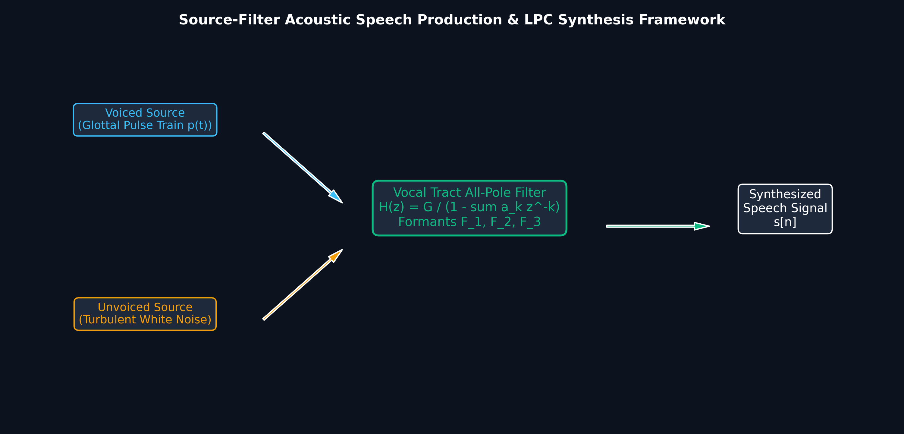
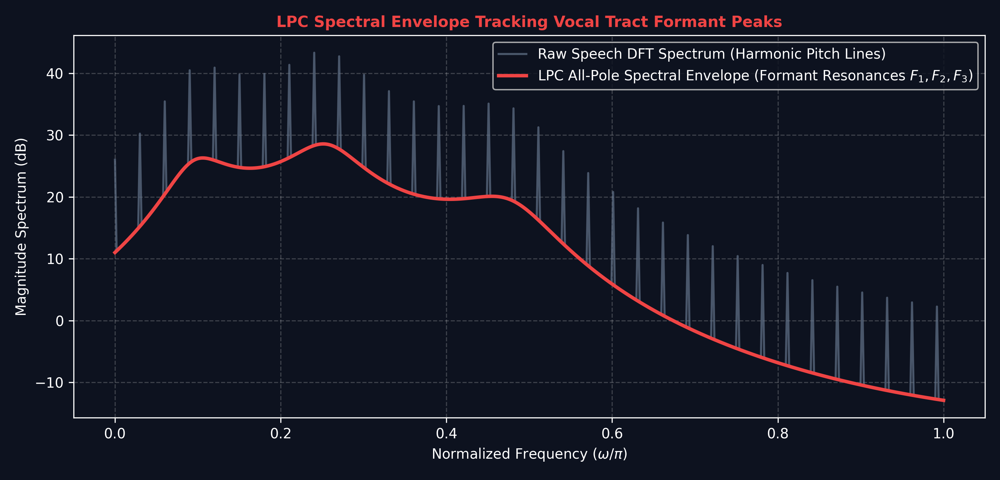

# Lecture 24: Linear Prediction & Vocoder / Speech Processing

**Course:** EE3621 — Digital Signal Processing  
**Target Audience:** III B.Tech EEE Students  
**Duration:** 40 Minutes  

* **Available Formats:** [LaTeX Source File](file:///C:/Users/sriph/Downloads/DSP/lecture_24.tex) | [Compiled PDF Notes](file:///C:/Users/sriph/Downloads/DSP/lecture_24.pdf)

---

## 1. Lecture Plan (40 Minutes Breakdown)

* **00:00 – 06:00 (6 mins):** **Speech Production Model**: Source-filter model; glottal excitation (voiced) or white noise (unvoiced); vocal tract as all-pole filter; formants as poles.
* **06:00 – 12:00 (6 mins):** **Linear Prediction (LP)**: Predict $x[n]$ from past $p$ samples; formulate prediction error; objective function.
* **12:00 – 18:00 (6 mins):** **Normal (Yule-Walker) Equations**: Deriving the Yule-Walker equations; Toeplitz matrix structure.
* **18:00 – 24:00 (6 mins):** **Levinson-Durbin Algorithm**: Efficient recursive solution; PARCOR coefficients and stability condition.
* **24:00 – 30:00 (6 mins):** **LPC Vocoder**: Analysis and synthesis sides; voiced/unvoiced classification; low bit rate encoding.
* **30:00 – 35:00 (5 mins):** **Cepstrum & MFCCs**: Homomorphic analysis; log-spectrum deconvolution; Mel scale and feature extraction.
* **35:00 – 40:00 (5 mins):** **Pitch Detection Algorithms \& Checkpoints**: Autocorrelation, AMDF; Q\&A.

---

## 2. Speech Production Model

### Visual Illustration: Source-Filter Speech Production Model

* **Acoustic Speech Synthesis:** Voiced pitch pulses (vocal cords) or unvoiced white noise (fricatives) excite a time-varying all-pole vocal tract filter $H(z) = G / A(z)$ to produce intelligible speech.

---

### Visual Illustration: LPC Spectral Envelope Formant Tracking

* **Formant Extraction:** Linear Predictive Coding (LPC) estimates the coefficients $a_k$, smoothing out fine glottal pitch harmonics to track major acoustic resonance peaks ($F_1, F_2, F_3$) for speech recognition and vocoder compression.

The physical process of human speech generation can be approximated by the **Source-Filter Model**. In this paradigm, the speech signal is the output of a linear time-invariant (LTI) (or slowly time-varying) system.

### 2.1 Excitation Source (The "Source")
The source models the air expelled from the lungs, which provides the initial excitation signal $e[n]$:
1.  **Voiced Speech (e.g., vowels /a/, /e/):** 
    The vocal cords vibrate periodically. The excitation is modeled as a quasi-periodic impulse train with period $T_0$ (pitch period).
2.  **Unvoiced Speech (e.g., consonants /s/, /sh/):**
    The vocal cords remain open, and air creates turbulence. The excitation is modeled as random white noise.

### 2.2 Vocal Tract Filter (The "Filter")
The throat, mouth, and nasal cavities act as an acoustic tube that shapes the spectrum of the excitation. This is modeled as an **all-pole filter** $H(z)$:
$$ H(z) = \frac{G}{1 + \sum_{k=1}^{p} a_k z^{-k}} $$
where:
*   $G$ is the gain.
*   $a_k$ are the filter coefficients (LPC coefficients).
*   $p$ is the order of the filter (typically 10 to 12 for speech).

**Physical Intuition:** The poles of $H(z)$ correspond to the resonant frequencies of the vocal tract, known as **formants**. By finding the coefficients $a_k$, we accurately model the shape of the vocal tract.

---

## 3. Linear Prediction (LP) Formulation

The core idea of Linear Prediction is that a speech sample $x[n]$ can be well approximated as a linear combination of its past $p$ samples.

### 3.1 The Prediction Model
Let the predicted value be $\hat{x}[n]$:
$$ \hat{x}[n] = -\sum_{k=1}^{p} a_k x[n-k] $$
*(Note: The negative sign is standard convention to simplify the all-pole filter representation).*

### 3.2 The Prediction Error
The actual sample $x[n]$ differs from the prediction by an error (or residual) $e[n]$:
$$ e[n] = x[n] - \hat{x}[n] $$
Substituting $\hat{x}[n]$:
$$ e[n] = x[n] + \sum_{k=1}^{p} a_k x[n-k] $$

**KEY RESULT:** In the $z$-domain, $E(z) = X(z) A(z)$, where $A(z) = 1 + \sum_{k=1}^p a_k z^{-k}$ is the **inverse filter** (or analysis filter).

### 3.3 Objective Function
Our goal is to find the coefficients $a_k$ that minimize the mean squared prediction error:
$$ J = E\{e^2[n]\} $$

---

## 4. Normal (Yule-Walker) Equations

To minimize $J$, we take the partial derivative of $J$ with respect to each coefficient $a_m$ and set it to zero.

### 4.1 Derivation Steps
1.  **Objective:** $J = E\left\{ \left( x[n] + \sum_{k=1}^{p} a_k x[n-k] \right)^2 \right\}$
2.  **Differentiate:**
    $$ \frac{\partial J}{\partial a_m} = E\left\{ 2 \left( x[n] + \sum_{k=1}^{p} a_k x[n-k] \right) x[n-m] \right\} = 0 $$
    for $m = 1, 2, \dots, p$.
3.  **Distribute Expectation:**
    $$ E\{ x[n]x[n-m] \} + \sum_{k=1}^{p} a_k E\{ x[n-k]x[n-m] \} = 0 $$
4.  **Use Autocorrelation Definition:** Let $R_{xx}[m] = E\{ x[n]x[n-m] \}$. Since the signal is assumed wide-sense stationary, $E\{ x[n-k]x[n-m] \} = R_{xx}[m-k]$.
5.  **Final Equations:**
    $$ R_{xx}[m] + \sum_{k=1}^{p} a_k R_{xx}[m-k] = 0 $$
    $$ \sum_{k=1}^{p} a_k R_{xx}[m-k] = -R_{xx}[m] \quad \text{for } m = 1, 2, \dots, p $$

### 4.2 Matrix Formulation
We can write this system of $p$ linear equations in matrix form $\mathbf{R}\mathbf{a} = -\mathbf{r}$:
$$
\begin{bmatrix}
R_{xx}[0] & R_{xx}[1] & \cdots & R_{xx}[p-1] \\
R_{xx}[1] & R_{xx}[0] & \cdots & R_{xx}[p-2] \\
\vdots & \vdots & \ddots & \vdots \\
R_{xx}[p-1] & R_{xx}[p-2] & \cdots & R_{xx}[0]
\end{bmatrix}
\begin{bmatrix}
a_1 \\ a_2 \\ \vdots \\ a_p
\end{bmatrix}
= -
\begin{bmatrix}
R_{xx}[1] \\ R_{xx}[2] \\ \vdots \\ R_{xx}[p]
\end{bmatrix}
$$
Notice the **Toeplitz structure** of the matrix $\mathbf{R}$ (constant along diagonals). This allows for efficient inversion.

---

## 5. Levinson-Durbin Algorithm

Solving $\mathbf{R}\mathbf{a} = -\mathbf{r}$ using Gaussian elimination takes $O(p^3)$ operations. The Levinson-Durbin algorithm exploits the Toeplitz structure to solve it recursively in $O(p^2)$ operations.

### 5.1 The Algorithm Steps
Let $a_k^{(m)}$ be the $k$-th coefficient of the predictor of order $m$. Let $E_m$ be the minimum prediction error for order $m$.
1.  **Initialization:**
    $$ E_0 = R_{xx}[0] $$
2.  **Order 1 Update:**
    The first reflection coefficient (PARCOR coefficient) is:
    $$ k_1 = -\frac{R_{xx}[1]}{E_0} $$
    $$ a_1^{(1)} = k_1 $$
    $$ E_1 = (1 - k_1^2) E_0 $$
3.  **Recursive Update (for $m = 1, \dots, p-1$):**
    Compute the $m+1$-th reflection coefficient:
    $$ k_{m+1} = -\frac{R_{xx}[m+1] + \sum_{i=1}^{m} a_i^{(m)} R_{xx}[m+1-i]}{E_m} $$
    Update the coefficients:
    $$ a_{m+1}^{(m+1)} = k_{m+1} $$
    $$ a_i^{(m+1)} = a_i^{(m)} + k_{m+1} a_{m+1-i}^{(m)} \quad \text{for } i = 1, \dots, m $$
    Update the error:
    $$ E_{m+1} = (1 - k_{m+1}^2) E_m $$

**Engineering Intuition \& Stability:** The variables $k_m$ are called **reflection coefficients** or PARCOR (Partial Correlation) coefficients. A profound mathematical theorem states that the all-pole filter $H(z)$ is strictly stable (all poles inside the unit circle) if and only if:
$$ |k_m| < 1 \quad \text{for all } m=1, \dots, p $$

---

## 6. LPC Vocoder (Analysis/Synthesis)

The Linear Predictive Coding (LPC) vocoder compresses speech by extracting model parameters instead of sending the raw waveform. This achieves extremely low bit rates (e.g., 2400 bps).

### 6.1 Analysis Side (Transmitter)
For a block of speech (e.g., 20 ms frames):
1.  Compute the LPC coefficients $a_k$ (using Levinson-Durbin).
2.  Compute the residual error $e[n]$.
3.  **Voiced/Unvoiced Decision:** Determine if the frame is voiced or unvoiced.
4.  **Pitch Estimation:** If voiced, estimate the pitch period $T_0$.
5.  **Gain Estimation:** Compute the gain $G = \sqrt{E_p}$.
**Transmit:** $\{a_k \text{ (or } k_m \text{)}, G, T_0, \text{V/UV flag}\}$.

### 6.2 Synthesis Side (Receiver)
1.  Generate excitation: an impulse train (spacing $T_0$) if voiced, or white noise if unvoiced.
2.  Scale by gain $G$.
3.  Pass through the synthesis filter $H(z) = \frac{1}{1 + \sum a_k z^{-k}}$.

*Visualizing Spectral Envelopes:* Although drawn from FIR design, the discrete frequency samples represent the smooth envelope modeled by LPC.

*(Fig: Spectral envelope visualization mapping discrete resonances to continuous envelopes).*

---

## 7. Cepstrum & Homomorphic Analysis

Speech is a convolution of the source $e[n]$ and the vocal tract filter $h[n]$: $x[n] = e[n] * h[n]$.
To separate them, we use homomorphic analysis (the Cepstrum).

### 7.1 Cepstral Deconvolution
1.  **Fourier Transform:** $X(e^{j\omega}) = E(e^{j\omega}) H(e^{j\omega})$
2.  **Magnitude & Logarithm:** $\log |X(e^{j\omega})| = \log |E(e^{j\omega})| + \log |H(e^{j\omega})|$
    *The multiplicative relationship becomes additive!*
3.  **Inverse Fourier Transform:** The **real cepstrum** $c[n]$ is:
    $$ c[n] = \mathcal{F}^{-1}\{ \log |X(e^{j\omega})| \} $$
    $$ c[n] = c_e[n] + c_h[n] $$

**Separation:**
*   $c_h[n]$ (vocal tract) varies slowly in frequency, so it occupies the **low-quefrency** (low $n$) region of the cepstrum.
*   $c_e[n]$ (pitch/excitation) varies rapidly in frequency, appearing as a sharp peak at the **high-quefrency** region $n = T_0$.
*   We can separate them using a "lifter" (a window in the cepstral domain).

---

## 8. MFCC (Mel-Frequency Cepstral Coefficients)

MFCCs are the standard features used in Automatic Speech Recognition (ASR). They approximate the human auditory system's non-linear frequency resolution.

### 8.1 Steps to Compute MFCCs:
1.  **Frame & Window:** Divide speech into short overlapping frames; apply a Hamming window.
2.  **FFT:** Compute the magnitude spectrum $|X[k]|$.
3.  **Mel Filterbank:** Multiply the spectrum by a bank of triangular filters spaced according to the Mel scale. The Mel scale is linear below 1 kHz and logarithmic above.
4.  **Logarithm:** Take the log of the filterbank energies.
5.  **DCT (Discrete Cosine Transform):** Apply DCT to decorrelate the log energies, yielding the MFCCs. Typically, the first 13 coefficients are kept.

---

## 9. Pitch Detection Algorithms

Pitch (fundamental frequency $F_0 = 1/T_0$) detection is crucial for vocoders.

### 9.1 Autocorrelation Method
The autocorrelation $R_{xx}[k]$ measures the similarity of a signal with its shifted version. For a periodic signal, $R_{xx}[k]$ exhibits a strong peak at the fundamental period $k = T_0$.
$$ R_{xx}[k] = \sum_{n=0}^{N-1-k} x[n]x[n+k] $$

### 9.2 AMDF (Average Magnitude Difference Function)
Instead of multiplying, AMDF subtracts. It looks for a minimum at the pitch period:
$$ D[k] = \sum_{n=0}^{N-1-k} |x[n] - x[n+k]| $$
At $k = T_0$, $x[n] \approx x[n+T_0]$, so $D[T_0]$ drops close to zero. It requires no multiplications, making it computationally cheaper.

### 9.3 RAPT (Robust Algorithm for Pitch Tracking)
A highly accurate standard algorithm that uses normalized cross-correlation and dynamic programming (Viterbi decoding) to find the smoothest pitch contour over time.

*(Fig: Analogous to transition bands, smooth pitch tracking avoids abrupt frequency discontinuities).*

---

## 10. Key Formulas Summary

| Concept | Formula |
| :--- | :--- |
| **Synthesis Filter** | $H(z) = \frac{G}{1 + \sum_{k=1}^{p} a_k z^{-k}}$ |
| **Prediction Error** | $e[n] = x[n] + \sum_{k=1}^{p} a_k x[n-k]$ |
| **Yule-Walker Eqs** | $\sum_{k=1}^{p} a_k R_{xx}[m-k] = -R_{xx}[m]$ |
| **Real Cepstrum** | $c[n] = \mathcal{F}^{-1}\{ \log \|X(e^{j\omega})\| \}$ |
| **Levinson Update 1**| $k_1 = -R_{xx}[1] / R_{xx}[0]$ |

---

## 11. Checkpoint Questions

1.  **Q1: In an LPC system of order $p=1$, derive the optimal coefficient $a_1$ and the minimum error $E_1$.**
    *   **Answer:**
        For $p=1$, the Yule-Walker equation is:
        $a_1 R_{xx}[0] = -R_{xx}[1]$
        Therefore, $a_1 = -\frac{R_{xx}[1]}{R_{xx}[0]}$.
        The minimum error $J$ (or $E_1$) is given by $R_{xx}[0] + a_1 R_{xx}[1]$.
        Substituting $a_1$:
        $E_1 = R_{xx}[0] - \frac{R_{xx}[1]^2}{R_{xx}[0]} = R_{xx}[0] \left( 1 - \left(\frac{R_{xx}[1]}{R_{xx}[0]}\right)^2 \right)$.
        Note that $k_1 = -R_{xx}[1]/R_{xx}[0]$, so $E_1 = R_{xx}[0](1 - k_1^2)$.

2.  **Q2: Explain why the Cepstrum separates the vocal tract filter from the glottal excitation, and specify which part of the cepstrum corresponds to which.**
    *   **Answer:**
        Speech is modeled as a convolution: $x[n] = e[n] * h[n]$.
        In the frequency domain, this is a multiplication: $X(e^{j\omega}) = E(e^{j\omega})H(e^{j\omega})$.
        Taking the magnitude and logarithm converts multiplication to addition: $\log|X| = \log|E| + \log|H|$.
        The inverse Fourier transform is a linear operator, so $c[n] = c_e[n] + c_h[n]$.
        Because $H(e^{j\omega})$ (vocal tract) is a smooth, slowly varying spectrum, its inverse transform $c_h[n]$ is concentrated at low quefrencies (small $n$).
        Because $E(e^{j\omega})$ (glottal pulse) is a periodic harmonic structure (fast varying), its inverse transform $c_e[n]$ has a sharp peak at high quefrency corresponding to the pitch period $T_0$.

3.  **Q3: What guarantees the stability of the all-pole synthesis filter $H(z)$ derived from the Levinson-Durbin algorithm?**
    *   **Answer:**
        The stability of the all-pole filter $H(z) = 1/A(z)$ is guaranteed if all roots of the polynomial $A(z) = 1 + \sum_{k=1}^p a_k z^{-k}$ lie strictly inside the unit circle.
        The Levinson-Durbin algorithm computes intermediate reflection coefficients $k_m$ (PARCOR coefficients). Mathematical properties of the autocorrelation matrix ensure that as long as the signal $x[n]$ is not perfectly predictable (i.e., deterministic), the magnitude of every reflection coefficient satisfies $|k_m| < 1$ for all $1 \le m \le p$. This condition is both necessary and sufficient for the roots of $A(z)$ to remain inside the unit circle, thereby guaranteeing a strictly stable synthesis filter.
