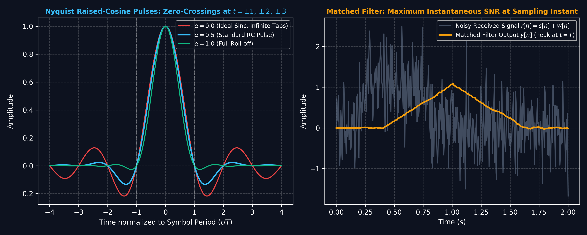
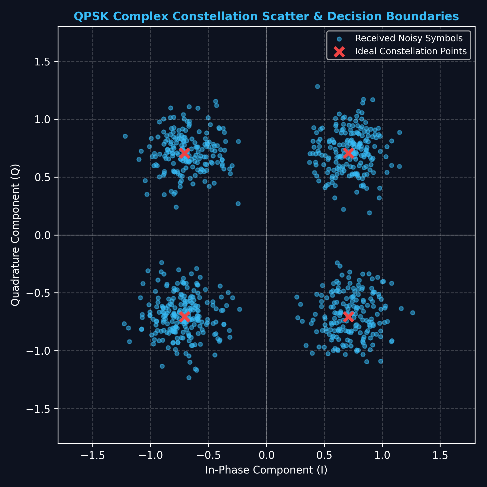

# Lecture 25: DSP in Communications — Modulation, Detection & Matched Filter

**Course:** EE3621 — Digital Signal Processing  
**Target Audience:** III B.Tech EEE Students  
**Duration:** 40 Minutes  

* **Available Formats:** [LaTeX Source File](file:///C:/Users/sriph/Downloads/DSP/lecture_25.tex) | [Compiled PDF Notes](file:///C:/Users/sriph/Downloads/DSP/lecture_25.pdf)

---

## 1. Lecture Plan (40 Minutes Breakdown)

* **00:00 – 05:00 (5 mins):** Digital Modulation Review (BPSK, QPSK, QAM).
* **05:00 – 12:00 (7 mins):** Pulse Shaping & Inter-Symbol Interference (ISI); Raised Cosine and Square-Root Raised Cosine filters.
* **12:00 – 22:00 (10 mins):** Matched Filter & Correlation Receiver; SNR maximization proof.
* **22:00 – 28:00 (6 mins):** Equalization techniques (Zero-Forcing, MMSE, DFE).
* **28:00 – 35:00 (7 mins):** OFDM Fundamentals, Cyclic Prefix, FFT/IFFT architecture, and Standards.
* **35:00 – 40:00 (5 mins):** Checkpoints & Worked Examples.

---

## 2. Digital Modulation Review

In modern communication systems, digital information is transmitted by modulating the amplitude and phase of a carrier. The complex baseband representation simplifies analysis and is an essential tool in digital signal processing for communications.

### Complex Baseband Representation
Any passband signal can be mathematically represented in terms of its complex baseband equivalent.
1. Let the passband signal be $x(t)$.
2. $x(t) = \text{Re}\{ s(t) e^{j 2\pi f_c t} \}$
3. Here, $s(t)$ is the complex baseband envelope.
4. $f_c$ is the carrier frequency.
5. In discrete time, a modulated symbol is sampled as $s_i[n]$.
6. $s_i[n] = I_i[n] + j Q_i[n]$
7. $I_i[n]$ is the In-phase component (Real part).
8. $Q_i[n]$ is the Quadrature component (Imaginary part).
9. This complex formulation enables us to model the entire communication link without simulating the high-frequency carrier.

### Constellations
The mapping of bits to complex symbols $s_i$ is known as a constellation.
* **BPSK (Binary Phase Shift Keying):**
  - Symbols take values from $\{+A, -A\}$.
  - Represents 1 bit per symbol.
  - Excellent noise resilience but low data rate.
* **QPSK (Quadrature Phase Shift Keying):**
  - Symbols take values from $\{\pm A \pm jA\}$.
  - Represents 2 bits per symbol.
  - A popular balance between robustness and throughput.
* **QAM (Quadrature Amplitude Modulation):**
  - Higher order constellations like 16-QAM or 64-QAM vary both amplitude and phase.
  - Represents $\log_2(M)$ bits per symbol, where $M$ is the constellation size.
  - Demands high Signal-to-Noise Ratio (SNR) for reliable detection.

---

## 3. Pulse Shaping and ISI

### Visual Illustration: Nyquist Raised Cosine Pulses (Zero ISI) & Matched Filter

* **Eliminating Intersymbol Interference:** Raised cosine pulses pass through zero at integer symbol multiples $t = \pm T, \pm 2T$, ensuring adjacent transmitted symbols cause zero interference at the decision sampling instant.
* **Matched Filter:** Setting receiver filter impulse response $h[n] = s^*[N-n]$ maximizes output Signal-to-Noise Ratio (SNR) in additive white Gaussian noise.

---

### Visual Illustration: QPSK Constellation & Decision Regions

* **Vector Modulations:** In-phase (I) and Quadrature (Q) complex constellations illustrate symbol clustering and noise margins against symbol error decisions.

When symbols are transmitted consecutively, they can overlap in time if not properly shaped, causing Inter-Symbol Interference (ISI). This is a critical physical problem in communications.

### The ISI Problem
Let's break down how ISI occurs mathematically.
1. The received signal (ignoring noise) is $y(t)$.
2. $y(t) = \sum_{k} s[k] p(t - k T)$
3. Here $p(t)$ is the overall continuous-time pulse shape.
4. $T$ is the symbol period.
5. Sampling at time $t = nT$ gives the discrete signal $y(nT)$.
6. $y(nT) = \sum_{k} s[k] p(nT - k T)$
7. $y(nT) = \sum_{k} s[k] p((n-k)T)$
8. We can isolate the desired symbol $s[n]$ from the others.
9. $y(nT) = s[n] p(0) + \sum_{k \neq n} s[k] p((n-k)T)$
10. The first term $s[n] p(0)$ is the desired signal.
11. The second term $\sum_{k \neq n} s[k] p((n-k)T)$ is the ISI.
12. If ISI is large, it can cause the detector to make incorrect decisions, resulting in a high Bit Error Rate (BER).

### Nyquist Criterion for Zero-ISI
To achieve zero ISI, the second term must be identically zero for all possible data sequences.
1. This implies that $p((n-k)T) = 0$ for all $k \neq n$.
2. Equivalently, $p(mT) = 0$ for all integers $m \neq 0$.
3. To preserve the desired symbol, $p(0)$ should be a non-zero constant, typically 1.
4. Thus, the Nyquist criterion for zero-ISI in the time domain is:
5. $p(nT) = \begin{cases} 1 & n = 0 \\ 0 & n \neq 0 \end{cases}$
6. In the discrete domain, this is equivalent to the impulse function: $p[n] = \delta[n]$.

### Raised Cosine Filter
The Raised Cosine (RC) filter is widely used because it perfectly satisfies the Nyquist criterion while offering a smooth transition (roll-off). This smooth roll-off dramatically reduces the bandwidth required compared to a strict rectangular pulse in frequency (which corresponds to a sinc pulse in time that decays too slowly).
Its frequency response $P_{RC}(f)$ features:
* A completely flat passband near DC.
* A sinusoidal (cosine) roll-off in the transition band.
* A parameter called the roll-off factor, denoted $\alpha \in [0,1]$.
* When $\alpha=0$, it is a brick-wall filter (minimum bandwidth, infinite time decay).
* When $\alpha=1$, it provides the fastest time decay but uses twice the minimum bandwidth.

The absolute bandwidth required is given by the key formula:
$$ B = \frac{1+\alpha}{2T} $$

### Square-Root Raised Cosine (SRRC)
In a real-world system, the filtering must be distributed between the transmitter and the receiver.
1. The transmitter needs a filter to limit the transmitted spectrum.
2. The receiver needs a filter to reject out-of-band noise (which we will see is the Matched Filter).
3. We split the Nyquist filter evenly: each implements $\sqrt{P_{RC}(f)}$.
4. The transmitter applies $\sqrt{P_{RC}(f)}$.
5. The channel is assumed flat (ideal).
6. The receiver applies $\sqrt{P_{RC}(f)}$.
7. The overall cascaded frequency response is the product:
8. $\sqrt{P_{RC}(f)} \times \sqrt{P_{RC}(f)} = P_{RC}(f)$
9. Because the overall system response is $P_{RC}(f)$, it achieves the Nyquist zero-ISI criterion at the sampling instants.

To visualize filter responses in DSP, here is a magnitude response reference (using an MA filter as a generic placeholder):

---

## 4. The Matched Filter

The Matched Filter is arguably the most important concept in digital receivers. Its objective is not to recover the exact shape of the transmitted pulse, but rather to maximize the Signal-to-Noise Ratio (SNR) at the exact instant the signal is sampled.

### Definition and Intuition
For a transmitted continuous-time signal $s(t)$, the matched filter impulse response $h(t)$ is defined as:
$$ h(t) = s^*(T_0 - t) $$
where $T_0$ is the sampling time.
In the discrete-time domain, for a signal $s[n]$ of length $L$, it is defined as:
$$ h[n] = s^*[L-n] $$
This means the filter is the time-reversed and complex conjugated version of the signal itself.
The engineering intuition is that the filter acts as a template. It collects all the energy of the signal over time and concentrates it into a single peak at the sampling instant.
A Z-plane representation of simple filters can be seen here:

### Formal Proof of SNR Maximization
We want to prove that this specific filter shape maximizes the SNR. This is a classic DSP derivation.
1. Let the filter output signal component at time $T_0$ be $y_s(T_0)$.
2. Using the Inverse Fourier Transform:
3. $y_s(T_0) = \int_{-\infty}^{\infty} H(f) S(f) e^{j 2\pi f T_0} df$
4. Let the noise at the input be AWGN with Power Spectral Density $N_0/2$.
5. The noise power at the output of the filter is $P_n$.
6. $P_n = \frac{N_0}{2} \int_{-\infty}^{\infty} |H(f)|^2 df$
7. The SNR at the sampling instant is the ratio of signal power to noise power.
8. $\text{SNR} = \frac{|y_s(T_0)|^2}{P_n}$
9. Substitute the expressions:
10. $\text{SNR} = \frac{\left| \int_{-\infty}^{\infty} H(f) S(f) e^{j 2\pi f T_0} df \right|^2}{\frac{N_0}{2} \int_{-\infty}^{\infty} |H(f)|^2 df}$
11. To maximize this, we apply the Cauchy-Schwarz inequality.
12. The inequality states: $\left| \int A(f) B(f) df \right|^2 \leq \left( \int |A(f)|^2 df \right) \left( \int |B(f)|^2 df \right)$
13. Let $A(f) = H(f)$.
14. Let $B(f) = S(f) e^{j 2\pi f T_0}$.
15. Applying the inequality to our numerator:
16. $\left| \int_{-\infty}^{\infty} H(f) S(f) e^{j 2\pi f T_0} df \right|^2 \leq \left( \int_{-\infty}^{\infty} |H(f)|^2 df \right) \left( \int_{-\infty}^{\infty} |S(f)|^2 df \right)$
17. The term $\int_{-\infty}^{\infty} |S(f)|^2 df$ is simply the total energy of the signal, $E_s$.
18. Substitute this back into the SNR equation.
19. $\text{SNR} \leq \frac{ \left( \int |H(f)|^2 df \right) E_s }{ \frac{N_0}{2} \int |H(f)|^2 df }$
20. The integral of $|H(f)|^2$ cancels out from numerator and denominator.
21. $\text{SNR}_{\max} = \frac{2 E_s}{N_0}$
22. The Cauchy-Schwarz inequality reaches equality (the maximum) when $A(f)$ is proportional to the complex conjugate of $B(f)$.
23. Therefore, $H(f) = k B^*(f)$.
24. $H(f) = k [S(f) e^{j 2\pi f T_0}]^*$
25. $H(f) = k S^*(f) e^{-j 2\pi f T_0}$
26. Taking the Inverse Fourier Transform of this optimum $H(f)$ gives the impulse response.
27. $h(t) = k s^*(T_0 - t)$
28. Setting $k=1$ yields the standard matched filter. This proves that the matched filter is the optimal linear detector in the presence of AWGN.

### Correlation Receiver equivalence
The operation of the matched filter can also be implemented as a correlation receiver.
1. The output of the matched filter at time $T_0$ is the convolution:
2. $y(T_0) = \int_{-\infty}^{\infty} r(\tau) h(T_0 - \tau) d\tau$
3. Substitute the matched filter impulse response $h(t) = s^*(T_0 - t)$.
4. $h(T_0 - \tau) = s^*(T_0 - (T_0 - \tau))$
5. $h(T_0 - \tau) = s^*(\tau)$
6. Substitute this back into the integral:
7. $y(T_0) = \int_{-\infty}^{\infty} r(\tau) s^*(\tau) d\tau$
8. This is the definition of a cross-correlation between the received signal $r(t)$ and the known template $s(t)$.
9. In digital implementations, a correlator is often easier to build and yields the exact same sufficient statistic for decision making.

---

## 5. Channel Equalization

Even with ideal pulse shaping, real-world channels introduce multipath fading, acting like a filter that distorts the signal. This causes ISI. Equalization is the DSP technique used at the receiver to undo this channel distortion.

### Zero-Forcing (ZF) Equalizer
The most intuitive approach is to simply invert the channel.
1. Let the channel frequency response be $H_{channel}(f)$.
2. The zero-forcing equalizer is designed such that $H_{eq}(f) \cdot H_{channel}(f) = 1$.
3. Therefore, $H_{eq}(f) = \frac{1}{H_{channel}(f)}$.
4. While this perfectly removes ISI, it introduces a massive problem: **Noise Enhancement**.
5. If the channel has a deep fade at a specific frequency (i.e., $H_{channel}(f) \approx 0$).
6. Then the equalizer gain $H_{eq}(f)$ at that frequency becomes enormous.
7. Background noise at that frequency is amplified tremendously, destroying the overall SNR.

### Minimum Mean Square Error (MMSE) Equalizer
To solve the noise enhancement problem, the MMSE equalizer balances ISI removal with noise amplification.
1. The goal is to minimize the expected mean square error: $E[|s[n] - \hat{s}[n]|^2]$.
2. The solution to this optimization problem yields the MMSE filter:
3. $H_{MMSE}(f) = \frac{H^*(f)}{|H(f)|^2 + N_0/E_s}$
4. Let us analyze its physical behavior at different SNR extremes.
5. Case 1: High SNR. The noise power $N_0 \to 0$.
6. The formula becomes $H_{MMSE}(f) \approx \frac{H^*(f)}{|H(f)|^2} = \frac{1}{H(f)}$.
7. Thus, at high SNR, MMSE acts exactly like a Zero-Forcing equalizer to eliminate ISI, because noise is not a concern.
8. Case 2: Low SNR. The noise term $N_0/E_s$ dominates the denominator.
9. The denominator becomes a large constant.
10. The formula becomes $H_{MMSE}(f) \propto H^*(f)$.
11. Thus, at low SNR, it acts like a Matched Filter, prioritizing noise reduction over ISI cancellation.

### Decision Feedback Equalizer (DFE)
Linear equalizers (like ZF and MMSE) always enhance noise to some degree. A non-linear approach is the DFE.
1. The DFE utilizes decisions made on previous symbols.
2. It consists of a feedforward filter and a feedback filter.
3. The Feedforward filter processes the incoming received signal.
4. The Feedback filter processes the previously decoded discrete symbols.
5. By knowing the exact previous symbols and estimating the channel, the DFE can calculate the exact ISI they will cause on the current symbol.
6. It then subtracts this ISI out perfectly.
7. Because it subtracts a clean digital signal, it does not amplify noise.

---

## 6. OFDM Fundamentals

Orthogonal Frequency Division Multiplexing (OFDM) is arguably the most successful modulation scheme in modern history. It solves the severe multipath ISI problem without requiring overwhelmingly complex equalizers.

### Multicarrier Modulation
Instead of sending data at a very high rate over a single carrier (which causes very short symbols and massive ISI):
1. OFDM splits the high-speed data stream into $N$ parallel, lower-speed streams.
2. Each stream modulates a separate, orthogonal subcarrier frequency.
3. Because the data rate on each subcarrier is low, the symbol duration $T$ is very long.
4. If $T$ is much larger than the channel delay spread, ISI affects only a tiny fraction of the symbol.

### Cyclic Prefix (CP)
To completely eradicate the remaining ISI, OFDM uses a Cyclic Prefix.
1. A segment of the end of the time-domain OFDM symbol is copied.
2. This copied segment is prepended to the start of the symbol.
3. The length of this CP must strictly exceed the maximum delay spread of the multipath channel.
4. When the signal passes through the multipath channel, the linear convolution of the channel effectively becomes a **circular convolution** for the duration of the main symbol.
5. In DSP theory, circular convolution in time equates to point-wise multiplication in frequency.
6. Therefore, the frequency-selective multipath channel is transformed into multiple independent, flat-fading channels.
7. This allows equalization to be just a simple single-tap complex scalar multiplication per subcarrier.

### IFFT / FFT Architecture
The orthogonality of subcarriers allows for an incredibly efficient digital implementation.
1. **At the Transmitter:** The parallel symbols are mapped to frequency bins. An Inverse Fast Fourier Transform (IFFT) converts these frequency bins into a time-domain signal.
2. **At the Receiver:** After removing the CP, a Fast Fourier Transform (FFT) converts the time-domain signal back into individual frequency symbols.

### Spectral Efficiency
Because the subcarriers are mathematically orthogonal (sinc pulses in frequency cross zero at the center of adjacent carriers), they can heavily overlap.
1. Traditional FDM requires large guard bands between channels to prevent interference.
2. OFDM requires no guard bands between subcarriers.
3. This massive overlap allows OFDM to approach theoretical maximum spectral efficiency.

---

## 7. OFDM in Modern Standards

OFDM's robustness against multipath has made it the standard for almost all broadband communications.

### Key Applications
1. **WiFi (802.11a/g/n/ac/ax):** The complex indoor environment has severe multipath reflections. OFDM mitigates this flawlessly.
2. **LTE (4G) & 5G NR:** Cellular networks use OFDMA (Orthogonal Frequency Division Multiple Access), assigning specific subcarriers to different users simultaneously. 5G extends this by allowing scalable subcarrier spacing.
3. **Digital Broadcasting:** DVB-T and DAB rely on OFDM to allow Single Frequency Networks (SFNs) where multiple towers broadcast the same signal.

### The PAPR Problem
The main physical disadvantage of OFDM is its Peak-to-Average Power Ratio (PAPR).
1. An OFDM signal in the time domain is the sum of hundreds or thousands of independent sinusoidal subcarriers.
2. By the Central Limit Theorem, the time-domain signal amplitude follows a Gaussian distribution.
3. Occasionally, these sine waves will align constructively, creating massive power peaks.
4. The power amplifier at the transmitter must operate in its linear region to avoid distorting the signal.
5. A high PAPR forces the amplifier to operate with a large "back-off", drastically reducing its power efficiency.
6. Techniques like SC-FDMA (used in the LTE uplink) or clipping are used to mitigate this issue.

---

## 8. Summary of Key Formulas

| Concept | Key Mathematical Formula |
| :--- | :--- |
| Complex Baseband Symbol | $s_i[n] = I_i[n] + j Q_i[n]$ |
| Nyquist Zero-ISI Condition | $p(nT) = \delta[n]$ |
| Raised Cosine Bandwidth | $B = \frac{1+\alpha}{2T}$ |
| Matched Filter (Discrete) | $h[n] = s^*[L-n]$ |
| Matched Filter Max SNR | $\text{SNR} = \frac{2E_s}{N_0}$ |
| Correlation Receiver | $y = \int r(t)s^*(t)dt$ |
| Zero-Forcing Equalizer | $H_{eq}(f) = \frac{1}{H_{channel}(f)}$ |
| MMSE Equalizer | $H_{MMSE}(f) = \frac{H^*(f)}{|H(f)|^2 + N_0/E_s}$ |

---

## 9. Checkpoint Questions & Detailed Answers

### Checkpoint 1: Raised Cosine Bandwidth
**Question:** A satellite communication system transmits data at a rate of 25 Msymbols/s using a raised cosine pulse shape. If the system has an absolute bandwidth limitation of 16 MHz, what is the maximum roll-off factor $\alpha$ that can be utilized?

**Answer:**
1. Let the symbol rate be $R_s = 25 \times 10^6$ symbols/s.
2. The symbol period is the inverse: $T = \frac{1}{R_s} = \frac{1}{25 \times 10^6}$ seconds.
3. The total bandwidth available is $B = 16 \times 10^6$ Hz.
4. Write down the raised cosine bandwidth formula:
5. $B = \frac{1+\alpha}{2T}$
6. Since $R_s = \frac{1}{T}$, we can rewrite the formula as:
7. $B = \frac{(1+\alpha) \cdot R_s}{2}$
8. Isolate the roll-off factor $\alpha$:
9. $1+\alpha = \frac{2B}{R_s}$
10. $\alpha = \frac{2B}{R_s} - 1$
11. Substitute the known numerical values:
12. $\alpha = \frac{2 \times 16 \times 10^6}{25 \times 10^6} - 1$
13. $\alpha = \frac{32}{25} - 1$
14. $\alpha = 1.28 - 1$
15. $\alpha = 0.28$
16. The maximum permissible roll-off factor is 0.28.

### Checkpoint 2: Matched Filter Output Derivation
**Question:** Let a transmitted baseband signal $s(t)$ be a rectangular pulse of amplitude $A$ and duration $T$. Derive the continuous time-domain output of the matched filter when $s(t)$ itself is received without noise. What is the peak value?

**Answer:**
1. The signal definition is $s(t) = A$ for the interval $0 \le t \le T$, and $0$ outside this interval.
2. The matched filter impulse response is defined as $h(t) = s(T-t)$ (assuming real signals).
3. Since $s(t)$ is perfectly symmetric and real, flipping and shifting it yields identical rectangular pulse.
4. Thus, $h(t) = A$ for $0 \le t \le T$, and $0$ elsewhere.
5. The output $y(t)$ is the convolution of the signal and the filter:
6. $y(t) = s(t) * h(t) = \int_{-\infty}^{\infty} s(\tau) h(t-\tau) d\tau$
7. This integral represents the overlapping area of two sliding rectangles.
8. Case 1: $0 \le t \le T$. The rectangles begin to overlap. The overlap width is $t$.
9. $y(t) = \int_0^t A \cdot A d\tau$
10. $y(t) = A^2 \cdot \tau \Big|_0^t = A^2 t$
11. Case 2: $T < t \le 2T$. The rectangles are sliding apart. The overlap width decreases.
12. $y(t) = \int_{t-T}^T A \cdot A d\tau$
13. $y(t) = A^2 \cdot \tau \Big|_{t-T}^T = A^2 (T - (t - T))$
14. $y(t) = A^2 (2T - t)$
15. Case 3: $t < 0$ or $t > 2T$. There is no overlap, so $y(t) = 0$.
16. The output is a triangle pulse spanning from $t=0$ to $t=2T$.
17. The maximum peak value occurs exactly at $t=T$:
18. $y(T) = A^2 T$
19. This peak value is mathematically equal to the total energy of the original signal $E_s$.

### Checkpoint 3: Equalizer Noise Enhancement Proof
**Question:** Consider a flat fading channel with a constant attenuation gain of $H_{channel}(f) = 0.05$. The input noise is AWGN with power spectral density $N_0/2$. Prove mathematically the exact amplification factor of the noise power when a Zero-Forcing equalizer is applied.

**Answer:**
1. The objective of the Zero-Forcing equalizer is to completely invert the channel response.
2. The Zero-Forcing equalizer transfer function is:
3. $H_{eq}(f) = \frac{1}{H_{channel}(f)}$
4. Substitute the given constant channel gain:
5. $H_{eq}(f) = \frac{1}{0.05}$
6. $H_{eq}(f) = 20$
7. This means the equalizer applies a constant voltage gain of 20 to all incoming frequencies.
8. When a random noise process passes through a linear time-invariant filter, its power spectral density (PSD) is scaled by the squared magnitude of the filter's frequency response.
9. Let the input noise PSD be $S_{ni}(f) = N_0/2$.
10. Let the output noise PSD be $S_{no}(f)$.
11. $S_{no}(f) = |H_{eq}(f)|^2 \cdot S_{ni}(f)$
12. Calculate the squared magnitude (power gain):
13. $|H_{eq}(f)|^2 = |20|^2 = 400$
14. Substitute back into the PSD equation:
15. $S_{no}(f) = 400 \cdot (N_0/2)$
16. To find the total noise power, we integrate the PSD over the system bandwidth $B$.
17. $P_{noise\_out} = \int_{-B}^{B} S_{no}(f) df = \int_{-B}^{B} 400 \cdot (N_0/2) df$
18. $P_{noise\_out} = 400 \cdot \int_{-B}^{B} (N_0/2) df = 400 \cdot P_{noise\_in}$
19. Conclusion: The noise power is amplified by a massive factor of 400. This rigorous proof demonstrates why Zero-Forcing equalizers are highly detrimental in channels with severe fades, necessitating the use of MMSE equalizers.
