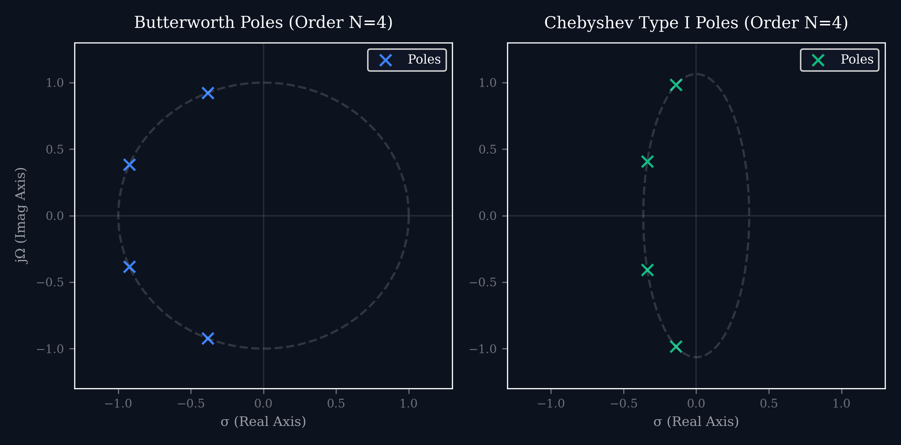
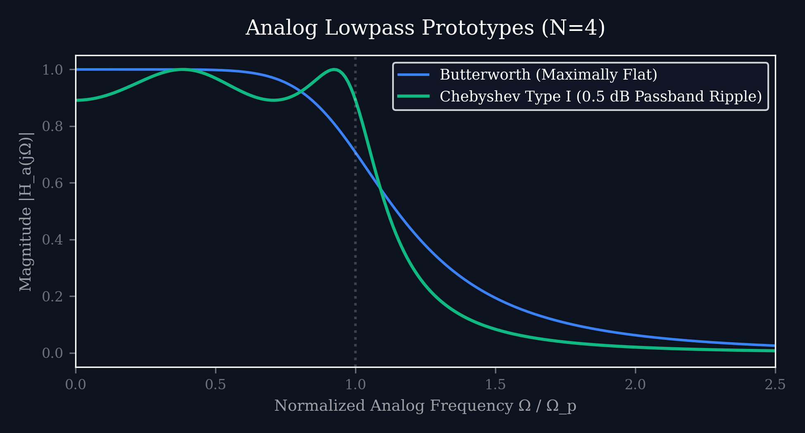

# Lecture 26: DSP for Power Systems — Harmonic Analysis & Phasor Estimation

**Course:** EE3621 — Digital Signal Processing  
**Target Audience:** III B.Tech EEE Students  
**Duration:** 40 Minutes  

* **Available Formats:** [LaTeX Source File](lecture_26.tex) | [Compiled PDF Notes](lecture_26.pdf)

---

## 1. Lecture Plan (40 Minutes Breakdown)

* **00:00 – 05:00 (5 mins):** Introduction to Power Quality Issues. 
  * Harmonics from nonlinear loads (VFDs, UPS, rectifiers).
  * THD definition and its physical meaning.
  * Effects on grid infrastructure (motors, transformers).
* **05:00 – 12:00 (7 mins):** Fourier Analysis of Power Signals. 
  * The 1-cycle DFT and windowing.
  * Fundamental frequency vs sampling frequency.
  * Complex harmonic phasors extraction and interpretation.
* **12:00 – 17:00 (5 mins):** DFT Spectral Leakage. 
  * What happens when $f_0$ drifts from nominal (e.g., $49.8$ Hz).
  * Windowing techniques.
  * Interpolation-based frequency estimation.
* **17:00 – 22:00 (5 mins):** Phasor Measurement Units (PMUs). 
  * Synchrophasors and IEEE C37.118 standard.
  * Total Vector Error (TVE) definition and requirement ($<1\%$).
  * GPS time-sync and 1-Pulse-Per-Second (1-PPS).
* **22:00 – 27:00 (5 mins):** Recursive (Sliding) DFT. 
  * Efficient sample-by-sample update algorithms for real-time tracking.
  * Derivation of the recursive step.
  * Computational complexity comparison.
* **27:00 – 32:00 (5 mins):** Kalman Filter for Phasor Tracking. 
  * State-space models for amplitude and phase under dynamic conditions.
  * Process noise and measurement noise handling.
* **32:00 – 35:00 (3 mins):** Protection Relay DSP \& Anti-Aliasing. 
  * Digital relays (overcurrent, distance, differential).
  * Analog filter design for anti-aliasing.
* **35:00 – 40:00 (5 mins):** Active/Reactive Power from DFT and Checkpoints.

---

## 2. Power Quality Issues

Modern power systems are plagued by power quality issues due to the proliferation of nonlinear loads.

### 2.1 Nonlinear Loads and Harmonics
Devices such as Variable Frequency Drives (VFDs), Uninterruptible Power Supplies (UPS), and bridge rectifiers draw non-sinusoidal currents even when supplied with a perfectly sinusoidal voltage. This non-sinusoidal current causes voltage drops across the system impedance, leading to voltage distortion.
The distorted waveform can be decomposed into the fundamental frequency and its integer multiples, known as harmonics.

### 2.2 Total Harmonic Distortion (THD)
The severity of harmonic distortion is quantified by the Total Harmonic Distortion (THD). For a voltage signal, it is defined as the ratio of the RMS value of all the harmonic components to the RMS value of the fundamental component.

Mathematically, let $V_k$ be the RMS voltage of the $k$-th harmonic:
$$ THD_V = \frac{\sqrt{\sum_{k=2}^N V_k^2}}{V_1} $$

**Step-by-step interpretation:**
1. Square the RMS value of each harmonic ($k=2, 3, \dots, N$).
2. Sum all these squared values.
3. Take the square root of the sum (this gives the total RMS of the harmonic content).
4. Divide by the RMS value of the fundamental ($V_1$).

**KEY RESULT:** A pure sine wave has $THD = 0\%$. High THD indicates poor power quality.

### 2.3 Effects on Grid Infrastructure
* **Motors:** 
  * Harmonics cause additional core losses (eddy current and hysteresis).
  * Overheating occurs due to high-frequency currents.
  * Negative sequence harmonics (like the 5th) produce opposing torque, reducing efficiency and causing mechanical vibrations.
* **Transformers:** 
  * High-frequency currents increase skin and proximity effects.
  * Massively increasing copper and stray losses.
  * Transformers supplying nonlinear loads must be heavily derated.
* **Capacitor Banks:** 
  * The impedance of a capacitor decreases with frequency ($Z_c = \frac{1}{j \omega C}$). 
  * High-frequency harmonics cause large currents to flow through power factor correction capacitors.
  * Leading to dielectric breakdown, overheating, and eventual failure.

---

## 3. Fourier Analysis of Power Signals

To quantify harmonics and extract phasors, we apply the Discrete Fourier Transform (DFT) to power signals.

### 3.1 One-Cycle DFT for Harmonic Estimation
Consider a power system with a nominal fundamental frequency $f_0$ (e.g., $50$ or $60$ Hz). We sample the voltage or current at a sampling frequency $f_s$.

To avoid spectral leakage under nominal conditions, we choose $f_s$ such that there is an integer number of samples per fundamental cycle.
Let $N$ be the number of samples per cycle:
$$ N = \frac{f_s}{f_0} $$
For example, if $f_0 = 50$ Hz and $f_s = 1600$ Hz, then:
$$ N = \frac{1600}{50} = 32 \text{ samples per cycle} $$

### 3.2 Extracting Complex Harmonic Phasors
Given a block of $N$ samples, $x[0], x[1], \dots, x[N-1]$, representing exactly one fundamental cycle, the DFT at the $k$-th bin is:
$$ X[k] = \sum_{n=0}^{N-1} x[n] e^{-j \frac{2\pi}{N} k n} $$

The fundamental component corresponds to $k=1$. The complex phasor $V_1$ (using peak amplitude convention) is directly related to the DFT bin.
We scale the DFT output to get the peak amplitude:
$$ V_1 = \frac{2}{N} X[1] $$

For the $k$-th harmonic, the derivation is:
$$ X[k] = \sum_{n=0}^{N-1} x[n] \left( \cos\left(\frac{2\pi}{N} k n\right) - j \sin\left(\frac{2\pi}{N} k n\right) \right) $$
$$ V_k = \frac{2}{N} X[k] $$
$$ V_k = \frac{2}{N} \sum_{n=0}^{N-1} x[n] e^{-j \frac{2\pi}{N} k n} $$

This yields the complex phasor $V_k = |V_k| e^{j \phi_k}$.
The RMS phasor would be:
$$ V_{k, RMS} = \frac{|V_k|}{\sqrt{2}} e^{j \phi_k} $$

---

## 4. DFT Leakage in Power Systems

The perfect orthogonality of the DFT relies on exact synchronization between the sampling window and the fundamental period. 

### 4.1 Frequency Drift and Non-Integer Cycles
In real power systems, the grid frequency is not constant. It fluctuates based on the balance of active power generation and demand. 
If nominal $f_0 = 50$ Hz, the actual frequency might drift to $49.8$ Hz.

When this happens, the $N$-sample window no longer contains an exact integer number of cycles.
* Nominal cycle time = $1 / 50 = 20.00$ ms.
* Actual cycle time at $49.8$ Hz = $1 / 49.8 \approx 20.08$ ms.
* If we sample 32 points in $20.00$ ms, we miss the last $0.08$ ms of the true cycle.

Because the DFT implicitly assumes the finite sequence is periodically extended, this mismatch creates a discontinuity at the boundaries of the observation window.

### 4.2 Mathematical Impact of Leakage
The energy of the fundamental frequency "leaks" into all other DFT bins. 
If you calculate the THD during a frequency droop using a standard rectangular window DFT, the leaked fundamental energy appears as false harmonics.
This artificially inflates the THD reading, potentially causing false alarms in power quality monitoring relays.

### 4.3 Mitigation Strategies
1. **Windowing:** 
   * Instead of a rectangular window, use a Hanning or Blackman window.
   * This tapers the ends of the sequence to zero, smoothing the discontinuity.
2. **Interpolation-based Frequency Estimation:** 
   * Calculate the DFT.
   * Use the magnitude of adjacent bins around the fundamental peak to precisely interpolate the true frequency.
   * Correct the phasor estimate based on the true frequency.
3. **Frequency Tracking (PLL):** 
   * Dynamically adjust the sampling rate $f_s$ to maintain exactly $N$ samples per actual cycle.
   * This requires a Phase-Locked Loop (PLL) hardware or software implementation.

---

## 5. Phasor Measurement Units (PMUs)

PMUs are the backbone of Wide Area Monitoring Systems (WAMS), providing real-time visibility into the dynamic state of the grid.

### 5.1 Synchrophasor Definition
A synchrophasor is a phasor calculated from voltage or current samples, synchronized to an absolute time reference (UTC).
For a signal:
$$ x(t) = V_{peak} \cos(2\pi f t + \phi) $$
The phasor representation is defined at a specific reference time $t=0$:
$$ \text{Phasor} = \frac{V_{peak}}{\sqrt{2}} e^{j\phi} $$
The PMU tags this phasor with a precise UTC timestamp, allowing for coherent comparison of phasors measured at substations hundreds of miles apart.

### 5.2 IEEE C37.118 Standard
The industry standard for synchrophasors dictates stringent performance requirements.
The primary metric is **Total Vector Error (TVE)**, which combines magnitude, phase, and timing errors into a single scalar value.

Let the true phasor be $X = X_r + j X_i$.
Let the measured phasor be $\hat{X} = \hat{X}_r + j \hat{X}_i$.
$$ \text{TVE} = \sqrt{ \frac{(\hat{X}_r - X_r)^2 + (\hat{X}_i - X_i)^2}{X_r^2 + X_i^2} } \times 100\% $$

**KEY RESULT:** To comply with the standard under steady-state conditions, a PMU must maintain:
$$ \text{TVE} < 1\% $$

### 5.3 GPS Time Synchronization
To achieve sub-microsecond synchronization across thousands of miles, PMUs rely on the 1-Pulse-Per-Second (1-PPS) signal from GPS satellites. 
A $1\mu s$ timing error corresponds to an phase error of:
$$ \Delta \phi = 360^\circ \times f_0 \times \Delta t $$
$$ \Delta \phi = 360^\circ \times 50 \times 10^{-6} = 0.018^\circ $$
In a $50$ Hz system, this easily fits within the $1\%$ TVE budget (which allows up to $\approx 0.57^\circ$ of pure phase error).

---

## 6. Recursive DFT (Sliding DFT)

In protective relays and PMUs, we need phasor estimates updated at every new sample, not just once every $N$ samples. Recomputing the full DFT or FFT every sample is computationally wasteful.

### 6.1 The Sliding Window Update
Let $X_k[n]$ be the $k$-th DFT bin for a window of $N$ samples ending at time $n$.
$$ X_k[n] = \sum_{m=0}^{N-1} x[n-m] e^{-j \frac{2\pi}{N} k (N-1-m)} $$

When the next sample $x[n+1]$ arrives, the window slides forward by one. 
The oldest sample $x[n-N+1]$ drops out, and the newest sample $x[n+1]$ enters.

### 6.2 Derivation of Recursive Update
Let's write the new DFT bin $X_k[n]$ in terms of the previous one $X_k[n-1]$:
$$ X_k[n] = \sum_{m=0}^{N-1} x[n-m] W_N^{k(N-1-m)} $$
Where $W_N = e^{-j \frac{2\pi}{N}}$.
$$ X_k[n] = x[n]W_N^{k(N-1)} + x[n-1]W_N^{k(N-2)} + \dots + x[n-N+1]W_N^0 $$
Notice that:
$$ X_k[n-1] = x[n-1]W_N^{k(N-1)} + x[n-2]W_N^{k(N-2)} + \dots + x[n-N]W_N^0 $$
We can relate the two by factoring out a common phase term:
$$ X_k[n] = \left( X_k[n-1] - x[n-N]W_N^0 + x[n]W_N^{kN} \right) W_N^{-k} $$
Since $W_N^{kN} = e^{-j 2\pi k} = 1$ and $W_N^0 = 1$:
$$ X_k[n] = \left( X_k[n-1] + x[n] - x[n-N] \right) W_N^{-k} $$
Or substituting the exponential:
$$ X_k[n] = \left( X_k[n-1] + x[n] - x[n-N] \right) e^{j \frac{2\pi}{N} k} $$

**Computational Complexity:**
* Full FFT: $O(N \log N)$ operations per update.
* Recursive DFT: $O(1)$ operations per bin. 
* For $M$ harmonics of interest, it takes $O(M)$ per sample.
This extreme efficiency makes it ideal for real-time power monitoring on DSP microcontrollers.

---

## 7. Kalman Filter for Phasor Tracking

While the DFT is optimal for stationary signals, power systems experience dynamic changes (power swings, faults). The Kalman filter provides an optimal dynamic state estimator.

### 7.1 State-Space Model
We model the phasor as a rotating vector in the complex plane. The state vector at step $k$ is the real and imaginary parts of the fundamental phasor:
$$ \mathbf{x}_k = \begin{bmatrix} X_{re, k} \\ X_{im, k} \end{bmatrix} $$

**State Transition:**
If the frequency is perfectly nominal, the phasor is constant: 
$$ \mathbf{x}_k = \mathbf{x}_{k-1} + \mathbf{w}_k $$
If there is a frequency offset $\Delta f$, the phasor rotates continuously.
$\mathbf{w}_k$ represents the process noise (e.g., random frequency variations).

**Measurement Model:**
The instantaneous voltage sample $z_k$ is a projection of the state onto the measurement axis, corrupted by noise $v_k$:
$$ z_k = \mathbf{H}_k \mathbf{x}_k + v_k $$
where the observation matrix is:
$$ \mathbf{H}_k = [ \cos(k \theta_0) \quad -\sin(k \theta_0) ] $$
and $\theta_0 = 2\pi f_0 / f_s$ is the nominal angular step per sample.

### 7.2 Optimal Tracking
The Kalman filter recursively updates the state estimate and the error covariance matrix. 
1. **Predict:** Estimate the next state based on the transition model.
2. **Update:** Correct the estimate using the new voltage sample $z_k$ and the Kalman gain.
It provides faster dynamic response during faults compared to the 1-cycle DFT and can handle frequency ramps seamlessly.

---

## 8. Protection Relay DSP & Anti-Aliasing

Numerical relays (overcurrent, distance, differential) rely entirely on DSP to make trip decisions in milliseconds.

### 8.1 Relay Algorithms
* **Overcurrent:** Calculates fundamental current phasor magnitude. Trips if $|I_1| > I_{pickup}$. Used for feeder protection.
* **Distance:** Calculates apparent impedance $Z = \frac{V_1}{I_1}$. Trips if $Z$ falls inside a predefined zone in the complex R-X plane. Used for transmission lines.
* **Differential:** Compares current phasors entering and leaving a zone. $\Delta I = |I_{in} - I_{out}|$. Trips if $\Delta I$ is large, indicating an internal fault. Used for transformers and busbars.

### 8.2 Analog Anti-Aliasing Filter Design
Before the ADC samples the voltage/current, an analog lowpass filter is essential to prevent high-frequency noise and transients (e.g., lightning strikes, switching surges) from aliasing into the fundamental frequency band.
For a 50 Hz system sampled at 1600 Hz (Nyquist = 800 Hz), the anti-aliasing filter cutoff is typically placed around 300-400 Hz.

Below we see the design characteristics of typical analog lowpass prototypes (Butterworth vs Chebyshev) used for anti-aliasing in relay design.

*Figure 1: Pole distributions for analog anti-aliasing filters (Butterworth vs Chebyshev).*

*Figure 2: Magnitude responses for analog anti-aliasing prototypes. Notice the maximally flat passband of Butterworth compared to the ripple in Chebyshev.*

---

## 9. Active and Reactive Power from DFT

Once the complex voltage and current phasors are obtained via the DFT, computing power is straightforward.

Let the RMS phasors of the $k$-th harmonic be:
$$ V_k = |V_k| e^{j \phi_{Vk}} $$
$$ I_k = |I_k| e^{j \phi_{Ik}} $$

### 9.1 Active Power ($P$)
Active power is the average power consumed by the load, representing actual work done. It is the sum of the active powers of all harmonic components:
$$ P = \sum_{k=1}^N |V_k| |I_k| \cos(\phi_{Vk} - \phi_{Ik}) $$

*(If using peak phasors from standard DFT, multiply by 1/2: $P = \frac{1}{2} \sum |V_k| |I_k| \cos(\dots)$ )*

### 9.2 Reactive Power ($Q$)
Reactive power represents the oscillating energy in the system, which does no useful work but requires conductor capacity. Following the Budeanu definition for harmonic reactive power:
$$ Q = \sum_{k=1}^N |V_k| |I_k| \sin(\phi_{Vk} - \phi_{Ik}) $$

*(Again, if using peak phasors, multiply by 1/2).*

**Physical Intuition:** Harmonics also contribute to active and reactive power. However, harmonic active power often represents losses (e.g., heating in a motor), not useful mechanical work.

---

## 10. Checkpoint Questions

**Q1: Total Harmonic Distortion Calculation**
A voltage signal in a 50 Hz grid contains a fundamental component of 230 V (RMS), a 3rd harmonic of 40 V (RMS), and a 5th harmonic of 30 V (RMS). All higher harmonics are negligible. Calculate the Total Harmonic Distortion ($THD_V$).
* **Step 1:** Identify the RMS values. 
  * $V_1 = 230$ V
  * $V_3 = 40$ V
  * $V_5 = 30$ V
* **Step 2:** Sum of squared harmonic RMS values: 
  * $\sum V_k^2 = V_3^2 + V_5^2$
  * $\sum V_k^2 = 40^2 + 30^2 = 1600 + 900 = 2500$
* **Step 3:** Take the square root of the sum to get total harmonic RMS: 
  * $\sqrt{2500} = 50$ V.
* **Step 4:** Divide by the fundamental RMS: 
  * $THD_V = \frac{50}{230} \approx 0.21739$
* **Answer:** $THD_V = 21.74\%$.

**Q2: Sampling and DFT Bins**
A PMU samples a 60 Hz system at 2880 Hz. What is the required window size $N$ for exactly one cycle? Which DFT bin $k$ corresponds to the 5th harmonic (300 Hz)?
* **Step 1:** Calculate samples per cycle: 
  * $N = \frac{f_s}{f_0}$
  * $N = \frac{2880}{60} = 48$ samples.
* **Step 2:** The fundamental frequency is at bin $k=1$. The $m$-th harmonic is at bin $k=m$.
* **Step 3:** The 5th harmonic is a multiple of the fundamental, so it corresponds to bin $k=5$.
* **Answer:** $N = 48$, and the 5th harmonic is at DFT bin $k=5$.

**Q3: Recursive DFT Efficiency**
Consider calculating the fundamental phasor ($k=1$) in real-time. If the window size is $N=64$, how many complex additions and multiplications are required per sample using the sliding DFT update formula, compared to computing an $N$-point radix-2 FFT from scratch?
* **Step 1:** The recursive update is $X_1[n] = (X_1[n-1] + x[n] - x[n-N]) e^{j \frac{2\pi}{N}}$.
* **Step 2:** This requires:
  * 2 real additions for $(x[n] - x[n-N])$.
  * 1 complex addition with $X_1[n-1]$.
  * 1 complex multiplication with $e^{j \frac{2\pi}{N}}$.
  * Total: strictly $O(1)$ complex operations per bin.
* **Step 3:** An $N$-point FFT requires $\frac{N}{2} \log_2 N$ complex multiplications. 
  * For $N=64$, this is $32 \times 6 = 192$ complex multiplications.
* **Answer:** The sliding DFT requires just 1 complex multiplication per sample to track the fundamental, whereas a full FFT would require 192 complex multiplications per sample, making the recursive approach incredibly efficient.

---

## 11. Key Formulas Summary

| Parameter | Formula | Description |
| :--- | :--- | :--- |
| **THD** | $THD = \frac{\sqrt{\sum_{k=2}^N V_k^2}}{V_1}$ | Total Harmonic Distortion (using RMS) |
| **DFT Phasor** | $V_k = \frac{2}{N} \sum_{n=0}^{N-1} x[n] e^{-j \frac{2\pi}{N} k n}$ | $k$-th harmonic peak phasor |
| **Sliding DFT** | $X_k[n] = X_k[n-1] + (x[n] - x[n-N])e^{j \frac{2\pi}{N} k}$ | Sample-by-sample update |
| **Active Power** | $P = \frac{1}{2}\sum_k \|V_k\|\|I_k\|\cos(\phi_{Vk}-\phi_{Ik})$ | Active power (using peak phasors) |
| **Reactive Power** | $Q = \frac{1}{2}\sum_k \|V_k\|\|I_k\|\sin(\phi_{Vk}-\phi_{Ik})$ | Reactive power (using peak phasors) |
| **TVE** | $\text{TVE} = \sqrt{ \frac{(\hat{X}_r - X_r)^2 + (\hat{X}_i - X_i)^2}{X_r^2 + X_i^2} } \times 100\%$ | Total Vector Error |

## 12. Frequently Asked Questions (FAQ)

**Q: Why don't we just use a generic windowing function instead of bothering with recursive DFT?**
* While windowing (e.g., Hanning, Blackman-Harris) mitigates spectral leakage when the system frequency deviates from nominal, applying a generic window to every block of $ samples involves multiplying each block by the window coefficients. 
* This takes (N)$ multiplications before you even begin the FFT, which takes (N \log N)$. 
* The sliding DFT only takes (1)$ operations per update. Therefore, for real-time tracking, recursive DFT is vastly superior for computational load, even if windowing is applied as a post-processing step.

**Q: What is the main advantage of the Kalman filter over the Recursive DFT?**
* The recursive DFT fundamentally assumes the signal is stationary over the $-sample window. 
* If the system experiences a severe fault (e.g., a short circuit), the phasor will transition to a new state. The recursive DFT will take exactly $ samples (one full cycle) to completely settle to the new phasor value. 
* A well-tuned Kalman filter, utilizing both a process model and a measurement model, can respond dynamically to step changes and ramps in the state much faster, potentially settling in a fraction of a cycle.

**Q: How do we choose the order $ of an analog anti-aliasing filter?**
* The order $ is chosen based on the required stopband attenuation at the Nyquist frequency.
* For a 50 Hz system sampled at 1600 Hz, the Nyquist frequency is 800 Hz. We might want at least 40 dB of attenuation at 800 Hz to ensure noise does not alias into the 0-50 Hz band.
* Using the Butterworth order formula from earlier lectures, we calculate the minimum $. Often =2$ to =4$ is sufficient for power system relays.
