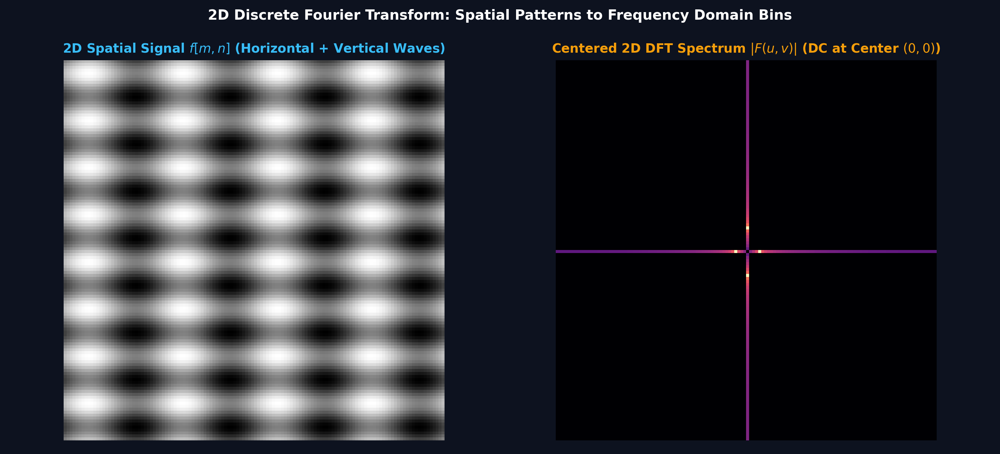
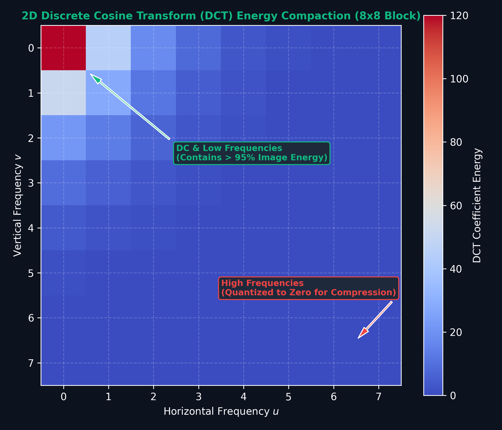

# Lecture 27: DSP for Image Processing — 2D DFT, Filtering & Transforms

**Course:** EE3621 — Digital Signal Processing  
**Target Audience:** III B.Tech EEE Students  
**Duration:** 40 Minutes  

* **Available Formats:** [LaTeX Source File](file:///C:/Users/sriph/Downloads/DSP/lecture_27.tex) | [Compiled PDF Notes](file:///C:/Users/sriph/Downloads/DSP/lecture_27.pdf)

---

## 1. Lecture Plan (40 Minutes Breakdown)

* **00:00 – 05:00 (5 mins): Welcome & 2D Signals.** 
  * Introduction to digital images.
  * Spatial coordinates and pixel values.
  * Grayscale vs. Color (RGB) domains.
  * Spatial sampling and the concept of aliasing in images.
* **05:00 – 12:00 (7 mins): 2D DTFT and 2D DFT.** 
  * Understanding the spatial frequency spectrum.
  * The mathematical definition of the 2D DFT.
  * Demonstrating separability.
  * Row-column FFT computational strategies and time complexity savings.
* **12:00 – 18:00 (6 mins): 2D Convolution & Filtering.** 
  * Definition of 2D Convolution.
  * Derivations of separability in filters.
  * Computational savings with practical examples.
* **18:00 – 24:00 (6 mins): Spatial Frequency Domain Filtering.** 
  * Low-pass vs. High-pass vs. Band-pass filtering.
  * Ideal vs. Practical 2D filters (ringing artifacts).
  * In-depth look at Gaussian (smoothing) and Laplacian (sharpening) filters.
* **24:00 – 30:00 (6 mins): 2D Discrete Cosine Transform (DCT).** 
  * Mathematical definition of the DCT.
  * The property of energy compaction.
  * Real-world application: JPEG block-level processing (8x8 blocks, quantization, and zigzag scanning).
* **30:00 – 36:00 (6 mins): Edge Detection.** 
  * Gradient operators and finite differences (Sobel, Prewitt).
  * Calculating gradient magnitude and direction.
  * The Canny Edge Detection pipeline steps.
* **36:00 – 40:00 (4 mins): Summary, Key Formulas, and Checkpoint Questions.** 
  * Review of key takeaways.
  * Summary table of formulas.
  * Interactive Q&A.

---

## 2. 2D Signals: The Digital Image

In traditional 1D digital signal processing, a signal $x[n]$ is typically a sequence of values indexed by time (e.g., an audio recording). In the realm of image processing, however, a digital image is fundamentally a **2D discrete signal**, denoted by $f[m,n]$. Here, $m$ and $n$ are discrete spatial coordinates representing the rows and columns of a pixel grid.

### 2.1 Pixel Values and Domains
When we sample an optical image, we discretize both the spatial coordinates and the amplitude (intensity) of the light.
* **Grayscale Images:** The function $f[m,n]$ represents a single intensity value for each coordinate pair. This is typically mapped on an 8-bit scale, ranging from $0$ (pure black) to $255$ (pure white). Intermediate values represent varying shades of gray.
* **Color Images (RGB):** A color image is a multidimensional signal. Each pixel consists of three separate channels: Red, Green, and Blue. Thus, the image can be viewed as three stacked 2D signals: $f_R[m,n]$, $f_G[m,n]$, and $f_B[m,n]$, or as a single 3D tensor $f[m,n,c]$ where $c \in \{0, 1, 2\}$.

### 2.2 Spatial Sampling and Aliasing
Just as a 1D continuous audio signal must be sampled above the Nyquist rate to avoid temporal aliasing (where high frequencies masquerade as low frequencies), a continuous 2D optical image $f_c(x,y)$ must be sampled with an adequately fine spatial resolution. The spatial resolution is determined by the density of the sensor pixels.

**Physical Intuition:** 
Imagine taking a digital photograph of a brick wall from far away, or a person wearing a shirt with very fine, densely packed stripes. These physical objects represent **high spatial frequencies** because the visual intensity changes very rapidly over a small spatial distance. 

If your camera's sensor does not have enough pixels to capture these rapid changes (i.e., you are sampling below the spatial Nyquist rate), the high-frequency stripes will fold over into lower frequencies. Visually, this manifests as **Moiré patterns**—strange, wavy, artificial low-frequency artifacts that do not exist in the real object. 

This is **spatial aliasing**, which is conceptually identical to the 1D aliasing demonstrated below (from our earlier analysis on frequency folding). Notice how high-frequency spectral components wrap around and corrupt the primary band.

---

## 3. 2D DTFT and 2D DFT

### Visual Illustration: 2D Spatial Signals & Centered 2D DFT Spectrum

* **Spatial Frequencies:** Horizontal and vertical variations in pixel brightness map to corresponding $(u,v)$ frequency coordinates in the centered 2D DFT spectrum (DC located at origin $(0,0)$).

---

### Visual Illustration: JPEG 2D Discrete Cosine Transform (DCT) Energy Compaction

* **Energy Compaction in Compression:** Transforming $8	imes 8$ pixel blocks via 2D DCT concentrates $>95\%$ of image energy into the top-left low-frequency coefficients, allowing high-frequency coefficients to be quantized to zero for lossy compression.

To analyze the frequency content of images—to understand where the rapid changes (edges) and slow changes (smooth areas) lie—we must extend our Fourier analysis tools into two dimensions.

### 3.1 The 2D Discrete-Time Fourier Transform (DTFT)
The 2D DTFT is the theoretical bridge that converts a discrete spatial domain signal $f[m,n]$ of infinite extent into a continuous spatial frequency domain representation, denoted as $F(e^{j\omega_x}, e^{j\omega_y})$:

$$F(e^{j\omega_x}, e^{j\omega_y}) = \sum_{m=-\infty}^{\infty} \sum_{n=-\infty}^{\infty} f[m,n] e^{-j(\omega_x m + \omega_y n)}$$

**Physical Intuition in the Frequency Domain:**
* **$\omega_x$ (Horizontal Frequency):** Represents the rate of variation across the horizontal axis (columns). A high $\omega_x$ means rapid changes horizontally, which corresponds to vertical edges.
* **$\omega_y$ (Vertical Frequency):** Represents the rate of variation down the vertical axis (rows). A high $\omega_y$ corresponds to horizontal edges.
* **The 2D Magnitude Spectrum:** When we plot $|F(e^{j\omega_x}, e^{j\omega_y})|$ as an image, **low frequencies** are concentrated at the center $(\omega_x=0, \omega_y=0)$. These represent smooth shading, flat regions, and the overall average brightness (DC component). **High frequencies** extend out to the periphery, representing sharp edges, fine textures, and random noise.

### 3.2 The 2D Discrete Fourier Transform (DFT)
In practice, images are not infinite; they have a finite size of $M \times N$ pixels. Therefore, we use the 2D DFT, which samples the continuous DTFT at discrete intervals. 

The forward 2D DFT is defined as:
$$F[k,l] = \sum_{m=0}^{M-1} \sum_{n=0}^{N-1} f[m,n] W_M^{km} W_N^{ln}$$

where the standard twiddle factors are $W_M = e^{-j 2\pi / M}$ and $W_N = e^{-j 2\pi / N}$.

The Inverse 2D DFT (IDFT) brings us back to the spatial domain:
$$f[m,n] = \frac{1}{MN} \sum_{k=0}^{M-1} \sum_{l=0}^{N-1} F[k,l] W_M^{-km} W_N^{-ln}$$

### 3.3 Proof of Separability and Row-Column Computation
A remarkable and computationally vital property of the 2D DFT is its **separability**. 

**Theorem:** The 2D DFT can be computed by performing 1D DFTs along the rows, followed by 1D DFTs along the columns.

**Step-by-Step Derivation:**
1. Start with the standard 2D DFT definition:
   $$F[k,l] = \sum_{m=0}^{M-1} \sum_{n=0}^{N-1} f[m,n] e^{-j\frac{2\pi}{M}km} e^{-j\frac{2\pi}{N}ln}$$
2. Because the exponential terms are independent for $m$ and $n$, we can pull the $m$-dependent terms outside the inner summation:
   $$F[k,l] = \sum_{m=0}^{M-1} e^{-j\frac{2\pi}{M}km} \left[ \sum_{n=0}^{N-1} f[m,n] e^{-j\frac{2\pi}{N}ln} \right]$$
3. Notice that the expression in the brackets is exactly a 1D DFT applied to the $m$-th row of the image. Let us call this intermediate result $G[m,l]$:
   $$G[m,l] = \sum_{n=0}^{N-1} f[m,n] W_N^{ln}$$
4. Now, substitute $G[m,l]$ back into the outer summation:
   $$F[k,l] = \sum_{m=0}^{M-1} G[m,l] W_M^{km}$$
5. This final expression is simply a 1D DFT applied to the $l$-th column of the intermediate array $G$.

In compact matrix notation, if $\mathbf{f}$ is the image matrix, this separability is elegantly written as:
$$\mathbf{F} = \mathbf{W}_M \mathbf{f} \mathbf{W}_N$$

### 3.4 Computational Savings
Why is separability so important? It drastically reduces the number of mathematical operations.
* **Naive Approach:** Computing the 2D DFT directly via the double summation requires $M \times N$ complex multiplications for each of the $M \times N$ output pixels. Total complexity: $\mathcal{O}(M^2 N^2)$. For a $1000 \times 1000$ image, this is $10^{12}$ operations.
* **Row-Column Approach:** Using 1D Fast Fourier Transforms (FFTs), we compute $M$ row-wise FFTs of length $N$, followed by $N$ column-wise FFTs of length $M$. Total complexity drops to $\mathcal{O}(MN \log_2(MN))$. For a $1000 \times 1000$ image, this is roughly $2 \times 10^7$ operations—a speedup of $50,000\times$!

---

## 4. 2D Convolution

In image processing, linear shift-invariant (LSI) filtering is performed using 2D convolution. If we have a 2D filter $h[m,n]$ (often called a kernel or mask), the filtered output image $g[m,n]$ is given by:

$$g[m,n] = h[m,n] ** f[m,n] = \sum_{k=-\infty}^{\infty} \sum_{l=-\infty}^{\infty} h[k,l] f[m-k, n-l]$$

The process involves flipping the kernel $h$ horizontally and vertically, sliding it over the image $f$, and computing the sum of element-wise multiplications at every position.

### 4.1 Separable 2D Filters
Just like the DFT, certain filters possess the property of separability. A 2D filter is **separable** if it can be expressed as the outer product of a 1D vertical filter $h_x[m]$ and a 1D horizontal filter $h_y[n]$:
$$h[m,n] = h_x[m] h_y[n]$$

**Theorem:** 2D convolution with a separable filter is mathematically equivalent to two sequential 1D convolutions.

**Step-by-Step Proof:**
1. Substitute the separable form into the convolution definition:
   $$g[m,n] = \sum_k \sum_l (h_x[k]h_y[l]) f[m-k, n-l]$$
2. Rearrange the terms, pulling the $k$-dependent term outside the inner sum over $l$:
   $$g[m,n] = \sum_k h_x[k] \left( \sum_l h_y[l] f[m-k, n-l] \right)$$
3. Define the inner summation as an intermediate image $w[m-k, n]$, which represents the image rows convolved with $h_y$:
   $$w[m-k, n] = \sum_l h_y[l] f[m-k, n-l]$$
4. Substitute $w$ back into the outer sum:
   $$g[m,n] = \sum_k h_x[k] w[m-k, n]$$
   This is a 1D convolution of the intermediate columns with $h_x$.

### 4.2 Computational Savings from Separable Filters
Suppose we are applying a $K \times K$ filter to an $M \times N$ image.
* **Standard 2D Convolution:** Requires $K^2$ multiplications per pixel. Total: $K^2 \times M \times N$.
* **Separable Convolution:** Requires $K$ multiplications per pixel for the rows, plus $K$ for the columns. Total: $2K \times M \times N$.

**Numerical Example:** 
Consider a $15 \times 15$ Gaussian blur applied to a $1920 \times 1080$ (1080p) image. 
- Standard: $15^2 = 225$ multiplications per pixel. 
- Separable: $15 + 15 = 30$ multiplications per pixel.
- Savings: We reduce the computational load by $\frac{225 - 30}{225} \times 100 = 86.6\%$. This allows real-time video processing to function smoothly on low-power devices.

---

## 5. Spatial Frequency Domain Filtering

Filters applied in the spatial domain using convolution have direct counterparts in the frequency domain, where convolution becomes simple element-wise multiplication:
$$G[k,l] = H[k,l] \cdot F[k,l]$$

By manipulating the 2D spectrum, we can perform various enhancement operations:
*   **Low-pass Filtering:** Attenuates high frequencies. Used for noise reduction, skin smoothing, and blurring.
*   **High-pass Filtering:** Attenuates low frequencies. Used for edge detection, image sharpening, and feature extraction.
*   **Bandpass Filtering:** Allows a specific ring of frequencies to pass. Used to isolate specific repetitive textures or remove periodic noise (like removing the Moiré pattern itself).

### Ideal vs. Practical Filters
An **ideal** circular 2D low-pass filter abruptly cuts off all frequencies above a certain radius cutoff, $\omega_c = \sqrt{\omega_x^2 + \omega_y^2}$. It acts like a brick wall in the frequency domain. 

However, in the spatial domain, the IDFT of an ideal cylinder is a 2D sinc function, commonly known as a "sombrero" function. This function has infinite undulating tails. When applied to an image, these tails cause heavy **ringing artifacts** (Gibbs phenomenon) around sharp edges. 

To avoid ringing, modern image processing rarely uses ideal filters. Instead, we use practical filters with smooth, gradual roll-offs, such as the Butterworth filter or, most commonly, the Gaussian filter.

---

## 6. Gaussian and Laplacian Filters

### 6.1 Gaussian Smoothing (Low-pass)
The 2D Gaussian filter is ubiquitous in computer vision. It is the only filter whose Fourier transform is also a Gaussian, meaning it possesses optimal localization in both the spatial and frequency domains.

$$G_\sigma[m,n] = \frac{1}{2\pi\sigma^2} e^{-\frac{m^2+n^2}{2\sigma^2}}$$

*Key Properties:* 
1. The standard deviation $\sigma$ controls the amount of blur. Larger $\sigma$ means a wider kernel and more aggressive smoothing.
2. The Gaussian is perfectly **separable** because $e^{-(m^2+n^2)} = e^{-m^2} e^{-n^2}$. This is why we can apply massive Gaussian blurs very quickly using two 1D passes.

### 6.2 Laplacian Operator (High-pass)
The Laplacian is an isotropic (rotation-invariant) 2D second-order spatial derivative. It highlights regions of rapid intensity change.

$$\nabla^2 f = \frac{\partial^2 f}{\partial x^2} + \frac{\partial^2 f}{\partial y^2}$$

Because second derivatives are extremely sensitive to high-frequency noise (an isolated noisy pixel creates a massive derivative spike), the Laplacian is almost never used on raw images. 

**Laplacian of Gaussian (LoG):**
Instead, the image is first smoothed with a Gaussian, and then the Laplacian is computed. By linearity, this is equivalent to convolving the image with the Laplacian of a Gaussian function:
$$L = \nabla^2 G_\sigma$$

The LoG filter resembles a Mexican hat. It responds most strongly to "blobs"—circular regions of a specific size (tuned by $\sigma$) that are significantly brighter or darker than their surroundings. This forms the foundation of scale-invariant feature transform (SIFT) blob detection.

---

## 7. 2D Discrete Cosine Transform (DCT) and JPEG Compression

While the DFT is theoretically beautiful, it uses complex exponentials and assumes periodic boundary conditions, which leads to edge artifacts. The **Discrete Cosine Transform (DCT)** uses only real cosine basis functions and implies symmetric boundary conditions, solving these issues.

The 2D Type-II DCT for an $M \times N$ image block is defined as:
$$F[k,l] = \frac{4 c[k] c[l]}{MN} \sum_{m=0}^{M-1} \sum_{n=0}^{N-1} f[m,n] \cos\left[ \frac{(2m+1)k\pi}{2M} \right] \cos\left[ \frac{(2n+1)l\pi}{2N} \right]$$
where the scaling factors are $c[0] = 1/\sqrt{2}$ and $c[k] = 1$ for $k > 0$.

### 7.1 Why use the DCT? Energy Compaction
The primary superpower of the DCT is its **energy compaction**. Photographic images are highly correlated—adjacent pixels usually have similar colors. The DCT leverages this by concentrating almost all of the visual signal's energy into a very small number of low-frequency coefficients located in the top-left corner of the $F[k,l]$ frequency matrix. The remaining high-frequency coefficients are nearly zero.

### 7.2 The JPEG Compression Pipeline
The DCT is the beating heart of the JPEG image format. The compression pipeline operates in several distinct stages:

1.  **Color Space Conversion and Subsampling:** The image is converted from RGB to YCbCr, and color information is downsampled (since human eyes are less sensitive to color detail than to brightness detail).
2.  **Blocking:** The image is sliced into an enormous grid of $8 \times 8$ non-overlapping pixel blocks.
3.  **2D DCT:** Each $8 \times 8$ spatial block undergoes the 2D DCT, transforming it into an $8 \times 8$ frequency matrix. The top-left element is the DC coefficient (average brightness), and the others are AC coefficients.
4.  **Quantization (The Lossy Step):** The DCT matrix is divided element-wise by a pre-defined Quantization Table, and the results are rounded to the nearest integer. Because the quantization table has very large values for high frequencies, the high-frequency coefficients (which already had small magnitudes due to energy compaction) are crushed to zero.
5.  **Zigzag Scanning:** The quantized matrix is read diagonally starting from the top-left (DC) to the bottom-right. This reordering clusters the non-zero low-frequency terms at the front of the 1D array, leaving a massive, unbroken trail of zeros at the end.
6.  **Entropy Coding:** The resulting sequence is compressed perfectly using Run-Length Encoding (RLE) and Huffman coding, yielding the final compact `.jpg` file.

---

## 8. Edge Detection & Gradient Operators

In human vision and computer algorithms alike, edges carry the most critical structural information about an object. Mathematically, an edge corresponds to a local maximum of the first spatial derivative of the image intensity.

### 8.1 Gradient Vector
Since an image is a 2D scalar field, its first derivative is the gradient vector:
$$\nabla f = \begin{bmatrix} G_x \\ G_y \end{bmatrix} = \begin{bmatrix} \frac{\partial f}{\partial x} \\ \frac{\partial f}{\partial y} \end{bmatrix}$$

From this vector, we extract two vital pieces of information at every pixel:
*   **Gradient Magnitude (Edge Strength):** $|\nabla f| = \sqrt{G_x^2 + G_y^2}$
*   **Gradient Direction (Edge Angle):** $\theta = \tan^{-1}\left( \frac{G_y}{G_x} \right)$. The direction always points perpendicular to the edge boundary (towards the brightest area).

### 8.2 Sobel Operators
Because images are discrete grids, we cannot take analytic derivatives. Instead, we approximate them using finite differences (e.g., $f[m, n+1] - f[m, n-1]$).

The most famous finite difference kernels are the **Sobel Operators**. The Sobel filter computes the derivative in one direction while applying a slight Gaussian smoothing in the orthogonal direction to suppress noise. 
The 3x3 convolution masks are:
$$H_x = \begin{bmatrix} -1 & 0 & 1 \\ -2 & 0 & 2 \\ -1 & 0 & 1 \end{bmatrix}, \quad H_y = \begin{bmatrix} -1 & -2 & -1 \\ 0 & 0 & 0 \\ 1 & 2 & 1 \end{bmatrix}$$

**Worked Numerical Example:**
Consider a 3x3 patch of an image exhibiting a harsh vertical edge:
$$f = \begin{bmatrix} 50 & 50 & 200 \\ 50 & 50 & 200 \\ 50 & 50 & 200 \end{bmatrix}$$
Let's calculate the horizontal gradient $G_x$ at the center pixel:
1. Align $H_x$ over the image patch.
2. Multiply element-wise and sum the results:
   $$G_x = (-1\cdot50) + (0\cdot50) + (1\cdot200) + (-2\cdot50) + (0\cdot50) + (2\cdot200) + (-1\cdot50) + (0\cdot50) + (1\cdot200)$$
3. $$G_x = -50 + 200 - 100 + 400 - 50 + 200 = 600$$
4. Now calculate the vertical gradient $G_y$:
   $$G_y = (-1\cdot50 - 2\cdot50 - 1\cdot200) + (0) + (1\cdot50 + 2\cdot50 + 1\cdot200) = -350 + 350 = 0$$
5. Compute the magnitude: $\sqrt{600^2 + 0^2} = 600$. 
This massive gradient accurately identifies the presence of a strong vertical edge.

### 8.3 The Canny Edge Detector
The Canny Edge Detector, developed in 1986, remains the industry standard. It is not just a filter, but a multi-stage intelligent algorithm:
1.  **Gaussian Smoothing:** Apply a $5 \times 5$ Gaussian filter to remove high-frequency noise that might trigger false edges.
2.  **Gradient Calculation:** Compute Sobel gradients $G_x$ and $G_y$ to find the magnitude and angle at every pixel.
3.  **Non-Maximum Suppression (NMS):** Edges output by Sobel are often several pixels thick. NMS thins them down to a single pixel. It checks if a pixel is the absolute maximum among its neighbors along the gradient direction $\theta$. If not, it is suppressed (set to 0).
4.  **Hysteresis Thresholding:** NMS leaves behind fragmented edges. Hysteresis uses two thresholds ($T_{low}$ and $T_{high}$). Strong edges ($> T_{high}$) are immediately kept. Weak edges (between $T_{low}$ and $T_{high}$) are only kept if they form a continuous chain connecting to a strong edge. This prevents noise from surviving while preserving continuous object boundaries.

---

## 9. Key Formulas Summary

| Concept | Mathematical Formulation |
| :--- | :--- |
| **2D DTFT** | $F(e^{j\omega_x}, e^{j\omega_y}) = \sum_{m=-\infty}^{\infty} \sum_{n=-\infty}^{\infty} f[m,n] e^{-j(\omega_x m + \omega_y n)}$ |
| **2D DFT** | $F[k,l] = \sum_{m=0}^{M-1} \sum_{n=0}^{N-1} f[m,n] W_M^{km} W_N^{ln}$ |
| **Separable 2D DFT** | $\mathbf{F} = \mathbf{W}_M \mathbf{f} \mathbf{W}_N$ |
| **2D Convolution** | $g[m,n] = \sum_{k=-\infty}^{\infty} \sum_{l=-\infty}^{\infty} h[k,l] f[m-k, n-l]$ |
| **Gaussian Filter** | $G_\sigma[m,n] = \frac{1}{2\pi\sigma^2} e^{-(m^2+n^2)/(2\sigma^2)}$ |
| **Laplacian** | $\nabla^2 f = \frac{\partial^2 f}{\partial x^2} + \frac{\partial^2 f}{\partial y^2}$ |
| **Gradient Magnitude** | $|\nabla f| = \sqrt{G_x^2 + G_y^2}$ |
| **Gradient Direction** | $\theta = \tan^{-1}(G_y/G_x)$ |

---

## 10. Checkpoint Questions

**Q1: A 2D spatial filter has the following $3 \times 3$ kernel:** 
$$h = \begin{bmatrix} 1 & 2 & 1 \\ 2 & 4 & 2 \\ 1 & 2 & 1 \end{bmatrix}$$
**Prove mathematically that this filter is separable and explicitly identify its 1D vertical and horizontal components.**
*Answer:* 
A 2D filter is separable if it can be written as an outer product of a column vector $h_x$ and a row vector $h_y$. 
Observing the rows of matrix $h$, we can see that the second row is exactly $2 \times$ the first row, and the third row is identical to the first. 
Let us propose a vertical filter $h_x = \begin{bmatrix} 1 \\ 2 \\ 1 \end{bmatrix}$ and a horizontal filter $h_y = \begin{bmatrix} 1 & 2 & 1 \end{bmatrix}$. 
Multiplying them out gives:
$$h_x h_y = \begin{bmatrix} 1 \\ 2 \\ 1 \end{bmatrix} \begin{bmatrix} 1 & 2 & 1 \end{bmatrix} = \begin{bmatrix} 1\cdot1 & 1\cdot2 & 1\cdot1 \\ 2\cdot1 & 2\cdot2 & 2\cdot1 \\ 1\cdot1 & 1\cdot2 & 1\cdot1 \end{bmatrix} = \begin{bmatrix} 1 & 2 & 1 \\ 2 & 4 & 2 \\ 1 & 2 & 1 \end{bmatrix}$$
Since the 2D matrix decomposes perfectly into the outer product $h_x[m]h_y[n]$, we have proven that it is completely separable.

**Q2: During the JPEG compression pipeline, an $8 \times 8$ Discrete Cosine Transform is computed. Why does the JPEG algorithm perform a complicated "Zigzag scanning" pattern immediately after the quantization step, instead of just reading the matrix row by row?**
*Answer:* 
The quantization step is designed to heavily suppress high-frequency coefficients, replacing them with literal zeros. In an $8 \times 8$ DCT matrix, the top-left element holds the DC frequency, while the highest AC frequencies are clustered at the bottom-right. 
If we read the matrix normally (row-by-row), we intersperse non-zero low frequencies and zero high frequencies throughout the resulting 1D string. By reading diagonally (zigzag) starting from the top-left and moving back and forth towards the bottom-right, all the large non-zero coefficients are neatly clustered at the very beginning of the sequence. This is followed by a continuous, extremely long run of zeros towards the end. This specific grouping allows the subsequent Run-Length Encoding (RLE) to drastically compress the string of zeroes into a tiny packet, which directly and massively minimizes the final file size.

**Q3: Suppose a Canny Edge Detector is processing a digital image and identifies a long, thin, continuous edge (e.g., a wire). However, due to lighting variations, the middle portion of the wire has a gradient magnitude slightly below the upper threshold $T_{high}$. How does the algorithm prevent the wire's edge from breaking in half in the final output?**
*Answer:* 
The Canny detector elegantly solves this issue using its final stage: **Hysteresis Thresholding**. The algorithm does not rely on a single hard cutoff; instead, it uses two thresholds: $T_{high}$ and $T_{low}$. 
Any pixel with a gradient above $T_{high}$ is immediately and permanently classified as a "strong" valid edge. The dim middle section of the wire has a gradient that falls between $T_{low}$ and $T_{high}$. During the hysteresis sweep, the algorithm evaluates the 8-connected neighbors of these "weak" pixels. Because the weak section physically touches (connects to) the strong edge pixels at either end of the wire, the hysteresis logic promotes the weak pixels to "strong" status. Consequently, the edge survives the thresholding process and remains entirely contiguous and unbroken in the final output.

---

## 11. Extended Topics: Mathematical Properties of the 2D DFT

To further solidify our understanding, let's explore some key mathematical properties of the 2D DFT that make it so powerful for image processing:

### 11.1 Translation (Spatial Shift)
If we shift an image in the spatial domain by $(m_0, n_0)$, this corresponds to a phase shift in the frequency domain. 
$$f[m - m_0, n - n_0] \longleftrightarrow F[k,l] e^{-j\frac{2\pi}{M}km_0} e^{-j\frac{2\pi}{N}ln_0}$$
This property is critical for image registration (aligning two images). Even if the object moves, the magnitude spectrum $|F[k,l]|$ remains identical; only the phase changes.

### 11.2 Rotation
If an image is rotated in the spatial domain by an angle $\theta$, its 2D Fourier spectrum is also rotated by the exact same angle $\theta$.
This property is utilized in orientation analysis and texture recognition. If you look at the Fourier spectrum of a woven fabric, the principal angles of the threads will show up as bright lines at the exact same angles in the frequency domain.

### 11.3 Scaling
Scaling an image in the spatial domain (e.g., zooming in) causes an inverse scaling in the frequency domain. 
If an object becomes wider in the spatial domain, its frequency components become narrower (compress towards the DC center). 
Mathematically:
$$f(a\cdot x, b\cdot y) \longleftrightarrow \frac{1}{|ab|} F\left(\frac{u}{a}, \frac{v}{b}\right)$$
This inverse relationship is why tiny, sharp details (narrow spatial width) correspond to very high frequencies (wide spectral width).

---

## 12. Extended Topics: Advanced Edge Detection Operators

While Sobel is the most common, other operators are used depending on the specific application requirements.

### 12.1 The Prewitt Operator
The Prewitt operator is very similar to Sobel, but it does not place extra weight on the center pixel. It provides a standard average rather than a weighted average.
$$H_x = \begin{bmatrix} -1 & 0 & 1 \\ -1 & 0 & 1 \\ -1 & 0 & 1 \end{bmatrix}, \quad H_y = \begin{bmatrix} -1 & -1 & -1 \\ 0 & 0 & 0 \\ 1 & 1 & 1 \end{bmatrix}$$
**Trade-offs:** Prewitt is slightly more sensitive to diagonal edges than Sobel, but it is also more sensitive to random noise because it lacks the Gaussian-like weighting in the orthogonal direction.

### 12.2 The Scharr Operator
When highly accurate gradient angles are required, the Scharr operator is preferred. It provides much better rotational symmetry than Sobel.
$$H_x = \begin{bmatrix} -3 & 0 & 3 \\ -10 & 0 & 10 \\ -3 & 0 & 3 \end{bmatrix}$$
**Application:** Used extensively in computer vision tasks where the exact edge orientation $\theta$ is needed for feature extraction, such as in the Histogram of Oriented Gradients (HOG) algorithm for pedestrian detection.

---

## 13. Deep Dive: Zero-Padding and Linear Convolution

When performing filtering via the DFT (frequency domain multiplication), we must be careful about boundary conditions. The DFT inherently assumes the image is **periodic** (it wraps around like a torus).

If we directly multiply the DFTs of an image and a filter, we perform **Circular Convolution**. This means pixels filtering off the right edge will wrap around and affect the left edge, creating severe boundary artifacts.

**The Solution: Zero-Padding**
To perform true **Linear Convolution** using the DFT, we must zero-pad both the image and the filter. 
If the image is $M \times N$ and the filter is $K \times L$, we must pad both of them with zeros to a new size of at least:
$$P \ge M + K - 1$$
$$Q \ge N + L - 1$$
Only after padding to this size can we take the $P \times Q$ DFT, multiply them, and take the IDFT to get an artifact-free filtered image.
