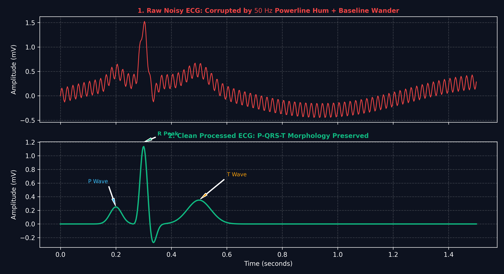
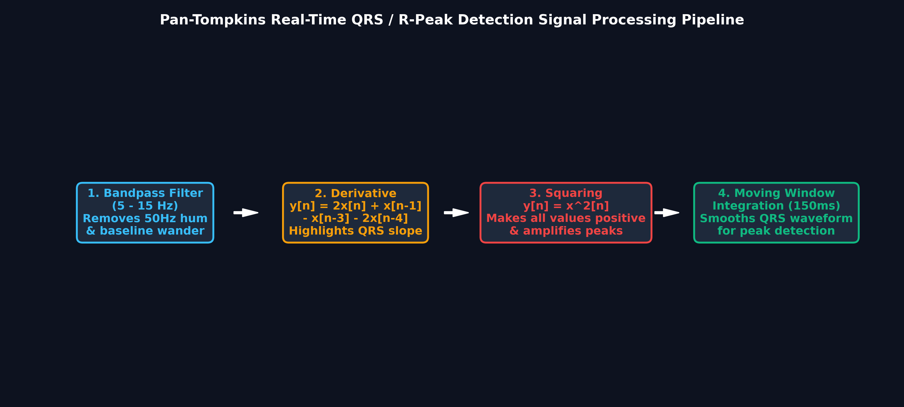

# Lecture 28: DSP for Biomedical Signals — ECG, EEG & EMG Processing

**Course:** EE3621 — Digital Signal Processing  
**Target Audience:** III B.Tech EEE Students  
**Duration:** 40 Minutes  

* **Available Formats:** [LaTeX Source File](file:///C:/Users/sriph/Downloads/DSP/lecture_28.tex) | [Compiled PDF Notes](file:///C:/Users/sriph/Downloads/DSP/lecture_28.pdf)

---

## 1. Lecture Plan (40 Minutes Breakdown)
* **00:00 – 05:00 (5 mins):** Biomedical Signal Characteristics: Amplitudes, frequencies, and noise sources for ECG, EEG, and EMG.
* **05:00 – 12:00 (7 mins):** ECG Processing Pipeline: From Anti-aliasing and ADC to Baseline Wander and Notch Filtering.
* **12:00 – 18:00 (6 mins):** Notch Filter Design: Pole-zero placement, transfer function, and derivation of notch width. Connection to Bilinear Transformation.
* **18:00 – 25:00 (7 mins):** Pan-Tompkins QRS Detection Algorithm: Step-by-step mathematical breakdown and physical intuition.
* **25:00 – 30:00 (5 mins):** Heart Rate Variability (HRV): Time and frequency domain metrics, sympathovagal balance.
* **30:00 – 35:00 (5 mins):** EEG \& EMG Analysis: Frequency bands, ICA, spatial filtering, rectification, zero-crossing, and muscle fatigue.
* **35:00 – 40:00 (5 mins):** Real-time Considerations \& Checkpoints.

---

## 2. Biomedical Signal Characteristics

Biomedical signals present unique challenges for DSP engineers because they typically have very low amplitudes and share frequency bands with various physiological and environmental noises.

### 2.1 Signal Parameters
* **ECG (Electrocardiogram):**
  * **Bandwidth:** 0.05 Hz to 150 Hz
  * **Amplitude:** ~1 mV
  * **Function:** Measures electrical activity of the heart.
* **EEG (Electroencephalogram):**
  * **Bandwidth:** 0.1 Hz to 70 Hz
  * **Amplitude:** 10 to 100 $\mu$V
  * **Function:** Measures electrical activity of the brain.
* **EMG (Electromyogram):**
  * **Bandwidth:** 20 Hz to 2000 Hz
  * **Amplitude:** 0.1 mV to 10 mV
  * **Function:** Measures electrical activity produced by skeletal muscles.

### 2.2 Common Noise Sources
1. **Powerline Interference:** 50 Hz or 60 Hz sinusoidal noise from the mains supply.
2. **Motion Artifacts:** Low-frequency transients caused by electrode motion.
3. **Baseline Wander:** Very low-frequency drift (<0.5 Hz) usually due to respiration.
4. **Muscle Artifacts:** High-frequency noise from muscle contractions overlapping with ECG/EEG bands.

---

## 3. ECG Processing Pipeline

### Visual Illustration: Clinical ECG Morphology & Noise Artifacts

* **ECG Waveform Features:** The cardiac electrical cycle comprises the P-wave (atrial depolarization), QRS-complex (ventricular depolarization), and T-wave (ventricular repolarization), vulnerable to $50	ext{ Hz}$ powerline hum and respiration baseline drift.

---

### Visual Illustration: Pan-Tompkins Real-Time QRS Detection Pipeline

* **Five-Stage R-Peak Detection:**
  1. Bandpass filter ($5-15	ext{ Hz}$) isolates QRS energy.
  2. Five-point derivative calculates waveform steepness.
  3. Non-linear squaring operator amplifies high-frequency R-peaks.
  4. Moving window integration ($150	ext{ ms}$) smooths pulses.
  5. Dual-threshold adaptive logic detects heartbeats reliably.

To accurately extract information like the heart rate or arrhythmias from an ECG signal, we must process it through a well-defined pipeline.

1. **Anti-aliasing LPF:** Analog low-pass filter with a cutoff frequency around 150 Hz.
2. **ADC:** Analog-to-Digital Conversion with a sampling rate $f_s$ of 500 Hz to 1000 Hz.
3. **Baseline Wander Removal:** A digital high-pass filter with a cutoff at 0.5 Hz, or a morphological filter, removes respiratory drift.
4. **Powerline Notch Filter:** Removes 50/60 Hz interference.
5. **QRS Detection:** Locating the main spikes (R-peaks) in the signal.
6. **Feature Extraction:** Measuring PR intervals, ST segments, etc.

---

## 4. Notch Filter Design for Powerline Interference

Powerline noise is typically a pure sine wave at 50 Hz. We design an IIR notch filter to remove it without distorting the surrounding ECG frequencies.

### 4.1 Pole-Zero Placement
Let $\omega_0 = 2\pi(50)/f_s$ be the digital frequency of the noise.
* Place a conjugate pair of **zeros** exactly on the unit circle at $z_1, z_2 = e^{\pm j\omega_0}$. This ensures the gain is strictly zero at the target frequency.
* Place a conjugate pair of **poles** slightly inside the unit circle at $p_1, p_2 = r e^{\pm j\omega_0}$, where $r < 1$ controls the notch width.

### 4.2 Transfer Function
The transfer function is:
$$H(z) = \frac{(z - e^{j\omega_0})(z - e^{-j\omega_0})}{(z - r e^{j\omega_0})(z - r e^{-j\omega_0})}$$

Expanding the numerator and denominator:
$$H(z) = \frac{z^2 - (e^{j\omega_0} + e^{-j\omega_0})z + 1}{z^2 - r(e^{j\omega_0} + e^{-j\omega_0})z + r^2}$$
$$H(z) = \frac{1 - 2\cos(\omega_0)z^{-1} + z^{-2}}{1 - 2r\cos(\omega_0)z^{-1} + r^2 z^{-2}}$$

### 4.3 Derivation of Notch Width
The 3-dB bandwidth (notch width) $\Delta\omega$ is related to the pole radius $r$. For $r$ close to 1:
$$r \approx 1 - \frac{\Delta\omega}{2}$$
$$\Delta\omega \approx 2(1 - r)$$

**KEY RESULT:** A closer pole ($r \rightarrow 1$) makes the notch sharper (narrower bandwidth) but increases the transient response time (ringing).

### 4.4 Connection to Bilinear Transformation
Sometimes, biomedical filters are designed in the analog domain and converted using the Bilinear Transformation. The mapping preserves stability.

When mapping from continuous to discrete time, the frequency axis is warped:

---

## 5. Pan-Tompkins QRS Detection Algorithm

The Pan-Tompkins algorithm is the standard for detecting QRS complexes (heartbeats) in ECG.

### Step 1: Bandpass Filter
A cascade of low-pass and high-pass filters to isolate the 5–15 Hz band, which maximizes QRS energy and attenuates muscle noise and baseline wander.

### Step 2: Differentiation
Provides the slope of the QRS complex.
$$y[n] = \frac{1}{8T} (2x[n] + x[n-1] - x[n-3] - 2x[n-4])$$

### Step 3: Squaring
Amplifies large slopes and makes all data points positive.
$$y[n] = (x[n])^2$$

### Step 4: Moving-Window Integration
Smooths out multiple peaks within a single QRS complex into a single lump.
$$y[n] = \frac{1}{N} (x[n - (N - 1)] + x[n - (N - 2)] + \dots + x[n])$$

### Step 5: Adaptive Thresholding
Maintains two thresholds: a signal peak tracking threshold and a noise peak tracking threshold. Helps adapt to varying ECG amplitudes.

---

## 6. Heart Rate Variability (HRV)

HRV is the physiological phenomenon of variation in the time interval between heartbeats (RR interval).

### 6.1 Time-Domain Metrics
* **SDNN:** Standard deviation of all normal RR intervals.
* **RMSSD:** Root mean square of successive differences between adjacent RR intervals.

### 6.2 Frequency-Domain Metrics
Power Spectral Density (PSD) of the RR intervals gives:
* **VLF (Very Low Frequency):** < 0.04 Hz
* **LF (Low Frequency):** 0.04 Hz to 0.15 Hz
* **HF (High Frequency):** 0.15 Hz to 0.4 Hz

**Sympathovagal Balance:** The LF/HF ratio is used as a measure of the balance between the sympathetic and parasympathetic nervous systems.

---

## 7. EEG and EMG Signal Analysis

### 7.1 EEG Frequency Bands
* **Delta ($\delta$):** < 4 Hz (Deep sleep)
* **Theta ($\theta$):** 4–8 Hz (Light sleep)
* **Alpha ($\alpha$):** 8–13 Hz (Relaxed, eyes closed)
* **Beta ($\beta$):** 13–30 Hz (Active thinking)
* **Gamma ($\gamma$):** > 30 Hz (Cognitive processing)

**Artifact Removal:** Independent Component Analysis (ICA) is heavily used to separate statistically independent sources like eye blinks and muscle artifacts from EEG.
**Spatial Filtering:** Techniques like Common Average Reference (CAR) and Laplacian filters enhance spatial resolution by referencing electrodes to their neighbors.

### 7.2 EMG Signal Analysis
* **Rectification and RMS Envelope:** Converting raw alternating EMG into a smoothed envelope representing muscle force.
* **Zero-Crossing Rate:** Used as a simple time-domain indicator of frequency content.
* **Power Spectral Fatigue Index:** As a muscle fatigues, motor unit firing slows down, and the median frequency of the EMG power spectrum shifts to lower frequencies.
* **Wavelet Decomposition:** Used for detecting specific muscle activation events across different scales.

---

## 8. Real-time Considerations

Implementing DSP for biomedical signals in wearable devices requires optimizing for real-time constraints.

1. **Latency Constraints:** Medical monitors often require sub-100ms latency.
2. **Causal vs Non-Causal Filters:** Non-causal filters (like zero-phase forward-backward filtering) cannot be used in strict real-time applications because they require future samples.
3. **Hardware:** Low-power microcontrollers with hardware FPUs (Floating Point Units) or dedicated DSP chips are utilized for efficiency.

---

## 9. Checkpoint & Quick Review Questions

1. **Q1: An ECG signal is sampled at 1000 Hz. You need to design an IIR notch filter to remove 50 Hz powerline noise with a pole radius of 0.95. What are the filter coefficients?**
   * *Answer:*
     * Digital frequency: $\omega_0 = \frac{2\pi \times 50}{1000} = 0.1\pi$ rad/sample.
     * $\cos(\omega_0) = \cos(0.1\pi) \approx 0.951$.
     * Transfer function coefficients:
       * Numerator: $1 - 2\cos(0.1\pi)z^{-1} + z^{-2} = 1 - 1.902z^{-1} + z^{-2}$.
       * Denominator: $1 - 2r\cos(0.1\pi)z^{-1} + r^2 z^{-2} = 1 - 2(0.95)(0.951)z^{-1} + 0.95^2 z^{-2} = 1 - 1.807z^{-1} + 0.9025z^{-2}$.
     * Final filter: $H(z) = \frac{1 - 1.902z^{-1} + z^{-2}}{1 - 1.807z^{-1} + 0.9025z^{-2}}$.

2. **Q2: In the Pan-Tompkins algorithm, why is the squaring operation necessary after differentiation?**
   * *Answer:*
     * The differentiation step amplifies high-frequency slopes, producing both large positive and large negative peaks.
     * The squaring operation ensures all data points are positive (rectification) and non-linearly amplifies the larger higher-frequency components (the QRS complex) while suppressing smaller baseline noise, making peak detection by integration much more robust.

3. **Q3: Explain how muscle fatigue is detected using the frequency domain of an EMG signal.**
   * *Answer:*
     * As a muscle fatigues during sustained contraction, the conduction velocity of the muscle fibers decreases.
     * This causes a shift in the energy of the EMG signal from higher frequencies to lower frequencies.
     * By calculating the power spectral density (PSD) and tracking the median frequency or mean frequency over time, fatigue is indicated by a progressive downward shift in these frequency metrics.

---

## 10. Summary of Key Formulas

| Concept | Formula |
|---------|---------|
| Notch Filter Transfer Function | $H(z) = \frac{1 - 2\cos(\omega_0)z^{-1} + z^{-2}}{1 - 2r\cos(\omega_0)z^{-1} + r^2 z^{-2}}$ |
| Notch 3-dB Bandwidth | $\Delta\omega \approx 2(1 - r)$ |
| PT Differentiator | $y[n] = \frac{1}{8T} (2x[n] + x[n-1] - x[n-3] - 2x[n-4])$ |
| Moving Window Integrator | $y[n] = \frac{1}{N} \sum_{k=0}^{N-1} x[n-k]$ |
| Bilinear Transformation | $s = \frac{2}{T_d} \frac{1 - z^{-1}}{1 + z^{-1}}$ |

---
