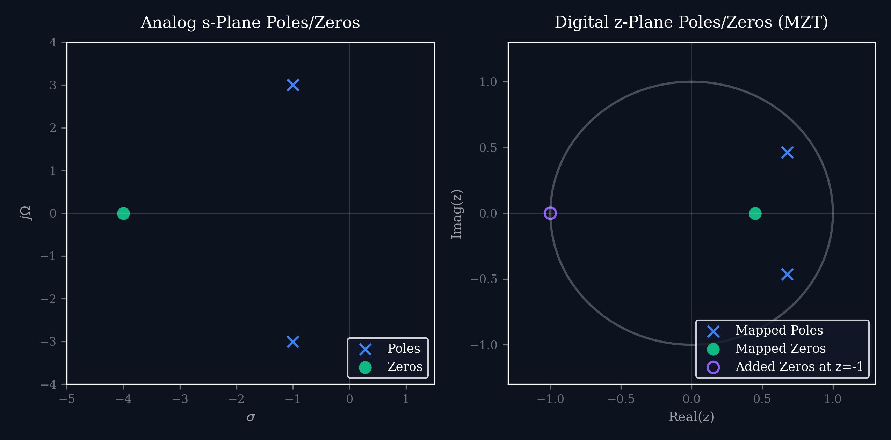
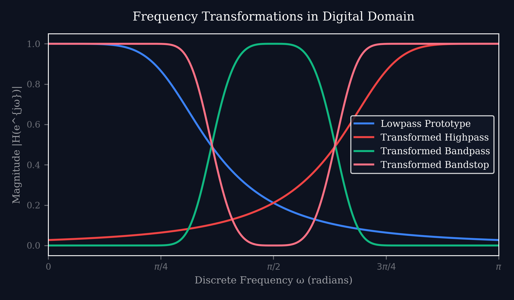

# Lecture 29: DSP for Radar — Pulse Compression, Doppler Processing & CFAR

**Course:** EE3621 — Digital Signal Processing  
**Target Audience:** III B.Tech EEE Students  
**Duration:** 40 Minutes  

* **Available Formats:** [LaTeX Source File](file:///C:/Users/sriph/Downloads/DSP/lecture_29.tex) | [Compiled PDF Notes](file:///C:/Users/sriph/Downloads/DSP/lecture_29.pdf)

---

## 1. Lecture Plan (40 Minutes Breakdown)

* **00:00 – 05:00 (5 mins):** Radar Fundamentals: Range, Doppler, and Resolutions.
* **05:00 – 12:00 (7 mins):** Matched Filter & LFM (Chirp): Waveform equations, matched filtering, and Pulse Compression output.
* **12:00 – 18:00 (6 mins):** Pulse Compression Implementation: Stretch processing and FFT-based filtering.
* **18:00 – 25:00 (7 mins):** Range-Slow Time Matrix & Doppler Processing: MTI, Pulse-Doppler, and 2D FFT mapping.
* **25:00 – 30:00 (5 mins):** Constant False Alarm Rate (CFAR) Detection: Cell-Averaging CFAR and threshold derivation.
* **30:00 – 35:00 (5 mins):** FMCW Radar & SAR Basics.
* **35:00 – 40:00 (5 mins):** Checkpoints \& Quick Review.

---

## 2. Radar Fundamentals

### 2.1 Range Equation
Radar transmits an electromagnetic pulse and waits for the echo from a target. Let the time-of-flight of the pulse be $\tau$. Since electromagnetic waves travel at the speed of light $c$, the total round-trip distance is $c\tau$. The target range $R$ is half of this:
$$ R = \frac{c\tau}{2} $$
**Physical Intuition:** A microsecond of delay corresponds to $150$ meters of range.

### 2.2 Doppler Frequency
If a target is moving with radial velocity $v$ (positive for closing targets), the total round trip distance changes as $2vt$. This introduces a phase shift $\phi(t) = - \frac{2\pi (2vt)}{\lambda}$. The Doppler frequency shift is the derivative of phase with respect to time:
$$ f_d = -\frac{1}{2\pi} \frac{d\phi}{dt} = \frac{2v}{\lambda} $$
**Engineering Note:** This shift allows us to distinguish moving targets from stationary clutter.

### 2.3 Range Resolution
The range resolution $\delta R$ defines the minimum distance between two targets for them to be resolvable. It depends on the pulse bandwidth $B$:
$$ \delta R = \frac{c}{2B} $$
**Intuition:** A wider bandwidth gives a narrower compressed pulse, which means closer targets can be distinguished.

### 2.4 Doppler Resolution
The Doppler resolution $\delta v$ is related to the observation time (dwell time) $T_{dwell}$:
$$ \delta f_d = \frac{1}{T_{dwell}} \implies \delta v = \frac{\lambda}{2T_{dwell}} $$
**Range-Doppler Trade-off:** High range resolution requires large bandwidth. High Doppler resolution requires long dwell times. Balancing these is a key aspect of radar system design.

---

## 3. Matched Filter for Radar

To maximize the Signal-to-Noise Ratio (SNR) of a received pulse, we use a matched filter.

### 3.1 Linear Frequency Modulated (LFM) Chirp
A common radar waveform is the LFM chirp, whose frequency changes linearly with time:
$$ s(t) = \text{rect}(t/T) e^{j\pi\mu t^2} $$
where:
* $T$ is the pulse duration.
* $\mu = B/T$ is the chirp rate (frequency slope).
* $B = \mu T$ is the total swept bandwidth.

### 3.2 Matched Filter Response
The matched filter impulse response for a signal $s(t)$ is defined as its time-reversed and complex-conjugated version:
$$ h(t) = s^*(-t) $$
The output of the matched filter is the autocorrelation function of the transmitted signal. For an LFM chirp, the output pulse compression is:
$$ R_{ss}(\tau) = s(\tau) * h(\tau) $$
$$ |R_{ss}(\tau)|^2 = T^2 \text{sinc}^2(\pi B\tau) $$
**KEY RESULT:** The original pulse width is $T$. After matched filtering, the main lobe width (null-to-null) is roughly $2/B$. 

### 3.3 Pulse Compression Ratio
The Time-Bandwidth Product (TBP) represents the compression ratio:
$$ \text{TBP} = B \cdot T $$
**Engineering Intuition:** A pulse with duration $T = 10 \mu s$ and bandwidth $B = 100 \text{ MHz}$ has a TBP of 1000. It provides the energy of a long $10 \mu s$ pulse, but the resolution of a $10 \text{ ns}$ short pulse!

---

## 4. Pulse Compression Implementation

Implementing the matched filter in the digital domain requires fast processing. 

### 4.1 Digital Matched Filter (Fast Convolution)
Instead of time-domain convolution (which is $O(N^2)$), we use the Frequency Domain:
1. Take FFT of received signal: $R(f) = \text{FFT}\{r(t)\}$
2. Multiply with complex conjugate of transmitted signal FFT: $Y(f) = R(f)S^*(f)$
3. Take IFFT to get compressed time-domain signal: $y(t) = \text{IFFT}\{Y(f)\}$
This FFT-Multiply-IFFT structure is $O(N \log N)$ and widely used.

### 4.2 Stretch Processing (for extreme bandwidths)
For very wide bandwidths (e.g., $B = 1 \text{ GHz}$), digitizing the raw signal requires unreasonable ADCs. Instead, we mix the received chirp with a local reference chirp:
$$ y_{mix}(t) = r(t) \cdot s_{ref}^*(t) $$
This converts time delays into constant frequency tones, easily resolvable by a standard FFT!

---

## 5. Range Cell Processing

A typical radar transmits a series of $N_{chirps}$ pulses. 
* Fast Time: The time within one pulse (samples correspond to range bins).
* Slow Time: The time between pulses (samples correspond to successive pulses).
We stack each received pulse into a 2D **Range-Slow Time Matrix**. 
* Rows correspond to specific range bins (range cells).
* Columns correspond to specific pulses.

---

## 6. Doppler Processing (MTI & Pulse-Doppler)

### 6.1 Moving Target Indicator (MTI)
MTI is a simple high-pass filter applied across slow-time to cancel stationary clutter (like buildings or ground).
By subtracting consecutive pulses:
$$ y(n) = x(n) - x(n-1) $$
Stationary targets (DC in slow time) are cancelled. 

**Filter Design for Radar:** In designing more complex MTI filters, analog prototype filters can be digitized using techniques like the Matched Z-Transform (MZT).

Furthermore, spectral transformations can adapt the MTI notch to moving clutter (like rain or chaff).

### 6.2 Pulse-Doppler Processing
For precise velocity measurement, we take an FFT across the slow-time dimension for each range bin.
This 2D FFT over the Range-Slow Time Matrix produces a **Range-Doppler Map**, visualizing targets by their distance and velocity simultaneously!

---

## 7. Constant False Alarm Rate (CFAR) Detection

A simple fixed threshold will cause massive false alarms if noise or clutter levels increase. CFAR dynamically adjusts the threshold based on the local background power.

### 7.1 Threshold Equation
The threshold $T_{thresh}$ is determined by multiplying the estimated noise power $\bar{P}_{noise}$ by a scaling factor $T$:
$$ T_{thresh} = T \cdot \bar{P}_{noise} $$

### 7.2 Cell Averaging CFAR (CA-CFAR)
In CA-CFAR, we slide a window over the range bins:
1. **Cell Under Test (CUT):** The bin we are testing.
2. **Guard Cells:** Immediate neighbors of CUT, ignored to prevent target energy from bleeding into the noise estimate.
3. **Reference Cells:** Surrounding cells used to estimate $\bar{P}_{noise}$ by taking their mean.

For $N$ reference cells and a desired Probability of False Alarm $P_{fa}$, the multiplier $T$ is:
$$ T = N\left( P_{fa}^{-1/N} - 1 \right) $$
**Derivation Intuition:** Assuming exponentially distributed noise power, the exact probability is governed by the chi-squared distribution of the sum of $N$ cells.

---

## 8. FMCW Radar

Frequency Modulated Continuous Wave (FMCW) radar transmits continuously.
* It transmits a repeating frequency sweep.
* The received signal is mixed with the transmitted signal to create a **beat frequency** $f_b$.
* The beat frequency is proportional to both range and Doppler.

### 8.1 Beat Frequency Equation
For a stationary target:
$$ f_b = \frac{2R}{c} \frac{B}{T} $$
We perform an FFT on the beat signal. The frequency peak directly gives the range $R$. This is heavily used in automotive radars for short-range, high-resolution sensing.

---

## 9. SAR Basics (Brief)

Synthetic Aperture Radar (SAR) is used on aircraft or satellites to generate high-resolution images of the ground.
* **Problem:** Real aperture azimuth resolution depends on antenna size $D$. $\delta a_{real} = \frac{\lambda R}{D}$. From space, this is miles wide!
* **Solution:** As the platform moves, it collects pulses over a long distance, synthesizing a massive virtual antenna.
* **Miraculous Result:** The theoretical SAR azimuth resolution is:
  $$ \delta a = \frac{D}{2} $$
  It is independent of range $R$ and wavelength! A smaller real antenna actually provides better SAR resolution.

---

## 10. Checkpoint & Quick Review Questions

1. **Q1:** A radar uses a linear chirp with $B = 50 \text{ MHz}$ and pulse width $T = 20 \mu s$. Calculate the range resolution and the Time-Bandwidth Product (compression ratio).
   * *Answer:*
     * Range Resolution: $\delta R = \frac{c}{2B}$
     * $c = 3 \times 10^8 \text{ m/s}$
     * $\delta R = \frac{3 \times 10^8}{2 \times 50 \times 10^6} = \frac{300}{100} = 3 \text{ meters}$.
     * TBP: $B \times T = 50 \times 10^6 \times 20 \times 10^{-6} = 1000$. The pulse is compressed by a factor of 1000.

2. **Q2:** A CA-CFAR detector uses 16 reference cells. If the desired false alarm probability is $P_{fa} = 10^{-6}$, calculate the required threshold multiplier $T$.
   * *Answer:*
     * Formula: $T = N(P_{fa}^{-1/N} - 1)$
     * $N = 16$, $P_{fa} = 10^{-6}$.
     * $P_{fa}^{-1/16} = (10^{-6})^{-0.0625} = 10^{0.375} \approx 2.37137$.
     * $T = 16 \times (2.37137 - 1) = 16 \times 1.37137 = 21.94$.
     * The threshold must be set to nearly 22 times the estimated average noise power.

3. **Q3:** An automotive FMCW radar operates with a sweep bandwidth of $1 \text{ GHz}$ and a sweep time of $100 \mu s$. If it detects a beat frequency of $150 \text{ kHz}$ from a stationary target, what is the range to the target?
   * *Answer:*
     * Formula: $f_b = \frac{2R}{c} \frac{B}{T} \implies R = \frac{f_b \cdot c \cdot T}{2B}$
     * $f_b = 150 \times 10^3 \text{ Hz}$
     * $T = 100 \times 10^{-6} \text{ s}$
     * $B = 10^9 \text{ Hz}$
     * $R = \frac{150 \times 10^3 \times 3 \times 10^8 \times 100 \times 10^{-6}}{2 \times 10^9} = \frac{4.5 \times 10^{12} \times 10^{-6}}{2 \times 10^9} = \frac{4.5 \times 10^6}{2 \times 10^9} = 2.25 \text{ meters}$.

---
## 11. Key Formulas Summary Table

| Concept | Formula | Description |
| :--- | :--- | :--- |
| Range | $R = \frac{c\tau}{2}$ | $\tau$ is round-trip time |
| Doppler Frequency | $f_d = \frac{2v}{\lambda}$ | $v$ is radial velocity |
| Range Resolution | $\delta R = \frac{c}{2B}$ | $B$ is chirp bandwidth |
| Doppler Resolution | $\delta v = \frac{\lambda}{2T_{dwell}}$ | $T_{dwell}$ is observation time |
| Pulse Compression | $TBP = BT$ | Time-bandwidth product |
| FMCW Beat Frequency | $f_b = \frac{2R}{c}\frac{B}{T}$ | Maps range to frequency |
| CA-CFAR Threshold | $T = N(P_{fa}^{-1/N} - 1)$ | $N$ is reference cells |
| SAR Azimuth Res. | $\delta a = D/2$ | $D$ is antenna length |

