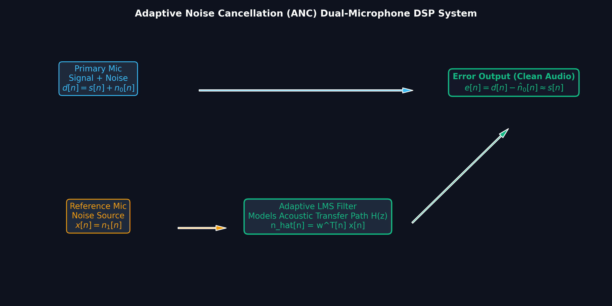
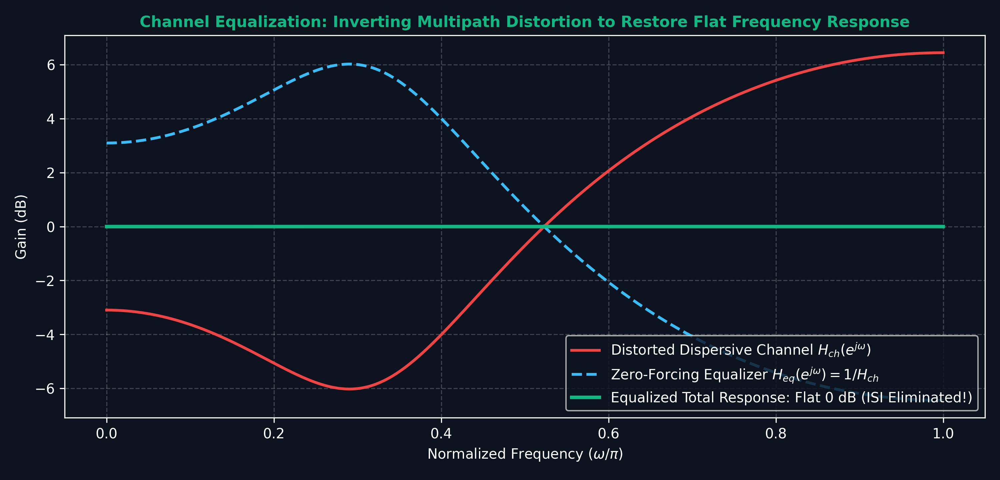

# Lecture 30: DSP Capstone — System Design, Implementation & Future Trends

**Course:** EE3621 — Digital Signal Processing  
**Target Audience:** III B.Tech EEE Students  
**Duration:** 40 Minutes  

* **Available Formats:** [LaTeX Source File](file:///C:/Users/sriph/Downloads/DSP/lecture_30.tex) | [Compiled PDF Notes](file:///C:/Users/sriph/Downloads/DSP/lecture_30.pdf)

---

## 1. Lecture Plan (40 Minutes Breakdown)
* **00:00 – 05:00 (5 mins):** System Design Methodology: Requirements, algorithmic choices, fixed vs floating point.
* **05:00 – 12:00 (7 mins):** Fixed-Point DSP Implementation: Q-format notation, overflow, scaling, and rounding strategies.
* **12:00 – 18:00 (6 mins):** DSP Processor Architecture: Harvard architecture, MAC, barrel shifter, circular buffers, and SIMD.
* **18:00 – 22:00 (4 mins):** Hardware Trade-offs (FPGA vs DSP vs GPU) & Real-Time System Design.
* **22:00 – 30:00 (8 mins):** Course Review: Interconnections of key topics (Sampling $\rightarrow$ FFT $\rightarrow$ Filtering $\rightarrow$ Applications).
* **30:00 – 35:00 (5 mins):** Emerging Trends (TinyML, QSP) & Career Paths in DSP.
* **35:00 – 40:00 (5 mins):** Comprehensive Final Exam Problems discussion.

---

## 2. System Design Methodology

### Visual Illustration: Adaptive Noise Cancellation (ANC) Dual-Microphone System

* **Acoustic Noise Removal:** The reference microphone picks up noise source $n_1[n]$. The adaptive LMS filter models the acoustic transfer path to estimate and subtract noise $\hat{n}_0[n]$ from primary speech microphone $d[n]$, yielding clean output $e[n] pprox s[n]$.

---

### Visual Illustration: Channel Equalization & Multipath Distortion Inversion

* **Restoring Flat Response:** Multipath wireless channels introduce frequency-selective nulls. A zero-forcing / MMSE channel equalizer applies inverse transfer function $H_{eq}(z) pprox 1/H_{ch}(z)$ to restore a distortion-free flat frequency response.

Designing a DSP system requires traversing from abstract mathematics to physical hardware.

### 2.1 Requirements Analysis
Before writing any code, engineers must define:
1. **Sampling Rate ($f_s$):** Dictates the computational budget. A system processing audio at $48\text{ kHz}$ has $\approx 20.8\,\mu\text{s}$ per sample.
2. **Dynamic Range & SNR:** Determines the word length (e.g., 16-bit vs 24-bit).
3. **Latency:** Critical for real-time control loops or two-way communications.
4. **Power Consumption:** Dictates hardware selection (e.g., battery-powered hearing aids vs grid-powered base stations).

### 2.2 Algorithm Selection
* **FIR vs. IIR:** FIR provides linear phase and unconditional stability but requires more MAC (Multiply-Accumulate) operations. IIR requires fewer coefficients but is prone to limit cycles and quantization noise.
* **FFT Size:** Larger FFTs provide better frequency resolution but increase latency and memory requirements.

### 2.3 Floating-Point vs. Fixed-Point
* **Floating-Point:** Easier to program, vast dynamic range, no overflow concerns. High power and silicon area.
* **Fixed-Point:** Harder to program (requires manual scaling), limited dynamic range. Low power, cheap, fast.

---

## 3. Fixed-Point DSP Implementation

### 3.1 Two's Complement Arithmetic
Most DSPs use two's complement for signed numbers. An $N$-bit number represents values from $-2^{N-1}$ to $2^{N-1}-1$.

### 3.2 Q-Format Notation
To represent fractional numbers in integer hardware, we use $Q(m.n)$ notation:
* $m$: Number of integer bits (including sign bit).
* $n$: Number of fractional bits.
* Total bits: $N = m + n$.
* Range: $[-2^{m-1}, 2^{m-1} - 2^{-n}]$
* Resolution: $2^{-n}$

**Example:** $Q(2.14)$ in a 16-bit register.
Range is $[-2^1, 2^1 - 2^{-14}] = [-2, 1.99993896]$.

### 3.3 Overflow Handling
When additions exceed the maximum value, two's complement wraps around (e.g., a large positive number becomes negative).
* **Saturation Arithmetic:** Instead of wrapping, the result is clamped to the maximum/minimum representable value. This prevents catastrophic sign inversions.

### 3.4 Scaling and Rounding
When multiplying two $Q(m.n)$ numbers (e.g., two 16-bit numbers), the result requires $2N$ bits (e.g., 32 bits) and is in $Q(2m.2n)$ format.
To store this back into a 16-bit register, we must shift right by $n$ bits and round.
* **Truncation:** Simply discarding lower bits. Causes a negative DC bias.
* **Rounding:** Adding $2^{n-1}$ before truncating. Symmetric and zero-mean error.

### 3.5 Block Floating-Point
A compromise between fixed and floating point. A block of data shares a single exponent. Before processing (like an FFT), the block is scanned for the maximum magnitude, and all values are scaled to maximize dynamic range, updating the shared exponent.

---

## 4. DSP Processor Architecture

General-purpose CPUs are inefficient for DSP. Specialized DSP processors include unique hardware structures.

### 4.1 Harvard Architecture
Separate memory spaces and buses for instructions and data. Allows the processor to fetch an instruction and read/write data simultaneously. Modern DSPs use Super Harvard Architecture (SHARC) with multiple data buses.

### 4.2 Single-Cycle MAC
The core of DSP is the Multiply-Accumulate operation: $y = y + h[k]x[n-k]$.
DSPs have a dedicated hardware multiplier and a wide accumulator (e.g., 40-bit accumulator for 16x16 bit multiplication) to prevent overflow during long sums. This executes in a single clock cycle.

### 4.3 Barrel Shifter
Can shift a data word left or right by any number of bits in a single clock cycle. Crucial for scaling in fixed-point arithmetic.

### 4.4 Circular Buffers
FIR filters use a delay line (sliding window). Instead of shifting all data in memory, a circular buffer updates pointers modulo the buffer size, implementing delays with zero data-movement overhead.

### 4.5 SIMD Extensions
Single Instruction, Multiple Data. Allows one instruction to operate on multiple data points simultaneously (e.g., four 16-bit MACs in one 64-bit register).

### 4.6 Pipeline Hazards
Deep pipelines increase clock speed but can stall due to data dependencies or branches. DSP programmers often unroll loops to avoid branch penalties.

---

## 5. FPGA vs DSP Processor vs GPU

| Feature | FPGA | DSP Processor | GPU |
| :--- | :--- | :--- | :--- |
| **Architecture** | Reconfigurable logic gates | Programmable Harvard CPU | Massive multi-core SIMD |
| **Parallelism** | True hardware parallelism | Limited (instruction level) | Massive thread-level |
| **Latency** | Extremely low (nanoseconds) | Low (microseconds) | High (batch processing) |
| **Power Efficiency**| Very high for specific tasks | High | Low |
| **Best For** | High-speed I/O, custom bit-widths | Complex sequential math, audio | Matrix operations, ML |

---

## 6. Real-Time System Design

### 6.1 Interrupt vs DMA
* **Interrupt-driven:** CPU pauses to read each sample. High overhead for fast rates.
* **DMA (Direct Memory Access):** Hardware peripheral writes ADC samples directly to memory. CPU is only interrupted when a full block is ready.

### 6.2 Double-Buffering (Ping-Pong)
While the CPU processes Buffer A, the DMA fills Buffer B. This hides I/O latency and ensures continuous real-time operation.

### 6.3 Worst-Case Execution Time (WCET)
In real-time systems, average execution time is irrelevant. The WCET must be strictly less than the block processing deadline.

---

## 7. Course Review — Key Connections

Let's connect the major themes of EE3621:

1. **Sampling & Transforms:**
   Continuous time $x(t)$ $\xrightarrow{\text{Sample}}$ Discrete $x[n]$ $\xrightarrow{\text{DTFT}}$ Continuous spectrum $X(e^{j\omega})$ $\xrightarrow{\text{Sample}}$ Discrete $X[k]$ (DFT) $\xrightarrow{\text{Fast Algo}}$ FFT.
   
2. **Filter Design & Quantization:**
   Continuous Specs $\xrightarrow{\text{Bilinear Transform}}$ IIR Filter $H(z)$ $\xrightarrow{\text{Direct Form II}}$ Structure $\xrightarrow{\text{Finite Wordlength}}$ Quantization Noise & Limit Cycles.

3. **Adaptive Systems:**
   Static Filters $\rightarrow$ Time-Varying Environments $\rightarrow$ Adaptive Filters (LMS/RLS).

Below is an illustration of an Adaptive Noise Cancellation system, showing how these concepts combine:

And the effect of equalization on a distorted channel:

---

## 8. Emerging Trends & Career Paths

### 8.1 Emerging Trends
* **Deep Learning on Edge (TinyML):** Quantized Neural Networks (4-bit or 8-bit integer inference) running on microcontrollers for audio keyword spotting or anomaly detection.
* **Neuromorphic Computing:** Spiking neural networks mimicking biological brains for ultra-low-power DSP.
* **Quantum Signal Processing:** Using quantum algorithms to compute transforms exponentially faster than classical FFTs.
* **Software-Defined Radio (SDR):** Moving the ADC closer to the antenna; replacing analog mixers with digital DSP.

### 8.2 Career Paths
* **RF/Communications DSP Engineer:** Designing modems for 5G/6G, Wi-Fi.
* **Embedded Audio/Video:** Smart speakers, noise-canceling headphones, video compression.
* **Power Electronics DSP:** Real-time control of inverters, motor drives, grid-tie systems.
* **Biomedical DSP:** Processing ECG/EEG, MRI image reconstruction.
* **Autonomous Vehicles:** Radar, LiDAR, and sensor fusion algorithms.

---

## 9. Comprehensive Final Exam Problems

### Problem 1: Filter Design & Quantization
**Problem:** Design a 1st-order IIR lowpass filter with a pole at $z = 0.8$. Implement it in $Q(2.14)$ fixed-point format. What is the quantization error variance if truncation is used?
**Solution:**
Step 1: Difference equation: $y[n] = x[n] + 0.8 y[n-1]$.
Step 2: Convert $0.8$ to $Q(2.14)$.
$0.8 \times 2^{14} = 13107.2 \approx 13107$.
Actual pole value: $13107 / 16384 = 0.799987$.
Step 3: Quantization error modeled as uniform noise in $[-(2^{-14}), 0]$ for truncation.
Variance $\sigma_e^2 = \frac{q^2}{12} = \frac{(2^{-14})^2}{12} \approx 3.1 \times 10^{-10}$.
Output noise variance: $\sigma_y^2 = \sigma_e^2 \sum |h[n]|^2 = \sigma_e^2 \frac{1}{1 - 0.8^2} = 8.6 \times 10^{-10}$.

### Problem 2: Adaptive Filtering
**Problem:** An LMS adaptive filter with $M=2$ taps is used for system identification. Input $x[n]$ is white noise with variance $1$. Find the maximum step size $\mu$ for stability.
**Solution:**
Step 1: Input autocorrelation matrix $\mathbf{R} = E[\mathbf{x}[n]\mathbf{x}^T[n]] = \mathbf{I}$.
Step 2: Eigenvalues of $\mathbf{R}$ are $\lambda_1 = 1, \lambda_2 = 1$.
Step 3: Stability condition: $0 < \mu < \frac{2}{\lambda_{\text{max}} M}$ (in practice $0 < \mu < \frac{1}{\text{Tr}(\mathbf{R})}$).
$\text{Tr}(\mathbf{R}) = 2$.
Therefore, $0 < \mu < 0.5$.

### Problem 3: Multirate System Design
**Problem:** A signal sampled at $8\text{ kHz}$ needs to be upsampled to $48\text{ kHz}$. Design an efficient polyphase interpolator.
**Solution:**
Step 1: Interpolation factor $L = 48/8 = 6$.
Step 2: Insert 5 zeros between each sample of $x[n]$.
Step 3: Design a lowpass filter $H(z)$ with cutoff $\pi/6$.
Step 4: Decompose $H(z)$ into 6 polyphase components: $H_k(z)$ for $k=0,1,\dots,5$.
Step 5: The filtering is performed at the lower rate ($8\text{ kHz}$) before the commutator multiplexes the outputs to $48\text{ kHz}$, reducing MAC operations by a factor of 6.

---

## 10. Key Formulas Summary

| Concept | Formula | Description |
| :--- | :--- | :--- |
| **Q-format Range** | $[-2^{m-1}, 2^{m-1} - 2^{-n}]$ | For $Q(m.n)$ format |
| **LMS Update** | $\mathbf{w}[n+1] = \mathbf{w}[n] + 2\mu e[n]\mathbf{x}[n]$ | Filter tap update rule |
| **LMS Stability** | $0 < \mu < \frac{1}{\text{Tr}(\mathbf{R})}$ | Bound on step size |
| **Zero-Forcing** | $E(z) = \frac{1}{C(z)}$ | Channel equalizer |
| **Polyphase Filter** | $H(z) = \sum_{k=0}^{L-1} z^{-k} E_k(z^L)$ | Interpolation structure |

---

## 11. Checkpoint Questions

1. **Q1:** Why is a barrel shifter essential in a fixed-point DSP processor?
   * *Answer:* 
     * In fixed-point arithmetic, multiplying two $Q(m.n)$ numbers results in a $Q(2m.2n)$ product.
     * To store the result back into a $Q(m.n)$ register, the result must be shifted right by $n$ bits.
     * A regular CPU might take $n$ clock cycles to shift $n$ bits, but a barrel shifter can shift any number of bits in a **single clock cycle**, making DSP algorithms much faster.

2. **Q2:** Compare truncation vs rounding in fixed-point DSP.
   * *Answer:*
     * Truncation simply discards the lower bits. This is computationally free but introduces a **non-zero DC bias** (the error is always negative).
     * Rounding adds half of the LSB ($2^{n-1}$) before truncating. This requires an extra addition but produces a **zero-mean error** (no DC bias), which prevents error accumulation in recursive IIR filters.

3. **Q3:** How does double-buffering prevent data loss in real-time systems?
   * *Answer:*
     * Without double-buffering, if the CPU processes data from a buffer, the DMA cannot write new incoming samples to that buffer without overwriting the data being processed.
     * With double-buffering (Ping-Pong), the DMA fills Buffer A while the CPU processes Buffer B. Once Buffer A is full, they swap roles.
     * This decouples the continuous hardware I/O from the bursty CPU processing, ensuring no samples are dropped as long as processing time is less than the buffer fill time.
